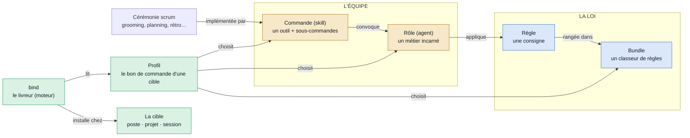

# domaine-mega-city

> Diagramme généré par **ezk-diagram**. Source de vérité : [`description.md`](description.md) (prose).
> Ce fichier est **généré** (explication comprise) — ne pas l’éditer à la main (il serait écrasé au prochain `publish`).

## Ce que montre ce diagramme

Ce que montre ce diagramme : comment les objets de la méthode mega-city s'emboîtent,
sans vocabulaire de diagramme objet. À gauche, LA LOI : une règle (une consigne) se range
dans un bundle (un classeur). Au centre, L'ÉQUIPE : une commande (un outil avec ses
sous-commandes) convoque des rôles (des métiers incarnés), et un rôle applique des
règles. Une cérémonie scrum n'est pas une commande : elle est implémentée par une ou
plusieurs commandes. En vert, la livraison : le profil est le bon de commande d'une
cible ; bind (le livreur) le lit et installe le tout chez la cible — ton poste, un
projet, ou une session. Trois couleurs, trois mondes : bleu = la loi, or = l'équipe,
vert = ce qui livre.

**Vues partageables** · [Éditer sur mermaid.live](https://mermaid.live/edit#pako:eNp9Us1uEzEQfpWRe2grtoJUoT8rVClJe4gUQUjEKe7BsWc3pl576x8QNJW48iKIvSNxZ9-EJ0F2sqkiAbfReL6f-cYPhBuBJCeFMh_5ilkPkxnVAC4sS8vqFUzejBeUTAaxoOQ2vgHMFpTM2u-lwldL-_wqaARutJOlRkpu4eTkam2ZLtsGQTDt1jBcUDIMWuwAwBVzDoMFgWATldvSoxZ7Dm7evhtPb6KJw_Zrqnc-5gtKRqaqmBYIR-5OKnXcCZjgpYJn4ExwJ3w75Dp73OgP5j7gGgZplx8K4YiVqP2OoGobL9GC1JxZ3Tb79kY3MYRR29i2qYyWCI7bUCVwaY2ppC4zqBXTOlW2bbw1v7986xzIqlZtU6H2Maaa2TXMI_EgvbK6VjL5S-eYLiiZWlNIlQQUwtLoGF23GIjDdAW5VLsT8JWRTvo1DBPFfm_wl17SH45fXy8oWUotOi0lP9h4qqPKeAz2uBNQETTtQJuttPNMKQS-ws9rGI2Hk3Q6trGWGGvjPMKvn1Bb8x59rBw6J41OEUe-9DuusQBlJBRSqfxALPG8YJnz1txhfnBanBXiRcaNMjY_6PV77LS_h8T7IGvcgoszvOAXOzC7PO_32H_Am0U75cviFPs7cI9fspfFP8Awy4bR9FNjng22Xp560ywGlqV0tlpUk4xUaCsmBcnJQxymxK-wQkpyoERgwYLylFD9SDLCgjfzT5qT3NuAGQm1YB6vJSstqzbNxz9HFlQE) · [Image PNG (mermaid.ink)](https://mermaid.ink/img/pako:eNp9Us1uEzEQfpWRe2grtoJUoT8rVClJe4gUQUjEKe7BsWc3pl576x8QNJW48iKIvSNxZ9-EJ0F2sqkiAbfReL6f-cYPhBuBJCeFMh_5ilkPkxnVAC4sS8vqFUzejBeUTAaxoOQ2vgHMFpTM2u-lwldL-_wqaARutJOlRkpu4eTkam2ZLtsGQTDt1jBcUDIMWuwAwBVzDoMFgWATldvSoxZ7Dm7evhtPb6KJw_Zrqnc-5gtKRqaqmBYIR-5OKnXcCZjgpYJn4ExwJ3w75Dp73OgP5j7gGgZplx8K4YiVqP2OoGobL9GC1JxZ3Tb79kY3MYRR29i2qYyWCI7bUCVwaY2ppC4zqBXTOlW2bbw1v7986xzIqlZtU6H2Maaa2TXMI_EgvbK6VjL5S-eYLiiZWlNIlQQUwtLoGF23GIjDdAW5VLsT8JWRTvo1DBPFfm_wl17SH45fXy8oWUotOi0lP9h4qqPKeAz2uBNQETTtQJuttPNMKQS-ws9rGI2Hk3Q6trGWGGvjPMKvn1Bb8x59rBw6J41OEUe-9DuusQBlJBRSqfxALPG8YJnz1txhfnBanBXiRcaNMjY_6PV77LS_h8T7IGvcgoszvOAXOzC7PO_32H_Am0U75cviFPs7cI9fspfFP8Awy4bR9FNjng22Xp560ywGlqV0tlpUk4xUaCsmBcnJQxymxK-wQkpyoERgwYLylFD9SDLCgjfzT5qT3NuAGQm1YB6vJSstqzbNxz9HFlQE)

Les liens mermaid.live/mermaid.ink encodent le diagramme dans l’URL (service externe) — pratique pour partager/éditer vite ; la vue sans service tiers reste ce README rendu par GitHub.
