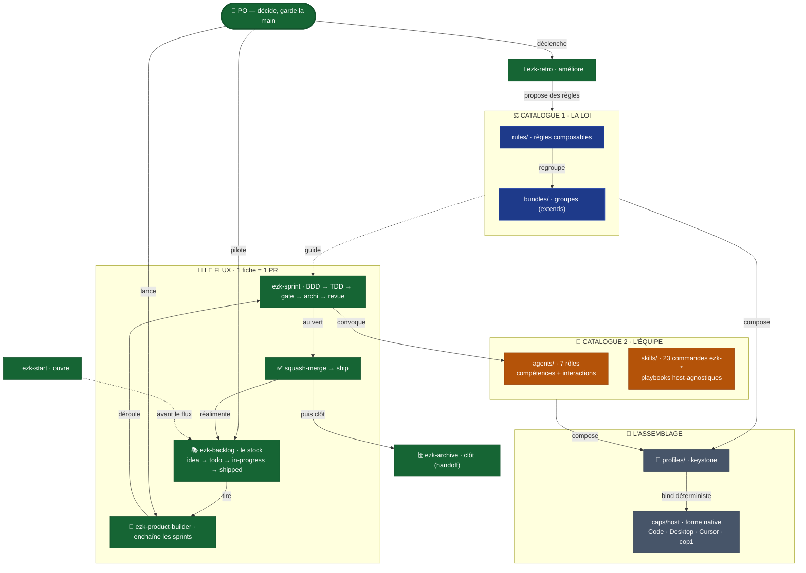

# "La méthode mega-city en une carte (colonne vertébrale + carte dynamique)"

> Diagramme généré par **ezk-diagram**. Source de vérité : [`description.md`](description.md) (prose).
> Ce fichier est **généré** (explication comprise) — ne pas l’éditer à la main (il serait écrasé au prochain `publish`).

## Ce que montre ce diagramme

## Ce que montre ce diagramme

La méthode mega-city en une seule carte : **comment les pièces tiennent ensemble**, du référentiel
jusqu'au travail livré.

- **Le PO** (toi) est le point d'entrée : il décide et garde la main.
- **Deux catalogues** se composent : **LA LOI** (bleu — les règles + leurs regroupements) et
  **L'ÉQUIPE** (ambre — 7 rôles/agents + 23 commandes `ezk-*`).
- **L'assemblage** (gris) : un **profil** (keystone) compose loi + équipe, puis le **bind
  déterministe** matérialise le tout dans la forme native de chaque hôte (Claude Code, Desktop,
  Cursor, cop1).
- **Le flux** (vert) met la méthode en oeuvre : le **backlog** alimente le **product-builder**, qui
  enchaîne des **sprints** (1 fiche → 1 PR), jusqu'au **ship** qui réalimente le backlog.

Les liens porteurs : le sprint **convoque les agents**, la loi **guide** le sprint, et la
**rétro** propose de nouvelles règles qui **retournent dans la loi** — la boucle se referme.
`ezk-start` ouvre la session, `ezk-archive` la clôt sans rien perdre.

> Cette carte est la **colonne vertébrale** (simple). Le détail exhaustif — les 23 commandes avec
> leurs sous-commandes, les 7 capabilities, tous les liens de composition — vit dans la **carte
> dynamique interactive** (l'artefact HTML compagnon).

> ⚠️ **v1 — trois défauts connus** (audit du 2026-08-20, détail dans `description.md`) :
> les liens sont surtout **inférés de la prose** (7 arêtes réellement déclarées via
> `composes:`, une quarantaine dessinées) ; **`bind → caps/host` est faux** comme séquence
> (le bind *utilise* un cap, ADR-0003) ; **les rôles ne sont pas dans le graphe**
> (`composes:` ne relie que skill→skill). À corriger avant d'en faire la carte de référence.

**Vues partageables** · [Éditer sur mermaid.live](https://mermaid.live/edit#pako:eNqNVc1u20YQfpXB5hCnoeofSU4jtwYkW7ENMxAtyWgD0YcVOZQWWu7Su0vFbhSgQNMCPQVpgwQwCvTSFjUK9JQiPUdv4hdoH6HdpfyjBDXMi5Y7830z38xw9IREMkZSIwmXj6MhVQa6jVAAAASthV5I_vnp9z8haMHZVy8hnp5GLEYPBlTFCJxCSpkIycGdUBQYnfcHimZD8Fs7vZCcnbz6-6_nsFHv1v3W1n4TluHdW_Dr1hySgwJjn5gpjAyT4iK6fdq9kKico160MDX9bcBRQyTTTGra56hDcgCl0vpE4UDJPMMJNP6L2s9FfA4q7jUs4JFBEes7F2FRxB9k3dxzil_8ciXlFZfy7el3e_s7QfMGWde3eiGhAxSmSOEeqOkbjvrTvlpct8lPTw2KCDXcBSYMKuo49Bx1Z7cXEj1inBckK2WrO6UiRg345aj0kaPLOD3uSznSMJTalOhASG3YYY76Wp31zkMn9OVr8G_XO53mw4Zf37qJuN3mowL5AjIlE3Ze5xEeayMFnnekz0Rs58WgSplg2uAENupBpxeSiGZ60aZrcYlUKYKgho3RKdqQMVrDJuqRkZk9buRKS2VPkcyWrxX2wG997vJ7_jX4TXjg739hccuQsGiI8BksQ9C-gcyG71h-OHG17tNoxOXAMnEEbWQ0crmyGCmcffs9GBlLd2CilCk5UKi1e9dDlmUYz0UMGo7751eOO1MyziNT6ueMx-hUooiGdPqHQLDjrjPFhHlvOoJeSCy6MFpQY3PTRezOfgfUoDtQFQ2ZOykc5zjPs71jmc5-_Ab0YU71sJSiGuBF6nPODd911jCFEwga7iWeniqZc5xAJ3AXNIcxKjNx1B_0qdOtt7tO_cmvTr02duO8ewsyH6vL3OrtjW3n9vqZ3R_W08kYu9GI-PSNgYUhFbFMkssvut3stlvFdD5zGIVGSYug6fSUMzmLUHj7rR2XcbFOcGJHu7A09_7HELScIWNc2nlu-HPXnIrIVWamNZixiLE8zHEC9a0rgT8urU8GOYtd5WaA7Z0CoqanlLMUxdUgrnQFjo6pMHYSE54fXfE4x2c500WRJq6Sc1naHc7thOGkKNiV2hVoJa1ssItmtnInbl_P6hZxqvUmJsAlg4RxXru1jGX6CfW0UXKE9rWyRBMvklyq2q0kSdbeQ-LhDNivVMtL9y-A91cqS0t4DdD-SZ3HXF2tliuXMSvV8kp8DZTqdIas3KtWVy-DlsuV5Wr1GmQmbxhyZik9ZrEZ1srZ0dpczaDtNWzRrvJDfcvr7AIezl02fC9oeJ3Asy31XOc920iv6JKtwpz_bvORZ5erFTlnCFqQybVQEI-kqFLKYlIjT6xHSMwQUwxJDUISY0JzbkISiqfEIzQ3snMsIlIzKkeP5FlMDW4yOlA0LS6f_gtfbMLP) · [Image PNG (mermaid.ink)](https://mermaid.ink/img/pako:eNqNVc1u20YQfpXB5hCnoeofSU4jtwYkW7ENMxAtyWgD0YcVOZQWWu7Su0vFbhSgQNMCPQVpgwQwCvTSFjUK9JQiPUdv4hdoH6HdpfyjBDXMi5Y7830z38xw9IREMkZSIwmXj6MhVQa6jVAAAASthV5I_vnp9z8haMHZVy8hnp5GLEYPBlTFCJxCSpkIycGdUBQYnfcHimZD8Fs7vZCcnbz6-6_nsFHv1v3W1n4TluHdW_Dr1hySgwJjn5gpjAyT4iK6fdq9kKico160MDX9bcBRQyTTTGra56hDcgCl0vpE4UDJPMMJNP6L2s9FfA4q7jUs4JFBEes7F2FRxB9k3dxzil_8ciXlFZfy7el3e_s7QfMGWde3eiGhAxSmSOEeqOkbjvrTvlpct8lPTw2KCDXcBSYMKuo49Bx1Z7cXEj1inBckK2WrO6UiRg345aj0kaPLOD3uSznSMJTalOhASG3YYY76Wp31zkMn9OVr8G_XO53mw4Zf37qJuN3mowL5AjIlE3Ze5xEeayMFnnekz0Rs58WgSplg2uAENupBpxeSiGZ60aZrcYlUKYKgho3RKdqQMVrDJuqRkZk9buRKS2VPkcyWrxX2wG997vJ7_jX4TXjg739hccuQsGiI8BksQ9C-gcyG71h-OHG17tNoxOXAMnEEbWQ0crmyGCmcffs9GBlLd2CilCk5UKi1e9dDlmUYz0UMGo7751eOO1MyziNT6ueMx-hUooiGdPqHQLDjrjPFhHlvOoJeSCy6MFpQY3PTRezOfgfUoDtQFQ2ZOykc5zjPs71jmc5-_Ab0YU71sJSiGuBF6nPODd911jCFEwga7iWeniqZc5xAJ3AXNIcxKjNx1B_0qdOtt7tO_cmvTr02duO8ewsyH6vL3OrtjW3n9vqZ3R_W08kYu9GI-PSNgYUhFbFMkssvut3stlvFdD5zGIVGSYug6fSUMzmLUHj7rR2XcbFOcGJHu7A09_7HELScIWNc2nlu-HPXnIrIVWamNZixiLE8zHEC9a0rgT8urU8GOYtd5WaA7Z0CoqanlLMUxdUgrnQFjo6pMHYSE54fXfE4x2c500WRJq6Sc1naHc7thOGkKNiV2hVoJa1ssItmtnInbl_P6hZxqvUmJsAlg4RxXru1jGX6CfW0UXKE9rWyRBMvklyq2q0kSdbeQ-LhDNivVMtL9y-A91cqS0t4DdD-SZ3HXF2tliuXMSvV8kp8DZTqdIas3KtWVy-DlsuV5Wr1GmQmbxhyZik9ZrEZ1srZ0dpczaDtNWzRrvJDfcvr7AIezl02fC9oeJ3Asy31XOc920iv6JKtwpz_bvORZ5erFTlnCFqQybVQEI-kqFLKYlIjT6xHSMwQUwxJDUISY0JzbkISiqfEIzQ3snMsIlIzKkeP5FlMDW4yOlA0LS6f_gtfbMLP)

Les liens mermaid.live/mermaid.ink encodent le diagramme dans l’URL (service externe) — pratique pour partager/éditer vite ; la vue sans service tiers reste ce README rendu par GitHub.
