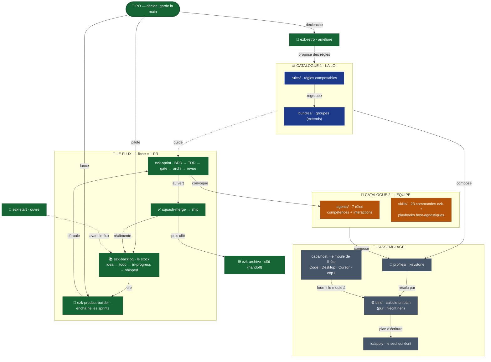

# "La méthode mega-city en une carte (colonne vertébrale + carte dynamique)"

> Diagramme généré par **ezk-diagram**. Source de vérité : [`description.md`](description.md) (prose).
> Ce fichier est **généré** (explication comprise) — ne pas l’éditer à la main (il serait écrasé au prochain `publish`).

## Ce que montre ce diagramme

## Ce que montre ce diagramme

La méthode mega-city en une seule carte : **comment les pièces tiennent ensemble**, du référentiel
jusqu'au travail livré.

- **Le PO** (toi) est le point d'entrée : il décide et garde la main.
- **Deux catalogues** se composent : **LA LOI** (bleu — les règles + leurs regroupements) et
  **L'ÉQUIPE** (ambre — 7 rôles/agents + 23 commandes `ezk-*`).
- **L'assemblage** (gris) : un **profil** (keystone) compose loi + équipe, puis le **bind
  déterministe** matérialise le tout dans la forme native de chaque hôte (Claude Code, Desktop,
  Cursor, cop1).
- **Le flux** (vert) met la méthode en oeuvre : le **backlog** alimente le **product-builder**, qui
  enchaîne des **sprints** (1 fiche → 1 PR), jusqu'au **ship** qui réalimente le backlog.

Les liens porteurs : le sprint **convoque les agents**, la loi **guide** le sprint, et la
**rétro** propose de nouvelles règles qui **retournent dans la loi** — la boucle se referme.
`ezk-start` ouvre la session, `ezk-archive` la clôt sans rien perdre.

> Cette carte est la **colonne vertébrale** (simple). Le détail exhaustif — les 23 commandes avec
> leurs sous-commandes, les 7 capabilities, tous les liens de composition — vit dans la **carte
> dynamique interactive** (l'artefact HTML compagnon).

> **Sur l'assemblage** : `bind` n'est pas l'étape avant `caps/host` — il l'**utilise**.
> C'est une fonction pure qui lit le profil, prend le moule de ton hôte, et rend un plan
> d'écriture ; `io/apply` est le seul à toucher au disque (ADR-0003).
>
> **Sur les liens** : les flèches de composition sont le **miroir** du graphe généré depuis
> les fichiers (`pnpm composes:graph`) — plus une lecture de la prose. Les trois défauts de
> la v1 sont corrigés ; le détail est dans `description.md`.

**Vues partageables** · [Éditer sur mermaid.live](https://mermaid.live/edit#pako:eNqNVV1vG0UU_StX24eksCYftlvqQiU7cZMoW7y1U0Hl7cN456498nhmMx9pQ10JiYLEU1WoWlEhwQMgIiSeispz95_kD8BPgJm1k7gVUfzi3Zl7zj333DuzD4NUUgwaQcbl_XRElIG9ViIAAOLOcj8J_vnx9z8h7sDxF8-AFkcpoxjCkCiKwAlMCBNJcO9yIkqMtoOhIvkIos5OPwmOXz7_-68nsNHca0adrTttWIM3ryFquu0kuFdi3I8yhalhUpxkd79uPwmU5ahXHEwVvw05akjlJJeaDDjqJLgHlcqNqcKhkjbHKbT-yzqwgs5B5bqGZXxgUFB9-SQtCvqO6vZtX_HTX85IXveSl4pvbt_ZidsXUN3c6icBGaIwpYSroIpXHPVHA7Vyw4kvjgyKFDW8D0wYVMRz6AXq3m4_CfSYcV6SrFdd3RMiKGrAz8eV9zxdzsnhQMqxhpHUpkKGQmrD9i3qc-ts9m75Qp-9gGip2eu1b7Wi5tZFittt3y2RTyFXMmNzn8d4qI0UeNKR4khLbiEnagqtnU82_TR876ZhwAR1kJTw1HIEKyDnRPh6lnOroAFiqThKFTOgGIrLC7I2mnGvnwQpyfWKq9kxcYSJdFRuKJdGxSuDnm1DUnT7m6jHRubuccMqLZVPL_O1udpMWiWYOSUqfipVn-Z1bz7WaQU6E2gVTqEZx5FzhckVkuf8cCZJo-WwbxmUoec25GbU-dT7-uRLiNpwM7rzmWNZg4ylI4SPYQ3i7gXa04o8y3cv_YwMSDrmcjjXY2Q69r4wigSOv_4WjKTSPzBRyZUcKtTav-sRy3OkCxnjluf--bnnzpWkNjWVgWWconcURToixR8CwR1TnSsmzFtTHfeTwKHLTQdqbW76jHuz_yEx6B-ISkfMPyk8sLjIs73jmI5_-Ar0viV6VJmgGuKJ9IXgVuT7ZpjrVdzyL7Q4Uq7RU-jFfoFYOEBlpp76nT719prdPV_9y1999dq4m_LNa5D2QJ1qa3Y3tn3Yi8du0l2kL-PAj2HKi1cGlkdEUJllp2Pdbe91O-WpeuwxCo2SDkEmxRFncpahjI46O15xeQ3i1B3Jcqd9-3824k45uYxL4-7IaGGZE5F6Z2a1xjMWcSD3rRvvrTOJP6jcmA4to965GWB7J56fecLZBMXZJN66EkcOiPBnLOP2wZmIOT63TJcmTb2TCyrdt4e7CcNpadgZ70q0kq5scBfk7FMx9d-ZmW8pJ1pvYgZcMsgY541La1glH5JQGyXH6F5rqyQLU8mlalzKsuz6W0jcnwEHtXp19doJ8Np6bXUVzwG6j-s855Ur9WrtNGetXl2n50CJnsyQtav1-pXTpNVqba1ePweZywumnO1U7jNqRo1q_uD6gmfQDVvOtLP80NwKe7uA-wuLrSiMW2EvDl1LQ9_50DUyLLvkXFiI323fDd19HrrLNfTXqKt3ISbuQC6vJyIIgwmqCWE0aAQPXUQSmBFOMAkakAQUM2K5SYJEPArCgFgje4ciDRpGWQwDm1NicJORoSKTcvHRv9LOBm4=) · [Image PNG (mermaid.ink)](https://mermaid.ink/img/pako:eNqNVV1vG0UU_StX24eksCYftlvqQiU7cZMoW7y1U0Hl7cN456498nhmMx9pQ10JiYLEU1WoWlEhwQMgIiSeispz95_kD8BPgJm1k7gVUfzi3Zl7zj333DuzD4NUUgwaQcbl_XRElIG9ViIAAOLOcj8J_vnx9z8h7sDxF8-AFkcpoxjCkCiKwAlMCBNJcO9yIkqMtoOhIvkIos5OPwmOXz7_-68nsNHca0adrTttWIM3ryFquu0kuFdi3I8yhalhUpxkd79uPwmU5ahXHEwVvw05akjlJJeaDDjqJLgHlcqNqcKhkjbHKbT-yzqwgs5B5bqGZXxgUFB9-SQtCvqO6vZtX_HTX85IXveSl4pvbt_ZidsXUN3c6icBGaIwpYSroIpXHPVHA7Vyw4kvjgyKFDW8D0wYVMRz6AXq3m4_CfSYcV6SrFdd3RMiKGrAz8eV9zxdzsnhQMqxhpHUpkKGQmrD9i3qc-ts9m75Qp-9gGip2eu1b7Wi5tZFittt3y2RTyFXMmNzn8d4qI0UeNKR4khLbiEnagqtnU82_TR876ZhwAR1kJTw1HIEKyDnRPh6lnOroAFiqThKFTOgGIrLC7I2mnGvnwQpyfWKq9kxcYSJdFRuKJdGxSuDnm1DUnT7m6jHRubuccMqLZVPL_O1udpMWiWYOSUqfipVn-Z1bz7WaQU6E2gVTqEZx5FzhckVkuf8cCZJo-WwbxmUoec25GbU-dT7-uRLiNpwM7rzmWNZg4ylI4SPYQ3i7gXa04o8y3cv_YwMSDrmcjjXY2Q69r4wigSOv_4WjKTSPzBRyZUcKtTav-sRy3OkCxnjluf--bnnzpWkNjWVgWWconcURToixR8CwR1TnSsmzFtTHfeTwKHLTQdqbW76jHuz_yEx6B-ISkfMPyk8sLjIs73jmI5_-Ar0viV6VJmgGuKJ9IXgVuT7ZpjrVdzyL7Q4Uq7RU-jFfoFYOEBlpp76nT719prdPV_9y1999dq4m_LNa5D2QJ1qa3Y3tn3Yi8du0l2kL-PAj2HKi1cGlkdEUJllp2Pdbe91O-WpeuwxCo2SDkEmxRFncpahjI46O15xeQ3i1B3Jcqd9-3824k45uYxL4-7IaGGZE5F6Z2a1xjMWcSD3rRvvrTOJP6jcmA4to965GWB7J56fecLZBMXZJN66EkcOiPBnLOP2wZmIOT63TJcmTb2TCyrdt4e7CcNpadgZ70q0kq5scBfk7FMx9d-ZmW8pJ1pvYgZcMsgY541La1glH5JQGyXH6F5rqyQLU8mlalzKsuz6W0jcnwEHtXp19doJ8Np6bXUVzwG6j-s855Ur9WrtNGetXl2n50CJnsyQtav1-pXTpNVqba1ePweZywumnO1U7jNqRo1q_uD6gmfQDVvOtLP80NwKe7uA-wuLrSiMW2EvDl1LQ9_50DUyLLvkXFiI323fDd19HrrLNfTXqKt3ISbuQC6vJyIIgwmqCWE0aAQPXUQSmBFOMAkakAQUM2K5SYJEPArCgFgje4ciDRpGWQwDm1NicJORoSKTcvHRv9LOBm4=)

Les liens mermaid.live/mermaid.ink encodent le diagramme dans l’URL (service externe) — pratique pour partager/éditer vite ; la vue sans service tiers reste ce README rendu par GitHub.
