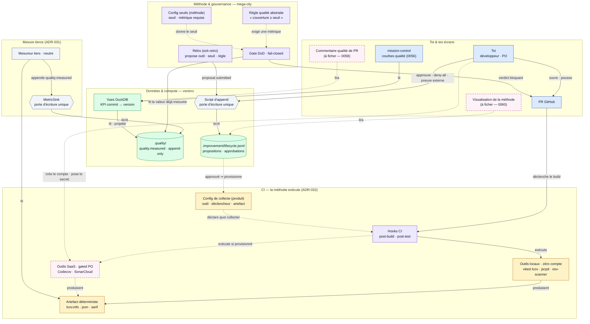

# "Qualité — composants détaillés (vue à débattre : CI, tiers, journaux, gouvernance)"

> Diagramme généré par **ezk-diagram**. Source de vérité : [`description.md`](description.md) (prose).
> Ce fichier est **généré** (explication comprise) — ne pas l’éditer à la main (il serait écrasé au prochain `publish`).

## Ce que montre ce diagramme

## Ce que montre ce diagramme

La vue **détaillée** de l'observabilité qualité : comment les cinq zones s'emboîtent, du push
d'une PR jusqu'aux courbes — et par où passe chaque décision.

Comment le lire :

- **bleu = toi et tes écrans** (la PR, mission-control) ; **violet = la méthode** (hooks CI,
  règles, gate, rétro) ; **ambre = les outils et leur config de collecte** ; **gris = les pièces
  neutres** (mesureur tiers et les deux portes d'écriture) ; **vert = les données** (journaux +
  vues de calcul).
- **Pointillé rose = pas encore fiché ou optionnel** : le commentaire de PR (0058), la
  visualisation de la méthode (0060), et les outils SaaS (chaque installation = proposition que
  TU approuves, c'est toi qui crées le compte).

Les quatre verrous à retenir :

1. **Lancer ≠ écrire** : la méthode exécute l'outil, mais seul le **mesureur tiers** écrit le
   chiffre (via MetricSink). De même, seule la porte « script d'append » écrit le journal des
   décisions — ni la rétro ni toi n'écrivez le fichier à la main.
2. **Le gate ne voit que le journal** : il lit une valeur déjà mesurée, jamais l'outil en
   direct ; pas de mesure valide ⇒ refus (fail-closed).
3. **Deux configs, pas une** : la *collecte* (quel outil, quel artefact) vit côté produit ; le
   *seuil* (la loi) vit côté méthode. Un seul fichier aurait recouplé les deux domaines.
4. **Les frontières se franchissent par fichiers** (journaux, config, artefacts), jamais par
   imports de code — c'est la parade structurelle au couplage.

**Vues partageables** · [Éditer sur mermaid.live](https://mermaid.live/edit#pako:eNqNVstuGzcU_RViAiQ2MHIk2_JDKQIoI9cWHMeKpHoRTRcU547MmEPKfKhxLANdteg26AdkU6BCPyCL7qI_8ZcUlzN6TGvE9caa4bmHh_fce4e3AVMJBI0gFeondkm1Jf1XsSSEECaoMS1IiVWcpFyIxpNkCDSF0FitrqDxpAa7VZqGTAmlG09qtdrB9v6LfwVnYC9VAgUBJHC4RrCXbB8kh98mUM5yYYr4FNIdtr-MH-7Wd6qPxCdKSoAFQcJSBiuCWv2gupN8m0CCs3pxgLSW1tPDZfzufr2-94iA1FmnF-FJup0eLMMPk9r-blI8VhJqLqnW9KaxR3b_w5mzGjccaTq-JL3j2iAO-oqTp8SCIfMZ01SaOPgxB-Jf6-gix3w31M9fJvPZBIQaj8Fp8vUL6ZyXwJ3uIA46XXLM7Ykblpais_4gDiKVZSAt5RrItaOC2_mMJEA6XU-_Mf9MUs4uQZP7n38n1Wr9YLPEchYN4iDjxnAlK0xJq5XwkUw5PQSzIt2oVut75eCL9rtBHFxwgxhDLVcS9xaUZPOZr7CHRexVVzwgkwfSuI1Ha3v4GhuBD_MZcxbIRrPVrVR3tst6Tk4HcXCi1JUhUdtvPVbGVoaOiwST658sGFtOZOTzKFM-QvVMCQEM9xhrlThuNz2Tr3gkSeYzJkCyy8Ixqi2klJU5X58j6XneJUIx6j4g9uN8phVhKhvbPDUTjnKIYGqC6-8NG3ulykwqhlEpQZd4e81mb0Xco7SH6BG1kJDOuaeMVAIFXU9JqiOhXFIiaXaxcpqFbjyQBZ1xyU2hCuVscZmqXJOS-N9QzdNHbNsZxMEZGKeBWA6aLY2qlY3qt4-6vSXWaY82uEve1-Uzt9-c3t4i2GrOelxeFdZqCyR5hj3GLW7pJL92EAd3d9_SuDuIg5aScj4DQ556M7CisNQmwKzSH0u7vx1sxMFW3gU3z_3OxcNWBhTle8PoeAwyqSgpbuJgs-RYp4Pqe0zzsSXJsxz5P4_ga6n9_ZEXwbOxVhPAfn8ueArshgnYQn_ylh1rNVaGYxuaQpNWQ9-Wpiyq9UOErXLhwJCWY1etV57gtNPGfGTckvtfPpEJaBwLj3heRx8XDfqUjJSbgJZUsjynGYxohXF7U8pq93gQB935nyOxNrbo0FhNeVGEX_8izHP5xNz_9gcx4LAF_y53b2_VvR5gyMZiXuSdW4R98WNEY36JhmvHTbnMjpv9o0EcHFMLpKVaGJBSLipMKAPlBuoe9bvn_gAzqxXZgI9XFQ1Wq801H4AsR8ZSgfYnfiihraMLUqm8nCo30ZDPKmcMTEmnmwM6Xb--mj5EAPGTbUpOTnNMFJHK1gJE_RdB8eVA0yvgyaknW4zTKc6r1crW2hIxnGDVcawEOZ9N_QjKsa_PI0-Tz0kD0k5xtuSLCMupHlz2E8BHC_7w-7xPFuWx6rapHwjFJu03-UnyDpqSt_n77vHiFHyETQUr76fe6CJfhUJ_G8F8eqPWEfhroRK_RBMqcFwl89n7-WeS4fiaz2C57xI-AZ1wZslQqGtH8eQLH7H1lozos1bvwdoVx1m0SguCC6ln_Vyr4JquL1y0360v4LAocoBFuvBnrAwVW8YNM26tz2Gz0ylXnp8WbuKLLwF5U6FC5AIB38IHC1rCeiT-KmV_tTn-ymUVtPMZuf_101opwZRE0ZoCxDJMJvqQfyGLT3bhDNNgF9W3dpnD6LDTDc8ivBKvX_MwZ-FF-13oS9Ff-ErLJ6dh9ziMeiG6FubpKi7GZZoofH0ehc1uv7j2llZ9wYZYiKHPR_4BK0HehpiO0DtfXHxfxDIIgwx0RnkSNIJbxMeBvYQM4qBB4iCBlDph4yCWd0EYUGdV70ayoGG1gzBw44RaaHE60jTLX979A-QkFeo=) · [Image PNG (mermaid.ink)](https://mermaid.ink/img/pako:eNqNVstuGzcU_RViAiQ2MHIk2_JDKQIoI9cWHMeKpHoRTRcU547MmEPKfKhxLANdteg26AdkU6BCPyCL7qI_8ZcUlzN6TGvE9caa4bmHh_fce4e3AVMJBI0gFeondkm1Jf1XsSSEECaoMS1IiVWcpFyIxpNkCDSF0FitrqDxpAa7VZqGTAmlG09qtdrB9v6LfwVnYC9VAgUBJHC4RrCXbB8kh98mUM5yYYr4FNIdtr-MH-7Wd6qPxCdKSoAFQcJSBiuCWv2gupN8m0CCs3pxgLSW1tPDZfzufr2-94iA1FmnF-FJup0eLMMPk9r-blI8VhJqLqnW9KaxR3b_w5mzGjccaTq-JL3j2iAO-oqTp8SCIfMZ01SaOPgxB-Jf6-gix3w31M9fJvPZBIQaj8Fp8vUL6ZyXwJ3uIA46XXLM7Ykblpais_4gDiKVZSAt5RrItaOC2_mMJEA6XU-_Mf9MUs4uQZP7n38n1Wr9YLPEchYN4iDjxnAlK0xJq5XwkUw5PQSzIt2oVut75eCL9rtBHFxwgxhDLVcS9xaUZPOZr7CHRexVVzwgkwfSuI1Ha3v4GhuBD_MZcxbIRrPVrVR3tst6Tk4HcXCi1JUhUdtvPVbGVoaOiwST658sGFtOZOTzKFM-QvVMCQEM9xhrlThuNz2Tr3gkSeYzJkCyy8Ixqi2klJU5X58j6XneJUIx6j4g9uN8phVhKhvbPDUTjnKIYGqC6-8NG3ulykwqhlEpQZd4e81mb0Xco7SH6BG1kJDOuaeMVAIFXU9JqiOhXFIiaXaxcpqFbjyQBZ1xyU2hCuVscZmqXJOS-N9QzdNHbNsZxMEZGKeBWA6aLY2qlY3qt4-6vSXWaY82uEve1-Uzt9-c3t4i2GrOelxeFdZqCyR5hj3GLW7pJL92EAd3d9_SuDuIg5aScj4DQ556M7CisNQmwKzSH0u7vx1sxMFW3gU3z_3OxcNWBhTle8PoeAwyqSgpbuJgs-RYp4Pqe0zzsSXJsxz5P4_ga6n9_ZEXwbOxVhPAfn8ueArshgnYQn_ylh1rNVaGYxuaQpNWQ9-Wpiyq9UOErXLhwJCWY1etV57gtNPGfGTckvtfPpEJaBwLj3heRx8XDfqUjJSbgJZUsjynGYxohXF7U8pq93gQB935nyOxNrbo0FhNeVGEX_8izHP5xNz_9gcx4LAF_y53b2_VvR5gyMZiXuSdW4R98WNEY36JhmvHTbnMjpv9o0EcHFMLpKVaGJBSLipMKAPlBuoe9bvn_gAzqxXZgI9XFQ1Wq801H4AsR8ZSgfYnfiihraMLUqm8nCo30ZDPKmcMTEmnmwM6Xb--mj5EAPGTbUpOTnNMFJHK1gJE_RdB8eVA0yvgyaknW4zTKc6r1crW2hIxnGDVcawEOZ9N_QjKsa_PI0-Tz0kD0k5xtuSLCMupHlz2E8BHC_7w-7xPFuWx6rapHwjFJu03-UnyDpqSt_n77vHiFHyETQUr76fe6CJfhUJ_G8F8eqPWEfhroRK_RBMqcFwl89n7-WeS4fiaz2C57xI-AZ1wZslQqGtH8eQLH7H1lozos1bvwdoVx1m0SguCC6ln_Vyr4JquL1y0360v4LAocoBFuvBnrAwVW8YNM26tz2Gz0ylXnp8WbuKLLwF5U6FC5AIB38IHC1rCeiT-KmV_tTn-ymUVtPMZuf_101opwZRE0ZoCxDJMJvqQfyGLT3bhDNNgF9W3dpnD6LDTDc8ivBKvX_MwZ-FF-13oS9Ff-ErLJ6dh9ziMeiG6FubpKi7GZZoofH0ehc1uv7j2llZ9wYZYiKHPR_4BK0HehpiO0DtfXHxfxDIIgwx0RnkSNIJbxMeBvYQM4qBB4iCBlDph4yCWd0EYUGdV70ayoGG1gzBw44RaaHE60jTLX979A-QkFeo=)

Les liens mermaid.live/mermaid.ink encodent le diagramme dans l’URL (service externe) — pratique pour partager/éditer vite ; la vue sans service tiers reste ce README rendu par GitHub.
