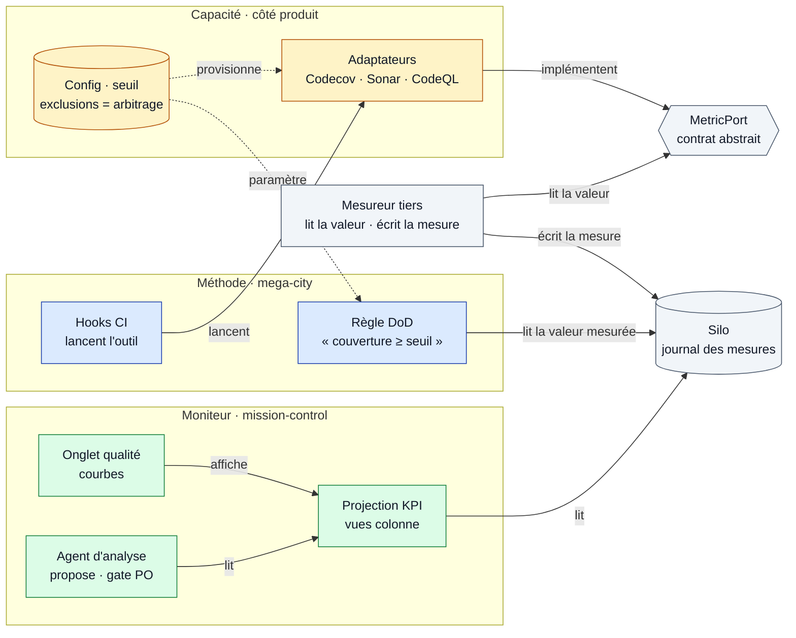

# "Qualité — diagramme de composants (port · adaptateurs · tiers · silo · moniteur)"

> Diagramme généré par **ezk-diagram**. Source de vérité : [`description.md`](description.md) (prose).
> Ce fichier est **généré** (explication comprise) — ne pas l’éditer à la main (il serait écrasé au prochain `publish`).

## Ce que montre ce diagramme

## Ce que montre ce diagramme

La structure statique de l'observabilité qualité — **qui dépend de quoi** — rangée selon la
trichotomie **règle / capacité / config** :

- **bleu = la méthode** (la règle-loi + les hooks qui lancent l'outil) ;
- **ambre = la capacité** (les outils, sous forme d'adaptateurs, + la config) ;
- **vert = le moniteur** (KPI, courbes, agent d'analyse).

En gris, trois pièces neutres : le **MetricPort** (le contrat abstrait — c'est lui qui rend
l'ensemble *language-agnostic*), le **Mesureur tiers** et le **Silo** (le magasin des mesures).

Le pivot **corrigé par le panel** : le **mesureur tiers** est le **seul** à *écrire* la mesure ;
la règle DoD, elle, **lit** une valeur déjà mesurée. On ajoute un outil = un adaptateur derrière
le port, sans toucher ni la règle ni le silo ; **installer un outil = provisionner un adaptateur**
(un préalable, pas une règle).

**Vues partageables** · [Éditer sur mermaid.live](https://mermaid.live/edit#pako:eNp9VM1uEzEQfpWReyhIG2hoQ2mASlGKWpSWhqQ9rTk43tmNwWsv_glUTR-AB0Ei4orEgVvzJjwJeHfzi8SerJnvG8_3zaxvCdcJkjZJpf7Ex8w4OB9QBQDAJbP2BFPI0Y11gpAKKds7yQhZipF1Rn_A9k4TD_ZYGnEttWnvNJvNZ08On28VKIxOvHB1gRTTfX64LDA6aO3vHf2_QK6VcOjNogWeclxVaLae7e0n_6-g0DuzkJA201Z6tOQfHLZaT__toKpg_SgzrBjDxaur-GI-q6y4_wk5ZqzBhbt5VwHDN4gpGcy_ZRLhRJ-8GJnHx_ffgWs_QeO8Qfj95StY9ELC_S9K1phnMSVnWn-w0H1d8iRTHJUDuau9E3IJRpVUh_7tLSUX6IzgfW1cSeJaOcMcsJF1hglHyd3dloxupx93WcG4cPNZ0MHnP8KpntFaS52Ykk7CCseC9ba8oKsT5HoSeEOtmAmHEHt7vqGmGz-gpKtVKrKAKBWXfPzMpbdCKwsvgZmRcIZlSMnDbXVXcRBnvQlTdwLr-6VwIBlMmAzxv5fPZ9xUsbxEL9sYhhaGQuqS9157o5iEBG0NtKtLVyO-fBNfLFYtjFjY0GujtFXLNYG9mJK-0e-RO6EV9PrV0CYeLYQ9Ugo3DLmOKblUmUQHHz2Twft6YN6MQi_rvp8G47Mw_GSXKSZvLJbgwuhC23L5MuYQ-pebW1Edz6DROJ7W6zOFThXtlFGRF3I-y1G5Mtevva4Y69Zu5bZdnsKwSg_-pVaQ-WwF6kLjUeN4WjDD8vk3F-iDzYzRExGcVrhsuLeovCxzXUZYmgo-xin0amGnK2Bv4UH528MgOlu8XevPAXSi7mLdN-K96DrqnC4fm41cPxpGV_Ur8pwqEpEcTc5EQtrkNgApcWPMkZI2UJJgyrx0lFB1RyLCvNPDG8VJ2xmPEfFFwhyeCJYZllfBuz9agddZ) · [Image PNG (mermaid.ink)](https://mermaid.ink/img/pako:eNp9VM1uEzEQfpWReyhIG2hoQ2mASlGKWpSWhqQ9rTk43tmNwWsv_glUTR-AB0Ei4orEgVvzJjwJeHfzi8SerJnvG8_3zaxvCdcJkjZJpf7Ex8w4OB9QBQDAJbP2BFPI0Y11gpAKKds7yQhZipF1Rn_A9k4TD_ZYGnEttWnvNJvNZ08On28VKIxOvHB1gRTTfX64LDA6aO3vHf2_QK6VcOjNogWeclxVaLae7e0n_6-g0DuzkJA201Z6tOQfHLZaT__toKpg_SgzrBjDxaur-GI-q6y4_wk5ZqzBhbt5VwHDN4gpGcy_ZRLhRJ-8GJnHx_ffgWs_QeO8Qfj95StY9ELC_S9K1phnMSVnWn-w0H1d8iRTHJUDuau9E3IJRpVUh_7tLSUX6IzgfW1cSeJaOcMcsJF1hglHyd3dloxupx93WcG4cPNZ0MHnP8KpntFaS52Ykk7CCseC9ba8oKsT5HoSeEOtmAmHEHt7vqGmGz-gpKtVKrKAKBWXfPzMpbdCKwsvgZmRcIZlSMnDbXVXcRBnvQlTdwLr-6VwIBlMmAzxv5fPZ9xUsbxEL9sYhhaGQuqS9157o5iEBG0NtKtLVyO-fBNfLFYtjFjY0GujtFXLNYG9mJK-0e-RO6EV9PrV0CYeLYQ9Ugo3DLmOKblUmUQHHz2Twft6YN6MQi_rvp8G47Mw_GSXKSZvLJbgwuhC23L5MuYQ-pebW1Edz6DROJ7W6zOFThXtlFGRF3I-y1G5Mtevva4Y69Zu5bZdnsKwSg_-pVaQ-WwF6kLjUeN4WjDD8vk3F-iDzYzRExGcVrhsuLeovCxzXUZYmgo-xin0amGnK2Bv4UH528MgOlu8XevPAXSi7mLdN-K96DrqnC4fm41cPxpGV_Ur8pwqEpEcTc5EQtrkNgApcWPMkZI2UJJgyrx0lFB1RyLCvNPDG8VJ2xmPEfFFwhyeCJYZllfBuz9agddZ)

Les liens mermaid.live/mermaid.ink encodent le diagramme dans l’URL (service externe) — pratique pour partager/éditer vite ; la vue sans service tiers reste ce README rendu par GitHub.
