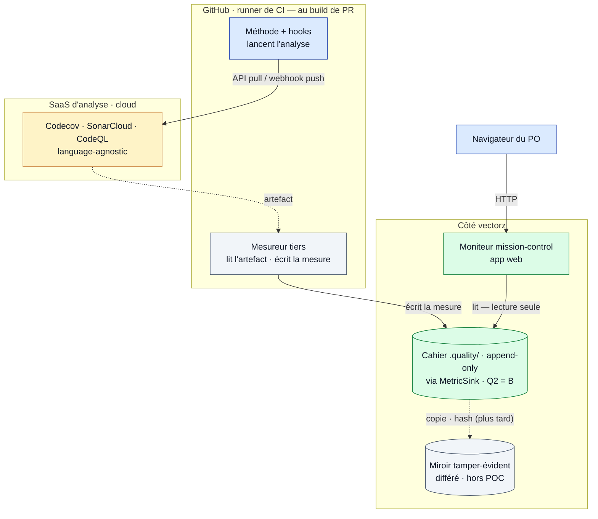

# "Qualité — diagramme de déploiement (où tourne quoi)"

> Diagramme généré par **ezk-diagram**. Source de vérité : [`description.md`](description.md) (prose).
> Ce fichier est **généré** (explication comprise) — ne pas l’éditer à la main (il serait écrasé au prochain `publish`).

## Ce que montre ce diagramme

## Ce que montre ce diagramme

**Où tourne physiquement chaque pièce**, et par quel canal elles se parlent :

- **bleu = l'exécution** (le runner de CI, au build de PR, où la méthode lance l'analyse ; et le
  navigateur du PO) ;
- **gris = le mesureur tiers** (neutre) — il tourne aussi sur la CI, mais c'est **lui** qui écrit ;
- **ambre = le cloud** (les outils d'analyse SaaS, language-agnostic) ;
- **vert = côté vectorz** (le silo, et le moniteur web).

Le point **corrigé par le panel** : c'est le **mesureur tiers** qui écrit la mesure (ni la méthode
auditée, ni le moniteur). Le silo n'a pas encore de foyer figé (arbitrage Q2 : dans le silo 0044
ou un frère `.quality/`), donc on écrit derrière une interface neutre (`MetricSink`) en attendant ;
et le **miroir** tamper-évident est **repoussé hors du premier jet** (POC). Rien de nouveau à
héberger sauf le silo et le moniteur ; les outils lourds sont délégués au cloud.

**Vues partageables** · [Éditer sur mermaid.live](https://mermaid.live/edit#pako:eNp9VN1OGkEUfpWT8aKasioqVWlrUtAUEqnI0pqU7cUwc5adOMxsZ2ewVEz6EH0J7pv0vrxJn6SdXdaCNnJ5zvdzzn5nuCVMcyR1Ekt9wxJqLPRPIwUAwCTNslOMAb8gg1hIWd_gQ6QxVjJr9DXWN6p4sEvjCtNSm_pGtVo92jt8-YDNpHZ8SY8x3meH9_ThQW1_9_hp-gSZ1eZr6c9ihv8EqrWj3X3-tIBCZw2WA1TjWnx8zz84rNVePB6gUMjccGRomkCzPXgrbMsN4ddPME4pNMARmm34_e07UAdDJyT3pW7vU8H1v05rEJHOYm4TzRGeQ6L1dfZqaHZOJFUMlQX5jCoqpxlGZIXX73keZs6gM2AFmiVL5AxjMabM-lkWc2Z8kcI4h9_LoOIPdzi_eH86CCkNgZeuXiJPZ9V8EJGm5sj0xLdDrahp5gn-9fONy_NyhZGjIwzoSOnMCvaE94ePg-bih13MyzBX_MLBZkSaNBFoYPuzo1LY6Y73ommKigdayWluOBEUOmiNYKFQ1x5xuQevoRGRrdVv3u55wY4wWhiwdJyiCRbzieCobK7DRRwv5mYx9xKJNhl0L5rrIldnDZ-AVsL6BMYiy4RWAdPKGi1zFZqmcIPDx0t75js6ESOac7mD7kWOKtqdFgTBySwib7ptSJ2UsON1_GlA6rIkIjPoF9A-BNvByazMewb93rLRyzUehj-DsOiHBTEiTKciDzmhWQKbqXQZWGr4lnfptJdyV2eN5Uz-wPxFS2TWGYQMnUSPXQoXuFa_3515VrlT_tL8Zv5_YvX1-UmL17deLY5urRZW_BjL81jrdNr_FWmUbqRCxmjGVHBSJ7ceEhGb4BgjUoeIcIypkzYikbojFUKd1eFUMVK3xmGFuJRTi6eCjgwdF8W7P6yHqvY=) · [Image PNG (mermaid.ink)](https://mermaid.ink/img/pako:eNp9VN1OGkEUfpWT8aKasioqVWlrUtAUEqnI0pqU7cUwc5adOMxsZ2ewVEz6EH0J7pv0vrxJn6SdXdaCNnJ5zvdzzn5nuCVMcyR1Ekt9wxJqLPRPIwUAwCTNslOMAb8gg1hIWd_gQ6QxVjJr9DXWN6p4sEvjCtNSm_pGtVo92jt8-YDNpHZ8SY8x3meH9_ThQW1_9_hp-gSZ1eZr6c9ihv8EqrWj3X3-tIBCZw2WA1TjWnx8zz84rNVePB6gUMjccGRomkCzPXgrbMsN4ddPME4pNMARmm34_e07UAdDJyT3pW7vU8H1v05rEJHOYm4TzRGeQ6L1dfZqaHZOJFUMlQX5jCoqpxlGZIXX73keZs6gM2AFmiVL5AxjMabM-lkWc2Z8kcI4h9_LoOIPdzi_eH86CCkNgZeuXiJPZ9V8EJGm5sj0xLdDrahp5gn-9fONy_NyhZGjIwzoSOnMCvaE94ePg-bih13MyzBX_MLBZkSaNBFoYPuzo1LY6Y73ommKigdayWluOBEUOmiNYKFQ1x5xuQevoRGRrdVv3u55wY4wWhiwdJyiCRbzieCobK7DRRwv5mYx9xKJNhl0L5rrIldnDZ-AVsL6BMYiy4RWAdPKGi1zFZqmcIPDx0t75js6ESOac7mD7kWOKtqdFgTBySwib7ptSJ2UsON1_GlA6rIkIjPoF9A-BNvByazMewb93rLRyzUehj-DsOiHBTEiTKciDzmhWQKbqXQZWGr4lnfptJdyV2eN5Uz-wPxFS2TWGYQMnUSPXQoXuFa_3515VrlT_tL8Zv5_YvX1-UmL17deLY5urRZW_BjL81jrdNr_FWmUbqRCxmjGVHBSJ7ceEhGb4BgjUoeIcIypkzYikbojFUKd1eFUMVK3xmGFuJRTi6eCjgwdF8W7P6yHqvY=)

Les liens mermaid.live/mermaid.ink encodent le diagramme dans l’URL (service externe) — pratique pour partager/éditer vite ; la vue sans service tiers reste ce README rendu par GitHub.
