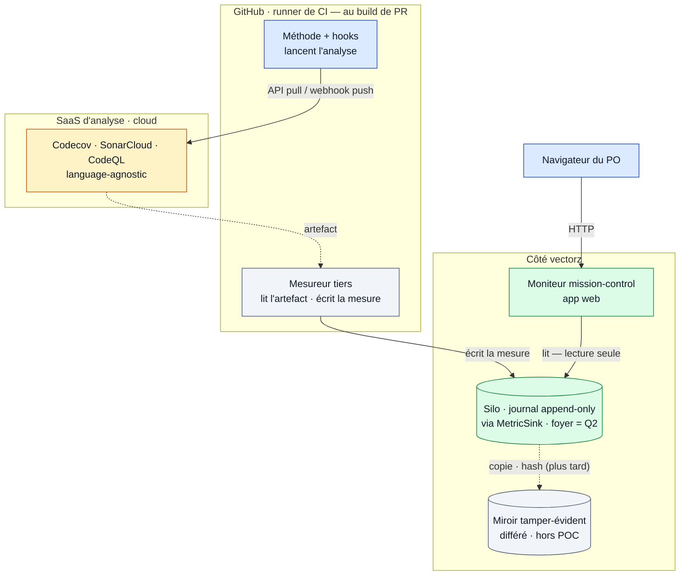

# "Qualité — diagramme de déploiement (où tourne quoi)"

> Diagramme généré par **ezk-diagram**. Source de vérité : [`description.md`](description.md) (prose).
> Ce fichier est **généré** (explication comprise) — ne pas l’éditer à la main (il serait écrasé au prochain `publish`).

## Ce que montre ce diagramme

## Ce que montre ce diagramme

**Où tourne physiquement chaque pièce**, et par quel canal elles se parlent :

- **bleu = l'exécution** (le runner de CI, au build de PR, où la méthode lance l'analyse ; et le
  navigateur du PO) ;
- **gris = le mesureur tiers** (neutre) — il tourne aussi sur la CI, mais c'est **lui** qui écrit ;
- **ambre = le cloud** (les outils d'analyse SaaS, language-agnostic) ;
- **vert = côté vectorz** (le silo, et le moniteur web).

Le point **corrigé par le panel** : c'est le **mesureur tiers** qui écrit la mesure (ni la méthode
auditée, ni le moniteur). Le silo n'a pas encore de foyer figé (arbitrage Q2 : dans le silo 0044
ou un frère `.quality/`), donc on écrit derrière une interface neutre (`MetricSink`) en attendant ;
et le **miroir** tamper-évident est **repoussé hors du premier jet** (POC). Rien de nouveau à
héberger sauf le silo et le moniteur ; les outils lourds sont délégués au cloud.

**Vues partageables** · [Éditer sur mermaid.live](https://mermaid.live/edit#pako:eNp9lMFOGzEQhl9lZA4FNVsIkAJpi1QSRCKRErJpkZrtwbFnsy6OvfLaoSlB6kP0JXKv1HvzJn2S1rtZmkBFjjPzf__Mzji3hGmOpE5iqW9YQo2FfjNSAABM0ixrYgz4BRnEQsr6Bh8ijbGSWaOvsb5Rxf0dGleYltrUN6rV6uHuwasHaia140t5jPEeO7iXD_dreztHT8snyKw2X0t_FjP8B6jWDnf2-NMAhc4aLBuoxrX46F6_f1CrvXzcQEHI3HBkaJpAoz04E7blhvDrJxinFBrgCI02_P72HaiDoROS-1C396nQ-l-nNYhIZzG3ieYIzyHR-jp7PTTbx5IqhsqCfEYVldMMI7Ki6_e8DjNn0BmwAs1SJXKFsRhTZn0vizkzPkhhnJffY1DxhzOcX7xvDkJKQ-Clq0fk21k1H0SkoTkyPfHpUCtqGvkG__r5xOV5OcLI0REGdKR0ZgV7wvvDx0Fj8cMu5uUyV_zCwWZEQiG153_WzigqgaYpKh5oJae52URQ6KA1goVCXfvKWE_RwBu43I3I1uo3b_c8sCOMFgYsHadogsV8Ijgqm7O4iOPF3CzmHpNok0H3orEOuTo98RvQSli_gbHIMqFVwLSyRsucQtMUbnD4eGivfEcnYkRzLXfQvcirinSnBUFwPIvI224bUiclbHuOPw1IXZZEZAb9orQPwYvgeFbuewb93jLRyxkPlz-DsMiHhTAiTKciX3JCswQ2U-kysNTwLe_SaS9xV6cny578gfmLlsisMwgZOom-dgku6lr9fnfmVeVM-Uvzk_n_idXX5zstXt96tDi6tVhY8W0sz2Mt02n_F3JSupEKGaMZU8FJndz6kojYBMcYkTpEhGNMnbQRidQdqRDqrA6nipG6NQ4rxKWcWmwKOjJ0XATv_gCMzKu5) · [Image PNG (mermaid.ink)](https://mermaid.ink/img/pako:eNp9lMFOGzEQhl9lZA4FNVsIkAJpi1QSRCKRErJpkZrtwbFnsy6OvfLaoSlB6kP0JXKv1HvzJn2S1rtZmkBFjjPzf__Mzji3hGmOpE5iqW9YQo2FfjNSAABM0ixrYgz4BRnEQsr6Bh8ijbGSWaOvsb5Rxf0dGleYltrUN6rV6uHuwasHaia140t5jPEeO7iXD_dreztHT8snyKw2X0t_FjP8B6jWDnf2-NMAhc4aLBuoxrX46F6_f1CrvXzcQEHI3HBkaJpAoz04E7blhvDrJxinFBrgCI02_P72HaiDoROS-1C396nQ-l-nNYhIZzG3ieYIzyHR-jp7PTTbx5IqhsqCfEYVldMMI7Ki6_e8DjNn0BmwAs1SJXKFsRhTZn0vizkzPkhhnJffY1DxhzOcX7xvDkJKQ-Clq0fk21k1H0SkoTkyPfHpUCtqGvkG__r5xOV5OcLI0REGdKR0ZgV7wvvDx0Fj8cMu5uUyV_zCwWZEQiG153_WzigqgaYpKh5oJae52URQ6KA1goVCXfvKWE_RwBu43I3I1uo3b_c8sCOMFgYsHadogsV8Ijgqm7O4iOPF3CzmHpNok0H3orEOuTo98RvQSli_gbHIMqFVwLSyRsucQtMUbnD4eGivfEcnYkRzLXfQvcirinSnBUFwPIvI224bUiclbHuOPw1IXZZEZAb9orQPwYvgeFbuewb93jLRyxkPlz-DsMiHhTAiTKciX3JCswQ2U-kysNTwLe_SaS9xV6cny578gfmLlsisMwgZOom-dgku6lr9fnfmVeVM-Uvzk_n_idXX5zstXt96tDi6tVhY8W0sz2Mt02n_F3JSupEKGaMZU8FJndz6kojYBMcYkTpEhGNMnbQRidQdqRDqrA6nipG6NQ4rxKWcWmwKOjJ0XATv_gCMzKu5)

Les liens mermaid.live/mermaid.ink encodent le diagramme dans l’URL (service externe) — pratique pour partager/éditer vite ; la vue sans service tiers reste ce README rendu par GitHub.
