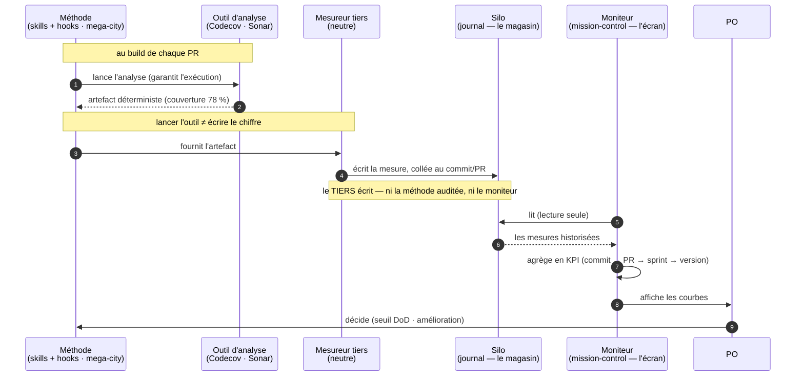

# "Qualité — la méthode exécute, un tiers mesure, le moniteur agrège (flux)"

> Diagramme généré par **ezk-diagram**. Source de vérité : [`description.md`](description.md) (prose).
> Ce fichier est **généré** (explication comprise) — ne pas l’éditer à la main (il serait écrasé au prochain `publish`).

## Ce que montre ce diagramme

## Ce que montre ce diagramme

Le chemin d'une mesure de qualité, du moment où une PR est construite jusqu'à ce que le PO en
tire une décision.

Le point clé, **corrigé par le panel adverse** : **lancer l'outil ≠ écrire le chiffre**. La
méthode *exécute* l'outil (elle seule peut, pendant le build) et garantit qu'il tourne ; mais
c'est un **tiers neutre** qui *note* le résultat dans le journal — sinon l'élève corrigerait sa
propre copie. Ni la méthode auditée, ni le moniteur n'écrivent la mesure.

Deux mots à ne pas confondre : le **silo** est le *magasin* (le journal qui garde chaque mesure,
collée à un commit/PR) ; le **moniteur** (mission-control) est l'*écran* qui lit ce magasin et
affiche les courbes.

**Vues partageables** · [Éditer sur mermaid.live](https://mermaid.live/edit#pako:eNptU81qGzEQfpVBUOzQNTm2LMWXpodQXJusj76MtbPeabSSM5JMQwj0VOi19AF67D5B7903yZMU7Q8pxKdlNfP9zHzSg9KuJJUrT3eRrKYrxoNgs7MAABiDs7HZkwz_R5TAmo9oA6wAPay6NtSupHd7uVzO_S0b4-E11M7devj7Bxo64EJzuL94SbBOBOsY2EA5Q4vm3o88711J2p0SQeEsyhnwtlcnH4WiQGASP2AtxSB0BlEkRMHGDX2fXRSLBp6-_gRD0OABPdszuJWzvZazHCjKgG7Ye3Z2oZ0N4kaWWddqwXMcm37WzXpnh9onFwjciQRW2ToHjLCPbEooCXSNd5FgczN0rhbL5ToHg1YTmGlNMD-goA0cwMzoS9fqGNhNyuvFYrlc5YASqEIdoOzaQNKwZR8I5trFE0mIQvDmLby6eOlpOyoKmJnrE3r6_gvSeCyU1qVrriqhZ4_bHKq00d7RJDyUt4vlssgHdACD0PSxZaCdMV1LaXztmobD5TT1s5dtVuRJcHv94aaYONK2LfdU4_0DjCWHrqWsLxA0Y1yjQ2cHE4YDzA3pfnhP0Uw3peh35mwS86NDDzX74IR915L_n6lvxIN0vw8EZOHj5jqtNc0AT99-wOam__ijsB1OTiT-OaGBZZOiryrWNfWq2kXZT0Kb9RBi2bWaS4K5p8gGrtxVehbYdK1hJzjGrjLVkDTIpcrVQ2LYqVBTQzuVw06VVGE0Yad29lFlKj3r4t5qlQeJlKl4LDFML384fPwHfAhvoQ==) · [Image PNG (mermaid.ink)](https://mermaid.ink/img/pako:eNptU81qGzEQfpVBUOzQNTm2LMWXpodQXJusj76MtbPeabSSM5JMQwj0VOi19AF67D5B7903yZMU7Q8pxKdlNfP9zHzSg9KuJJUrT3eRrKYrxoNgs7MAABiDs7HZkwz_R5TAmo9oA6wAPay6NtSupHd7uVzO_S0b4-E11M7devj7Bxo64EJzuL94SbBOBOsY2EA5Q4vm3o88711J2p0SQeEsyhnwtlcnH4WiQGASP2AtxSB0BlEkRMHGDX2fXRSLBp6-_gRD0OABPdszuJWzvZazHCjKgG7Ye3Z2oZ0N4kaWWddqwXMcm37WzXpnh9onFwjciQRW2ToHjLCPbEooCXSNd5FgczN0rhbL5ToHg1YTmGlNMD-goA0cwMzoS9fqGNhNyuvFYrlc5YASqEIdoOzaQNKwZR8I5trFE0mIQvDmLby6eOlpOyoKmJnrE3r6_gvSeCyU1qVrriqhZ4_bHKq00d7RJDyUt4vlssgHdACD0PSxZaCdMV1LaXztmobD5TT1s5dtVuRJcHv94aaYONK2LfdU4_0DjCWHrqWsLxA0Y1yjQ2cHE4YDzA3pfnhP0Uw3peh35mwS86NDDzX74IR915L_n6lvxIN0vw8EZOHj5jqtNc0AT99-wOam__ijsB1OTiT-OaGBZZOiryrWNfWq2kXZT0Kb9RBi2bWaS4K5p8gGrtxVehbYdK1hJzjGrjLVkDTIpcrVQ2LYqVBTQzuVw06VVGE0Yad29lFlKj3r4t5qlQeJlKl4LDFML384fPwHfAhvoQ==)

Les liens mermaid.live/mermaid.ink encodent le diagramme dans l’URL (service externe) — pratique pour partager/éditer vite ; la vue sans service tiers reste ce README rendu par GitHub.
