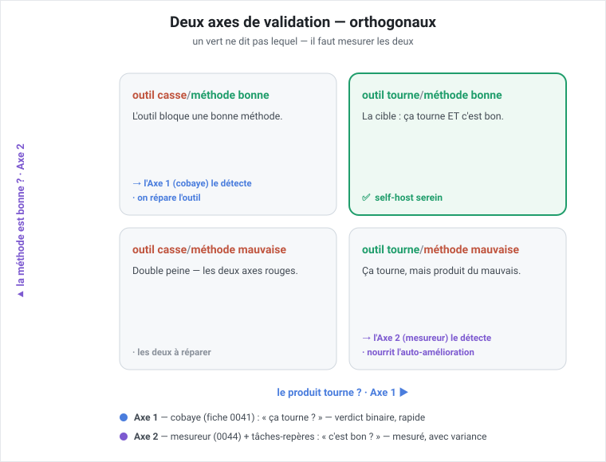

# ADR-031 — Deux axes de validation : banc fonctionnel du produit vs éval de qualité de méthode

**Statut :** **PROPOSÉ** — panel adverse manuel + arbitrage PO avant gravure (comme ADR-030),
idéalement après la 1ʳᵉ boucle de self-hosting vécue.
**Date :** 2026-07-16
**Déciders :** elzinko (PO)
**Compose (sans les rouvrir) :** le contrat de supervisabilité (capture 2026-07-13, gelé),
le contrat d'améliorabilité ([ADR-030](ADR-030-contrat-ameliorabilite.md), proposé — son
mesureur = fiche vectorz 0044), la fiche 0041 (cobaye — banc de test rapide).
**Ne révise pas :** ADR-021 (couture = **fichiers de config** — la « 2ᵉ couture journal » est
annoncée par la capture 2026-07-13 §7, pas encore écrite ; formule corrigée par ADR-032 item 7),
ADR-028 (lecteur journal).

## Contexte

Session self-hosting (2026-07-16). En proposant une « fiche cobaye » pour le premier
self-host, **collision de vocabulaire** : « cobaye » est déjà le nom de la fiche 0041 (banc
de test rapide). Le PO a alors **distingué deux préoccupations de validation** qu'on
mélangeait, et les a jugées **toutes deux importantes** :

1. *« tester tout de suite le projet »* — un **projet blanc**, un agent vérifie la cohérence
   du résultat ;
2. *« valider si la méthode fournit de bons résultats »* — selon skills / agents / prompts /
   workflow / règles / outils / métriques utilisés.

Le PO note que (2) peut **nourrir l'auto-amélioration** et l'**anticipation de bugs**, et
qu'il faut **définir des métriques** pour que l'éval ne soit pas trop longue et mesure
**objectivement les « dérives de valeurs factuelles »**.

Point clé : **ni (1) ni (2) n'est le self-hosting.** Le self-hosting (développer vectorz
avec vectorz) est l'**usage réel** qui *exerce* les deux.

## Décision (proposée)

> **Figure 1 — Les deux axes sont orthogonaux.** Colonnes = **Axe 1** (« le produit
> tourne-t-il ? », le cobaye 0041) ; lignes = **Axe 2** (« la méthode est-elle bonne ? »,
> le mesureur 0044 sur tâches-repères). Le quadrant *outil tourne / méthode mauvaise* est la
> raison d'être de l'ADR : ça compile mais produit du mauvais, et **seul l'Axe 2 l'attrape** —
> un test unique passerait au vert en le manquant. Code couleur : **rouge** = ça casse / c'est
> mauvais ; **vert** = ça tourne / c'est bon.

Reconnaître **deux axes de validation orthogonaux**, plus le self-hosting comme **usage**
(pas un test) :

- **Axe 1 — validation FONCTIONNELLE du produit (« ça tourne ? »).** Objet testé : **cop1,
  l'outil** (orchestrateur, gates, journal, worktrees, reprise). Entrée : un projet
  **blanc/synthétique**, jetable. Verdict ~binaire (marche / casse) + cohérence vérifiée par
  un agent. **C'est la fiche 0041.** Rapide, à chaque changement de cop1.
- **Axe 2 — évaluation de QUALITÉ de la méthode (« c'est bon ? »).** Objet testé : une
  **config de méthode** (skills + agents + prompts + workflow + règles + outils + métriques).
  **Mesure de qualité, non binaire, comparative, avec variance.** Alimente l'auto-amélioration
  (Sujet B) et l'anticipation de régressions de méthode.

**Décision structurante : l'Axe 2 n'est PAS un nouveau système.** C'est **le mesureur du
contrat d'améliorabilité (fiche 0044) appliqué à un corpus de tâches-repères, bâti sur le
harnais d'exécution de l'Axe 1.** Superposition :

| Couche | Rôle |
|---|---|
| **Couche 0 — harnais** | faire tourner la méthode sur un projet synthétique (fiche 0041) |
| **Axe 1** | Couche 0 **+ contrôle de cohérence** (ça tourne + ça a l'air sain) |
| **Axe 2** | Couche 0 **+ corpus de tâches-repères** (réponse vérifiable) **+ oracle objectif + baseline gelée + mesureur 0044** → qualité |

En tournant sur les tâches-repères, la méthode **émet son journal de supervisabilité** ; le
mesureur lit les outcomes + l'oracle. **Axe 2 compose donc les deux contrats existants** +
le banc 0041 — **zéro duplication** de la définition des métriques.

### Métriques de l'Axe 2 (réponse à la question du PO)

- **Tâches-repères (golden tasks)** à **réponse vérifiable par un oracle objectif** (test
  passe/échoue, lint/typecheck vert, fonction retourne X) — **pas** « un agent juge que c'est
  cohérent » (subjectif, non reproductible ⇒ inapte à mesurer une dérive). *L'agent-cohérence
  reste l'oracle de l'Axe 1, pas de l'Axe 2.*
- **Baseline gelée** : la dérive = écart aux outcomes d'une version de référence gelée.
- **Bruit stochastique ≠ dérive** : le LLM est non-déterministe ⇒ **k exécutions**, mesurer
  moyenne + variance ; une régression = écart **significatif au-delà du bruit**.
- **Bornage** (« pas trop long ») : échantillon **N stratifié**, **time-box**, **budget
  tokens** plafonné ; exécution asynchrone/nocturne.
- **Governing variables** : le choix des tâches-repères, de l'oracle et des seuils est **gelé
  et PO** (comme ADR-030) — sinon la méthode s'optimise pour le bench (Goodhart), pas pour la
  réalité.

## Options considérées

### Option A — Un seul « test » unique (fusionner les deux axes)
| Dimension | Évaluation |
|---|---|
| Complexité | Faible |
| Fidélité au besoin | **Mauvaise** — confond « ça tourne » et « c'est bon » |

**Contre :** un vert ne dit pas *lequel* des deux est vert. **Rejeté** : le PO a explicitement
séparé les deux.

### Option B — Deux systèmes séparés et indépendants
| Dimension | Évaluation |
|---|---|
| Clarté | Bonne |
| Coût / duplication | **Élevé** — harnais **et** définition des métriques dupliqués |

**Contre :** réimplémente le mesureur 0044 et le harnais 0041 ; les définitions de métriques
divergent. **Rejeté.**

### Option C — Deux axes distincts, Axe 2 composé sur Axe 1 + réutilise le mesureur  ✅ RETENU
| Dimension | Évaluation |
|---|---|
| Séparation des préoccupations | Nette (2 axes orthogonaux) |
| Duplication | **Nulle** — 1 harnais, 1 mesure, 2 feeders (runs réels / tâches-repères) |
| Alignement | Hexagonal (ADR-021) ; « évaluateur d'abord » (0044, leçon AlphaEvolve) |
| Chemin | Incrémental : 0041 → 0044 → corpus+oracle |

## Analyse des trade-offs

Les deux axes sont **orthogonaux** — une méthode peut tourner (Axe 1 vert) et produire du
mauvais (Axe 2 rouge), ou l'inverse. Les confondre (A) fait perdre l'information la plus
utile. Les séparer physiquement (B) coûte cher et fait diverger les métriques. **C** garde la
séparation *conceptuelle* tout en partageant l'*infrastructure* : le vrai gain est que l'Axe 2
tombe presque « gratuitement » une fois 0041 (harnais) et 0044 (mesureur) livrés — il ne reste
qu'à ajouter un **corpus** et un **oracle**.

## Conséquences

- ✅ **Plus facile** : chemin incrémental clair (0041 harnais → 0044 mesureur → Axe 2 = corpus
  + oracle) ; chaque brique se prouve seule (construire → prouver → retirer).
- ✅ L'auto-amélioration (Sujet B) gagne une source d'outcomes **reproductible** (le bench) en
  plus des runs réels — utile pour anticiper les régressions AVANT de merger.
- ⚠️ **Plus dur** : concevoir de bons **oracles objectifs** pour des tâches de dev (non
  trivial) ; concevoir le corpus.
- 🔁 **À revisiter** : quand une 2ᵉ méthode existera (pilote 0038), vérifier que corpus/oracle
  ne sont pas BMAD-spécifiques (cf. « prouver sur une 2ᵉ méthode », ADR-030).

## Risques

| Risque | Parade |
|---|---|
| **Goodhart / overfit du bench** | métriques governing **gelées (PO)** ; corpus tournant/élargi ; triangulation avec les runs réels |
| **Coût de l'oracle** | démarrer par des tâches à **oracle gratuit** (tests / lint / typecheck verts) — MVP |
| **Bruit pris pour une dérive** | **k-run** + seuil de significativité |
| **Éval trop lente** | échantillon borné, budget, exécution asynchrone |

## Action Items (arbitrages PO / panel)

1. [ ] Valider les **2 axes** + l'**Option C** (Axe 2 composé, pas un nouveau système).
2. [ ] **Panel adverse manuel** avant gravure (culture repo) — idéalement après la 1ʳᵉ boucle
   de self-hosting.
3. [ ] Définir le **1ᵉʳ corpus** de tâches-repères (départ : oracles gratuits) — grooming.
4. [ ] Choisir **k** (répétitions) et les **seuils** de significativité — governing, PO.
5. [ ] Fiches backlog si Option C validée : promouvoir **0041** (harnais / Axe 1) ; **créer**
   la fiche Axe 2 (corpus + oracle + branchement mesureur 0044).
6. [ ] Statuer où vit le corpus/oracle (fixtures côté vectorz vs repo dédié).
