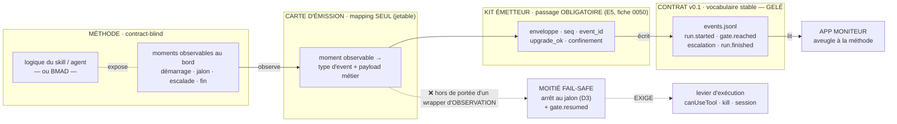

# ADR-032 — Séparabilité de l'émission : ce qu'une « carte d'émission » peut et ne peut pas produire

**Statut :** **ACCEPTÉ** — gravé par le PO le **2026-07-17**, après panel adverse (2026-07-16,
verdict « revoir-en-profondeur » appliqué) et arbitrage (i). La gravure prend la forme du **guide
compagnon** [docs/brancher-une-methode-existante.md](../brancher-une-methode-existante.md)
(comment brancher une méthode existante, exemple BMAD, pièges d'archi résolus). La **preuve
empirique** (0058, après 0050) reste la validation de la première implémentation sidecar — tout
retour d'expérience amende le guide.
**Date :** 2026-07-16 · **révisé 2026-07-16** après panel adverse (verdict *revoir-en-profondeur* ;
findings confirmés appliqués — la Décision, la table des options, le corollaire BMAD et le critère
du spike ont tous changé).
**Déciders :** elzinko (PO).
**Arbitrage PO (2026-07-17) : issue (i) RETENUE** — l'émetteur canonique **reste dans la méthode**
(D12 respecté, rien de rouvert). Le « **sidecar** » (mot du PO — alias *bmad-contracter*) est
**l'INSTALLATEUR** qui fait parler une méthode qu'on ne possède pas (Option A′), **pas** un wrapper
d'observation (Option B). Conséquences actées le même jour : fusion du spike 0048 dans la fiche
0058 (qui devient LA fiche sidecar) ; chemin de dev **0050 → 0058**.
**Origine :** `/architecture` demandé par le PO (« sujet important »), **cadré par la cérémonie
`ezk-retro`** (dry-run 2026-07-16 — convergence des lentilles architecte/QA/PM).
**Compose (sans le rouvrir) :** le contrat de supervisabilité gelé (capture 2026-07-13 §7).
**Décisions numérotées E1…E6** — propres à cet ADR : les décisions gelées **D3/D11/D12/D13** sont
citées comme **précédents d'inspiration, jamais comme autorités étendues** (norme
[ADR-030](ADR-030-contrat-ameliorabilite.md):19-22, à laquelle cet ADR se conforme).
**Citation intégrale de D12** (capture:249-252 — la version tronquée de la v1 de cet ADR inversait
sa polarité) : « L'**émetteur canonique est fourni par la méthode** (consignes de skill + script +
hooks livrés par mega-city) ; 🛠 un **shim d'émission côté superviseur est admis comme adaptateur
de transition** (marqué legacy — c'est le statut du pont BMAD actuel, **voué à disparaître** avec
l'extraction de `BmadCycle`, §4). » Et capture:277 : « `events.jsonl` # écrit par la MÉTHODE
(émetteur) — **jamais par le superviseur** ».
**Ne révise pas :** [ADR-028](ADR-028-lecteur-journal-mode-moniteur.md) (lecteur journal) ;
[ADR-021](ADR-021-megacity-integration-boundary.md) — **couture = les fichiers de config de cop1**
(ADR-021:43-44), **tel que révisé par la capture 2026-07-13 §7** (« Révisions d'ADR annoncées … à
matérialiser : ADR-021 décisions 2-3 — la 2ᵉ couture = le journal au format du contrat »,
capture:389-390) : cette révision est **annoncée, pas écrite**. Constat de panel : ADR-021 ne
contient aujourd'hui **aucune** occurrence de *event / journal / jsonl / hexagonal*, et range même
le MCP en « mode optionnel et différé » (ADR-021:53-55) alors que le chemin nominal du kit **est**
un MCP (`products/mega-city/src/supervision/README.md`:11-12). La formule fautive « ADR-021
(couture fichiers + événements) » est **identique dans ADR-031:9** — copier-coller de corpus, à
corriger aux deux endroits (action item 7).

## Contexte

Question du PO : peut-on **séparer conceptuellement** la description d'un agent/skill (sa
**logique** — ce qu'il fait) de la description des **événements qu'il émet** (quand/quoi émettre) ?
L'enjeu repéré par le PO : si l'émission est une **couche séparable**, on pourrait rendre **BMAD
conforme au contrat sans le réécrire** — juste en l'**enveloppant** — avant son retrait E4
(fiche 0039).

Le panel adverse a réfuté trois prémisses de la v1 de cet ADR. Elles sont corrigées ici, et l'état
des lieux réel est écrit :

1. **BMAD expose son propre point d'extension, et cop1 l'utilise déjà.** « Réécrire BMAD » n'a
   jamais été l'alternative. `products/cop1/packages/app/src/features/bmad-bridge/application/BmadBridgeService.ts`:22
   vise `_bmad/_config/agents/`, et :26-71 écrit des `critical_actions` dans `{agent}.customize.yaml`
   (idempotent) — c'est **BMAD lui-même** qui documente la couture :
   `_bmad/_config/agents/bmm-dev.customize.yaml`:16-17 « *Add custom critical actions (appended
   after standard config loading)* ». `find _bmad -type f` = 27 fichiers (`_config/` + `_memory/`) :
   **aucune source BMAD n'est vendorée en repo**. Cf. `features/0162-bmad-contrat-supervisabilite.md`:52-56
   (« v6 très modulaire … un vrai fork est rarement nécessaire »).
2. **Le contrat a deux moitiés ; l'émission n'en porte qu'une.** L'autre — l'**arrêt au jalon** —
   est de la logique, pas de l'émission : capture:299-300 « `gate.reached` … OBLIGATOIRE ; **la
   méthode s'arrête ici (D3)** » ; capture:263-266 « le sas n'est un enforcement que là où le
   lanceur possède un **levier d'exécution** … — **écrire une ligne JSONL n'arrête aucun
   process** ». Et c'est la propriété **différenciante** du contrat : capture:117-118 « le trou
   unanime = la polarité **fail-safe** (stop-par-défaut comme exigence vérifiable) ».
3. **L'émission « dans la méthode » n'est pas une option théorique rejetée : c'est le chemin
   livré.** `products/mega-city/src/supervision/README.md`:33-36 « Template de consignes d'émission
   (**à intégrer dans une skill de méthode**) … coller/adapter ce bloc **dans la SKILL.md** » ;
   :41-60 y met le vocabulaire du contrat (`run_start`…`run_finished`, `outcome`, `upgrade_ok`)
   **dans le corps du skill**. Fiche `0050`, `status: in-progress`, P1. Deux honnêtetés dues :
   le **runtime** est testé, **le template ne l'est pas**
   (`products/mega-city/src/supervision/__tests__/kit-emetteur.feature`:6 — « les consignes de skill
   (~15 lignes) sont **hors Gherkin** (revue documentaire) ») ; et README:35-36 présente
   l'intégration comme « un **choix du propriétaire de la méthode** », pas comme un chemin imposé.

**Fiches structurantes que la v1 ignorait** (aucune occurrence de `0050` ni `0058` dans le texte) :
`products/mega-city/features/0050-kit-emetteur-supervisabilite.md` (le kit livré) et
`features/0162-bmad-contrat-supervisabilite.md` (créée 2026-07-15, `todo`) — la
**même expérience** que le spike 0048, plus mûre : échelle graduée adaptateur→overlay→fork (:25-34),
prérequis dur « **ne démarre qu'après 0050 verte** » (:38-39), « **ADR au démarrage** : adaptateur
vs overlay vs fork — tranché AVANT de coder » (:43), critère réel « passe le journal-validator »
(:44), licence/trademark (:48, :52-53). Et 0058:63-69 (**re-scope 2026-07-15, relecture PO**) a déjà
tranché dans l'autre sens : « l'expérience se re-scope **émission-side : BMAD = méthode supervisée
qui ÉMET le contrat (kit 0050)**, observée par le moniteur — **sans pilotage cop1** ».

## Décision (proposée)

### E0 — Cadrage : ce que cet ADR propose, et ce qu'il ne peut pas s'arroger

Le noyau survit : **l'émission est séparable de la logique comme *vocabulaire*** — le contrat le dit
déjà (capture:257-258 : « le contrat est le **vocabulaire** (stable) ; l'émission est un
**adaptateur** (jetable) »). Mais ce noyau **est le shim que D12 admettait déjà comme dette de
transition**, pas un pattern de premier ordre.

Deux issues honnêtes, dont **le choix appartient au PO** (réouverture d'un gelé prononcé par un
panel de 5 lentilles, verdict unanime — capture:364-369) :

- **(i) Re-cadrage — ✅ RETENUE PAR LE PO (2026-07-17).** « Le shim admis par D12 est **généralisé
  comme pattern de TRANSITION pour les méthodes non modifiables** ; l'**émetteur canonique reste
  dans la méthode**. » Rien n'est rouvert, et l'émission-dans-la-méthode (Option A) **n'est pas
  rejetée** : elle reste le chemin canonique.
- **(ii) Assumer.** « Cet ADR **RÉVISE D12** » — **ÉCARTÉE par le PO (2026-07-17)** : pas de
  réouverture du gelé.

**(i) étant retenue, le texte ci-dessous est normatif ; la branche (ii) est close.**

**Vocabulaire PO (2026-07-17) — le « sidecar ».** L'intuition validée par le PO : un **sidecar**
(*bmad-contracter*) = des **fiches de branchement markdown** (« pour ce moment de la méthode →
ajouter cette consigne d'émission → dans cette prise ») + un **moteur** qui les **injecte dans les
prises natives** de la méthode (embryon existant : `BmadBridgeService`). Résultat : **c'est la
méthode elle-même qui parle** (consignes d'émission → kit 0050), BMAD reste intact et utilisable
normalement, avec ou sans vectorz. Le sidecar est donc une **implémentation de l'Option A′**
(installateur) — pas de l'Option B (observation) : il hérite du **fail-safe** de A (la méthode,
étendue, s'arrête elle-même aux jalons), et n'est pas concerné par les limites d'E2/E4.

### E1 — L'émission est séparable de la logique, comme vocabulaire

Le skill/agent (ou BMAD) peut rester **contract-blind** : il émet dans **son propre vocabulaire**,
ou expose des **moments observables** ; un **adaptateur — la « carte d'émission »** — traduit
*moment observable → **type d'événement** du contrat + payload métier*. La carte est **jetable** :
la remplacer change l'émission sans toucher la logique.

> **Figure 1 — Un wrapper d'observation produit la moitié *observabilité* du contrat (flèches
> pleines), jamais sa moitié *fail-safe* (flèche barrée) : l'arrêt au jalon exige un levier
> d'exécution que l'observation, par définition, ne détient pas.**

### E2 — Portée : « observabilité par enveloppe », **pas** « conformité par enveloppe »

Le corollaire de vente de la v1 (« BMAD conforme au contrat sans réécriture ») est **rétrogradé** :
une méthode enveloppée est **OBSERVÉE**, pas **conforme**. Écrit noir sur blanc :

| Ce qu'une carte branchée sur une surface **observée** peut produire | Ce qu'elle **ne peut pas** produire |
|---|---|
| `run.started`, `escalation`, `escalation.resolved`, `run.finished`, `heartbeat` | l'**arrêt** au jalon (D3, capture:299-300) — « écrire une ligne JSONL n'arrête aucun process » (capture:263-266) |
| la **trace** qu'un jalon a été atteint | la **garantie** que la méthode s'y est arrêtée |
| — | `gate.resumed` (cf. E4) ⇒ l'**INVARIANT** (capture:348-350) est structurellement invérifiable |

**Précision, contre la forme absolue proposée par deux lentilles :** l'impossibilité **n'est pas
universelle**. Un adaptateur qui **PILOTE** détient le levier — `products/cop1/packages/sprint-core/src/features/bmad-orchestration/domain/ports/BMADSessionPort.ts`:52-59 :
BMAD n'avance que si cop1 appelle `continueSession` ; **ne pas l'appeler EST l'arrêt**, et cop1 sait
qu'il a autorisé la reprise (il écrit `commands.jsonl`). C'est exactement la classe A revendiquée par
0058:28-29. **C'est la formulation de la v1 — « le cas BMAD : on lit ses sorties observables » — qui
se privait du levier**, pas une loi de la nature. L'ADR renonce donc à la thèse « enveloppe
d'observation ⇒ conformité » et distingue explicitement **wrapper d'observation** (moitié
observabilité) et **adaptateur pilotant** (peut porter le fail-safe, s'il possède le levier).

### E3 — Les champs **TYPÉS** du contrat ne s'infèrent pas

`outcome`, `escalation.type`, `upgrade_ok` sont la **base typée des politiques de siège** :
capture:300-301 « `outcome` = feu tricolore **auto-déclaré par la méthode** (**aucune interprétation
superviseur**) » ; D8 🛠 capture:209-210 « un siège *automatique* ne décide que sur les **champs
typés** du flux (jamais sur le contenu des artefacts — **sinon la méthode peut piloter son
superviseur par injection**) ».

**Interdit** : dériver un champ typé par **inférence sur du contenu libre** (texte, logs, artefacts
markdown d'une méthode). Ces champs exigent soit **l'Option C** (la méthode expose le moment **déjà
typé**), soit une **source déterministe**. À défaut, les événements ainsi produits sont **marqués non
fiables** et **exclus de toute policy de siège automatique**.

Le kit livré n'a pas ce problème parce que les types arrivent **en bande**, fournis par la méthode :
`runtime.ts`:219-225 (`escalate` avec `type` déjà choisi) ; `mcp-server.ts`:64
(`outcome: z.enum(['ok','attention','failed'])` fourni par l'appelant).

### E4 — `gate.resumed` n'est **pas** enveloppable en mode observation

Ce n'est pas un moment observable : c'est une **réponse corrélée à un identifiant que seul l'émetteur
détient** — `runtime.ts`:209-213 (`gate_resumed` refusé si `args.gate_event_id !== state.openGate.gate_event_id`),
id produit **uniquement** par le retour de `gateReached` (`runtime.ts`:198-201). Et en moniteur c'est
un **fait vécu dans la session de l'humain** : capture:305-309 « en moniteur il est **self-reported**
(l'humain a dit « continue » dans SA session) ».

Donc :

- la portée du **wrapper d'observation** est restreinte aux **moments unidirectionnels** :
  `run.started`, `escalation`, `escalation.resolved`, `run.finished`, `heartbeat` ;
- **il est INTERDIT à une carte de SYNTHÉTISER `gate.resumed`**. Sinon le compteur de violations est
  **structurellement à 0** quoi que fasse la méthode, et l'INVARIANT (capture:348-350) redevient le
  « slogan invérifiable » que le panel du 2026-07-13 avait précisément corrigé (capture:371-373).

Correction de corpus due : `products/mega-city/docs/method-map.md`:58 range « reprise après un gate
(« continue ») » **dans** la boîte « COUCHE MÉTHODE · contract-blind » (:54) — un moment qui n'est
pas au bord (action item 6).

### E5 — Invariant : **toute carte passe par le kit émetteur**

La v1 écrivait « la carte … **écrit `events.jsonl`** » sans aucun invariant de passage — ce qui
autorise un émetteur qui **contourne des garanties déjà codées** :

- `products/mega-city/src/supervision/upgrade-ok.ts`:50-57 — « `veto = true` force `false`
  inconditionnellement … **il n'existe aucun paramètre qui force `true`** » (D11 🛠, capture:233-236 :
  « `upgrade_ok` est **calculé mécaniquement par le kit émetteur** ») ;
- `products/mega-city/src/supervision/journal.ts`:107-123 — enveloppe, `seq`, `event_id` calculés par
  la lib (« l'appelant ne peut donc jamais écraser `seq`/`event_id`/`run_id`/`contract` ») ;
- `products/mega-city/src/supervision/runtime.ts`:132-153 — confinement `realpath` du rapport.

**Décision : toute carte d'émission passe OBLIGATOIREMENT par le kit émetteur** pour l'enveloppe et
les champs calculés (`seq`, `event_id`, `upgrade_ok`, confinement des refs). **La carte ne décrit QUE
le mapping *moment → type + payload métier* — jamais l'écriture du journal.**

### E6 — SRP : la carte ne porte que le mapping

Trois raisons de changer, distinctes, ne doivent pas être fusionnées dans un artefact unique :

| # | Axe | Où il vit | Preuve |
|---|---|---|---|
| i | **version du contrat** | le contrat (gelé, v0.2 déjà annoncée) | capture:385-388 (multi-piste `scope/track`, `max_gate_interval`) |
| ii | **surface observable** de la méthode | la méthode | E1 |
| iii | **hôte d'émission** (MCP / hooks / stream SDK) | **le kit** | capture:253-257 ; `README.md`:7-12 sépare déjà journal (transport) / mcp-server (hôte) / runtime (états) |

**La carte porte (ii)→(i) et rien d'autre. L'hôte d'émission (iii) reste l'affaire du kit.**

### Frontière : deux façons de brancher l'émission

- **observable au bord → wrapper externe** — **moitié observabilité seulement** (E2), `gate.resumed`
  exclu (E4), champs typés interdits par inférence (E3) ;
- **état interne → hook déclaratif exposé par la méthode** (Option C) — quand le moment n'est visible
  que de l'intérieur, ou quand il doit être **typé**.

### Le claim « DIP-correct » : constat, sans remède imposé

La v1 revendiquait `carte → contrat` **et** `carte → surface observable`, en posant « la **méthode ne
dépend de rien** » **comme une force**. Le panel constate que la revendication est **infondée du côté
de la surface observable** :

- côté contrat, l'abstraction **existe** : capture:285-291 (enveloppe normée, « breaking ⇒ nouvelle
  URI de contrat ») + `journal.ts`:21 `export const CONTRACT_URI = 'cop1/supervisability@0.1';` ;
- côté **surface observable**, **rien de tel** : elle n'est énumérée qu'en **prose** (« démarrage,
  jalon atteint, escalade »), sans propriétaire, sans version, sans test — et l'ADR nommait lui-même
  la conséquence 40 lignes plus loin (« la carte peut se **désynchroniser** de la surface
  observable »).

**« La méthode ne dépend de rien » n'est donc pas une force : c'est l'absence du contrat qui rendrait
la carte maintenable.** Deux sorties, **le choix restant au PO** (il engage la surface publique des
skills) :

- **(a)** la surface observable devient une **déclaration EXPLICITE, versionnée, possédée par la
  méthode** ⇒ **l'Option C devient le mécanisme PORTEUR**, pas un « complément », et
  « contract-blind » se dégrade honnêtement en **« vocabulary-blind mais interface-aware »** ;
- **(b)** on assume que le découplage obtenu est un découplage **de VOCABULAIRE**, pas de dépendance
  — et le gain réel est l'**indépendance de VERSIONNEMENT**, pas le « découplage net ».

### Qui nomme les moments ? (Option C — cas exhaustifs, à trancher)

La v1 écrivait « le skill *expose* un point d'accroche **nommé**, sans connaître le contrat » **sans
jamais dire par qui** ce vocabulaire est nommé. Les deux seuls cas possibles :

- **(a) noms libres par méthode** ⇒ la carte est une **table de traduction**, et tout renommage dans
  un `SKILL.md` la désynchronise **en silence** (skills en markdown, sans types — aucun test du repo
  de la méthode ne peut rougir). Alors : **la carte est livrée dans le MÊME artefact/PR que la
  méthode**, obligatoirement, et le golden test est un **garde-fou d'EXÉCUTION**, pas une propriété
  structurelle ;
- **(b) noms normalisés** ⇒ **cette liste EST une interface que le skill doit connaître** = le
  couplage de l'Option A remonté d'un cran. Alors : **« contract-blind » est faux**, et le gain réel
  est l'indépendance de **versionnement**.

Décision produit (surface publique des skills, entrée de `ezk-ezk` contract-aware 0067) ⇒ **arbitrage
PO** ; l'ADR ne le tranche pas, mais **exige qu'il soit tranché avant gravure**.

### Classe de conformité : trou nommé, pas comblé

Le contrat **exige** que le superviseur en affiche une : capture:255-257 « Le superviseur affiche la
**classe de conformité** de l'émission (**A** : renforcée/vérifiée — pilote SDK, hooks Claude Code ;
**B** : best-effort LLM — desktop) ». Le corpus l'applique déjà :
`products/mega-city/src/supervision/README.md`:11-12 (MCP = **classe B**) ;
[ADR-028](ADR-028-lecteur-journal-mode-moniteur.md):90 et :130 (« badge classe B »). La v1 disait
« conforme » **sans jamais nommer de classe** (`grep -i 'classe'` → 0 occurrence) : c'était un **abus
de langage**.

Constat du panel : **l'axe A/B ne mesure pas la FIDÉLITÉ d'un mapping tiers.** Il oppose « garantie
déterministe » à « bonne volonté d'un LLM » — et un adaptateur déterministe **est** du code, que le
repo range en A (0058:29). La classification est donc **sous-spécifiée pour ce cas** — ce n'est pas
une extension du gelé, c'est un **trou**. Écrire une 3ᵉ classe = **réouverture du gelé = arbitrage
PO**. En attendant : **une trace produite par enveloppe d'observation est affichée en classe B et
annotée « fidélité du mapping non vérifiée ; invariant non vérifiable (E4) »**.

### Ce que cet ADR révise (tranché le 2026-07-17)

- **Le template du kit 0050** : **confirmé, pas déprécié** — (i) retenue, l'Option A reste le
  chemin canonique pour toute méthode qu'on possède.
- **D12** : **non révisé** — (ii) écartée. Les décisions gelées restent des précédents
  d'inspiration, jamais des autorités étendues.

## Options considérées

Axe qui sépare réellement les options : **qui détient le levier d'arrêt, et quel est le statut de
l'émetteur au regard de D12** — pas « faut-il réécrire BMAD » (prémisse fausse, cf. Contexte §1).

### Option A — Émission fournie par la méthode (consignes dans son skill) — **chemin canonique de D12 ; implémentation LIVRÉE (0050)**
| Dimension | Évaluation |
|---|---|
| Simplicité initiale | Bonne |
| Couplage logique ↔ vocabulaire du contrat | **Fort** (le vocabulaire du contrat entre dans le corps du skill : `README.md`:41-60) |
| Marche pour BMAD ? | **Sans objet ici** — voir A′ (c'est A′ qui applique A à une méthode qu'on ne possède pas) |
| Fail-safe (arrêt au jalon) | ✅ **la méthode s'arrête elle-même** — `runtime.ts`:200 « STOP — arrête-toi et attends la décision du siège » (ordre adressé à l'appelant) |
| Champs typés (E3) | ✅ fournis **en bande** par la méthode |
| Statut D12 | ✅ **canonique** |
| État réel | **livré** ; runtime testé, **template NON testé** (`__tests__/kit-emetteur.feature`:6 : consignes « hors Gherkin ») ; intégration = « **choix du propriétaire de la méthode** » (`README.md`:35-36) |

**Non rejetée** (correction de panel : la v1 la rejetait sans jamais dire que c'était le chemin
livré). Sous l'hypothèse (i), elle **reste** le chemin canonique pour toute méthode qu'on possède.

### Option A′ — **Overlay natif** via le point d'extension que la méthode documente (BMAD v6) — **le « sidecar » du PO ; voie retenue pour BMAD (2026-07-17)**
| Dimension | Évaluation |
|---|---|
| **Marche pour BMAD ?** | ✅ **Oui, sans réécriture** — `BmadBridgeService.ts`:26-71 injecte déjà des `critical_actions` (`bmm-dev.customize.yaml`:16-17, documenté par BMAD) |
| Lignes de source BMAD modifiées | **0** — et pour cause : `find _bmad -type f` = 27 fichiers, **aucune source vendorée** |
| Fail-safe | ✅ même mécanique que A (la méthode, étendue, s'arrête elle-même) |
| Statut D12 | ✅ la « méthode » devient {vanilla **épinglé** + overlay émetteur}, `method:{name,version}` honnête (0058:30-32) |
| Coût | overlay à maintenir contre les versions de la méthode ; licence/trademark si distribution (0058:48, :52-53) |

**Conséquence directe sur le spike :** le critère « **0 ligne de source BMAD modifiée** »
(v1 de cet ADR ; `features/0048`:28) est **VACUOUS** — il n'existe **pas de source BMAD en repo à
modifier**, et **A′ le satisfait aussi**. Il **ne discrimine donc PAS A′ de B** : **le spike, tel
qu'écrit, ne peut pas trancher le pattern.**

### Option B — Adaptateur externe **d'observation** (« carte d'émission » lisant les sorties)
| Dimension | Évaluation |
|---|---|
| Découplage | **de VOCABULAIRE** (pas de dépendance : la surface observable n'est pas un contrat — cf. « DIP-correct ») |
| Enveloppe d'une méthode existante | ✅ oui, sans réécriture — **mais moitié observabilité seulement** (E2) |
| Fail-safe (arrêt au jalon, D3) | ❌ **impossible** — « écrire une ligne JSONL n'arrête aucun process » (capture:263-266) |
| `gate.resumed` / INVARIANT | ❌ non enveloppable, synthèse **interdite** (E4) ⇒ invariant invérifiable |
| Champs typés | ❌ interdits par inférence (E3) |
| Statut D12 | 🛠 **shim de transition, marqué legacy, voué à disparaître** (capture:249-252) — **pas** un pattern de premier ordre |
| Poste d'observation post-E4 | ❌ **à nommer, ou inexistant** (cf. Risques) |

### Option B′ — Adaptateur externe **qui PILOTE** (détient le levier)
| Dimension | Évaluation |
|---|---|
| Fail-safe | ✅ **possible** — `BMADSessionPort.ts`:52-59 : ne pas appeler `continueSession` **EST** l'arrêt ; le pilote sait qu'il a autorisé la reprise (il écrit `commands.jsonl`) |
| Classe revendiquée par le repo | **A** — « émission déterministe (classe A), zéro ligne changée dans BMAD » (0058:28-29) |
| Statut D12 | 🛠 shim superviseur (même statut legacy que B) |
| Disponibilité | ❌ **supprimé par E4** (`features/0039-e4-retrait-bmad.md`:33-34 : `DefaultBMADCommandRunner`) |
| Cohérence corpus | ❌ **contredit le re-scope PO** : 0058:63-69 « BMAD = méthode supervisée qui **ÉMET** le contrat (kit 0050) … **sans pilotage cop1** » |

### Option C — Hook déclaratif **nommé**, exposé par la méthode
Pour les moments **non observables de l'extérieur** et pour tout moment devant être **typé** (E3).
**Qui nomme ?** — non tranché (cas (a)/(b) ci-dessus) = **arbitrage PO**. Sous la sortie **(a)** du
constat DIP, cette option devient le **mécanisme porteur**, pas un complément.

**Verdicts (arbitrage PO 2026-07-17)** : **A** = chemin canonique pour toute méthode possédée (les
consignes d'émission vivent dans le skill) · **A′ « sidecar »** = voie retenue pour les méthodes non
possédées (BMAD) — portée par la fiche **0058** · **B** = wrapper d'observation, admis en dernier
recours comme **shim de transition** (moitié observabilité, classe B annotée) · **B′** = écarté
(poste supprimé par E4, contredit le re-scope « sans pilotage » de 0058) · **C** = complément pour
les moments non observables — à trancher au grooming (arbitrage 8). *(La v1 produisait son « RETENU »
contre un homme de paille ; cette table-ci compare des options réelles.)*

## Conséquences

- ✅ **Observabilité par composition** : une méthode qu'on **ne peut pas modifier** peut être rendue
  **observable** sans réécriture — moitié du contrat, honnêtement nommée (E2).
- ✅ **Émission jetable/remplaçable** : on fait évoluer la carte sans risquer la logique (E1), et le
  **kit garde les garanties déjà codées** (E5).
- ✅ **Périmètre net de la carte** : mapping seul ; hôte et enveloppe restent au kit (E5, E6).
- ⚠️ **« Conforme » devient « observé »** : la promesse « BMAD conforme au contrat sans réécriture »
  **n'est plus tenue** par cet ADR. Une trace par enveloppe est **classe B, fidélité non vérifiée,
  invariant non vérifiable**.
- ⚠️ **Le fail-safe reste dans la méthode** (A/A′) ou exige un **levier** (B′) — jamais dans une carte
  d'observation.

## Risques

1. **Le poste d'observation du corollaire BMAD n'existe peut-être plus.** Ce qui rend l'adaptateur
   possible, c'est que « **cop1 voit déjà** début/fin de commande, artefacts, statut » (0058:28-29) —
   un poste **in-process** (`BMADSessionPort.ts`:52-59) que **E4 supprime**
   (`features/0039-e4-retrait-bmad.md`:33-34, avec `_bmad/` et `_bmad-output/` :37-38, critère :53).
   Hors ce port, `_bmad-output/` ne contient que des **documents markdown**
   (`planning-artifacts/`, `implementation-artifacts/sessions/`, `sprint-logs/`) — **aucun flux de
   moments horodaté**. ⇒ **Cet ADR doit nommer le poste d'observation CONCRET post-E4, ou reconnaître
   qu'il n'y en a pas** (action item 2). Et il doit confronter le fait que **le repo a déjà décidé
   « BMAD ÉMET » (in-band, kit 0050 — 0058:63-69)**, pas « BMAD est enveloppé ».
2. **Dérive carte ↔ surface observable** — inhérente à l'absence de contrat côté surface (cf. « DIP-correct »).
3. **La parade « golden events » de la v1 ne couvrait AUCUN des deux vecteurs qu'elle prétendait
   couvrir** :
   - un golden test **compare une trace à une fixture** — `features/0067-ezk-ezk-contract-aware-carte-emission.md`:33-35
     « la trace `events.jsonl` produite **matche une fixture de référence** (types + ordre, payload en
     subset-match), en **dry-run sans effet de bord réel** » : il **ne peut structurellement pas
     constater que la méthode ne s'est pas arrêtée** ;
   - un **moment non observé ne produit aucune ligne, donc aucun trou** : `seq` est calculé par
     **l'écrivain** (`journal.ts`:117 `seq: this.nextSeqValue`) ⇒ la garantie capture:288 (« un trou
     de `seq` = perte détectable ») **ne voit rien**.

   **Parades retenues — des mécanismes d'exécution, pas un test de forme :**
   - **(a)** **interdiction de synthétiser `gate.resumed`** (E4) ;
   - **(b)** **exiger `files_hash` dans `run.started`** — le seul détecteur de dérive prévu par le
     contrat (capture:295 `files_hash?` ; capture:357-358 « pin de méthode = déclaratif —
     `files_hash` ré-émissible pour rendre la dérive détectable`), **aujourd'hui NON émis** :
     `runtime.ts`:166-169 n'écrit que `method: {name, version}` + `seat`. **Précision :** `files_hash?`
     est **OPTIONNEL** au contrat — le kit **n'est pas en violation** ; c'est un **renfort manquant**,
     pas une dette de conformité ;
   - **(c)** le golden test (0066/0067) est **conservé** — comme garde-fou de **forme**, avec son
     périmètre écrit ;
   - **(d)** la carte est **versionnée et livrée dans la même PR** que la méthode qu'elle enveloppe.
4. **Contradiction de séquencement dans ce texte même** : « à prouver avant de généraliser » vs des
   action items qui font valider le pattern **avant** le spike ⇒ remonté en arbitrage PO.

## Action Items (arbitrages PO / panel)

1. [x] **Tranché (PO, 2026-07-17) : (i) retenue** — re-cadrage « pattern de transition », pas de
       réouverture de D12. Statut du template 0050 : **confirmé**.
2. [x] **Dissous par le choix A′ (2026-07-17)** : le sidecar émet **en bande** (consignes injectées
       → kit) — aucun poste d'observation externe n'est requis. Le risque n°1 ne subsiste que pour
       l'éventuel recours au shim B (transition, dernier ressort).
3. [x] **Réconcilié (2026-07-17)** : fiche vectorz **0048 fusionnée dans**
       `products/mega-city/features/0058` (et supprimée du backlog racine) — **0058 = LA fiche
       sidecar**. 0050 + 0058 sont cités dans ce texte ; le prérequis « ne démarre qu'après 0050
       verte » est repris.
4. [x] **Réglé par la fusion (2026-07-17)** : le critère vacuous de 0048 disparaît avec elle ; les
       critères réels de 0058 s'appliquent (run BMAD réel → `events.jsonl` **qui passe le
       journal-validator**, zéro modification au-delà des consignes) — durcissement à intégrer au
       grooming de 0058 : `gate.resumed` **non synthétisé** (E4) + arrêt réel constaté.
5. [ ] **Reporté au démarrage de 0058 (décision PO 2026-07-17 : la gravure n'attend pas ce
       détail)** — trancher le **format des fiches de branchement du sidecar** dans le mini-ADR
       d'implémentation qu'exige déjà l'AC1 de 0058. Contrainte maintenue : **le schéma validé EST
       le contrat gelé v0.1**, aucun ajout (additif seulement ; breaking ⇒ nouvelle URI —
       capture:289-290 ; `journal.ts`:21 `CONTRACT_URI = 'cop1/supervisability@0.1'`).
6. [x] **Fait dans cette PR (2026-07-17)** — method-map corrigée : (a) la méthode **parle
       elle-même** (le « continue » n'est plus présenté comme un moment observé de l'extérieur) ;
       (b) **types d'événements** dans la boîte contrat, **noms d'outils MCP** dans la boîte kit ;
       (c) statut **PROPOSÉ** + direction (i) actée mentionnés ; + schéma du **sidecar** ajouté.
7. [x] **Fait dans cette PR (2026-07-17)** — ADR-031:10 corrigé (« couture = fichiers de config » ;
       la révision « journal » est annoncée, non écrite).
8. [ ] **Reporté au démarrage de 0058/0067 (décision PO 2026-07-17 : la gravure n'attend pas ce
       détail)** — trancher **qui possède le vocabulaire des moments** (noms libres + table de
       traduction vs liste normalisée) et la sortie du constat DIP, dans le mini-ADR
       d'implémentation (AC1 de 0058), **avant d'écrire la première fiche de branchement**.
       Décision sur la surface publique des skills et sur ce que `ezk-ezk` (0067) devra générer.
9. [x] **Tranché par le PO (2026-07-17, 2ᵉ passe) : gravure MAINTENANT**, sous forme de guide
       (`docs/brancher-une-methode-existante.md`). La **preuve vécue** (0058, après 0050) reste la
       validation de la première implémentation — construire → prouver → retirer s'applique au
       pattern **via 0058**, et tout REX amende le guide.
10. [ ] **0067, re-cadrée (note posée dans la fiche)** : pour une méthode **possédée**, `ezk-ezk`
        génère les **consignes d'émission DANS le skill** (chemin canonique A) ; la carte séparée ne
        concerne que le **sidecar** (A′). Périmètre exact au grooming — après les arbitrages 5 et 8.
11. [x] **Fait dans cette PR (2026-07-17)** — registre mis à jour (observabilité par enveloppe ;
        direction (i) actée).
