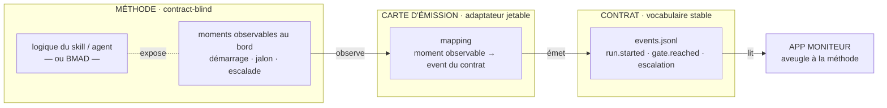

# ADR-032 — L'émission d'événements est un adaptateur séparable (« carte d'émission »)

**Statut :** **PROPOSÉ** — panel adverse manuel + arbitrage PO avant gravure (comme ADR-030/031).
**Date :** 2026-07-16
**Déciders :** elzinko (PO)
**Origine :** `/architecture` demandé par le PO (« sujet important »), **cadré par la cérémonie
`ezk-retro`** (dry-run 2026-07-16 — convergence des lentilles architecte/QA/PM).
**Compose (sans le rouvrir) :** le contrat de supervisabilité gelé (capture 2026-07-13, **D12** :
« le contrat est le vocabulaire *stable* ; l'émission est un adaptateur *jetable* » ; shim
d'émission côté superviseur admis comme pont BMAD). Cet ADR **généralise** D12 en pattern de
premier ordre — il ne l'étend ni ne le modifie.
**Ne révise pas :** ADR-021 (couture fichiers + événements), ADR-028 (lecteur journal).

## Contexte

Question du PO : peut-on **séparer conceptuellement** la description d'un agent/skill (sa
**logique** — ce qu'il fait) de la description des **événements qu'il émet** (quand/quoi
émettre) ? L'enjeu, repéré par le PO : si l'émission est une **couche séparable**, on pourrait
rendre **BMAD conforme au contrat sans le réécrire** — juste en l'**enveloppant** — avant son
retrait E4 (fiche 0039).

## Décision (proposée)

**Oui : l'émission est séparable de la logique.** Le skill/agent (ou BMAD) reste
**contract-blind** — il émet dans **son propre vocabulaire** ou, mieux, **expose des moments
observables au bord** (démarrage, jalon atteint, escalade). Un **adaptateur — la « carte
d'émission »** — traduit *moment observable → événement du contrat* et écrit `events.jsonl`.

> **Figure 1 — L'émission est un adaptateur, pas une propriété du skill.** La **méthode ne
> dépend de rien** ; la **carte d'émission** dépend du **contrat** (stable) et de la **surface
> observable** de la méthode. Remplacer la carte = changer l'émission **sans toucher la
> logique**. **BMAD** se traite comme n'importe quelle méthode : on lui écrit une carte depuis
> ses moments observables — **zéro réécriture**.

**Sens des dépendances (DIP-correct)** : `carte → contrat` et `carte → surface observable` ; la
logique de la méthode ne dépend **ni** du contrat **ni** de la carte.

**Frontière** : deux façons de brancher l'émission —
- **observable au bord → wrapper externe** (le cas BMAD : on lit ses sorties observables) ;
- **état interne → hook déclaratif exposé par le skill** (quand le moment n'est visible que de
  l'intérieur, le skill *expose* un point d'accroche nommé, sans connaître le contrat).

**Corollaires :**
- **BMAD s'enveloppe** (payoff PO) — conforme au contrat sans réécriture ; le **spike
  vectorz 0048** le prouve empiriquement (≥3 events conformes, 0 ligne BMAD modifiée).
- **`ezk-ezk` contract-aware** (subtree 0067) génère la carte comme **artefact séparé**, il
  **n'instrumente pas** le corps du skill.

## Options considérées

### Option A — Émission dans le corps du skill (couplée)
| Dimension | Évaluation |
|---|---|
| Simplicité initiale | Bonne |
| Couplage logique ↔ contrat | **Fort (défaut)** |
| Marche pour BMAD ? | **Non** (exigerait de réécrire BMAD) |

**Rejeté** : couple ce que le contrat veut découpler, et ferme la porte à l'enveloppe BMAD.

### Option B — Adaptateur externe séparé (« carte d'émission »)  ✅ RETENU
| Dimension | Évaluation |
|---|---|
| Découplage | Net (méthode contract-blind) |
| Enveloppe d'une méthode existante (BMAD) | **Oui, sans réécriture** |
| Alignement | D12, hexagonal (ADR-021), émission jetable |

### Option C — Hook déclaratif exposé par le skill (hybride)
Pour les moments **non observables de l'extérieur** : le skill expose un point d'accroche nommé
(toujours sans connaître le contrat). **Retenu comme complément de B**, pas comme alternative.

## Conséquences

- ✅ **Conformité par composition** : nouveaux skills *et* méthodes existantes (BMAD) rendus
  supervisables sans réécrire leur logique.
- ✅ **Émission jetable/remplaçable** : on fait évoluer la carte sans risquer la logique.
- ⚠️ **Risque de dérive** (relevé par la lentille revue) : la carte peut se **désynchroniser**
  de la surface observable, ou un wrapper peut **« mentir »** sur les events → parade : le test
  **« golden events »** (0066/0067) verrouille la trace attendue ; la carte est versionnée avec
  la méthode qu'elle enveloppe.
- 🔁 **À prouver avant de généraliser** : le spike 0048 (BMAD) est le juge de paix.

## Action Items (arbitrages PO / panel)

1. [ ] Valider le pattern (Option B + C en complément) — arbitrage PO après **panel adverse**.
2. [ ] **Spike 0048** — envelopper BMAD (≥3 events, 0 ligne modifiée) : prouve la séparabilité.
3. [ ] **0067** — `ezk-ezk` contract-aware génère la carte séparée (après validation du pattern).
4. [ ] Trancher le **format** de la carte d'émission (`emission-map.<fmt>`) et le schéma du contrat qu'elle valide.
