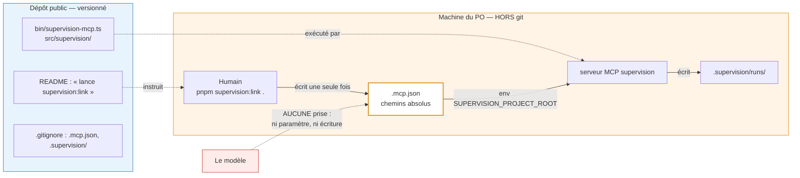
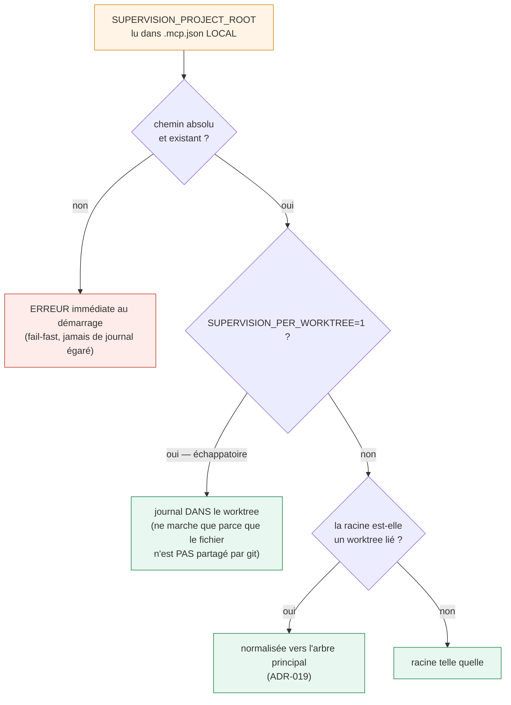

# ADR-034 — `.mcp.json` est un artefact d'installation LOCAL, pas une déclaration versionnée

**Statut :** Proposé (2026-07-26, architecte) — fiche
[0094](../../products/mega-city/features/0094-emetteur-branche-sur-claude-code.md).
**Révise** la proposition de la fiche 0094 (« un `.mcp.json` **commité à la racine du
dépôt** ») sur le seul point du versionnement. **Ne révise pas**
[ADR-019](ADR-019-worktree-location.md) (normalisation worktree), ni
[ADR-032](ADR-032-emission-adaptateur-separable.md) (l'émetteur reste dans la méthode),
ni l'invariant anti-falsification de la fiche 0050.

## Contexte

`pnpm --dir products/mega-city supervision:link .` produit à la racine de `vectorz` un
`.mcp.json` déclarant le serveur `supervision`. Trois faits, tous vérifiés sur pièce,
décident du sort de ce fichier.

**1. L'invariant est non négociable.** `SUPERVISION_PROJECT_ROOT` vient de la
**configuration**, jamais d'un paramètre d'outil : le modèle ne choisit jamais où son
journal s'écrit (fiche 0050 ; chemin vivant : `bin/supervision-mcp.ts` →
`resolveSupervisionRoot`, `project-root.ts:155` — `mcp-server.ts` n'en garde qu'un
ré-export de compatibilité, plus appelé qu'en test). Toute option doit le préserver.

**2. Le fichier généré est machine-spécifique par construction.** Il contient le chemin
nvm de `pnpm` et le `$HOME` du PO. Le dépôt est **public depuis le 2026-07-26**. Le repo
gitignore déjà `cop1.config.yaml` au motif littéral « *Local config (may contain
machine-specific paths/models)* » et `.supervision/` — même famille. Pire que la fuite :
sur tout autre poste, `assertValidExplicitRoot` **fail-fast** sur un chemin qui n'existe
pas (`project-root.ts:60`). Un fichier commité y serait donc *cassé pour tout le monde
sauf une machine*.

**3. La portabilité n'est pas exprimable aujourd'hui.** Vérifié dans la doc Claude Code
(`code.claude.com/docs/en/mcp.md`), pas supposé :
- **cwd du serveur : non garanti.** La doc dit que `CLAUDE_PROJECT_DIR` est fourni au
  serveur « *pour résoudre les chemins projet **sans dépendre du répertoire de
  travail*** ». Elle ne promet nulle part que le cwd est la racine du projet. Des chemins
  **relatifs** dans `args` seraient donc un pari — et c'était le pivot de l'option C.
- **Expansion de variables : oui, mais inopérante ici.** `.mcp.json` supporte `${VAR}` et
  `${VAR:-défaut}`, mais `CLAUDE_PROJECT_DIR` est peuplé dans l'environnement **du serveur
  spawné**, pas dans celui de Claude Code au moment de l'expansion — la doc impose
  d'ailleurs d'écrire un défaut. `${CLAUDE_PROJECT_DIR:-.}` retombe donc sur `.`,
  c'est-à-dire sur le cwd inconnu. La substitution réelle n'existe que pour les configs
  **fournies par un plugin**.
- **`command: "pnpm"` nu : valide** pour Claude Code (résolution par le PATH du shell).
  C'est le seul morceau de l'option C qui tient — et il est déjà obtenu gratuitement : le
  repli `"pnpm"` du script est là pour ça, l'absolu ne sert que Claude Desktop
  (`supervision-link.ts:50-57`, `src/supervision/README.md:47-54`).

**4. Le cas worktree condamne activement le commit.** Un `.mcp.json` versionné est
recopié par git dans **chaque worktree**, avec `SUPERVISION_PROJECT_ROOT` figé sur l'arbre
principal. Or dans `resolveSupervisionRoot`, la racine explicite est prise comme `base`
**avant** l'échappatoire : `SUPERVISION_PER_WORKTREE=1` renverrait alors l'arbre
principal. Le commit **neutraliserait silencieusement une échappatoire documentée**
(ADR-019 décision 6).

## Décision

**`.mcp.json` est gitignoré. `supervision:link` est l'étape d'installation locale, documentée.**
Option **B**. Rien de spécifique à une machine n'entre dans git ; le dépôt ne se déclare
pas lui-même supervisé, un clone lance une commande.

Quatre corollaires :

1. **Aucun changement de code.** Le générateur reste tel quel : chemins absolus, `pnpm`
   absolu avec repli nu, `SUPERVISION_PROJECT_ROOT` explicite. C'est correct *parce que*
   le fichier est local — l'absolu est la forme juste d'un artefact d'installation.
2. **La racine reste explicite**, donc `provenance: 'explicit'`, puis normalisation
   worktree ADR-019 inchangée. On ne dépend jamais du cwd, ni de `CLAUDE_PROJECT_DIR`.
3. **Le worktree redevient sain** : chaque worktree a *son* `.mcp.json` non versionné,
   écrit par un `supervision:link .` joué dedans. Sa racine explicite est le worktree, que
   ADR-019 normalise vers l'arbre principal — même destination qu'aujourd'hui — et
   `SUPERVISION_PER_WORKTREE=1` **refonctionne**, puisque le fichier n'est plus partagé.
4. **L'invariant tient, à l'identique.** La racine est écrite par un script, à partir d'un
   argument CLI humain, au moment de l'installation ; elle est lue par le serveur dans son
   environnement. Le modèle n'a ni paramètre d'outil, ni prise sur le fichier. Le
   versionnement ne joue aucun rôle dans cette garantie — l'invariant porte sur *qui
   écrit*, pas sur *où le fichier est stocké*.

*Ce que montre ce schéma : la frontière entre ce qui entre dans git (bleu — le code et la
consigne, portables) et ce qui reste sur la machine (orange — le fichier de branchement et
le journal, machine-spécifiques). Le trait rouge en pointillé est l'invariant : le modèle
n'a aucune arête vers le fichier qui décide où son journal s'écrit.*

*Ce que montre ce schéma : d'où vient la racine du journal, de bout en bout. Orange = la
seule source (un fichier local, écrit par un humain) ; vert = les destinations possibles ;
rouge = l'échec bruyant. La branche verte de gauche est celle qu'un `.mcp.json` commité
tuerait, puisque git imposerait la même racine à tous les worktrees.*

## Conséquences

**Positives.** Aucune donnée machine dans un dépôt public. Le clone ne peut pas hériter
d'une racine cassée ni, pire, d'une racine *plausible mais fausse* pointant un autre
checkout. L'échappatoire par-worktree redevient effective. Zéro code à écrire : la
décision valide le générateur existant au lieu de le complexifier.

**Négatives, assumées.** Le dépôt ne déclare plus lui-même sa supervision : un clone qui
ouvre Claude Code n'émet rien tant que `supervision:link .` n'a pas été joué. C'est une
étape d'installation de plus, donc un endroit où l'on oublie — le README et le compte
rendu du script sont la seule barrière. Et `.mcp.json` étant ignoré **en entier**, le
dépôt ne pourra pas commiter un *autre* serveur MCP portable sans rouvrir cette décision.

**Porte de sortie, non construite (YAGNI).** Le jour où un serveur MCP portable devra être
versionné : le serveur `supervision` déménage en **scope local** (`claude mcp add --scope
local`, stocké dans `~/.claude.json`, prioritaire sur le scope projet à nom égal — vérifié
dans la doc), et `.mcp.json` redevient commitable pour le reste. C'est l'option D, gratuite
le jour venu, inutile aujourd'hui.

**Question laissée ouverte.** La fiche 0094 demande un `supervision:probe`. Il devra
vérifier le `.mcp.json` **local** de la machine, pas un fichier versionné — la cible du
banc change avec cette décision.

## Alternatives écartées

| # | Option | Pourquoi non |
|---|--------|--------------|
| **A** | Commiter tel quel | Fuite `$HOME`/nvm dans un dépôt public ; fail-fast garanti sur tout autre poste ; et surtout **neutralise `SUPERVISION_PER_WORKTREE`** en imposant la même racine à tous les worktrees. |
| **C** | Rendre le fichier portable et le commiter | Ne tient pas : le cwd du serveur MCP n'est **pas** garanti égal à la racine du projet, donc les chemins relatifs sont un pari ; et `${CLAUDE_PROJECT_DIR}` n'est pas substitué dans un `.mcp.json` de projet (seulement dans les configs de plugin), donc aucune forme absolue portable n'est exprimable. Seul son `command: "pnpm"` nu était valide — déjà couvert par le repli existant. |
| **D** | Deux fichiers, portable commité + surcharge locale | Le mécanisme existe bien (scope local prioritaire), mais il ajoute un second lieu de vérité, invisible dans le repo, pour un POC qui n'a **qu'un** serveur et **aucune** part portable à commiter. Abstraction non justifiée ; retenue comme porte de sortie. |
| — | Faire dériver la racine de `CLAUDE_PROJECT_DIR` par le serveur | Séduisant (la variable est bien peuplée par le harnais, donc infalsifiable par le modèle) et déjà anticipé par la provenance `launcher` de `project-root.ts:26`. Mais c'est **du code**, ça ne résout pas les chemins de `args`, et ça lie la supervision à un harnais précis alors que ADR-032 la veut portable. À rouvrir avec la fiche « portée projet », pas ici. |
