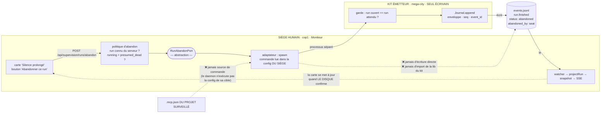
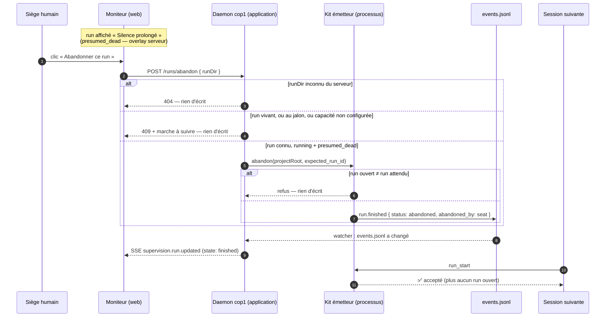

# ADR-035 — Abandon d'un run orphelin par le siège : la commande vient du Moniteur, l'écriture reste au kit émetteur

**Statut :** Proposé (2026-07-31) — cadre la fiche **0168** (bug P0 « run orphelin = verrou sans clé »).
**Amende (de façon bornée) :** [ADR-028](ADR-028-lecteur-journal-mode-moniteur.md):86 — le verrou
« panneau read-only (**aucune route d'écriture ajoutée**) » devient « le Moniteur **n'écrit jamais le
journal** ; il expose **exactement une** route de commande ». Le reste d'ADR-028 est intact.
**Respecte sans les rouvrir :** [ADR-032](ADR-032-emission-adaptateur-separable.md) **E5** (toute
écriture passe par le kit émetteur — enveloppe, `seq`, `event_id` calculés en **un seul endroit**) ;
[ADR-021](ADR-021-megacity-integration-boundary.md) **anti-décision #4** (cop1 n'importe jamais la lib
mega-city au runtime) ; contrat **`cop1/supervisability@0.1`** — l'ajout est **additif** (champ de
payload optionnel), donc **pas de nouvelle URI de contrat**.

## Contexte

Le kit émetteur n'autorise qu'un run ouvert par projet : `products/mega-city/src/supervision/runtime.ts`:172-176
refuse `run_start` tant que `findOpenRun` trouve un journal sans `run.finished`. L'invariant est sain,
mais **rien ne clôt un run quand la session qui l'a ouvert meurt** : le projet devient définitivement
muet. Le seul recours observé le 2026-07-30 a été d'écrire à la main dans le journal d'un tiers.

Trois faits du code cadrent la décision.

1. **Le Moniteur sait déjà qui est en panne, et il est le seul à le savoir.** `SupervisionService`
   arme le timer `presumed_dead` (`SupervisionService.ts`:105-138) — overlay **serveur**, absent du
   read-model de contrat. Le kit émetteur, lui, n'a **aucune horloge de silence** : il ne peut pas
   distinguer un run mort d'un run lent. Le contexte de décision est donc côté siège.
2. **Personne ne peut « demander à l'émetteur » de clôturer : l'émetteur est mort.** C'est la prémisse
   du bug. Quel que soit le chemin retenu, le processus qui écrira la ligne n'est **pas** celui qui a
   ouvert le run. La règle gelée « `events.jsonl` écrit par la MÉTHODE, jamais par le superviseur »
   (capture 2026-07-13 §7, citée ADR-032:28-29) rencontre ici son unique cas limite — et la fiche l'a
   déjà tranché en demandant `abandoned_by: "seat" | "method"`.
3. **cop1 ne dépend pas de mega-city, et ne doit pas commencer.** Le précédent existant est une
   **copie légère de lecteur** (`features/supervision/infrastructure/registry.ts`:4-6, « pour éviter
   une dépendance circulaire »). Copier un **écrivain** serait tout autre chose : ça dupliquerait
   l'enveloppe et le compteur `seq` (E5).

## Décision

### D1 — L'abandon siège est le seul événement du contrat **écrit pour le compte du siège** ; `abandoned_by` en est la marque de provenance

`run.finished` gagne un champ de payload **optionnel** `abandoned_by: 'seat' | 'method'`, écrit
**uniquement quand `status === 'abandoned'`**. Défaut de l'outil MCP `run_finished` : `'method'`
(la méthode abandonne son propre run) ; le chemin siège écrit `'seat'`.

Ce n'est pas un ornement d'affichage : c'est ce qui **rend l'exception auditable**. Sans lui, un
lecteur ne peut plus distinguer « la méthode a renoncé » de « le siège a déverrouillé un orphelin » —
et le corpus traite déjà la provenance comme un citoyen de première classe (`tokens.provenance`,
`gate.resumeOrigin`, `_method_mismatch`, badge `emissionClass: 'B'`). Ajout **additif** au contrat
gelé ⇒ l'URI reste `cop1/supervisability@0.1`.

### D2 — Le Moniteur **commande**, le kit **écrit**. Un port, un adaptateur qui `spawn`

cop1 n'écrit **aucune** ligne dans `events.jsonl`, ni directement ni via une copie du `Journal`.

- **Domaine** (`features/supervision/domain/ports/RunAbandonPort.ts`) : `abandon({ projectRoot,
  runId }): Promise<AbandonOutcome>` — une abstraction, zéro connaissance de mega-city, de `spawn`,
  de chemins.
- **Application** : un cas d'usage `AbandonRunUseCase` (ou une méthode de `SupervisionService`) qui
  porte **la politique** (D4) et rien d'autre. Il ne touche pas le disque.
- **Infrastructure** (`EmitterCliAbandonAdapter`) : `spawn` de la commande d'abandon du kit. Seul
  endroit qui sait qu'un processus existe.

Le sens des dépendances est celui de la clean architecture (application → port ← adaptateur), et
l'invariant E5 tient : l'enveloppe, `seq`, `event_id` et le confinement restent calculés **une seule
fois**, dans `products/mega-city/src/supervision/journal.ts`.

### D3 — La commande est résolue depuis la config **de cop1**, jamais depuis le `.mcp.json` du projet surveillé

Bloc `supervision` (Zod `ConfigSchema` + miroir `Cop1Config`) : `abandon_command: string[]`, **défaut
`[]`** ⇒ capacité **dormante**, exactement le patron `watch_roots: []` d'ADR-028. Bouton absent (ou
désactivé avec la raison) quand elle n'est pas configurée. Le dépôt vectorz la câble vers le kit
mega-city dans **sa** config : cop1 livré ne sait toujours rien de mega-city, et la couture reste
« un fichier de config » (ADR-021:43-44).

**Frontière de confiance, explicite.** La tentation était de lire la commande dans le `.mcp.json` du
projet surveillé — c'est-à-dire dans un fichier appartenant à la cible d'observation. Un clic
exécuterait alors une commande **déclarée par le projet observé** : le daemon passerait d'observateur
passif à exécutant de config étrangère (le danger que `bin/supervision-probe.ts`:20-35 documente déjà
comme « frontière de confiance »). La commande vient donc de la config **du siège**, qui est de
confiance par construction.

### D4 — La politique vit dans l'application, et la clé du run reste **serveur**

L'abandon est refusé sauf si, **au moment du POST** :

1. le `runDir` reçu est **une clé de la map de snapshots** du `SupervisionService` (le client ne peut
   donc nommer qu'un run que le serveur a lui-même découvert sous un watch-root configuré — aucun
   chemin client n'est jamais résolu, la traversée de chemin est impossible par construction, dans le
   même esprit que le confinement `realpath` du watcher) ⇒ sinon **404** ;
2. le snapshot est `state === 'running'` **et** `liveness === 'presumed_dead'` ⇒ sinon **409** (on
   n'abandonne pas un run vivant, ni un run au jalon dont le silence est *voulu*, D8/ADR-028) ;
3. `abandon_command` est configurée ⇒ sinon **409** avec la marche à suivre.

Route : `POST /api/supervision/runs/abandon`, corps `{ runDir }`. `HttpServer` reste sans dépendance
concrète à la feature (patron `setSupervisionProvider` déjà en place, `HttpServer.ts`:103-105).

### D5 — Abandon **ciblé**, garde `expected_run_id` côté kit

Le kit expose une opération d'abandon qui reçoit le `run_id` **attendu** et **refuse d'écrire** si le
run ouvert n'est pas celui-là. Sans cette garde, un clic sur une carte périmée (le front est passif,
son snapshot peut avoir quelques secondes) clôturerait un run **neuf et légitime** ouvert entre-temps
— exactement le mal qu'on répare. C'est un contrôle de concurrence optimiste, à un champ.

### D6 — Le chemin de lecture n'est pas court-circuité : le disque referme la boucle

Le POST ne met **pas** à jour le snapshot en optimiste. Le kit écrit → `JournalWatcherAdapter` voit
`events.jsonl` bouger → `SupervisionService.absorb` re-projette → `supervision.run.updated` → SSE →
la carte passe en `finished`. La carte ne se met à jour que quand **le disque** confirme : la source
unique de vérité d'ADR-028 §1 reste intacte, et l'UI ne peut pas mentir sur ce qui est écrit.

### D7 — Erreur `run_start` actionnable, et **aucun** auto-abandon

`runStart` refuse déjà en connaissant tout : `findOpenRun` a lu les événements. Un helper **pur**
`describeOpenRun(events)` en dérive le texte — méthode bloquante (`name@version` depuis
`run.started`), âge du run, date et âge du dernier événement, nombre d'événements, puis la sortie
(« abandonne-le au Moniteur, ou `run_finished {status:"abandoned"}` si c'est un orphelin de ta propre
session »). Journal semi-hostile ⇒ **jamais de throw** : un `ts` illisible dégrade en « date
inconnue », il ne transforme pas un refus en crash. SRP : `findOpenRun` trouve, `describeOpenRun`
formule — le message devient testable au texte (AC4).

**Aucun TTL, nulle part** (AC5) : `presumed_dead` reste la **précondition** de l'acte humain, jamais
son déclencheur. Un auto-abandon effacerait le signal que le Moniteur vient d'apprendre à montrer.

> **Figure 1 — Deux chemins qui ne se croisent qu'au disque : le siège *commande* (flèches pleines),
> le kit *écrit*, et le read-model existant *referme la boucle* (flèche pointillée de retour). Les
> trois flèches barrées sont les couplages refusés : écriture directe par cop1, import de la lib du
> kit, et commande empruntée à la config du projet observé.**

> **Figure 2 — Le chemin nominal et ses quatre refus : trois gardes côté siège (run inconnu, run non
> présumé mort, capacité non configurée) et une garde côté kit (le run ouvert n'est plus celui qu'on
> croyait). Dans tous les cas de refus, *aucune ligne n'est écrite* — et c'est le retour par le
> disque, pas la réponse HTTP, qui met la carte à jour.**

## Options considérées

| # | Option | Verdict |
|---|---|---|
| 1 | **cop1 écrit la ligne lui-même** (copie légère du writer, comme `registry.ts` l'a fait pour un *lecteur*) | ❌ duplique l'enveloppe et le compteur `seq` — deux écrivains pour un invariant qu'ADR-032 **E5** garde en un seul endroit. Le précédent `registry.ts` est un lecteur **pur** ; il ne s'étend pas à un écrivain. |
| 2 | **cop1 importe `Journal` de mega-city** | ❌ ADR-021 anti-décision #4 : cop1 ne dépend jamais de mega-city pour tourner. |
| 3 | **cop1 devient client MCP du serveur déclaré dans le `.mcp.json` du projet surveillé** | 🔁 le plus *pur* (c'est l'émetteur du projet, à sa version, qui écrit) mais : nouvelle dépendance runtime `@modelcontextprotocol/sdk` (absente de cop1), handshake MCP par clic, et surtout un clic **exécuterait une commande déclarée par la cible d'observation** (D3). **Reporté** — voie de sortie si un jour un vrai canal de commande siège→émetteur existe. |
| 4 | **Marqueur hors journal** (`abandoned.json` lu par `findOpenRun`) | ❌ deux sources de vérité : le journal ne raconte plus l'histoire, `journal-validator` et `supervision:analyze` restent aveugles à l'abandon. |
| 5 | **Auto-abandon par TTL** | ❌ résout le verrou en détruisant l'information : le run silencieux disparaîtrait de « en cours » alors que c'est précisément ce qu'on veut voir (fiche 0168, AC5). |
| 6 | **Bouton « copier la commande »** (le Moniteur affiche, l'humain colle dans une session) | ❌ déplace le problème dans une session — or le mode de panne **est** la mort de la session. Ne satisfait pas AC1 (« sans toucher au disque à la main »). |
| 7 | **Politique côté front** (le web décide si le bouton agit) | ❌ le front est passif par ADR-028 §1 ; une garde côté client n'est pas une garde. |

## Conséquences

- ✅ **Le verrou a une clé, et elle est humaine** : un orphelin ne rend plus un projet muet
  définitivement, sans qu'aucune heuristique n'efface le signal de silence.
- ✅ **Un seul écrivain du journal** : les garanties déjà codées (enveloppe, `seq`, `event_id`,
  confinement) restent en un point unique ; cop1 ne peut structurellement pas les contourner.
- ✅ **Capacité dormante par défaut** : `abandon_command: []` ⇒ zéro `spawn` surprise, et cop1 livré
  ignore toujours mega-city (ADR-021 tenu).
- ✅ **Traçabilité de l'exception** : `abandoned_by` permet au Moniteur et à `supervision:analyze` de
  raconter deux histoires distinctes (siège qui déverrouille vs méthode qui renonce).
- ⚠️ **ADR-028 est amendé** : le panneau garde **une** route de commande. Le verrou reste vrai dans
  sa formulation utile — *cop1 n'écrit jamais le journal* — et doit être relu ainsi.
- ⚠️ **Nouvelle surface d'exécution** : le daemon `spawn` un processus sur action humaine. Bornée par
  D3 (commande de la config du siège) et D4 (run connu du serveur uniquement).
- ⚠️ **Latence assumée** : entre le clic et la mise à jour de la carte il y a un `spawn`, une écriture,
  un `fs.watch` debouncé (80 ms) — l'UI doit montrer un état « abandon demandé », sans mentir sur
  l'écriture (D6).
- 🔁 **Différés (YAGNI)** : canal de commande siège→émetteur générique (option 3) ; abandon en masse ;
  toute forme de TTL ; changement de la règle d'absorption `ezk-sprint` (hors scope 0168).

## Fichiers à créer / modifier (guide TDD, non normatif sur le détail)

**mega-city (kit émetteur — l'écrivain)**
- `src/supervision/runtime.ts` — `RunFinishedArgs` + `abandoned_by?: 'seat' | 'method'` (payload
  seulement si `status === 'abandoned'`) ; abandon ciblé avec garde `expected_run_id` (D5) ;
  message de refus `run_start` via un `describeOpenRun` pur (D7).
- `bin/supervision-abandon.ts` — entrée CLI de l'abandon (famille `supervision-*` existante :
  `link`, `doctor`, `probe`, `analyze`) + script `supervision:abandon` dans `package.json`.
- `src/supervision/mcp-server.ts` — `run_finished` accepte `abandoned_by`, défaut `'method'`.

**cop1 (le commandeur)**
- `packages/app/src/features/supervision/domain/ports/RunAbandonPort.ts` — le port (D2).
- `packages/app/src/features/supervision/application/` — cas d'usage + politique (D4) ; **aucune**
  mutation optimiste du snapshot (D6).
- `packages/app/src/features/supervision/infrastructure/EmitterCliAbandonAdapter.ts` — `spawn`,
  runner injectable (les tests unitaires ne lancent jamais de vrai processus, cf.
  `GitCommitAnchor`/`CommandVerificationGate`).
- `packages/app/src/features/config/domain/ConfigSchema.ts` + `packages/shared-kernel/.../Cop1Config.ts`
  — `supervision.abandon_command: string[]` défaut `[]`.
- `packages/app/src/features/daemon/infrastructure/HttpServer.ts` — `POST /api/supervision/runs/abandon`.
- `packages/app/src/features/daemon/application/DaemonService.ts` — câblage de l'adaptateur **si**
  configuré.
- `packages/web/src/SupervisionView.tsx` — bouton sur la carte `presumed_dead` uniquement, état
  « abandon demandé », affichage de `abandoned_by` quand présent.
- `packages/journal-validator/src/projectRun.ts` — *optionnel* : remonter `finishStatus` /
  `abandonedBy` dans le read-model. **Ne pas toucher** au mapping d'état de `reduceState` (les 16
  fixtures restent vertes ; `abandoned` n'est pas un nouvel état, c'est un `status` de payload).
