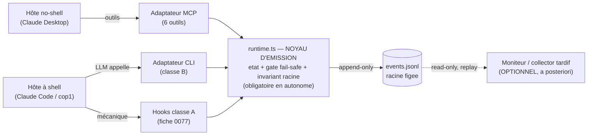

# ADR-036 — Le transport est séparable du noyau d'émission (supervisabilité)

- **Statut** : Accepté (2026-08-10)
- **Compose** (sans les rouvrir) : [ADR-032](ADR-032-emission-adaptateur-separable.md) (émission = adaptateur/vocabulaire), [ADR-034](ADR-034-mcp-json-artefact-local.md) (racine = config), [ADR-028](ADR-028-lecteur-journal-mode-moniteur.md) (lecteur read-only)
- **Fiches** : 0050 (kit émetteur), 0077 (hooks classe A), 0029 (contrat v0.2)

## Contexte

Le noyau d'émission — `products/mega-city/src/supervision/runtime.ts` (machine à états + invariant + `append`) et sa lib `journal.ts` — est **déjà pur** : aucun import MCP, seulement `node:*`. Le serveur MCP (`mcp-server.ts`) n'en est qu'une **traduction mince** en 6 outils. Le Moniteur lit le fichier séparément (ADR-028). La séparation *émission ↔ transport ↔ ingestion* est donc **déjà vraie dans le code** — mais nulle part écrite comme décision, et un garde-fou (`vz-product-builder` Override 3) la contredit en exigeant les 6 outils **MCP** plutôt qu'« une trace ».

Différence porteuse avec l'observabilité classique (OTel-GenAI, LangSmith) : le contrat a une **moitié fail-safe** — le **gate ARRÊTE le process**. « Écrire une ligne JSONL n'arrête rien » : l'analogie « collector optionnel » vaut pour le **Moniteur**, pas pour le **gate**.

## Décision

1. **Noyau d'émission = `runtime.ts`** (état + gate fail-safe + invariant de racine). **Obligatoire** en mode autonome — c'est la seule preuve de redevabilité.
2. **Transports = adaptateurs interchangeables** au-dessus du noyau : `mcp-server` (hôtes no-shell), un **CLI** wrappant `runtime` (hôtes à shell, classe B), les **hooks classe A** (fiche 0077). Le MCP n'est **qu'un** transport.
3. **Garde-fou lié à la CAPACITÉ D'ÉMETTRE, pas à la présence du MCP.** Un mode autonome refuse de démarrer si **aucun** transport ne peut écrire le journal. Sur Desktop (no-shell), seul MCP écrit → l'exiger y reste correct ; sur hôte à shell, un CLI/hook opérant satisfait la redevabilité (exiger le MCP y serait un faux négatif).
4. **Invariant anti-falsification préservé** (ADR-034) : la racine vient de la **config** (`SUPERVISION_PROJECT_ROOT`), jamais d'un paramètre. **Tout** transport la résout ainsi et n'expose ni `--root` ni « rattacher à un run existant ». Pas de porte au replay/forge ; le Moniteur reste read-only (ADR-028).
5. **Ingestion a posteriori : le fichier suffit.** `.supervision/runs/<id>/events.jsonl` (append-only, racine figée, enveloppe typée) est le substrat durable et rejouable. **La norme, c'est le format** (`cop1/supervisability@0.1`) — pas un nouveau protocole d'ingestion.
6. **Famille « supervisabilité » ≠ « observabilité ».** Télémétrie passive d'appels modèle (OTel-GenAI/LangSmith) vs supervisabilité **active** d'un run de méthode (gate fail-safe, quiescence, escalade). Le **gate** est le différenciateur. Id canonique conservé (`cop1/supervisability@0.1`) ; nom public candidat « Supervisability Journal » / « Gate Journal » (branding = arbitrage PO).

## Alternatives écartées

- **Statu quo** (MCP = seul pont, vz-pb exige les 6 outils) : correct sur Desktop, mais fausse la redevabilité sur hôte à shell et confond « transport présent » avec « trace existante ».
- **Thèse OTel pure** (monitoring 100 % optionnel, vz-pb ne refuse jamais) : gomme la moitié fail-safe — en autonome, l'émission n'est pas un agrément, c'est la preuve de redevabilité.
- **CLI absorbé dans la fiche 0077** : mélange deux classes de conformité (déterministe A vs impératif B) sous une fiche ; les garder frères distincts sur une couture commune.

## Conséquences

- Le noyau `runtime` devient explicitement « seul émetteur ; les transports sont des adaptateurs ». Nouvelle contrainte de revue sur tout futur transport : **racine par config uniquement, zéro paramètre d'attache**.
- Le garde-fou `vz-product-builder` passe d'une sonde « MCP présent ? » à « un transport peut-il écrire ? » (SKILL.md mis à jour avec cet ADR).
- Moniteur et ingestion tardive n'exigent rien de neuf.

## Schéma — la couture émission / transport / ingestion

*Le noyau (`runtime.ts`) est obligatoire et porte l'invariant anti-falsification. Les transports (MCP/CLI/hooks) sont interchangeables selon l'hôte — le MCP n'est que l'un d'eux. Le côté lecture (pointillé) est le seul endroit où « collector optionnel » s'applique.*
