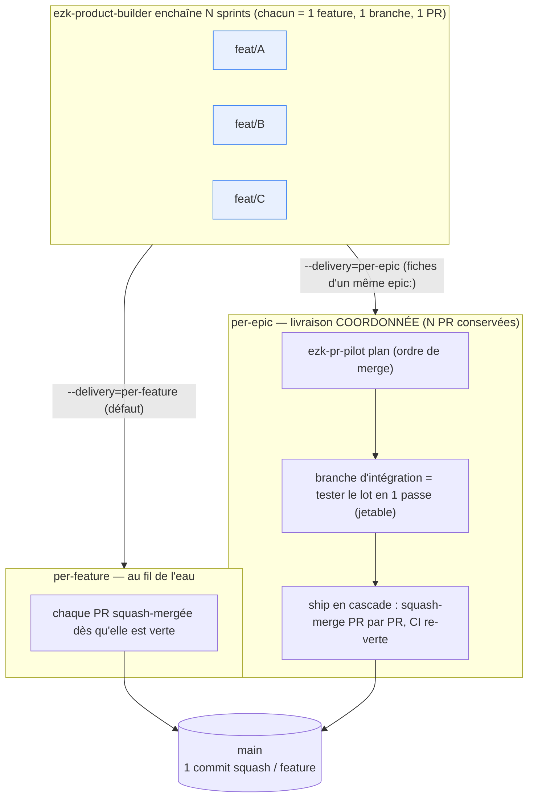

# ADR-037 — Livraison d'un lot : l'orchestrateur décide, le train de merge exécute (pas de merge agrégé)

- **Statut** : Accepté (2026-08-13) — *version réduite, post-panel adverse*
- **Compose** (sans les rouvrir) : [ADR-018](ADR-018-worktree-isolation.md) (une branche par feature), [ADR-017](ADR-017-budget-killswitch.md) (épic = champ front-matter), invariant `ezk-sprint` « 1 feature = 1 branche = 1 PR = 1 squash-merge » ([SKILL.md:32](../../products/mega-city/skills/ezk-sprint/SKILL.md))
- **Fiches** : [0065](../../features/done/0065-sprint-composition-lot-coherent.md) (sprint composition / mode `--delivery`)
- **Déciders** : PO (Thomas) ; **panel adverse passé le 2026-08-13** ([capture](../captures/2026-08-13-panel-adverse-adr-037.md))

> **Révision 2026-08-13 (panel adverse).** La 1ʳᵉ version proposait un **mode agrégé** (N features
> dans **1 PR**, merge en **`rebase-merge`**). Le panel l'a **écarté** (verdict archi NO-GO, faisabilité
> et valeur GO-avec-réserves convergents) : exécutant orphelin, prémisse « frictions par-merge » fausse
> aux ⅔, réutilisation `ezk-pr-pilot` nominale, orthogonalité des axes surclamée. La décision est
> **réduite** à ce que les 3 lentilles valident : *l'orchestrateur **décide** la stratégie de livraison,
> `ezk-pr-pilot` **exécute** le train de merge, une seule politique (**squash**), N PR conservées.* Le
> mode agrégé est consigné en [Alternatives écartées](#alternatives-écartées).

## Contexte

`ezk-product-builder` enchaîne N sprints → **N PR indépendantes**, chacune squash-mergée seule ([ezk-sprint/SKILL.md:32](../../products/mega-city/skills/ezk-sprint/SKILL.md)). Quand la boucle tourne beaucoup, gérer/tester/merger ces PR devient pénible. Trois douleurs distinctes s'y cachent, et **deux sont déjà outillées** par [`ezk-pr-pilot`](../../products/mega-city/skills/ezk-pr-pilot/SKILL.md) : *tester en une passe* (branche d'intégration = `git merge` de N branches, [SKILL.md:167](../../products/mega-city/skills/ezk-pr-pilot/SKILL.md)) et *merger dans le bon ordre* (`plan` + `ship` en cascade, CI re-verte entre deux PR partageant des fichiers, [SKILL.md:151](../../products/mega-city/skills/ezk-pr-pilot/SKILL.md)).

**La 3ᵉ douleur — le *nombre* de merges — est plus mince qu'elle n'y paraît** (établi au panel). Les frictions historiquement invoquées ne sont pas toutes fonction de l'acte de merge : les **collisions d'ids horodatés** sont réglées à la racine (fiche 0180, id minté inline à l'`add`, mergé) ; les **~45 liens cassés/ship** dépendent du **contenu** des fiches, pas du merge (mitigés par `check-links.sh`, câblage en gate = fiche 0101, en cours). **Seule** « `main` décale → rebaser les suivantes » est réellement proportionnelle au nombre de merges — et c'est exactement ce que le **train de merge** d'`ezk-pr-pilot` automatise déjà. Donc : réduire le nombre de merges a une valeur **résiduelle** (moins de rebases de `main`), pas la valeur large d'abord supposée.

Reste un manque réel : rien ne **coordonne** la livraison d'un **lot cohérent** de fiches (ex. les enfants d'un même `epic:`) — le tirage est unitaire (`next --ready-only`, ADR-0016), donc chaque feature part et merge isolément, même quand elle appartient à un ensemble qu'on voudrait tester et livrer **ensemble**.

## Décision

1. **Séparer la *décision de livraison* de la *mécanique*.** L'orchestrateur **décide** la stratégie ; il **n'exécute aucun merge lui-même** (frontière ADR-0001 : `ezk-product-builder` ne touche pas au git — [SKILL.md:71](../../products/mega-city/skills/ezk-product-builder/SKILL.md)). La mécanique reste dans les skills déterministes existants.
2. **Défaut `per-feature` = statu quo strict.** `ezk-sprint` ouvre sa PR et la **squash-merge** comme aujourd'hui ; son invariant « 1 feature = 1 branche = 1 PR = 1 squash-merge » est **réellement intact** (pas vidé).
3. **Nouveau levier `--delivery=per-feature|per-epic`** sur `ezk-product-builder`. `per-epic` = traiter les fiches d'un même `epic:` comme un **lot coordonné** — mais **N PR conservées** (revue, CI et revert **atomiques** par feature préservés). Le flag **décide** la coordination, il ne fusionne rien.
4. **Le regroupement = durcir le train de merge d'`ezk-pr-pilot`** (composition réelle, pas réécriture) : `plan` (ordre de merge) → **branche d'intégration** pour *tester le lot en une passe* (l'usage pour lequel elle existe : jetable, conditionnée `merge-tree` propre) → `ship` en **cascade** (squash-merge PR par PR, CI re-verte). `per-epic` déclenche cette coordination au lieu de merger au fil de l'eau.
5. **Abandon du merge agrégé.** Pas de `rebase-merge`, pas de PR unique, pas de branche-d'intégration-comme-artefact-de-livraison → **une seule politique de merge** (squash), **aucun exécutant orphelin**, **aucune régression** de la qualité de revue.
6. **La séparation des axes est *décisionnelle*, pas une orthogonalité pure.** Au niveau revue, le relecteur voit **la PR** — donc fusionner des PR *changerait* le grain de revue (c'est pourquoi on ne fusionne pas). Ce que l'orchestrateur sépare, c'est **quand** livrer un lot (au fil de l'eau vs coordonné : test groupé + merge en cascade), la PR restant l'unité de revue/merge.

## Alternatives écartées

- **Mode agrégé (N features → 1 PR, `rebase-merge`)** — **écarté par le panel adverse du 2026-08-13** ([capture](../captures/2026-08-13-panel-adverse-adr-037.md)) :
  - 🔴 **Exécutant orphelin** : aucun skill ne peut héberger l'assemblage linéaire + `rebase-merge` sans violer sa frontière (`ezk-product-builder` ne touche pas au git ; `ezk-sprint` ne merge plus ; le `ship` d'`ezk-pr-pilot` est **squash-only**). La mécanique n'a **aucun siège** — le « on ne réimplémente rien » est contredit (assembleur net-neuf).
  - **Prémisse fausse aux ⅔** : collisions d'ids (réglées, 0180) et liens cassés = fonction du **contenu**, pas du merge — agréger les **concentre**, ne les supprime pas.
  - **Réutilisation `ezk-pr-pilot` nominale** : sa branche d'intégration est un merge **jetable pour tester**, pas un historique linéaire de livraison.
  - **Orthogonalité surclamée** : Codex/`code-review` relit le **diff agrégé** → régression de revue (tout-ou-rien, gros diff), à rebours de l'objectif de [0065](../../features/done/0065-sprint-composition-lot-coherent.md).
- **Statu quo strict (pas de flag)** : ne coordonne pas la livraison d'un lot cohérent — le manque réel identifié.
- **Stacked PRs** : outillage `gh` mauvais + ne supprime pas les frictions par-merge (chaque PR de la pile merge séparément).

## Conséquences

- `ezk-product-builder` gagne `--delivery=per-feature|per-epic` — un levier **décisionnel** branché au checkpoint inter-sprint ([SKILL.md:72](../../products/mega-city/skills/ezk-product-builder/SKILL.md)) ; il n'exécute aucun git.
- `ezk-pr-pilot` : le train de merge (`plan` → test groupé → `ship` cascade) devient le **chemin de première classe** déclenché par `per-epic`. **Durcissement**, pas réécriture ; **une seule politique de merge** (squash) — invariant `ezk-sprint` intact, `check-pr-body.sh` inchangé.
- **Ce qui devient plus facile** : un lot cohérent se **teste** et se **livre** ensemble (test groupé + merge cascade ordonné), sans PR obèse ni tout-ou-rien.
- **Prérequis avant d'investir** : *re-chiffrer* la friction par-merge résiduelle post-0180 (combien de rebases de `main` en cascade réellement observés ?) — si négligeable, `per-epic` se réduit au **test groupé** + `ship` ordonné, sans autre justification.
- **Arbitrage de grooming (0065)** : le déclencheur `epic:` auto + opt-in et le nom `--delivery` restent ; « batched / plafond / rebase-merge » **tombent** (plus de PR agrégée à borner).

## Schéma — deux stratégies de livraison, une seule politique de merge

*Dans les DEUX modes : N PR (revue + revert atomiques), **squash-merge**, invariant `ezk-sprint` intact. Le flag `--delivery` ne fait que **décider** — livrer un lot cohérent au fil de l'eau ou de façon coordonnée (test groupé + merge en cascade) — il n'exécute aucun merge. Le mode agrégé (1 PR / `rebase-merge`) est écarté (cf. Alternatives).*
