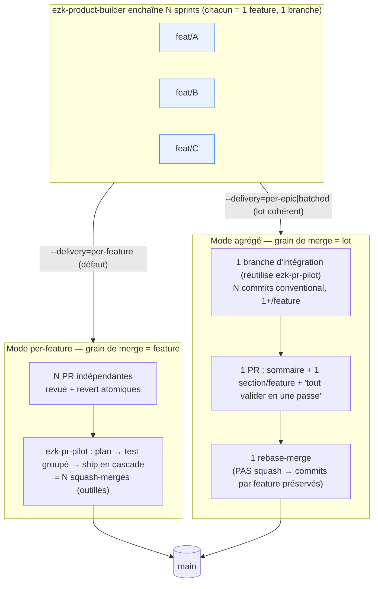

# ADR-037 — Le grain de merge est séparable du grain de revue (livraison d'un lot de sprints)

- **Statut** : Proposé (2026-08-13)
- **Compose** (sans les rouvrir) : [ADR-018](ADR-018-worktree-isolation.md) (une branche par feature), [ADR-017](ADR-017-budget-killswitch.md) (épic = champ front-matter), invariant `ezk-sprint` « 1 feature = 1 branche = 1 PR = 1 squash-merge » ([SKILL.md:32](../../products/mega-city/skills/ezk-sprint/SKILL.md))
- **Fiches** : voir la fiche d'implémentation liée (livraison per-feature/per-epic/batched)
- **Déciders** : PO (Thomas) ; panel adverse avant passage Proposé→Accepté

## Contexte

`ezk-product-builder` enchaîne N sprints → **N PR indépendantes**, chacune squash-mergée seule ([ezk-sprint/SKILL.md:32](../../products/mega-city/skills/ezk-sprint/SKILL.md), [:104](../../products/mega-city/skills/ezk-sprint/SKILL.md)). Quand la boucle tourne beaucoup, le coût n'est pas « N PR existent » mais **N merges successifs** — et dans *ce* repo chaque merge tire des frictions documentées (collisions d'ids horodatés, ~45 liens markdown cassés par ship, `main` qui décale et force à rebaser les suivantes).

Trois douleurs distinctes se cachent derrière « c'est dur à gérer/tester/merger », et deux sont **déjà outillées** par [`ezk-pr-pilot`](../../products/mega-city/skills/ezk-pr-pilot/SKILL.md) : *tester en une passe* (branche d'intégration = `git merge` de N branches, [SKILL.md:167](../../products/mega-city/skills/ezk-pr-pilot/SKILL.md)) et *merger dans le bon ordre* (`plan` + `ship` en cascade, CI re-verte entre deux PR qui partagent des fichiers, [SKILL.md:151](../../products/mega-city/skills/ezk-pr-pilot/SKILL.md)). Ce qu'aucun outil ne fait : réduire le **nombre** de merges — `ship` fait toujours N squash-merges.

Le point aveugle de conception : l'invariant fond **le grain de revue** (combien d'unités Codex/humain relisent séparément) **et le grain de merge** (combien de fois on touche `main`) dans un seul « 1 PR = 1 feature ». Ce sont deux axes orthogonaux.

## Décision

1. **Séparer les deux axes.** Le grain de revue reste la feature (unité atomique relue). Le grain de merge devient un **levier de livraison** décidé plus haut, au niveau de l'orchestrateur.
2. **Défaut inchangé, invariant `ezk-sprint` intact.** `ezk-sprint` continue de produire *la matière* — une branche `feat/<id>-<slug>`, ses commits, son bloc de corps de PR, son plan de test — **par feature**. Son invariant (jamais deux features dans *sa* PR) n'est pas touché : en mode agrégé, il **n'ouvre/merge simplement pas** la PR et laisse l'orchestrateur assembler.
3. **Nouveau levier sur `ezk-product-builder`** (l'orchestrateur qui décide la séquence, pas `ezk-sprint`) : `--delivery=per-feature|per-epic|batched` *(noms à acter — arbitrage PO)*. `per-feature` = statu quo. `per-epic`/`batched` = **une seule PR agrégée** pour un lot cohérent.
4. **Le mode agrégé impose `rebase-merge`, pas `squash`.** « Plusieurs commits organisés par feature » est incompatible avec le squash (qui écraserait les N features en un commit fourre-tout sur `main` et détruirait la traçabilité recherchée). Déviation **bornée et explicite** de l'invariant [ezk-sprint:32](../../products/mega-city/skills/ezk-sprint/SKILL.md), **uniquement dans ce mode** : un commit conventional propre par feature est préservé sur `main`.
5. **`ezk-pr-pilot` reste l'épine dorsale** du test groupé et du train de merge — **on ne le réimplémente pas**. Le mode agrégé **réutilise** sa branche d'intégration comme base de la PR unique ; le mode `per-feature` continue de s'appuyer sur `plan`/`ship`.
6. **Corps de PR agrégé = composition, pas concaténation brute.** En tête un **sommaire** (table `feature | fiche | statut gate`, sections ancrables) ; puis **une section par feature** réutilisant le bloc thin actuel (`## Summary` / `## Lien fiche` / `## Comment tester`) ; en fin une section **`## Tout valider en une passe`** (la gate agrégée). Les procédures de test *par feature* sont **conservées** — la procédure agrégée s'ajoute, elle ne les remplace pas.
7. **Déclencheur du regroupement = la cohésion du lot.** Un lot ne bascule en agrégé que s'il est cohérent — piste par défaut : les fiches partageant un même `epic:` ([ADR-017](ADR-017-budget-killswitch.md)). Pour des features indépendantes piochées au fil de l'eau, `per-feature` + train de merge restent la règle (le « tout-ou-rien » d'une PR agrégée y serait un piège, pas une sémantique voulue).

## Alternatives écartées

- **Statu quo (N squash-merges)** : correct, mais ne réduit pas le coût des merges successifs — la douleur centrale.
- **1-PR pour *tout* lot (proposition brute)** : perd le merge sélectif (merger 3/5, rejeter 2) et dévie du squash même quand c'est inutile (features indépendantes). Le regroupement doit être conditionné à la cohésion, pas systématique.
- **Stacked PRs** (pile de PR basées l'une sur l'autre) : préserverait revue atomique + merge groupé, mais l'outillage `gh` est mauvais pour les stacks et elles **ne suppriment pas** les frictions par-merge du repo (chaque PR de la pile merge séparément). Mauvais rapport bénéfice/complexité ici.
- **Durcir `ezk-pr-pilot` seul, sans mode agrégé** : résout *gérer* + *tester*, mais laisse *merger* à N touches sur `main`. Écarté comme solution *unique* ; retenu comme **socle** du mode `per-feature` (point 5).

## Conséquences

- `ezk-product-builder` gagne le flag `--delivery` et une **logique d'assemblage** branchée sur le checkpoint inter-sprint ([SKILL.md:72](../../products/mega-city/skills/ezk-product-builder/SKILL.md)) — le point de couture naturel entre deux sprints.
- **Politique de merge conditionnelle** : `squash` par défaut, `rebase-merge` en mode agrégé. Nouvelle contrainte de revue : vérifier que chaque commit d'un lot agrégé est un conventional-commit autonome.
- Le garde-fou [`check-pr-body.sh`](../../products/mega-city/skills/ezk-pr-pilot/scripts/check-pr-body.sh) (qui `grep -qF` un seul `## Summary` / `## Lien fiche` / `## Comment tester`) doit **tolérer la répétition** de ces titres sous des sections par feature.
- Ce qui devient plus **facile** : un lot cohérent se teste et se merge en **une passe** (les frictions repo tirent 1×), et la gate agrégée révèle les **interactions entre features** que N PR isolées ne voient jamais. Ce qui devient plus **dur** : la revue d'un gros diff, et le « tout-ou-rien » au merge d'un lot agrégé (assumé, car réservé aux lots cohérents).
- **Arbitrages PO restants** : (a) noms définitifs du flag et de ses valeurs ; (b) déclencheur exact du regroupement (`epic:` automatique vs opt-in explicite vs seuil de N) ; (c) faut-il un plafond de features par PR agrégée. → à trancher au grooming de la fiche, puis **panel adverse** avant Proposé→Accepté.

## Schéma — les deux modes de livraison

*Un seul concept : où le lot touche `main`. À gauche N touches outillées (atomicité préservée) ; à droite une seule touche (traçabilité par commit préservée via `rebase-merge`). `ezk-sprint` produit la matière à l'identique dans les deux cas ; seul l'orchestrateur change de stratégie de livraison.*
