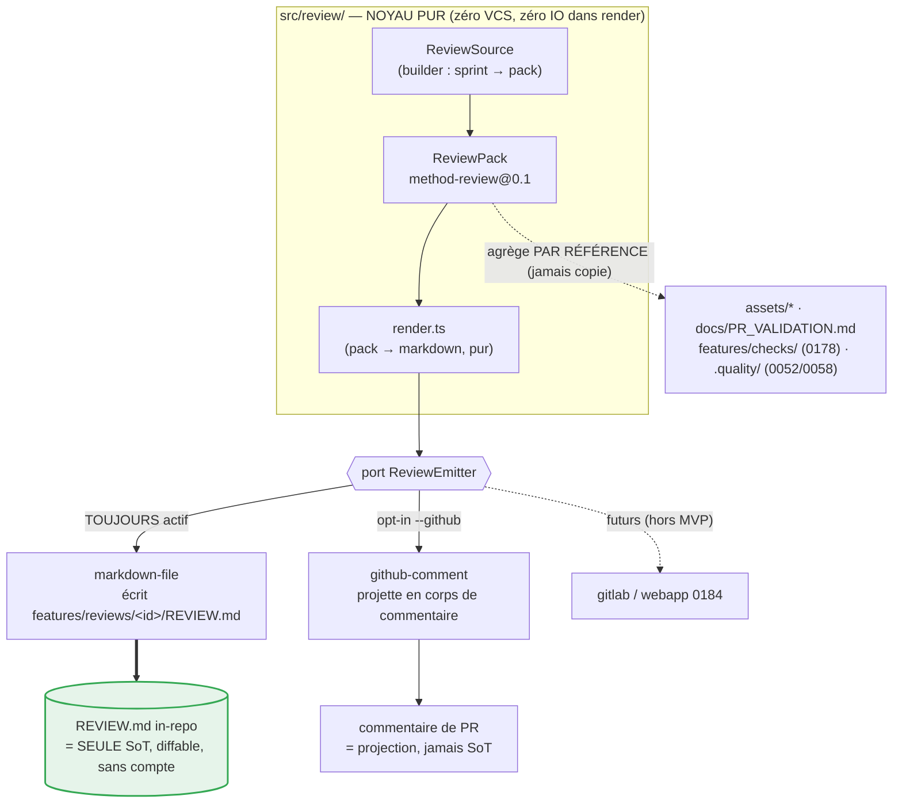

# ADR-038 — Le pack de review est markdown-first : la SoT vit dans le code, chaque rendu (PR GitHub…) est une projection

- **Statut** : Accepté (2026-08-17)
- **Compose** (sans les rouvrir) :
  - [ADR-036](ADR-036-transport-emission-separable-du-runtime.md) — noyau d'émission ↔ transports interchangeables, push-only, **appliqué ici au reporting** (là où 036 traite le *monitoring live*).
  - [ADR-029](ADR-029-emancipation-bmad-politique-archivage.md) et son extension « la fiche est le document, la PR en est le rendu » (fiche 0191) — **même posture SoT-in-repo / rendu-projeté**, transposée à l'artefact de review.
  - [ADR-032](ADR-032-emission-adaptateur-separable.md) — une carte d'émission **enregistre**, n'**applique** rien : ici l'émetteur **écrit un manifeste**, il ne pousse aucune PR de force.
  - [ADR-033](ADR-033-port-metrique-qualite-produit.md) — les métriques qualité sont **lues** via un port, jamais réécrites : le pack **agrège par référence**, jamais par copie.
- **Fiches** : [0183](../../features/done/0183-pack-review-markdown-first.md) (keystone), 0184 (webapp — **hors MVP**), 0058 (reclassé **adaptateur** du pack), 0178 (`features/checks/`, composé par référence).
- **Déciders** : PO (Thomas) ; passe adverse lean intégrée (ci-dessous, pas de fan-out panel).

## Contexte

Quand la méthode tourne seule, la restitution de ce qu'elle a **livré / testé / laissé à tester** se dilue dans les descriptions de PR GitHub — ou **disparaît** si aucune PR n'est poussée. Or (1) une fiche de review par branche est **inévitable** (un humain ou un autre agent doit pouvoir revoir sans contexte), (2) GitHub n'est qu'**une** cible de restitution parmi d'autres (GitLab, fichier seul, webapp), (3) si l'artefact vit **dans le code**, on gagne traçabilité, portabilité VCS, et la possibilité de *générer un body de PR sans créer de PR*.

Ce reporting **post-hoc** (« qu'a livré la méthode ? ») est distinct du **Moniteur** (monitoring *live* d'un run — vivacité, gates, silence ; ADR-036/028). Deux artefacts, deux raisons de changer, deux modules (SRP) : `events.jsonl` (append-only, machine, live) vs `REVIEW.md` (manifeste humain, diffable, post-hoc).

Le module `supervision/` (kit émetteur : noyau pur + transports minces + README + tests colocalisés) sert de **patron de forme**. On le réplique pour le reporting.

## Décision

1. **Deux frontières nettes, un module neuf.** Le reporting est une famille **distincte** du monitoring. Il vit dans un nouveau module `products/mega-city/src/review/`, sans dépendance vers `supervision/` ni vers un VCS. `supervision/` = *live/machine* ; `review/` = *post-hoc/humain*.

2. **SoT = un pack markdown versionné dans la branche feature.**
   ```
   features/reviews/<id>-slug/
     REVIEW.md          # manifeste, front-matter + sections obligatoires
     assets/            # screenshots avant/après, diffs, gif démo
   ```
   Le contrat **`method-review@0.1`** (front-matter `schema/fiche/branch/product/method{name,version}/status/created/run_id?/pr?`, 7 sections obligatoires) est **gravé par cet ADR** et implémenté par `review/contract.ts`.

3. **Agrégation par référence, jamais par copie** (invariant porteur, hérité d'ADR-033). Le pack **lie** (`assets/*`, `docs/PR_VALIDATION.md`, `features/checks/` de 0178, `.quality/` de 0052/0058) ; il ne **recopie** aucune métrique ni aucun rapport. La qualité y est **lue**, jamais écrite. Une section dont la source est absente **dégrade proprement** (mention « N.A. / non produit »), elle ne casse pas le rendu.

4. **Cœur hexagonal : un port `ReviewEmitter`, plusieurs rendus opt-in.**
   - Noyau pur : `contract.ts` (types + validation du front-matter + `CONTRACT_URI`) et `render.ts` (`ReviewPack → string markdown`, **fonction pure**, zéro IO, zéro VCS).
   - Port `ReviewEmitter` (DIP) : `emit(pack)`. Deux implémentations prouvent l'agnosticisme (**AC4**) :
     - `emitters/markdown-file.ts` — **toujours actif**, écrit `features/reviews/<id>/REVIEW.md` (+ `assets/`). Le fichier in-repo **est** le substrat durable.
     - `emitters/github-comment.ts` — **opt-in**, *projette* le même `ReviewPack` en corps de commentaire. Adaptateur mince : sa responsabilité testée = **produire le texte** ; l'acte `gh pr comment` reste un appel shell à la frontière CLI (opt-in `--github`).
   - **Aucun rendu n'est SoT** ; **aucun compte externe obligatoire** pour lire le pack (**AC5**). Un rendu qui échoue n'invalide pas le pack (push-only, best-effort, ADR-032/036).

5. **`ReviewSource` = une couture nommée, une seule implémentation en MVP.** La fabrication du `ReviewPack` (depuis un sprint) est un **builder**, pas encore une hiérarchie d'adaptateurs. L'interface est déclarée (documente l'intention, une raison de changer), mais on ne construit **pas** de registre de sources tant que la 2ᵉ source n'existe pas (YAGNI — cf. passe adverse §b).

6. **0058 devient un adaptateur du pack**, pas une SoT (note + cross-link dans la fiche 0058). La webapp **0184 est hors MVP** ; le 2ᵉ émetteur VCS (GitLab) **promeut** l'ensemble en épic quand il arrive (YAGNI, décision de grooming 0183).

## Passe adverse (ce qui pourrait casser cette décision)

- **a. « REVIEW.md contredit ADR-037 (le relecteur voit LA PR) ? »** — Non. ADR-037 fixe le **grain de merge/revue** (la PR = unité atomique de revue + revert) ; il ne dit rien de **où vit le rapport de livraison**. Le reviewer relit toujours le **diff de la PR** ; `REVIEW.md` est le **manifeste agrégateur** rendu *dans* le body de PR (un émetteur). Grains orthogonaux, zéro conflit — mais si un jour le pack prétendait *remplacer* la revue du diff, il violerait 037. **Garde-fou : le pack agrège par référence, il n'est pas le lieu de la revue du code.**
- **b. « Deux ports (`Source` + `Emitter`) dans un POC = sur-abstraction. »** Vrai pour `ReviewSource` (une seule source en MVP) : on la garde en **interface déclarée sans registre**. Le port `ReviewEmitter`, lui, **gagne sa place immédiatement** (2 impls = la preuve d'agnosticisme exigée par AC4). Abstraction justifiée d'un côté, bornée de l'autre.
- **c. « Agréger par référence casse la lecture hors-ligne (liens morts). »** Mitigé par la **dégradation propre** (§3) : une source absente devient « N.A. », le pack reste lisible en diff brut sans aucun outil ni compte (AC5). La copie, elle, dupliquerait la qualité et rouvrirait ADR-033.
- **d. « Frontière reporting/monitoring artificielle → un seul kit ? »** Non : `events.jsonl` (append-only, seq, machine, live) et `REVIEW.md` (manifeste humain, éditable, post-hoc) ont des cycles de vie et des lecteurs différents. Fusionner violerait SRP et rechargerait `supervision/` d'une 2ᵉ raison de changer.
- **e. `docs/PR_VALIDATION.md` et `features/checks/` (0178) n'existent pas encore.** Le pack les **cite** ; leur absence relève de la dégradation propre (§3). AC1 (« référencé depuis `docs/PR_VALIDATION.md` ») impose une action légère à l'impl : créer/annoter la cible du cross-link (voir plan, pas un blocage d'archi).

## Alternatives écartées

- **PR GitHub comme SoT (statu quo)** — perd le rapport si aucune PR n'est poussée, couple la restitution à un compte externe, non portable VCS. C'est exactement le problème (§Contexte).
- **Fusionner review dans `features/checks/` (0178)** — checks = *recette de test* rejouable ; review = *manifeste agrégateur*. Deux raisons de changer → SRP l'interdit (déjà tranché en grooming 0183).
- **Étendre le kit `supervision/` (un seul artefact)** — cf. passe adverse §d : mélange live/machine et post-hoc/humain.
- **Émetteur GitHub « riche » (intégration `gh` dans le cœur)** — couplerait le VCS au noyau, à rebours de la doctrine push-only (ADR-016/017/036). L'acte reste un appel shell mince à la frontière CLI.
- **Webapp 0184 dans le MVP** — hors périmètre (YAGNI) ; le markdown-seul + le commentaire GitHub suffisent à prouver l'agnosticisme (≥2 rendus).

## Conséquences

- Nouveau module `src/review/` (noyau pur + port + 2 émetteurs + README + tests), calqué sur `supervision/`. **Contrainte de revue** sur tout futur émetteur : *push-only, zéro couplage VCS dans le cœur, aucun rendu n'est SoT*.
- `features/reviews/<id>/REVIEW.md` devient un artefact **committé sur la branche feature** — un sprint réel peut le dogfooder (AC2).
- 0058 reclassé adaptateur ; 0184 (webapp) et l'émetteur GitLab restent des sous-fiches futures (promotion en épic au 2ᵉ VCS).
- Ce qui devient plus facile : *générer un body de PR sans PR*, revoir une livraison sans compte externe, porter le rapport hors GitHub.

## Schéma — un pack (SoT dans le code), N rendus projetés



*Légende — Le noyau `render.ts` transforme un `ReviewPack` en markdown ; le port `ReviewEmitter` en fait N rendus. **Vert** = la seule source de vérité (`REVIEW.md` in-repo, lisible en diff, sans compte externe) ; le commentaire GitHub et les cibles futures (pointillés) sont des **projections opt-in** qui ne font jamais autorité. Les liens en pointillé vers `REFS` rappellent que le pack **agrège par référence**, ne recopie aucune métrique (invariant ADR-033).*
