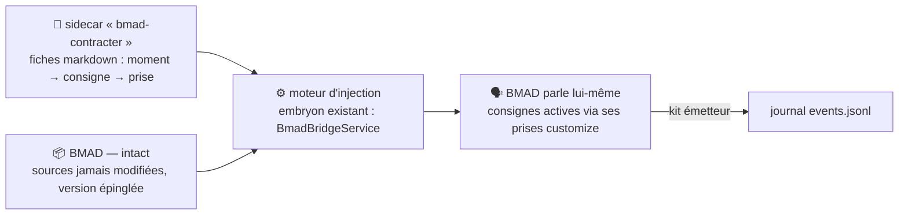

# Brancher une méthode existante à vectorz — le guide

> Compagnon lisible de l'[ADR-032](adr/ADR-032-emission-adaptateur-separable.md) (**gravé le
> 2026-07-17**). Comment une méthode de développement — la vôtre, ou une méthode tierce comme
> BMAD — devient **supervisable** par l'app, **sans réécrire la méthode**.

## Le principe en une phrase

Une méthode supervisable est une méthode qui **parle** : elle envoie des messages normalisés
(« je démarre », « étape atteinte », « bloqué », « j'ai fini ») dans un **journal**, que l'app
lit **sans rien connaître de la méthode**. La règle d'or (contrat de supervisabilité, D12) :
**c'est la méthode elle-même qui émet** — jamais un observateur extérieur qui devine.

> **Figure 1 — Le chemin d'un message.** La méthode appelle le kit, le kit écrit le journal,
> l'app le lit — et le feu vert de l'humain revient par le canal de commandes
> (`commands.jsonl`). Les trois commandes du contrat : `continue` (reprendre), `hold`
> (retenir), `abort` (interrompre) — ce sont les **seuls** noms valides, le validateur
> rejette tout autre.

## Les deux groupes de messages

| ① Messages **typés** (liste fixe, identique pour toutes les méthodes) | ② Contenu **libre** de la méthode |
|---|---|
| `run.started` · `gate.reached` · `gate.resumed` · `escalation` · `run.finished` · `heartbeat` | lien de PR, démo, rapport markdown… |
| Pilotent l'**état** et **les freins** : au `gate.reached`, la méthode **s'arrête** et attend `continue` | Voyage **en pièce jointe** (`report_ref`) d'un message typé ; l'app l'affiche **tel quel**, sans le comprendre |

Enveloppe normalisée, contenu libre — comme une lettre recommandée : le bordereau est
standard, le contenu est ce que vous voulez.

## Trois façons de brancher, par ordre de préférence

1. **Vous possédez la méthode** (skills maison, ex. mega-city) → les **consignes d'émission
   (~15 lignes) vivent DANS le skill** et appellent le kit. C'est le chemin canonique —
   fiche [0050](../products/mega-city/features/done/0050-kit-emetteur-supervisabilite.md).
2. **Vous ne possédez pas la méthode** (ex. BMAD) → le **sidecar** (installateur) : des fiches
   de branchement + un moteur qui **injecte les consignes dans les prises officielles** de la
   méthode. Après installation, **c'est la méthode elle-même qui parle** — cas détaillé
   ci-dessous, fiche [0058](../products/mega-city/features/0058-bmad-contrat-supervisabilite.md).
3. **Dernier recours** (méthode sans aucune prise) → l'**observation externe** (shim de
   transition) : un boîtier qui regarde et raconte. Il ne produit que la moitié
   **observabilité** — il ne peut **ni freiner, ni dire « je reprends »** — et sa trace est
   affichée **classe B, fidélité non vérifiée**. On ne s'en sert qu'en attendant mieux.

## L'exemple BMAD, pas à pas (le sidecar)

BMAD a servi de cas d'étude pour concevoir le pattern — c'est la première implémentation visée.

> **Figure 2 — Le sidecar est un installateur, pas un observateur.** Une fois les consignes
> injectées, BMAD émet et s'arrête aux jalons **comme une méthode maison**.

1. **Les prises existent déjà** : BMAD documente lui-même son point d'extension —
   `_bmad/_config/agents/*.customize.yaml` (« *Add custom critical actions* »). Aucune source
   BMAD n'est vendorée dans le repo : il n'y a littéralement **rien à modifier**.
2. **Le sidecar** est un dossier de fiches markdown : « pour *ce moment* de BMAD (fin de
   phase, artefact produit…) → ajouter *cette consigne d'émission* → dans *cette prise* ».
3. **Le moteur** applique les fiches dans les prises. Un embryon existe déjà :
   `BmadBridgeService` (cop1) injecte des `critical_actions` exactement par ce mécanisme.
4. **BMAD, ainsi étendu, appelle le kit** (5 outils : `run_start`, `gate_reached`,
   `gate_resumed`, `escalate`, `run_finished`) → le journal s'écrit.
5. **L'app affiche** l'avancement et les artefacts (liens PR, rapports) ; aux jalons, BMAD
   **s'arrête et attend le feu vert**.

BMAD reste **utilisable normalement, avec ou sans vectorz**. Si le sidecar est distribué un
jour : nom **sans « BMad »** (marque déposée) — « compatible with BMad Method » est permis.

## Les pièges d'architecture rencontrés (et comment on les a résolus)

Ce pattern n'est pas sorti tout armé : la **première version de l'ADR a été réfutée par un
panel adverse** (4 lentilles + juge vérifiant chaque affirmation dans le code — récit complet :
[capture du panel](captures/2026-07-16-panel-adverse-adr-032.md)). Ce qu'on a appris :

| Piège | Solution gravée |
|---|---|
| **Un observateur extérieur ne peut pas freiner.** Écrire une ligne de journal n'arrête aucun process — or l'arrêt au jalon est *le cœur* du contrat. | **La méthode parle elle-même** (consignes dedans, ou installées par le sidecar). L'observation pure est reléguée en dépannage, honnêtement étiquetée « observabilité seulement ». |
| **Deviner les champs typés depuis du texte** (« ça a l'air d'un succès ») ouvre la porte à la manipulation du superviseur par le contenu. | Les champs typés (`outcome`, type d'escalade…) sont **fournis par la méthode, en bande** — jamais inférés. |
| **« Je reprends » (`gate.resumed`) ne se devine pas de l'extérieur** : seul l'émetteur détient l'identifiant du jalon ouvert. | **Interdiction de le synthétiser.** Sans lui, le compteur de violations serait aveugle par construction. |
| **Un émetteur artisanal peut contourner les garanties** (numérotation, `upgrade_ok`, confinement des fichiers joints). | **Passage obligatoire par le kit émetteur** : l'enveloppe et les champs calculés sont hors de portée de l'appelant. |
| **On a failli graver l'inverse de notre propre règle** (v1 de l'ADR : l'observateur externe promu, D12 cité tronqué). | Le **panel adverse avant gravure** a réfuté la v1 sur pièces (`fichier:ligne`). Le processus a fait exactement son travail. |

## Pour aller plus loin

- **La décision** : [ADR-032](adr/ADR-032-emission-adaptateur-separable.md) (gravé 2026-07-17) — et le [registre des ADR](adr/README.md).
- **La carte vivante de la méthode** : [method-map](../products/mega-city/docs/method-map.md) (couche méthode / couche contrat).
- **Le contrat de supervisabilité** (gelé, 2026-07-13) : [capture](captures/2026-07-13-contrat-methode-et-versions.md) — et l'[article de fond](articles/contrat-de-supervisabilite.md).
- **Les fiches** : [0050](../products/mega-city/features/done/0050-kit-emetteur-supervisabilite.md) (kit émetteur, en cours) → [0058](../products/mega-city/features/0058-bmad-contrat-supervisabilite.md) (le sidecar BMAD).
- **Le récit du panel** : [capture 2026-07-16](captures/2026-07-16-panel-adverse-adr-032.md).
