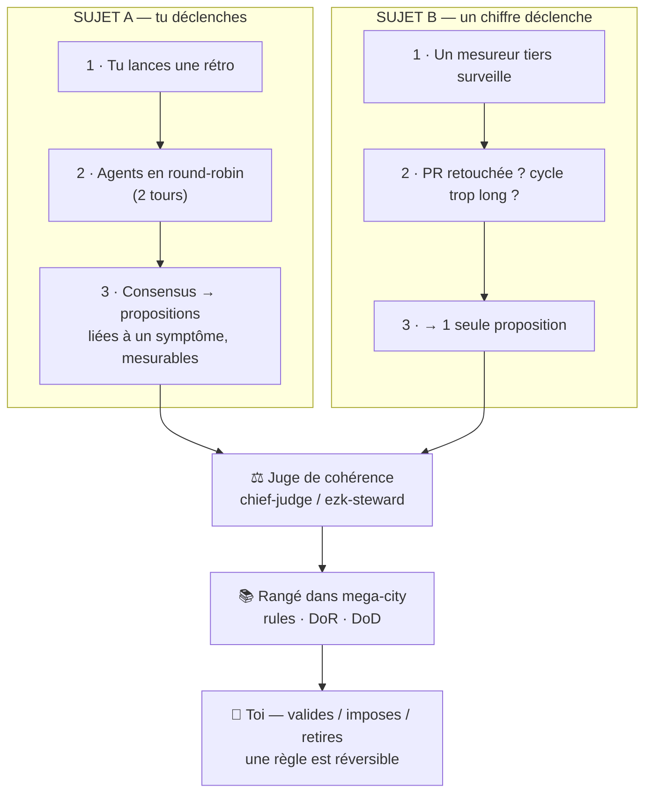
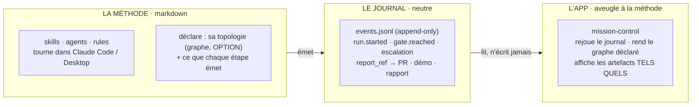

# En clair : les 2 sujets de l'auto-amélioration

> Note de cadrage lisible (session 2026-07-16). Le dossier technique dense (contrat mesuré)
> est à côté : `ADR-030` + `2026-07-16-note-concept-contrat-ameliorabilite.md`. **Tu n'as pas
> besoin de le lire** — cette carte suffit à décider.

Un retour du PO a débloqué le sujet : *« il y a 2 sujets, un où on améliore la méthode, un
autre où l'auto-amélioration naît de la méthode. »* C'est exactement ça, et ça change tout.

## Les 2 sujets

**Sujet A — on améliore la méthode** *(tu déclenches)*
Tu lances une rétro quand tu veux → les agents débattent en round-robin (2 tours) → ils
tombent d'accord sur des propositions liées à un **symptôme** et **mesurables** (une action,
une feature, un spike, ou **une règle** : lint, principe d'archi, item de DoD, outil de
contrôle, façon de communiquer). Simple, et tu gardes la main.

**Sujet B — la méthode s'auto-améliore** *(un chiffre déclenche)*
Un mesureur tiers surveille des résultats métier (une PR retouchée à la main ? un cycle trop
long ?). Quand un chiffre décroche, la méthode propose **une seule** amélioration, la prouve,
puis l'adopte ou la retire. Plus ambitieux → c'est le **contrat d'améliorabilité** (ADR-030),
pour plus tard.

## Ce qu'ils partagent (la même plomberie)

Les deux sujets finissent au même endroit :

1. **Un juge de cohérence** — « cette règle en contredit-elle une autre ? un doublon ? »
   C'est le *judgedread*. Déjà en idée : fiche [0008 chief-judge](../../products/mega-city/features/0008-chief-judge.md)
   + l'agent `ezk-steward` (gardien de LA LOI).
2. **Rangé dans mega-city** — une règle dans `rules/` (10 catégories existent déjà), un
   `bundle`, ou le DoD/DoR.
3. **Toi** — tu valides, tu peux imposer, tu peux retirer. Une règle est **réversible**.

## Le métier est-il déjà là ? Oui — presque tout est déjà codé (et testé).

Un fouilleur a remonté le pipeline historique cop1 fichier par fichier. Ton modèle mental
existe déjà **en pièces détachées, majoritairement côté cop1, codées et testées — mais ni
assemblées ni câblées** dans la boucle vivante.

> ⚠️ **Nuance paradigme (2026-07-16).** Ce code cop1 (`RoundTableEngine`, `RetroCeremony`…)
> appartient à l'**ancien monde** : la méthode vivait **dans le code** — précisément ce que
> le retrait de BMAD (E4, fiches 0038/0039) démonte. Dans le **nouveau paradigme** (méthode
> = markdown qui **émet des events** ; app d'affichage **aveugle à la méthode**), ce code
> vaut comme **référence d'algorithme** (le round-robin 2 tours, les seuils symptôme→règle)
> à **ré-encoder en orchestration de skills**, pas comme fondation à réutiliser telle quelle.
> Le « déjà là » qui compte vraiment pour le nouveau monde = **le contrat de supervisabilité**
> (voir « Côté affichage » ci-dessous).

| Brique de ton modèle | État aujourd'hui | Preuve (fichier) |
|---|---|---|
| Round-robin 2 tours → consensus | ✅ **codé + testé** (« 2 tours × 3 agents ») | `RoundTableEngine` (ceremony-engine), `maxRounds=2` |
| Rétro qui pond des propositions | 🟠 **codée mais orpheline** (jamais déclenchée) | `RetroCeremony` — `grep 'new RetroCeremony(' = vide` |
| Règle mesurable liée à un **symptôme** | ✅ **codé** (blocage > 30 %, coverage < 80 %…) | `AutoRuleSuggestionService`, `improvementScore` |
| Juge de cohérence (« judgedread ») | 🔴 **spécifié, pas codé** ; runtime = anti-doublon seul | fiches `0008` + `0034` ; `checkDuplicate` |
| Atterrir dans DoR/DoD / règles mega-city | ✅ DoD/DoR codés + règles en `rules/` | `DoDCheck` (ADR-020) ; 53 règles migrées (fiche 0006) |

**Donc ce qui manque n'est pas la machinerie — ce sont 3 soudures :**

1. un **déclencheur** « rétro à la demande » qui rebranche la cérémonie orpheline ;
2. le **juge de cohérence** (aujourd'hui on ne détecte que les doublons, pas les contradictions) ;
3. le **pont** rétro → `rules/` de mega-city (le retour de règle écrit encore à l'ancienne
   adresse cop1 `iamthelaw/*.yaml`).

C'est le job de la fiche [0063 ezk-retro](../../products/mega-city/features/done/0063-ezk-retro-ceremonie-auto-amelioration.md)
(Sujet A). Le mesureur du Sujet B = fiche vectorz 0044.

*Nuance sur ton souvenir : les 2 tours existent mais dans un ordre **déterministe** — le
tirage « aléatoire » des agents serait un petit ajout, pas un chantier.*

## Côté affichage (l'app) — tu l'as déjà tranché (13 juillet)

Le point qui restait flou — *« une app qui reçoit les events et affiche, indépendante de la
méthode ; ça ressemble à du BPMN ; mais elle ne connaît pas la méthode ? »* — **tu l'as
entièrement conçu, panel-validé et gelé le 2026-07-13** : c'est le **contrat de
supervisabilité** (`docs/captures/2026-07-13-contrat-methode-et-versions.md`, décisions
D4/D7/D8/D12/D13). Tu ne te trompes pas — tu redécouvres ta propre décision.

Réponses à tes questions, tirées de tes propres décisions :

- **« L'app ne connaît pas la méthode, je me trompe ? »** → Non. **D4** : *« cop1 ne connaît
  JAMAIS la méthode. »* L'app connaît le **contrat** (le vocabulaire d'events), pas le métier.
- **« Que du markdown depuis Claude Desktop ? »** → **D12** : transport = un **journal JSONL**
  émis par la méthode ; le **MCP émetteur est le chemin nominal pour Desktop**. Émission en
  **classe B** (best-effort LLM) vs classe A (SDK/hooks vérifiés).
- **« Ça se rapproche du BPMN, la méthode en graphe ? »** → Oui, et c'est **déjà prévu, en
  option** : **D8** — le superviseur n'exige **pas** de manifeste topologique (son chien de
  garde est *temporel*, pas *topologique*) ; la **topologie reste déclarable par la méthode,
  pour l'observabilité seulement** (`gates_topology?` dans `run.started`). L'app rend le
  graphe si la méthode le fournit — elle reste aveugle sinon.
- **« Afficher PR / démo / ce qu'il s'est passé ? »** → **D8 corollaire** : *« rendre ≠
  interpréter »* — l'app rend **tels quels** les artefacts référencés (`report_ref` → liens
  PR, démo, rapports md) sans les comprendre ; « ce qu'il s'est passé » = **replay** du journal.
- **« De quel côté mettre la déclaration (graphe + ce que les étapes émettent) ? »** →
  Côté **méthode**, en markdown : la méthode se décrit elle-même. Le **contrat** possède le
  *vocabulaire* (stable, partagé) ; chaque méthode fournit son *adaptateur* (sa topologie +
  son émission, jetable). Hexagonal pur, cohérent ADR-021 (« couture fichiers + événements,
  jamais d'API partagée »).

## La prochaine marche, concrète et simple

Le **Sujet A** (fiche `ezk-retro`) : un skill qui lance la cérémonie que tu décris, réutilise
le juge + `rules/` qui existent déjà, et te laisse la main sur la liste. Pas besoin de toucher
au gros ADR-030 pour ça.

*Premier symptôme candidat, mi-clin d'œil : « nos ADR sont illisibles » → règle mesurable
« un ADR tient en 1 page / a un résumé en 3 lignes ». La cérémonie ferait ses preuves sur son
propre outillage.*

## Faut-il un schéma universel pour toutes les méthodes de dev ? — non, pas maintenant

Le contrat de supervisabilité **est déjà** cette tentative de schéma universel (« ce que
*toute* méthode multi-agent doit exposer »). Mais il a été dessiné à partir d'**une** méthode
(BMAD/mega-city, sa *première* implémentation — D5). Le réflexe sain n'est pas de l'étendre à
« toutes les méthodes de dev » par anticipation (BPMN complet = marécage), mais de le
**prouver sur une 2ᵉ méthode** — le pilote natif (fiche 0038) — et de laisser les **vrais
ports** émerger de 2-3 cas concrets. C'est ta règle `construire → prouver → retirer`, et
c'est déjà nommé : le « test double-émetteur » d'ADR-030. **BPMN = le bon modèle mental, le
mauvais artefact de départ** : commence par la topologie minimale déjà prévue
(`gates_topology?`, que Mermaid rend gratuitement), et ne grossis vers BPMN que si la forme
l'exige.

## Trajectoire vers le self-hosting (l'objectif cible)

Le self-hosting — cop1 développe cop1 — **est plus proche que tu ne crois** : tu le fais déjà
à moitié avec `ezk-product-builder` (il enchaîne des sprints sur un backlog). Le pointer sur
**le backlog de vectorz**, c'est ça, le self-hosting.

**Le piège à éviter : « améliorer la méthode d'abord, pour accélérer ».** C'est le meta-trap —
tu polirais **à l'aveugle**. La méthode est **déjà assez bonne** pour se self-héberger (tu
l'utilises tous les jours ailleurs). Ce qui l'améliore vraiment, c'est la **friction d'un vrai
self-hosting**, pas une phase d'amélioration en amont.

**Donc on inverse cause et effet** — le self-hosting n'est pas la ligne d'arrivée, c'est le
**moteur** :

1. **Self-héberge UN petit truc, sûr** (markdown only : un skill, une règle, une doc — p.ex.
   la fiche 0063 `ezk-retro` elle-même) via `ezk-product-builder` sur vectorz. Mode **moniteur**
   (toi au siège) → pas besoin des 2 stubs *pilote* du README.
2. **La friction se ramasse en skill/règle** (`ezk-ezk` + Sujet A `ezk-retro`) — *ça*, c'est
   « améliorer la méthode », mais **nourri par du réel**.
3. **Un seul truc porteur à ajouter** : le tuple de version `(cop1@sha, méthode@vX)` par
   feature — **déjà tracké** (fiche 0042 #12). Indispensable dès qu'un outil se modifie lui-même.
4. **Le rendu graphique vient quand le volume le réclame** (observabilité, fiche 0042 #13) —
   il **ne bloque pas** le self-hosting.
5. **Versioning / migration → ADR + articles** tombent naturellement de l'expérience (tu l'as
   vu) : tester son produit avant de le versionner ouvre le plan LIVRAISON (capture 13 juil. §1).

**Blast-radius** : self-héberge d'abord sur le **markdown** (skills / règles / docs), jamais sur
le cœur de supervision en vol — `construire → prouver → retirer` vaut aussi pour le self-hosting.
