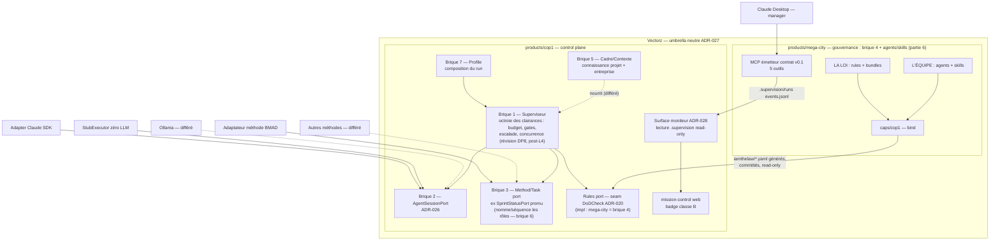
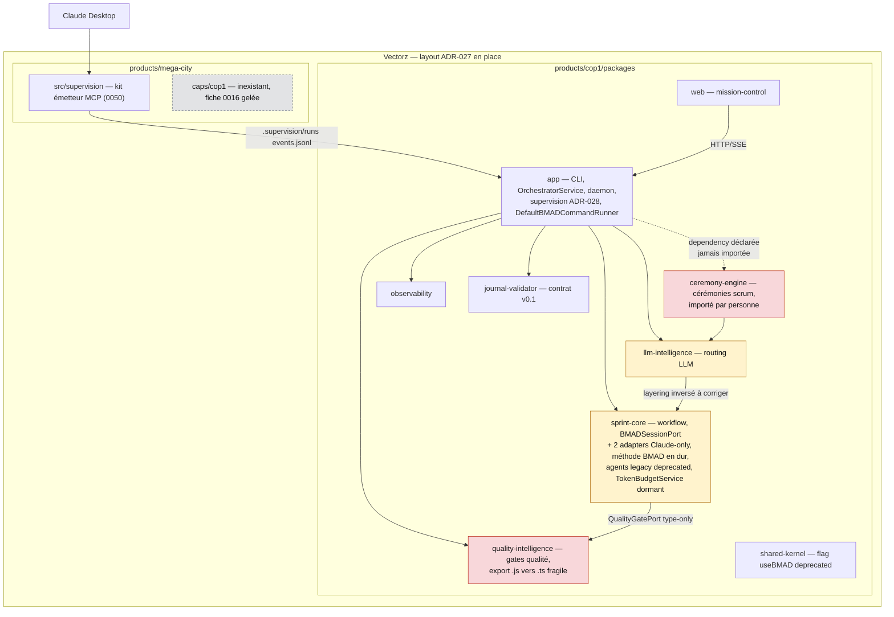
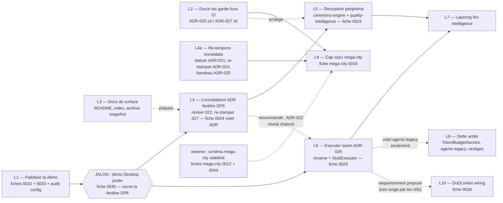

# 0034 — Mise à plat post-pivot (épic)

## Contexte / Problème

Le pivot est acté sur le papier — ontologie 7 briques / 3 ports (ADR-022), seam exécuteur
(ADR-026), umbrella Vectorz (ADR-027), mode moniteur nominal (ADR-028 + capture
2026-07-14) — mais le code et les docs sont ceux du clone cop1 pré-pivot : méthode BMAD
en dur dans le cœur, périphérie morte dans le graphe de prod, README « Morpheus / drives
BMAD », statuts ADR non consolidés. Risque : chaque nouveau lot construit sur un socle
qui contredit les décisions. Cette fiche est l'épic **P0** qui met tout à plat : écarts
sourcés, lots séquencés (1 PR/lot), schémas partagés pour valider la direction.

Synthèse produite par lecture exhaustive (ADR-015→028, fiches actives, docs vivants,
ADR mega-city, cartographie du code) + **deux** passes adverses le 2026-07-15 (revue de
la fiche, puis validation du registre garder/consolider/supprimer). Le travail amont
validé est éclaté en 3 fiches filles : [0035](0035-consolider-statuts-adr.md) (P0,
statuts ADR = L4a), [0036](0036-purge-code-mort-prouve.md) (P1, purge sûre ⊂ L8),
[0037](0037-arbitrage-double-writer-sprint-status.md) (P1, D7). Faits marquants vérifiés
en repo :

- **ADR-021 est mergé** (commit `3cb9db2`, PR #48) mais toujours stampé « Proposé » — la
  fiche 0024 (« vit dans une branche non mergée ») était périmée, corrigée dans cette passe.
- **Le garde-fou de frontière existe déjà** : `tools/boundary/boundary.test.ts` (scan
  vitest bidirectionnel cop1 ⇸ mega-city, dans le `pnpm test` racine) — la question Q4
  d'ADR-027 est de facto tranchée « test vitest maison » ; L2 le durcit au lieu de le créer.
  La CI porte déjà lint + build + test racine (boundary inclus), la couverture `@cop1/web`
  et des steps standalone mega-city (« host-agnosticity is proven mechanically », ci.yml).
- **E6-S2 (ContainerRuntimePort/DockerDesktopAdapter) est déjà supprimé** (commit
  `d200f0e`, PR #55) — reste à re-stamper ADR-024.
- **Aucun `dist/` ni `node_modules` commité** (les `dist/` visibles localement sont
  non-trackés) ; en revanche **`_bmad/` (27 fichiers) est commité à la racine** de
  l'umbrella et son sort n'était traité nulle part (→ décision ouverte D9).
- AI-7 d'ADR-027 (re-bind symlinks `~/.claude`) : **fait**. AI-3 (gel des originaux :
  tag `cop1-pre-vectorz` + README pointeur) : **à vérifier dans les repos d'origine**.

## L'état cible (projection ADR-022 × ADR-027)

> Le nœud Superviseur porte la **révision DP8** (capture 2026-07-14 : « octroie des
> clairances », pas « tire & dispatche ») — c'est l'état **post-L4**, pas ADR-022 tel
> qu'écrit aujourd'hui. Briques 5 (Cadre) et rôles (6) côté cop1 : différés, en pointillé.

## L'état courant (zones à résorber marquées)

> Légende : rouge = legacy pré-pivot à sortir du graphe de prod ; jaune = transitionnel
> (à généraliser, pas à supprimer) ; gris pointillé = manquant. Dépendances vers
> shared-kernel/observability omises pour la lisibilité (quasi tous en dépendent).

## Les écarts (courant → cible, sourcés)

| # | Écart | Courant | Cible | Réfs |
|---|-------|---------|-------|------|
| 1 | Seam exécuteur Claude-only | `BMADSessionPort` + 2 adapters Claude ; sélection dupliquée `sprint-run.ts`/`orchestrator.ts` ; pas de StubExecutor ni d'allowlist SDK | `AgentSessionPort` + factory `createAgentSessionAdapter(env)` (`COP1_EXECUTOR` sdk\|resume\|stub), StubExecutor, allowlist testée. Nuance capture Q4 : le journal au contrat **est** l'event-stream seam — la démo prouve l'agent-indépendance côté moniteur par un chemin plus court ; le StubExecutor reste la preuve exécutable côté pilote | ADR-026, 0020, ADR-022 (2) |
| 2 | Périphérie pré-pivot dans le graphe de prod | `ceremony-engine` (dependency morte d'app), `quality-intelligence` (importé par app + sprint-core) | plus aucun import prod ; méthode → Method port, qualité → seam DoDCheck | 0024, ADR-022, ADR-020 |
| 3 | Méthode BMAD en dur dans le cœur | ~59 fichiers prod mentionnent BMAD ; `SprintStatusPort` = Method port « en germe » | BMAD = **une** implémentation du Method/Task port générique. **À généraliser, PAS à supprimer** : ADR-026 garde explicitement `bmad-orchestration/` | ADR-022 (3), ADR-026 non-buts |
| 4 | Ports mal localisés (llm-intelligence) | dépendance `package.json` `llm-intelligence → sprint-core`, réduite à 2 `import type` (ReviewerPort/ReviewResult, CodeGeneratorPort) — zéro couplage runtime | interfaces de port relocalisées (shared-kernel ou brique 1), dépendance au package méthode retirée ; tiering → donnée du Profile à terme | ADR-022 (1), ADR-015 |
| 5 | Statuts ADR non consolidés | ADR-021 mergé mais « Proposé » ; ADR-025 sans bandeau « révisé par ADR-027 » ; ADR-024 non re-tamponné (E6-S2 exécuté `d200f0e`) | **re-tampons sûrs maintenant** (021 Accepté, 024 Accepté, 025 bandeau — fiche 0035). NB : **ADR-022 n'est PAS un simple re-tampon** — la réécriture de sa brique 1 (loop `pull→dispatch` rendu **caduc**) est une révision de fond différée DP8 ; 026+027 différables ensemble post-démo | capture 2026-07-14, 0035 |
| 6 | Garde-fous CI presque complets | `tools/boundary` **existe** ; CI = lint + build + test racine (boundary inclus) + couverture `@cop1/web` + steps standalone mega-city (host-agnosticité déjà prouvée mécaniquement) ; manquent seulement : step boundary **nommé**, allowlist SDK | les 2 manques câblés ; check « config générée committée » différé à L9 | ADR-025 §3, ADR-027 §5 |
| 7 | Frontière mega-city non matérialisée | cop1 lit `iamthelaw/*.yaml` mais personne ne l'écrit ; `caps/cop1` inexistant (0016 gelée) | `bind` → `global.yaml` généré, commité, read-only ; enforcements → DoDCheck | ADR-021, mega-city 0016/0010 |
| 8 | Docs de surface périmés | README « Morpheus / drives BMAD » (avril) ; `docs/index.md` sans ADR ≥ 015 ; GETTING_STARTED + USER-GUIDE-web-ui avec chemins `packages/*` cassés ; brownfield-snapshot supersédé | README Vectorz + README/produit ; index refondé ; snapshot archivé après re-port du drift ledger ; pilote étiqueté « différé », moniteur « nominal » | ADR-027, ADR-028, capture |
| 9 | Dette actée non résorbée | `TokenBudgetService` dormant ; `useBMAD` + agents legacy `@deprecated` ; vestiges `docker-compose.yml` (Ollama ADR-005) et `scripts/ea13-real-run.sh` ; `_bmad/` racine non statué | purge/tranchage lot par lot | ADR-017, ADR-024 |
| 10 | Config daemon incohérente | 0032 (`daemon.port` ignoré), 0033 (RAM : fail-fast CLI + défauts restants — le volet `wireSupervision` est déjà corrigé) | config déclarée = comportement ; défauts sûrs | 0032, 0033 |

## Proposition — lots séquencés (1 PR par lot)

- **L1 — Fiabiliser la démo** (pré-démo, immédiat) : 0032 (honorer `daemon.port` :
  priorité `--port` > config > défaut — c'est l'issue que la fiche impose) ; 0033
  (fail-fast RAM < 2 s + défauts raisonnables — le volet
  `wireSupervision` est déjà corrigé) ; audit `cop1.config.example.yaml` champs morts
  (`llm_routing` pré-pivot) vs vivants (`supervision.*`) ; alléger la checklist §4.
- **L2 — Durcir les garde-fous CI** (lot léger, indépendant) : l'essentiel existe déjà
  (lint + build + test racine boundary inclus, couverture `@cop1/web`, steps standalone
  mega-city typecheck+test — host-agnosticité déjà prouvée mécaniquement). Restes réels :
  promouvoir `tools/boundary` en step CI **nommé** ; poser l'allowlist des imports
  `@anthropic-ai/claude-agent-sdk` (état actuel, durcie en L6) ; le check « config
  générée committée et à jour » est **différé jusqu'à L9** (personne n'écrit encore le
  fichier). NB : « jobs `--filter` build par produit » infaisable tel quel — mega-city
  n'a pas de script build (tourne via tsx) et `cop1` est le nom du package racine.
- **L3 — Docs de surface** (zéro code, indépendant) : README racine = README **Vectorz**
  (umbrella, 2 produits co-égaux) + `products/cop1/README.md` ; refonder `docs/index.md`
  (colonne vertébrale ADR-015→028, captures, checklist) ; corriger les chemins
  `packages/*` → `products/cop1/packages/*` dans running-cop1, supervisor-playbook,
  **GETTING_STARTED, USER-GUIDE-web-ui** ; archiver brownfield-snapshot avec bandeau
  **après** re-port en fiches des items ouverts du drift ledger (double-writer
  sprint-status §10.5) ; documenter la frontière `.cop1/` = état runtime piloté (ADR-019)
  vs `.supervision/` = journal observé, arbre du projet supervisé, gitignoré (ADR-028 +
  capture DP6) — repos potentiellement différents.
- **L4a — Re-tampons immédiats** → **fiche [0035](0035-consolider-statuts-adr.md) (P0)**.
  Parallèle à L1-L3, sans gate démo : ADR-021 → Accepté (justifié par le contrat de
  couture, pas « code mergé » — lève le bloqueur (b) de mega-city 0016), ADR-024 → Accepté
  (après confirmation E6-S2 `d200f0e`), bandeau « révisé par ADR-027 » dans ADR-025.
- **L4 — Consolidation ADR** (fenêtre DP8, post-démo) : réviser ADR-022 en une passe
  (brique 1 → « octroie des clairances », EscalationPort différé, WIP → Proposé),
  coordonné avec le volet ADR de 0024 ; re-stamper ADR-027 ; trancher la politique par
  défaut `iamthelaw/global.yaml` absent (question ADR-020) avant que mega-city devienne
  l'écrivain ; lexique ATC optionnel.
- **L5 — Résorption périphérie** (= cœur de 0024, après L4) : sortir `ceremony-engine`
  (dépendance fantôme déclarée `app/package.json:19`, jamais importée en TS) et
  `quality-intelligence` (via seam DoDCheck ; relocaliser les
  config-templates d'InitService) du graphe de prod ; ~850 tests verts ; débloque
  mega-city 0016.
- **L6 — Executor seam** (= 0020 + ADR-026 ; post-démo recommandé, **parallélisable**
  d'après la capture Q4 — pas dans le groupe DP8 strict) : rename mécanique
  `BMADSessionPort` → `AgentSessionPort` (décompte réel : ~24 fichiers code + ~11
  docstrings ≈ 35 hors dist — le « ~17 » d'ADR-026 est à re-chiffrer dans la même passe ;
  zéro changement de comportement) ; factory partagée ; StubExecutor : **implémenter**
  l'émission `session.workflow.completed` + `tokensUsed` (eventBus à injecter —
  `InMemorySessionAdapter` n'émet rien aujourd'hui ; c'est la preuve budget ADR-017, le
  wiring y est abonné) ; durcir l'allowlist SDK ; preuve = épic-jouet de
  bout en bout zéro ligne de Claude. **Ne pas toucher** : `bmad-orchestration/`,
  AuthChecker, toolCatalog, SupervisorMcpServer (gardés explicitement par ADR-026).
- **L7 — Relocaliser les ports llm-intelligence** (après L5+L6) : la dépendance
  `llm-intelligence → sprint-core` tient en 2 `import type` (ReviewerPort/ReviewResult,
  CodeGeneratorPort) — relocaliser ces interfaces (shared-kernel ou brique 1), retirer la
  dépendance `package.json` ; recâbler `sprint-status.ts`/`PipelineStepFactory.ts` ;
  propager le rename L6.
- **L8 — Dette actée** (petits lots indépendants) : le **sous-ensemble sûr** (S1
  `TokenBudgetService`, S2 `docker-compose.yml`, S3 `ea13-real-run.sh`) part en
  **fiche [0036](0036-purge-code-mort-prouve.md) (P1)** ; le sort de `useBMAD=false` +
  agents legacy reste **arbitrage humain D6** (runtime-atteignable, testé — pas du code
  mort), à trancher après L6. (Onglets 404 **déjà retirés** — `web/src/App.tsx` réf. 0022 ;
  ne reste que l'arbitrage D8 avec 0031.)
- **L9 — Cap cop1 mega-city Phase 1** (= mega-city 0016 ; après L4 + L2, externe :
  mega-city 0012 + 0044 — 0006 et 0039 sont déjà livrées) : `bind` → WritePlan pur
  byte-for-byte, `iamthelaw/global.yaml` commité read-only ; enforcements → DoDCheck ;
  `IamTheLawLoader` stabilisé, pas remplacé ; activer le check L2 différé.
- **L10 — DoDLimiter** (= 0018 ; **non câblé** aujourd'hui — personne ne l'instancie) :
  boucle de retry par story (follow-up ADR-016) puis N rejets → blocked + escalade.
  **C'est un rouage du mode PILOTE que le pivot (moniteur nominal, ADR-028) diffère** —
  donc lot tardif, pas cœur-pivot ; le séquencement après L6 est un choix proposé ici.

## Critères d'acceptation

- [ ] Chaque lot L1→L10 (L4a inclus) est traçable : fiche existante rattachée ou fiche fille créée, 1 PR par lot
- [ ] L1 : `daemon.port` honoré (ACs 0032), fail-fast RAM visible (ACs 0033), zéro champ mort dans `cop1.config.example.yaml`, checklist §4 allégée
- [ ] L4a : ADR-021 Accepté, ADR-024 re-stampé, ADR-025 bandeau « révisé par ADR-027 »
- [ ] L4 : ADR-022 révisé/Proposé (brique 1 « clairances »), ADR-027 re-stampé
- [ ] L5 : plus aucun package du graphe de prod n'importe ceremony-engine ni quality-intelligence ; tests verts
- [ ] L6 : épic-jouet complet (budget, gates, SSE, escalade, worktrees) exécuté avec StubExecutor émettant `session.workflow.completed`+`tokensUsed`, zéro ligne Claude ; allowlist SDK verte
- [ ] L7 : plus aucune dépendance `llm-intelligence → sprint-core` (package.json + imports), ports relocalisés, tests verts
- [ ] L2 : boundary en step CI nommé + test allowlist SDK verts (la host-agnosticité mega-city est déjà prouvée par les steps standalone existants)
- [ ] L3 : README Vectorz + index refondé + zéro chemin `packages/*` cassé dans les docs vivants ; snapshot archivé après re-port du drift ledger
- [ ] Les décisions ouvertes D1→D9 ci-dessous sont tranchées (ou explicitement re-différées) au fil des lots
- [ ] Gate locale verte (typecheck/lint/tests) à chaque lot ; E2E si UI

## Notes / décisions ouvertes (arbitrage humain)

- **D1 — Déclencheur DP8** : « la démo 0030 jouée » (capture 14/07) — reste à préciser le
  critère opérationnel de « jouée ». (« 3 runs réels » gate DP7/0028 et la v0.2, pas L4/L6.)
- **D2 — TENSION nommage de branche vs ADR** : la branche courante s'appelle
  `claude/remove-bmad-files` mais ADR-026 (source la plus récente) **garde**
  `bmad-orchestration/` et ne purge que le *nom* du port ; ADR-022 dit « généraliser
  derrière les ports », pas supprimer. Retenu ici : généraliser, pas supprimer.
- **D3 — quality-intelligence** : suppression vs relégation derrière Rules port + où
  relocaliser les config-templates (L5).
- **D4 — ceremony-engine** : suppression pure ou gel derrière Method port (à acter à l'ADR en L4).
- **D5 — ADR-027 Q1/Q3/Q4** : nom `cop1` vs nom « tour » ; turbo maintenant ou à la
  douleur ; confirmer le scan vitest maison (de facto en place) vs dependency-cruiser.
- **D6 — useBMAD + agents legacy** : aucune ADR n'acte leur suppression — trancher après L6.
- **D7 — Double-writer sprint-status.yaml** (snapshot §10.5) : jamais tranché → **porté
  par la fiche [0037](0037-arbitrage-double-writer-sprint-status.md) (P1)**.
- **D8 — 0022 vs 0031** : une seule vue runs dans la mission-control ou deux sources
  (SSE legacy vs journal `.supervision`) — re-cadrer post-démo.
- **D9 — `_bmad/` racine (27 fichiers commités) et `_bmad-output/` (225)** : migrer sous
  `products/cop1/`, garder à la racine, ou purger (réinstallable via `bmad install`) —
  aucun texte ne le statue aujourd'hui.
- Hors-lots volontaires : 0017 (blocked), 0028 (P3, gate « 3 runs réels »), 0029 (parking
  v0.2) ; 0007 (P3) : volet format session log/ADR-009 adjacent à D7 (L3), volet D1 pin
  BMAD à re-scoper avec D9 après L5/L6.
- AI-3 ADR-027 (gel des originaux cop1/mega-city : tag + README pointeur) : à vérifier
  dans les repos d'origine — hors de ce repo.
- Vérifs négatives consignées : zéro `dist/`/`node_modules` commité ; zéro résidu
  `megacity.pin` (ADR-023) ; re-bind symlinks (AI-7) fait ; onglets 404 web déjà retirés
  (`web/src/App.tsx`, réf. 0022 — volet 4 de 0022 acté fait).
