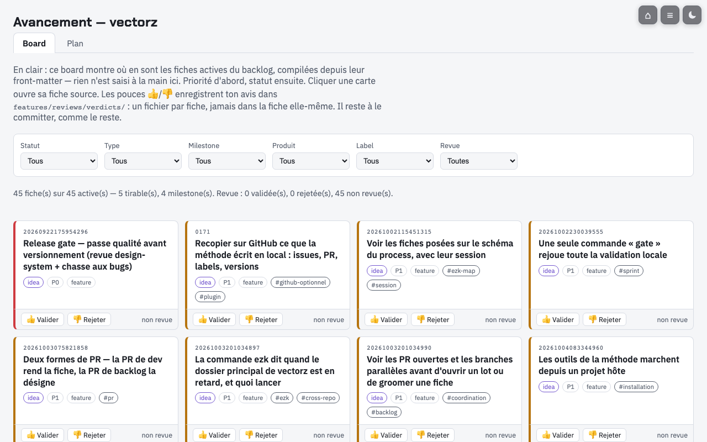
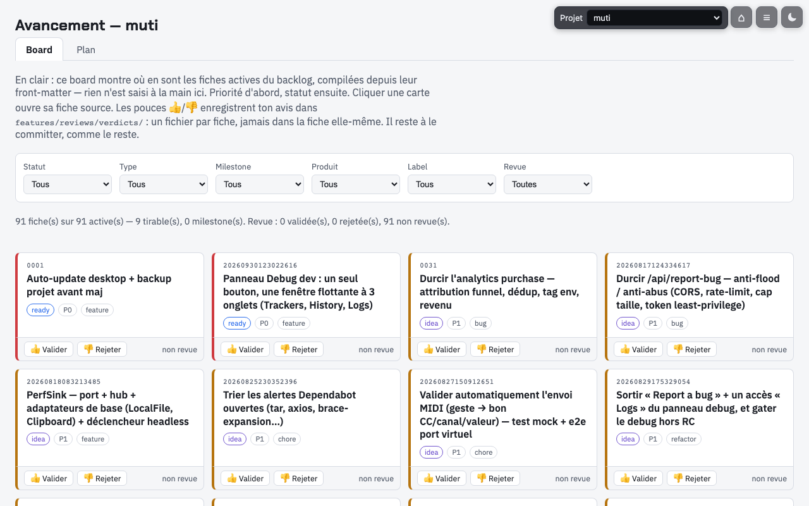
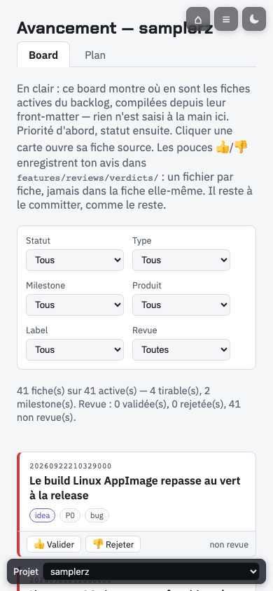

> 🗎 Rendu de la fiche [features/20261004192802897_cockpit-menu-projets-et-leurs-fiches.md](../done/20261004192802897_cockpit-menu-projets-et-leurs-fiches.md)

# 20261004192802897 — Cockpit : le tableau de bord liste tes projets et montre les fiches du projet choisi

**En clair.** Aujourd'hui, le tableau de bord ne lit qu'un projet à la fois : pour en changer, il
faut le relancer. Avec cette fiche, un menu liste les projets du registre. Tu en choisis un, et les
pages montrent ses fiches, sans relancer le serveur. Un projet que le cockpit ne sait pas lire
apparaît quand même, avec la raison.

**Si tu arrives frais.** Le *tableau de bord* est la page web locale de la méthode
(`ezk dashboard`, servie par `products/mega-city/bin/ezk-map.ts`) : board des fiches, pilotage,
runs, carte. Le *registre* est `supervision.registry.yaml` : la liste des projets suivis (id,
chemin, méthode). Un *pouce* 👍/👎 est le verdict qu'on pose sur une fiche depuis le board.

## Contexte / Problème

Deuxième des trois fiches nées du découpage de « Un seul tableau de bord pour tous tes projets »
(20260904080827072), décidé par le PO le 2026-10-04. Le PO pilote plusieurs projets avec la
méthode : vectorz, samplerz, muti. Le 2026-10-02, il demande « une vision claire d'où en est
chaque projet ».

- **Le tableau de bord sait lire un autre projet, mais un seul par lancement.**
  `ezk --root <projet> dashboard` fixe le projet au démarrage (`projectRootOrExit`). Les données,
  elles, sont déjà calculées à chaque requête pour une racine passée en argument
  (`dataViewForPath`). Le seul verrou : la racine est choisie une fois.
- **Le Moniteur liste déjà les projets**, mais il ne montre ni fiches ni config, et il vit dans un
  plugin hors de la méthode (ADR-0039).
- **Tous les projets ne rangent pas leurs fiches au même format** (constaté le 2026-10-03). vectorz
  et muti sont au format 5. whatsapp-mcp est au format 4 ; city-guided, claude-proxy,
  google-mcp-multi-account et whatsapp-group-mcp au format 2. samplerz rangeait ses fiches en
  fichiers Gherkin `.feature` ; il est passé au format 5 depuis (samplerz #439, constaté le
  2026-10-04 : 46 fiches `.md`, les `.feature` restent ses tests).
- **Les pouces s'écrivent dans le projet de lancement.** L'ADR-0057 limite le tableau de bord à
  cette seule écriture, par identifiant validé.

## Valeur — ce que coûte de ne rien faire

- Savoir où en est un projet oblige à relancer le tableau de bord sur lui, ou à lire le terminal.
- Avec le menu, un coup d'œil suffit, tous projets confondus. C'est aussi le socle de la page
  « config » (fiche sœur 20261004192802964) et des réglages d'agents par projet.

## Proposition

```
registre (lu à chaque requête, jamais écrit)
        │  vectorz · muti · samplerz…
        ▼
tableau de bord ── menu : choisir un projet par son identifiant (jamais par un chemin)
        ├─ pages : les mêmes pour tous (elles viennent de la méthode)
        └─ données et pouces : ceux du projet choisi
```

1. **Un menu de projets**, lu dans le registre à chaque requête : un projet inscrit apparaît sans
   relancer le serveur. Le choix voyage avec la requête (lien ou cookie, tranché au build) ; le
   serveur le résout en chemin par le registre, et seulement par lui.
2. **Des états, au lieu de pages fausses** :
   - « introuvable » : le chemin du registre n'existe pas sur le disque ;
   - « méthode non prise en charge » : le registre dit une autre méthode que mega-city ;
   - « format de fiches non pris en charge » : pas de fiches au format de la méthode (samplerz) ;
   - « format en retard » : les fiches sont à une version ancienne du format, affichée.
3. **Les pouces s'écrivent dans le projet choisi**, et seulement là.
4. **Sans choix de projet**, le tableau de bord se comporte comme aujourd'hui.

## Critères d'acceptation

- [x] La page liste les projets du registre. Choisir un projet affiche **ses** fiches, sans
      relancer le serveur.
- [x] Sans choix de projet, le tableau de bord se comporte comme aujourd'hui : `--root`, puis
      `EZK_ROOT`, puis la méthode elle-même.
- [x] Un identifiant de projet inconnu est refusé. Le serveur ne lit rien en dehors des projets du
      registre.
- [x] Un projet du registre introuvable sur le disque s'affiche comme tel. La page ne tombe pas.
- [x] Un projet du registre dont la méthode n'est pas mega-city apparaît avec l'état « méthode non
      prise en charge ». Le cockpit n'affiche pour lui ni fiches ni config.
- [x] Un projet sans fiches au format de la méthode apparaît avec l'état « format de fiches non pris
      en charge ». Aucune fiche n'est inventée.
- [x] Un projet dont les fiches sont dans une version ancienne du format affiche « format en
      retard » et cette version, au lieu de statuts faux.
- [x] Un pouce posé sur une fiche du projet choisi s'écrit dans ce projet, et seulement là.
- [x] Le serveur n'écoute que sur la boucle locale (127.0.0.1).

## Comment vérifier

```bash
cd products/mega-city && pnpm typecheck && pnpm test && pnpm test:scripts
# depuis le dossier principal de vectorz :
ezk supervision registry-add muti ~/git/bacasable/muti          # fiches au format 5
ezk supervision registry-add samplerz ~/git/samplerz            # format 5 depuis samplerz #439
ezk dashboard
# → la barre « Projet » liste vectorz, muti et samplerz
# → choisir muti : ses fiches s'affichent, le titre dit « Avancement — muti »
# → un projet sans format, ancien, d'une autre méthode ou introuvable : un bandeau dit pourquoi,
#   aucune fiche affichée (essai de bout en bout : products/mega-city/src/__tests__/project-root-bins.test.ts)
# poser un pouce sur une fiche de muti :
ls ~/git/bacasable/muti/features/reviews/verdicts/   # le verdict est là
git status --porcelain features/reviews/verdicts/    # depuis vectorz → rien
```

- vue board : `http://127.0.0.1:<port>/diagrams/avancement/board.html` (avant : sans menu ; après :
  barre « Projet », muti choisi)

**Avant / après** (règle `development/pr-before-after-media`)

| Vue | Avant | Après |
|---|---|---|
| board |  |  |
| board, téléphone | (pas de barre de projet) |  |

Demander un projet inconnu au serveur : il refuse, sans rien lire. Le choix voyage dans un cookie
(`ezk-projet`), posé par `GET /projet?id=<id>` ; un id inconnu y rend 400, sans cookie, et une
donnée demandée avec un cookie inconnu rend 400.

## Dépendances externes

- **dépendance muti — accès constaté le 2026-10-04.** `~/git/bacasable/muti`, sur `main`, format 5.
- **dépendance samplerz — accès constaté le 2026-10-04.** `~/git/samplerz`, sur `main`, format 5
  (46 fiches `.md`) ; ses 141 fichiers Gherkin `.feature` restent des tests.

## Glossaire

- `registre` — `supervision.registry.yaml` : la liste des projets suivis (id, chemin, méthode).
- `format` — la version de rangement des fiches, `layout_version` dans `features/README.md`.
- `pouce` — le verdict 👍/👎 posé sur une fiche depuis le board, écrit sous
  `features/reviews/verdicts/`.

## Notes / décisions

- 2026-10-04 : née du découpage de 20260904080827072 (décision PO, run `ezk-product-build`), avec
  ses critères 2 à 8, 11 et 15. Dépend du socle (20261004192802828 : ADR et registre unique).
- Décisions héritées du grooming du 2026-10-03 : global, pas une app par projet ; le tableau de
  bord devient le cockpit (option A) ; samplerz est signalé « non pris en charge », sans plus.
- Vise les projets hôtes : règle `development/host-project-proof-before-ship`, la preuve se fait
  sur muti, samplerz ou le banc cop1-cobaye avant le ship.
- **Prête le 2026-10-04** (run `ezk-product-build` en mode auto, sans `--review`) : critères hérités
  du parent prêt, concurrence `ezk-pm` GO sur la porte « prête ».
- **Choix du build (2026-10-04)** : le projet choisi voyage dans un cookie (`ezk-projet`,
  `SameSite=Strict`, `HttpOnly`) plutôt que dans l'adresse : chaque requête d'une page (son fichier de
  données, le pouce) le porte sans modifier les pages. Après un choix, on revient à la page d'où il
  est fait. Les coques de page portent le nom du projet affiché, au lieu de « vectorz » en dur.
  `EZK_COCKPIT_REGISTRY` fait lire un registre d'essai (tests, captures).
- **Éprouvée sur des projets hôtes le 2026-10-04** (règle `development/host-project-proof-before-ship`) :
  registre d'essai listant vectorz, muti, samplerz et cop1-cobaye ; le board de muti (91 fiches) et
  celui de samplerz (41 fiches) s'affichent sans relancer le serveur. Aucune gêne trouvée.
- **Revue adverse du 2026-10-04 : GO, puis correctifs.** Le retour après un choix refuse tout
  caractère de contrôle et toute autre origine (une tabulation menait ailleurs). Un choix périmé
  reste sélectionné, avec un lien de retour au projet du lancement. Le cookie porte le port du
  serveur (`ezk-projet-<port>`) : deux tableaux de bord ne partagent pas leur choix. Sans choix,
  les coques gardent leur nom d'avant. Écartés, avec leur raison : passer `/projet` en POST (le
  choix ne fait qu'afficher ; le pouce garde sa garde d'origine) ; mettre le registre en cache (un
  registre local de quelques projets, relu en quelques millisecondes).


## Validation

| Modalité | Statut |
|---|---|
| cockpit.test (unitaires) | ✅ |
| project-root-bins.test (bout en bout sur un vrai serveur) | ✅ |
| vitest 1824 | ✅ |
| test:scripts 36 | ✅ |
| typecheck | ✅ |
| Revue ezk-reviewer | ✅ GO puis correctifs |
| Preuve projets hôtes | ✅ muti et samplerz et cop1-cobaye |
| Before / after (UI) | ✅ docs/pr-evidence/20261004192802897 |
| CI cloud | N.A. github off |
| Codex | N.A. github off |
