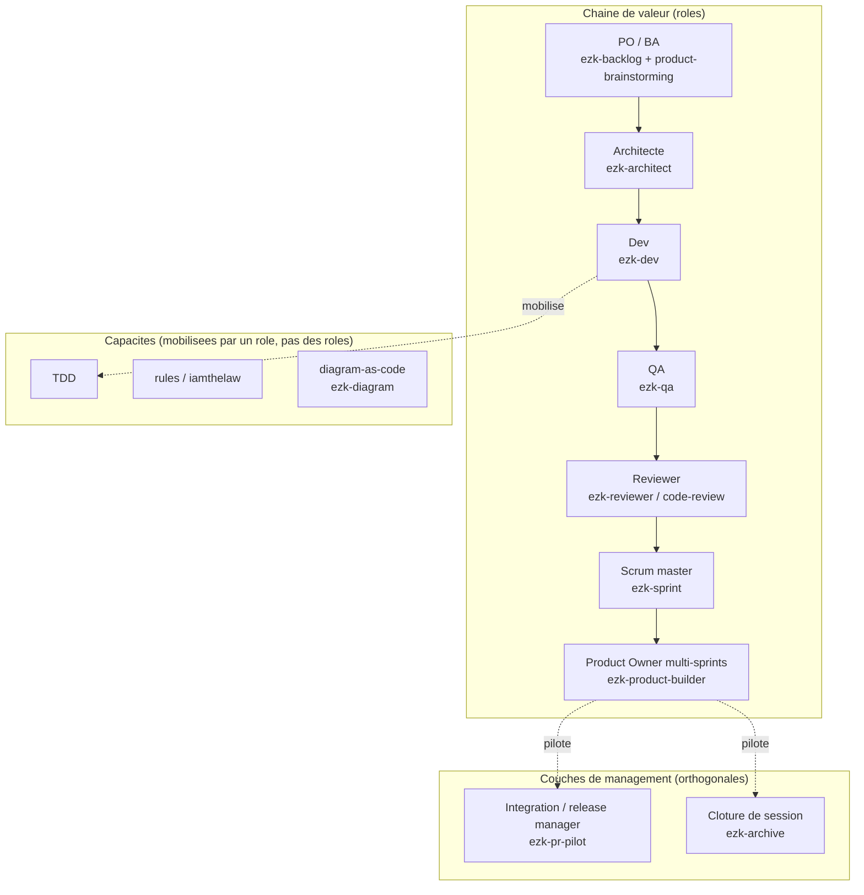

# Org-chart des rôles ezk-*

> Diagramme généré par **ezk-diagram**. Source de vérité : [`description.md`](description.md) (prose).
> Ce fichier est **généré** depuis `diagram.mmd` — ne pas l’éditer à la main (il serait écrasé au prochain rendu).

**Vues partageables** · [Éditer sur mermaid.live](https://mermaid.live/edit#pako:eNqFUsFu2zAM_RVCpw6Lm3swFHDjYAuQwKmT9WL1wNisLVSWPEpKsRX990F26rTAhh5Fvvf0yMcXUdmaxEI8avtctcgeDrfSALhwbBj7Fu6XpRTLFpUhqAlOqCkwXLHV5L5I8RDBALViqryyBjbFWNnlt2kpxS6HOdym3448v6E_T8kRqydtG_gKPds6VD45MirjvOVOmUaKB0iSG0iL5Y9SipSrVnmqPE0C-Faa_o7YgZSt7kspMjpN4JpOEyxb3Q-ou2jr7uLoF06Qu3RAFINOQSdFz8QTkM8FmENc2vk9kYuz_n5bSrGvOHTQofPvBFzPylx877cDfpdHwm7cBuTPhhi6oL06493EnzYWlK6Jz0Jk6g-Bbb9vDzEyG6qWXMysQ4MNdWQ8XFn2rW2swU_iWxfR1dp4ahiHzhyYNKF70-N3vpJeaXuZbLnJowNtfeDhahw5p6z5GOKJ_jPBMt1FOvZYKU8Orjp7VFo5Igc9MgQD8fxm0GOcz8Gnx3jIslKKQ5Zd0vq5We1LKThocjAHhZ1vSeMlzywdfdQKG8YuQZfE2C-3NdY_zjAc2TW8GYbr5CZ-Hlu7fBtbw6bGxrrY_rux3OTSiJnoiDtUtViIlwiUwrfUkRQLkKKmRwzaSyHNq5gJDN7uf5tKLDwHmonQ1-gpGz2Oxde_5ItHCg==) · [Image PNG (mermaid.ink)](https://mermaid.ink/img/pako:eNqFUsFu2zAM_RVCpw6Lm3swFHDjYAuQwKmT9WL1wNisLVSWPEpKsRX990F26rTAhh5Fvvf0yMcXUdmaxEI8avtctcgeDrfSALhwbBj7Fu6XpRTLFpUhqAlOqCkwXLHV5L5I8RDBALViqryyBjbFWNnlt2kpxS6HOdym3448v6E_T8kRqydtG_gKPds6VD45MirjvOVOmUaKB0iSG0iL5Y9SipSrVnmqPE0C-Faa_o7YgZSt7kspMjpN4JpOEyxb3Q-ou2jr7uLoF06Qu3RAFINOQSdFz8QTkM8FmENc2vk9kYuz_n5bSrGvOHTQofPvBFzPylx877cDfpdHwm7cBuTPhhi6oL06493EnzYWlK6Jz0Jk6g-Bbb9vDzEyG6qWXMysQ4MNdWQ8XFn2rW2swU_iWxfR1dp4ahiHzhyYNKF70-N3vpJeaXuZbLnJowNtfeDhahw5p6z5GOKJ_jPBMt1FOvZYKU8Orjp7VFo5Igc9MgQD8fxm0GOcz8Gnx3jIslKKQ5Zd0vq5We1LKThocjAHhZ1vSeMlzywdfdQKG8YuQZfE2C-3NdY_zjAc2TW8GYbr5CZ-Hlu7fBtbw6bGxrrY_rux3OTSiJnoiDtUtViIlwiUwrfUkRQLkKKmRwzaSyHNq5gJDN7uf5tKLDwHmonQ1-gpGz2Oxde_5ItHCg==)

Les liens mermaid.live/mermaid.ink encodent le diagramme dans l’URL (service externe) — pratique pour partager/éditer vite ; la vue sans service tiers reste ce README rendu par GitHub.
