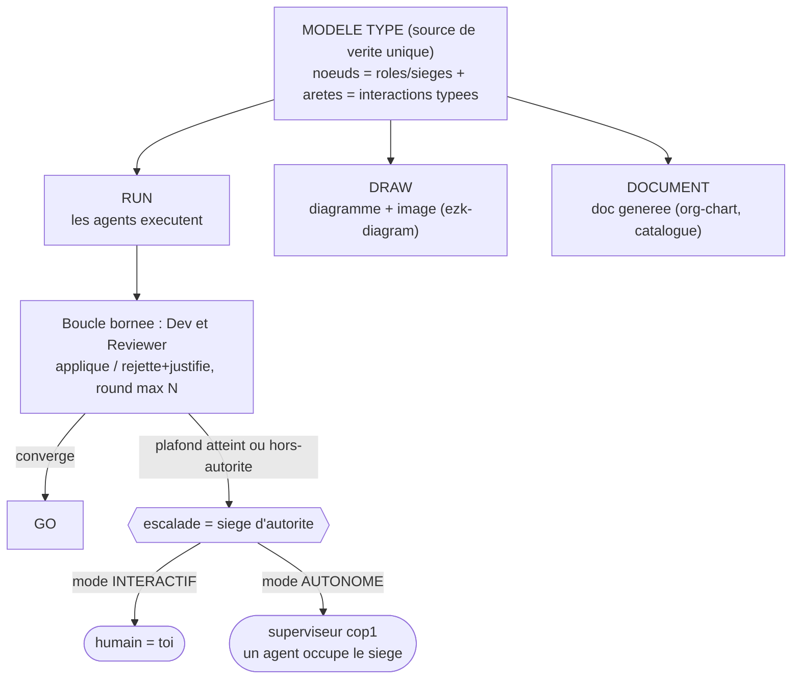

# Modèle typé → run/draw/document + siège d'autorité

> Diagramme généré par **ezk-diagram**. Source de vérité : [`description.md`](description.md) (prose).
> Ce fichier est **généré** (explication comprise) — ne pas l’éditer à la main (il serait écrasé au prochain `publish`).

## Ce que montre ce diagramme

Ce diagramme montre l'idée centrale de la fiche 0033 : **une seule description de
l'équipe** (le « modèle typé » : des rôles et leurs interactions) sert de source unique
à **trois usages** — la faire **tourner** (RUN : les agents exécutent les boucles et
leurs garde-fous), la **dessiner** (DRAW : le diagramme que vous regardez), et la
**documenter** (DOCUMENT : org-chart et catalogue de rôles générés).

Il illustre aussi ce qui se passe à l'exécution : le dev et le reviewer échangent en
**boucle bornée** (au maximum N allers-retours). Si ça converge, c'est GO ; sinon, le
désaccord **remonte au « siège d'autorité »** — une même chaise occupée par l'humain
quand on travaille en interactif, ou par le superviseur cop1 quand tout est autonome.
Les agents, eux, ne changent pas selon le mode : seul l'occupant de la chaise change.

**Vues partageables** · [Éditer sur mermaid.live](https://mermaid.live/edit#pako:eNplkV9v2kAQxL_Kal9KBCjqKyqREnDTSMGOAKuquDxczoO51L5z7w9JCnz3yHbaSuVppdXOb-5mDqxsAZ7wtrIvaiddoPWNMESLbJ7cbwR3M6H1j4eEBt5Gp0AFaA-nAyga_Svi4suTu7wyFrHwNCVnK_hLr1HC05CkQ0C71ybASRW0NZ7CWwN4wY9_zWg8vqJlnm4EL_O0Q1bwJEuY4AmvUDHAhDPJfHn9fSO4HZ2o0LJ0sq5BQ9K1LEED_P45_lhfnOuzWSvPZvkiSdc9wioqYeAAGlhXjrtkRqRkkJUtI_5QlnnaMe6z7GEj-MZGVYGerDMATWiOPSHQEnuNF7iOLZumakOjS3J4RggYPkcf9FZjRM5GU1AtXyn9cGjJrcVRWbOHK3Gk22wj-Db7_0BwU8mtNQXJEKBNIBtpZ50fyxhsW5fgIyWr2eEgGF7JShagKXVFUfHp39Xp1IKT1azj1rYA3aXrZHk9W999PdK3fDHYCN7FWmpDUwpWC368ONNc5-sszRbJkVb5Q6vwsYHba4_oSNnmc5dHNH3FZJWKDahC_6IeySOu4WqpC57wobUQHHaoIXhCggtsZayCYGFOPOL2C6s3o3gSXMSIY1PIgHnffL88vQOWK_hS) · [Image PNG (mermaid.ink)](https://mermaid.ink/img/pako:eNplkV9v2kAQxL_Kal9KBCjqKyqREnDTSMGOAKuquDxczoO51L5z7w9JCnz3yHbaSuVppdXOb-5mDqxsAZ7wtrIvaiddoPWNMESLbJ7cbwR3M6H1j4eEBt5Gp0AFaA-nAyga_Svi4suTu7wyFrHwNCVnK_hLr1HC05CkQ0C71ybASRW0NZ7CWwN4wY9_zWg8vqJlnm4EL_O0Q1bwJEuY4AmvUDHAhDPJfHn9fSO4HZ2o0LJ0sq5BQ9K1LEED_P45_lhfnOuzWSvPZvkiSdc9wioqYeAAGlhXjrtkRqRkkJUtI_5QlnnaMe6z7GEj-MZGVYGerDMATWiOPSHQEnuNF7iOLZumakOjS3J4RggYPkcf9FZjRM5GU1AtXyn9cGjJrcVRWbOHK3Gk22wj-Db7_0BwU8mtNQXJEKBNIBtpZ50fyxhsW5fgIyWr2eEgGF7JShagKXVFUfHp39Xp1IKT1azj1rYA3aXrZHk9W999PdK3fDHYCN7FWmpDUwpWC368ONNc5-sszRbJkVb5Q6vwsYHba4_oSNnmc5dHNH3FZJWKDahC_6IeySOu4WqpC57wobUQHHaoIXhCggtsZayCYGFOPOL2C6s3o3gSXMSIY1PIgHnffL88vQOWK_hS)

Les liens mermaid.live/mermaid.ink encodent le diagramme dans l’URL (service externe) — pratique pour partager/éditer vite ; la vue sans service tiers reste ce README rendu par GitHub.
