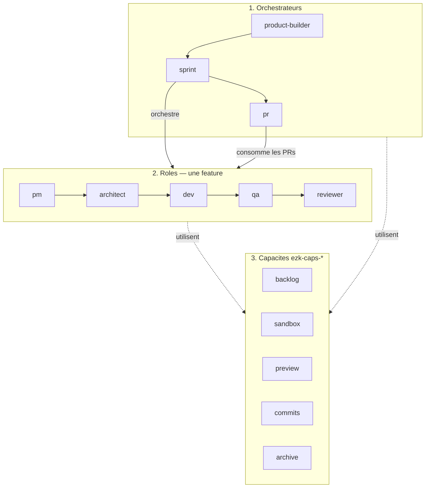

# Méthode ezk — vue globale (simple)

> Source : [`description.md`](description.md). Généré — ne pas éditer à la main.

## Ce que montre ce diagramme

Trois bandes, rien de plus :

1. **Orchestrateurs** — product-builder → sprint → pr.
2. **Rôles** — pm → architect → dev → qa → reviewer (une feature).
3. **Capacités** — backlog, sandbox, preview, commits, **archive**… (outils, pas des gens).

**Vues** · éditer sur [mermaid.live](https://mermaid.live) en collant `diagram.mmd`.
