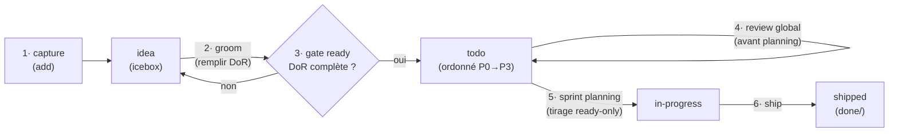

# ADR 0016 — Rituels scrum du cycle de vie backlog : DoR en gate, review global, priorisation, sprint planning

- Statut : **proposé** (re-tampon panel possible, cf. convention panels adverses)
- Date : 2026-07-17

## Contexte

Époque 2 : la méthode vit dans mega-city et le backlog natif `features/*.md` (ADR-029
vectorz). `ezk-backlog` couvre déjà la capture (`add` + anti-doublon + cran `idea`),
l'index régénéré et le ship. Mais quatre mailles du cycle de vie scrum passent entre
les trous — c'est la douleur exprimée par l'opérateur le 2026-07-17 :

1. **Rien ne re-contrôle le stock.** L'anti-doublon ne joue qu'à l'`add` ; aucune passe
   ne revérifie que les fiches existantes sont encore *vraies* (code livré entre-temps,
   ADR postérieur qui contredit, doublons apparus par accumulation).
2. **Le grooming DoR est conçu mais dormant.** La fiche 0056 (`groom <id>` /
   `ready <id>`) définit la Definition of Ready maison (problème / valeur / critères)
   et son gate — elle est restée `status: idea`, et demandait elle-même que la décision
   soit actée en ADR.
3. **La priorité est posée à l'add, jamais revérifiée globalement.** Les buckets P0→P3
   existent, mais rien ne garantit que l'ordre *relatif* de l'ensemble reste cohérent
   quand le backlog vieillit.
4. **Le tirage sprint ne vérifie pas la readiness.** `ezk-sprint` pioche la prochaine
   fiche via `list` ; rien n'empêche de tirer une fiche creuse.

Repères scrum (Scrum Guide 2020 ; guides Atlassian/Asana sur les cérémonies) : le
Product Backlog est une liste **ordonnée** et émergente ; le *refinement* est une
**activité continue** (ce n'est plus une cérémonie depuis le Guide 2020, ~10 % de la
capacité en pratique) ; le Sprint Planning répond à trois questions — pourquoi (but de
sprint), quoi (sélection), comment (plan). La DoR est une pratique complémentaire
(hors Guide) — la maison l'a déjà formulée (0056).

Forces maison : gate ADR-0013 (anti-surproduction de méta-outillage — historique de
trois systèmes scrum parallèles abandonnés) ; ADR-0001 (le LLM juge, le script range) ;
invariant n°1 d'ezk-backlog (backlog markdown commité sur `main`).

## Décision

1. **Pas de nouveau skill.** Les rituels deviennent des **sous-commandes et règles de
   cadence d'`ezk-backlog`**, là où vit la connaissance du format de fiche (test de
   séparabilité, gate ADR-0013). Le vocabulaire scrum officiel est mappé sur la
   mécanique maison — c'est ce mapping qui donne à l'auto-amélioration une direction
   « scrum » lisible machine :

   | Scrum (vocabulaire officiel) | Mécanique maison |
   |---|---|
   | Product Backlog (liste ordonnée) | `features/*.md` + index régénéré, tri P0→P3 |
   | Product Backlog Item / story | fiche (front-matter = source de vérité) |
   | Icebox / triage | `status: idea` |
   | Refinement (grooming) | `groom <id>` — remplit les 3 slots DoR (fiche 0056) |
   | Definition of Ready | gate `ready <id>` : problème / valeur / critères (0056) |
   | Sanity check du backlog | `review` — passe globale sur le stock (fiche 0065) |
   | Ordering / priorisation | buckets P0→P3 à l'`add` + cohérence globale via `review` |
   | Sprint Planning | intake `ezk-sprint` : but + capacité + tirage du haut *ready-only* |
   | Product Owner | l'opérateur ; `ezk-pm` en mode checkpoints auto |

2. **Grooming : continu, au plus tard au tirage.** La fiche 0056 est adoptée telle
   quelle (elle passe son propre gate DoR : les 3 slots sont remplis → promue
   `idea → todo`). On groome **quand on s'apprête à tirer** une fiche, pas à la
   capture (une `idea` qu'on ne tirera jamais ne mérite pas de grooming). Réponse à
   la question de cadence : le refinement est **au fil de l'eau** ; c'est la
   *vérification globale* (point 4) qui se cale avant le sprint planning.

3. **Sprint planning à trois questions, gate DoR bloquant.**
   - *Pourquoi* : un but de sprint en une ligne (journalisé dans le scratch de sprint).
   - *Quoi* : tirage **du haut du backlog ordonné**, uniquement des fiches passées au
     gate `ready`, dans la capacité (budget tokens / temps de la session).
   - *Comment* : `ezk-sprint` déroule (BDD → TDD → gates → PR) ; `ezk-product-builder`
     enchaîne les sprints.
   Interdiction de tirer une fiche non-ready : si la prochaine fiche P0/P1 ne passe
   pas le gate, on la groome d'abord — c'est le mécanisme qui empêche les sprints de
   démarrer sur du creux.

4. **`review` = le sanity check global** (fiche 0065), exécuté **avant chaque sprint
   planning** et **après tout pivot structurant** (ADR accepté qui invalide des
   fiches). Quatre contrôles : **validité** (la fiche est-elle encore vraie ?),
   **doublons/regroupements** par intention, **cohérence de l'ordre** P0→P3 sur
   l'ensemble, **staleness** (vieux `todo` jamais tirés → proposer rétrogradation en
   `idea` ou clôture). Sortie = rapport + propositions ; **l'arbitrage reste au PO**
   (jamais d'auto-suppression — même clause que la validation humaine d'ADR-0013).

5. **Rollout Pareto en deux phases** (le « curseur » demandé) :
   - **Phase 1 — tout de suite, ~zéro code** : adopter les rituels en playbook
     (points 1-4) + **mesure minimale** embarquée dans le rapport `review` : fiches
     par statut, % de `todo` ready, âge médian des `todo`, nb d'`idea` non groomées.
     La mesure est calculée par le LLM depuis les front-matters — aucun outillage.
   - **Phase 2 — sur preuve d'usage seulement** : rendu épics dans regen (ADR-0017,
     fiche 0066), scoring de priorité (valeur/effort, WSJF), vélocité par sprint.
   - Tout enrichissement au-delà (dashboard, cron, historisation) est **le signal de
     s'arrêter**, pas une roadmap (clause ADR-0013 §4). Pas d'ADR dédié « Pareto
     dynamique » : c'est une stratégie de rollout, pas une décision de structure —
     candidat article, pas candidat ADR.

Cycle de vie résultant (les deux gates + le rituel global) :

## Options considérées

### Option A — skill dédié `ezk-scrum` / `ezk-grooming`

Rejeté. Double la couverture d'`ezk-backlog` (gate ADR-0013, risque n°1 documenté :
surproduction de méta-outillage ; trois systèmes scrum parallèles déjà abandonnés dans
l'historique). La fiche 0056 avait déjà écarté cette voie.

### Option B — sous-commandes + règles de cadence dans `ezk-backlog` (retenue)

La connaissance du format de fiche vit déjà là ; coût marginal ~nul (playbook) ;
composable avec `product-brainstorming` (moteur du groom) et le panel de challenge
(0057) sans rien réimplémenter.

### Option C — outil externe (GitHub Projects, Jira)

Rejeté. Casse l'invariant n°1 (backlog markdown **commité sur `main`**, front-matter
source de vérité, visible de tous les worktrees) et sort la méthode de mega-city au
moment où l'époque 2 vient de l'y rapatrier (ADR-029 vectorz).

## Conséquences

**Plus facile** — le sprint planning ne tire plus de fiches creuses (gate DoR
bloquant) ; le stock ne pourrit plus silencieusement (`review` cadencé) ; la
convergence « vers scrum » devient testable : le mapping §1 est le référentiel que
l'auto-amélioration peut auditer.

**Plus dur / à surveiller** — la discipline de cadence (review avant planning) repose
sur les playbooks d'`ezk-sprint`/`ezk-product-builder`, à câbler quand les fiches sont
tirées ; risque de sur-groomer des `idea` qu'on ne tirera jamais (règle : groomer au
tirage) ; le rapport `review` est du jugement LLM → l'arbitrage PO n'est jamais
contournable.

## Action items

1. [x] Fiche 0056 promue `idea → todo` (elle passe son propre gate DoR) — cet ADR.
2. [ ] Fiche 0065 (`review` — sanity check global + mesure minimale) : implémenter.
3. [ ] Fiche 0056 (`groom`/`ready`) : implémenter dans le playbook ezk-backlog.
4. [ ] À l'implémentation : câbler la cadence dans ezk-sprint (intake = review + gate
   ready) et ezk-product-builder (inter-sprint).
5. [ ] Épics : ADR-0017 + fiche 0066 (phase 2).
