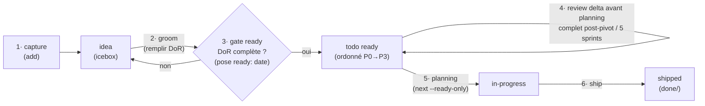

# ADR 0016 — Rituels scrum du cycle de vie backlog : DoR en gate, review global, priorisation, sprint planning

- Statut : **accepté** — panel adverse du 2026-07-17 (relecteurs architecture / dev / scrum + juge) : GO unanime, 13 amendements A1-A13 intégrés dans ce texte et ADR-0017 (cf. § Panel adverse)
- Date : 2026-07-17
- **Révision 2026-08-13 ([ADR-0028](0028-product-builder-auto-groom-ready.md)) :** l'invariant
  **A5** (« le gate ready n'est jamais auto-tamponné », STOP humain systématique) est **révisé,
  pas abrogé**. En `--checkpoints auto`, `ezk-product-builder` **groome désormais vers la DoR de
  façon autonome** au lieu de s'arrêter à vide ; l'option **`--check-ready`** règle le tampon
  final (`true` défaut = STOP humain, A5 préservé ; `false` = auto-tampon sur concurrence
  `ezk-pm`, plancher outcome-testable, blocage réel → skip). Voir ADR-0028.

## Contexte

Époque 2 : la méthode vit dans mega-city et le backlog natif `features/*.md` (ADR-029
vectorz). `ezk-backlog` couvre déjà la capture (`add` + anti-doublon + cran `idea`),
l'index régénéré et le ship. Mais quatre mailles du cycle de vie scrum passent entre
les trous — c'est la douleur exprimée par l'opérateur le 2026-07-17 :

1. **Rien ne re-contrôle le stock.** L'anti-doublon ne joue qu'à l'`add` ; aucune passe
   ne revérifie que les fiches existantes sont encore *vraies* (code livré entre-temps,
   ADR postérieur qui contredit, doublons apparus par accumulation).
2. **Le grooming DoR est conçu mais dormant.** La fiche 0056 (`groom <id>` /
   `ready <id>`) définit la Definition of Ready maison (problème / valeur / critères)
   et son gate — elle est restée `status: idea`, et demandait elle-même que la décision
   soit actée en ADR.
3. **La priorité est posée à l'add, jamais revérifiée globalement.** Les buckets P0→P3
   existent, mais rien ne garantit que l'ordre *relatif* de l'ensemble reste cohérent
   quand le backlog vieillit.
4. **Le tirage sprint ne vérifie pas la readiness.** `ezk-sprint` pioche la prochaine
   fiche via `list` ; rien n'empêche de tirer une fiche creuse.

Repères scrum (Scrum Guide 2020 ; guides Atlassian/Asana sur les cérémonies) : le
Product Backlog est une liste **ordonnée** et émergente ; le *refinement* est une
**activité continue** (il n'a jamais été un évènement officiel du Guide ; la version
2020 a retiré la guidance « ~10 % de la capacité ») ; le Sprint Planning répond à
trois questions — pourquoi (but de sprint), quoi (sélection), comment (plan). La DoR
est une pratique complémentaire (hors Guide) — la maison l'a déjà formulée (0056).

Forces maison : gate ADR-0013 (anti-surproduction de méta-outillage — historique de
trois systèmes scrum parallèles abandonnés) ; ADR-0001 (le LLM juge, le script range) ;
invariant n°1 d'ezk-backlog (backlog markdown commité sur `main`).

## Décision

1. **Pas de nouveau skill.** Les rituels deviennent des **sous-commandes et règles de
   cadence d'`ezk-backlog`**, là où vit la connaissance du format de fiche (test de
   séparabilité, gate ADR-0013). Le vocabulaire scrum est mappé sur la mécanique
   maison — c'est ce mapping qui donne à l'auto-amélioration une direction « scrum »
   lisible machine (**G** = Guide 2020, **P** = pratique complémentaire hors Guide) :

   | Scrum | Mécanique maison |
   |---|---|
   | Product Backlog, liste ordonnée (G) | `features/*.md` + index régénéré, tri P0→P3 |
   | Product Backlog Item / story (G) | fiche (front-matter = source de vérité) |
   | Icebox / triage (P) | `status: idea` |
   | Refinement — activité continue (G) | `groom <id>` — remplit les 3 slots DoR (fiche 0056) |
   | Definition of Ready (P) | gate `ready <id>` : problème / valeur / critères → pose `ready: <date>` |
   | Sanity check du backlog (P) | `review` — passe globale full/delta (fiche 0071) |
   | Ordering / priorisation (G) | buckets P0→P3 à l'`add` + cohérence globale via `review` |
   | Sprint Planning — pourquoi/quoi/comment (G) | intake `ezk-sprint` via `next --ready-only` |
   | Sprint Review (G) | validation de PR par l'opérateur : E2E + checkpoint (ezk-sprint 6/9), convention Validation (ezk-pr-pilot) |
   | Rétrospective (G) | cérémonie **ezk-retro** (fiche 0063) à la demande · checkpoint inter-sprint + handoff ezk-archive · *adapt* : flywheel capture (ADR-0001) |
   | Product Owner (G) | l'opérateur ; `ezk-pm` en mode checkpoints auto |

   **Dette nommée (A11)** : l'ordre *intra-bucket* est l'ordre des id (création), pas
   un jugement de valeur — le Guide exige une liste totalement ordonnée. Le levier
   maison est le re-bucketage via `review` ; pas de levier d'ordonnancement fin tant
   qu'un sprint n'a pas tiré la mauvaise fiche à cause de cette approximation
   (clause ADR-0013 §4).

   **Couverture Review/Rétro — contrôle « existant vs prévu » (2026-07-17, révisé
   après merge de main)** : les deux lignes s'appuient sur du **livré**. Sprint
   Review : validation E2E + checkpoint d'ezk-sprint (étapes 6/9), convention
   Validation d'ezk-pr-pilot (0027). Rétrospective : la cérémonie **ezk-retro**
   (fiche 0063, livrée le 2026-07-16 en session parallèle — round-robin des agents,
   propositions mesurables rattachées à un symptôme, items de DoD/DoR évolutifs), le
   checkpoint inter-sprint (0023/0040), le handoff ezk-archive (0026), et le
   **flywheel capture** (ADR-0001, 0002) comme canal *adapt* (les leçons deviennent
   des skills/rules). Fiches **prévues** rattachées (relation notée dans chacune) :
   mega-city 0007 (invariants → rules), 0014 (corpus judge), 0100 (santé backlog, ex-0064 —
   reste l'émission `backlog.health` + seuils, cf. sa note de réconciliation), 0065
   (composition de lot) ; côté vectorz, 0041 (banc cobaye = outillage du gate démo).

2. **Grooming : continu, au plus tard au tirage — et la readiness est persistée
   (A1).** La fiche 0056 est adoptée (elle passe son propre gate DoR : promue
   `idea → todo`) : `groom <id>` remplit les 3 slots DoR ; `ready <id>` vérifie la
   DoR comme gate et, au vert, **pose `ready: <date>` dans le front-matter** (et
   flippe `idea → todo` le cas échéant). Le front-matter reste la source de vérité :
   un `todo` né via `add` n'est **pas présumé ready** (pas de champ → groom + gate au
   moment de le tirer) ; les `todo` existants n'ont **aucun grandfathering** ;
   `review` peut **révoquer** un `ready:` devenu faux. On groome quand on s'apprête à
   tirer, pas à la capture. Cadence : refinement au fil de l'eau ; la vérification
   globale (point 4) se cale sur les plannings.

3. **Sprint planning à trois questions, gate DoR bloquant avec soupape PO.**
   - *Pourquoi* : un but de sprint en une ligne (journalisé dans le scratch de sprint).
   - *Quoi* : tirage **du haut du backlog ordonné** via le **point d'entrée unique**
     `ezk-backlog next --ready-only` (A6) — première fiche éligible (ready,
     non-épic) ; ezk-sprint et ezk-product-builder l'**appellent** sans réimplémenter
     la logique du gate. Capacité = budget tokens / temps de la session.
   - *Comment* : `ezk-sprint` déroule (BDD → TDD → gates → PR).
   - **Une fiche `type: epic` n'est jamais tirable** (A2) : le tirage descend sur son
     prochain enfant ready, sinon passe à la fiche suivante (cf. ADR-0017).
   - Fiche de tête non-ready → on la groome d'abord. **Soupape PO** (A1) : tirer une
     fiche non-ready reste possible sur décision explicite **journalisée** — le gate
     est un arbitrage, pas un automatisme. En run autonome, zéro fiche ready +
     arbitrage produit requis = **checkpoint bloquant « aucune fiche ready »**
     d'ezk-product-builder, DoR pré-remplies à valider (A5).

4. **`review` = le sanity check global (fiche 0071), à cadence bornée (A4)** :
   **complet** après tout pivot structurant (ADR accepté qui invalide des fiches) et
   **tous les 5 sprints** (défaut, réglable dans le playbook) ; **delta** avant les
   sprint plannings intermédiaires (fiches modifiées depuis le dernier complet + top
   P0/P1). Contrôles de jugement : **validité** (la fiche est-elle encore vraie ?),
   **doublons/regroupements** par intention, **cohérence de l'ordre** P0→P3 sur
   l'ensemble, **staleness** (vieux `todo` jamais tirés → proposer rétrogradation en
   `idea` ou clôture), **cohérence épic/enfants** (A8, cf. ADR-0017) et **révocation**
   des `ready:` devenus faux. Sortie = rapport + propositions ; **l'arbitrage reste au
   PO** (jamais d'auto-suppression — même clause que la validation humaine
   d'ADR-0013).

5. **Rollout Pareto en deux phases** (le « curseur » demandé) :
   - **Phase 1 — tout de suite** : adopter les rituels en playbook (points 1-4) +
     **mesure minimale produite par le script** (A3 — doctrine ADR-0001 : le script
     range, le LLM juge ; un LLM qui compte est non fiable) : `regen` agrège depuis
     les front-matters fiches par statut, `todo` ready (champ `ready:`), nb d'`idea`,
     ancienneté médiane des `todo`. Le LLM garde exclusivement les contrôles de
     jugement du point 4.
   - **Phase 2 — sur preuve d'usage seulement** : rendu épics dans regen (ADR-0017,
     fiche 0072), scoring de priorité (valeur/effort, WSJF), vélocité par sprint.
   - Tout enrichissement au-delà (dashboard, cron, historisation) est **le signal de
     s'arrêter**, pas une roadmap (clause ADR-0013 §4). Pas d'ADR dédié « Pareto
     dynamique » : c'est une stratégie de rollout, pas une décision de structure —
     candidat article (fiche 0074), pas candidat ADR.

Cycle de vie résultant (les deux gates + le rituel global) :

## Options considérées

### Option A — skill dédié `ezk-scrum` / `ezk-grooming`

Rejeté. Double la couverture d'`ezk-backlog` (gate ADR-0013, risque n°1 documenté :
surproduction de méta-outillage ; trois systèmes scrum parallèles déjà abandonnés dans
l'historique). La fiche 0056 avait déjà écarté cette voie.

### Option B — sous-commandes + règles de cadence dans `ezk-backlog` (retenue)

La connaissance du format de fiche vit déjà là ; coût marginal ~nul (playbook) ;
composable avec `product-brainstorming` (moteur du groom) et le panel de challenge
(0057) sans rien réimplémenter.

### Option C — outil externe (GitHub Projects, Jira)

Rejeté. Casse l'invariant n°1 (backlog markdown **commité sur `main`**, front-matter
source de vérité, visible de tous les worktrees) et sort la méthode de mega-city au
moment où l'époque 2 vient de l'y rapatrier (ADR-029 vectorz).

## Conséquences

**Plus facile** — le sprint planning ne tire plus de fiches creuses (gate DoR
bloquant, readiness **auditable en front-matter**) ; le stock ne pourrit plus
silencieusement (`review` cadencé full/delta) ; la convergence « vers scrum » devient
testable : le mapping §1 est le référentiel que l'auto-amélioration peut auditer,
boucle inspect-adapt comprise (Sprint Review, Rétrospective).

**Plus dur / à surveiller** — la discipline de cadence repose sur les playbooks
d'`ezk-sprint`/`ezk-product-builder` (câblés via le seul point d'entrée
`next --ready-only`, pas de logique dupliquée) ; le gate bloquant peut mettre un run
autonome en impasse → sortie propre par le checkpoint « aucune fiche ready » (A5) ;
risque de sur-groomer des `idea` qu'on ne tirera jamais (règle : groomer au tirage) ;
le rapport `review` est du jugement LLM → l'arbitrage PO n'est jamais contournable.

## Panel adverse (2026-07-17)

Trois relecteurs adversariaux (architecture, dev implémenteur, praticien scrum) +
juge — verdict **unanime : accepté avec amendements**, aucun arbitrage produit à
remonter au PO. Intégrés ici : **A1** readiness persistée (`ready:`) + soupape PO ·
**A2** épics jamais tirables · **A3** compteurs au script (ADR-0001) · **A4** review
complet post-pivot/5 sprints, delta avant planning · **A5** checkpoint « aucune fiche
ready » · **A6** point d'entrée unique `next --ready-only` · **A9** mapping complété
(Sprint Review, Rétrospective) · **A10** contresens Guide corrigés · **A11** dette
d'ordre intra-bucket nommée. (**A7, A8, A12, A13** → ADR-0017.)

## Action items

1. [x] Fiche 0056 promue `idea → todo` (elle passe son propre gate DoR) — cet ADR.
2. [x] Fiche 0056 (`groom`/`ready`, pose de `ready:`) + `next --ready-only` :
   implémenté dans le playbook ezk-backlog (PR #26).
3. [x] Fiche 0071 (`review` full/delta + compteurs côté script) : implémenté (PR #26).
4. [x] Cadence câblée : intake ezk-sprint = `next --ready-only` + delta-review ;
   ezk-product-builder = checkpoint « aucune fiche ready » + review complet
   tous les 5 sprints (PR #26).
5. [ ] Épics : ADR-0017 + fiche 0072 (phase 2).
