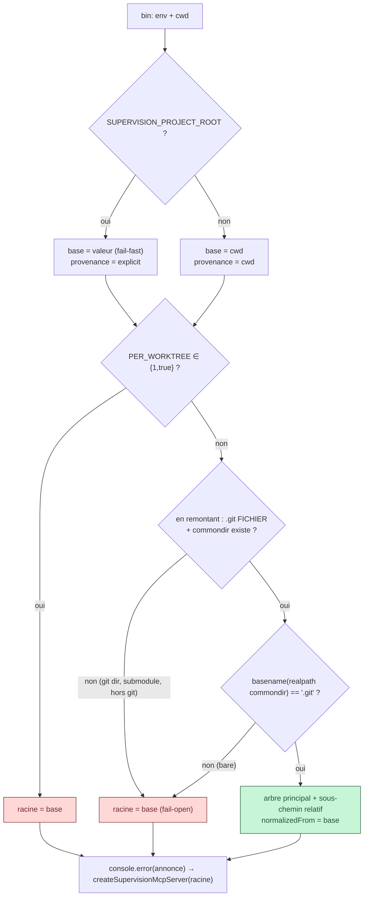

# ADR 0019 — La racine de supervision se normalise vers l'arbre principal — et l'annonce

- Statut : **Proposé** — 2026-07-24 (fiche 0086, sprint mega-city)
- Portée : kit émetteur — `bin/supervision-mcp.ts`, `src/supervision/mcp-server.ts`,
  nouveau `src/supervision/project-root.ts` ; `runtime.ts` inchangé
- Liens : fiche [0086](../../features/done/0086-feat-normalisation-arbre-principal.md),
  spike [0083](../../features/done/0083-spike-mesure-racine-projet-worktree.md),
  fiches 0084/0085 (quiescence)

## Contexte

Le kit résout sa racine ainsi : `SUPERVISION_PROJECT_ROOT` si fournie (fail-fast),
sinon `process.cwd()` — **aucune notion de git nulle part**. Le spike 0083 a mesuré que
`CLAUDE_PROJECT_DIR == cwd == dossier de lancement` dans tous les cas, worktrees compris :
**la normalisation ne viendra jamais de l'environnement, elle doit être faite côté kit.**

Conséquence en worktree (topologie du PO, `.claude/worktrees/`, gitignoré) : le journal
naît dans le worktree et **disparaît** avec un `worktree remove --force` — effacement
silencieux. La règle « le journal vit dans l'arbre principal » n'existait qu'en prose.

Contrainte : `git` peut être **absent** de l'environnement spawné par Claude Desktop —
interdit de dépendre du binaire (`git rev-parse --git-common-dir`).

## Décision

1. **Nouveau module `project-root.ts` (SRP).** Il porte la résolution env (fail-fast),
   la normalisation git, la provenance et le **formatage pur** de l'annonce. La logique de
   `resolveProjectRootFromEnv` y est **déplacée** ; `mcp-server.ts` la **re-exporte** —
   aucun importeur ne casse. `bin` appelle le nouvel orchestrateur `resolveSupervisionRoot`.

2. **Normalisation calculée au composition root, injectée.** `bin` calcule la racine
   effective **avant** de construire `SupervisionRuntime`, qui la reçoit déjà normalisée.
   `runtime.ts` et `mcp-server.ts` restent **git-agnostiques** — la dépendance à git est
   confinée à `project-root.ts` (infra) et dirigée vers le domaine, jamais l'inverse.

3. **Détection worktree en pur file-system, zéro spawn.** En remontant depuis la racine
   fournie : `.git` est un **fichier** (`gitdir: 
`) **et** `
/commondir` existe ⇒
   worktree lié ; arbre principal = `dirname(realpath(commondir résolu))` quand son
   basename est `.git`. Déterministe, testable en tmp, indépendant du binaire git.

4. **Deux axes orthogonaux dans `ResolvedRoot`** : `provenance ∈ {explicit, cwd}`
   (extensible `launcher`, hors scope) **et** `normalizedFromWorktree?: string`. Le futur
   cran lanceur s'ajoute sans toucher l'axe normalisation.

5. **Trois replis fail-open, jamais de crash** : `.git` dossier / hors git / submodule
   (pas de `commondir`) / dépôt bare (basename ≠ `.git`) ⇒ racine fournie **inchangée**.

6. **Échappatoire** `SUPERVISION_PER_WORKTREE ∈ {1,true}` : court-circuite la
   normalisation avant toute détection (journal par worktree, choix délibéré).

7. **Sous-chemin** : racine = sous-dossier d'un worktree ⇒ racine effective =
   `<arbre principal>/<même sous-chemin relatif>` (retombe de la remontée FS, 1 test).

8. **Annonce sur STDERR** (stdout = protocole MCP), fonction **pure** testable, émise
   dans `bin` : « journal → <racine> (racine <provenance>, normalisée depuis <worktree>
   | telle quelle) ». C'est une **condition** de la normalisation, pas un bonus.

9. **Garde de scope** : aucune lecture de `CLAUDE_PROJECT_DIR` (fiche « portée projet »).

## Schéma — pipeline de résolution + normalisation

**Légende** : une seule sortie **verte** normalise la racine vers l'arbre principal ; toutes
les sorties **rouges** conservent la racine fournie telle quelle (repli propre et silencieux).

## Options écartées

- **`git rev-parse --git-common-dir`** — vérité officielle, mais impose un spawn du binaire
  git, possiblement absent dans l'env Claude Desktop. Rejeté.
- **Normaliser dans `runtime.ts`** — mettrait git dans le domaine et inverserait le sens
  des dépendances. Rejeté : la détection est de l'infra, injectée en valeur.
- **S'appuyer sur `CLAUDE_PROJECT_DIR`** — mesuré == cwd (spike 0083), aucune protection
  worktree. Hors scope de cette fiche.

## Conséquences

**Plus facile** — la règle « journal dans l'arbre principal » devient un invariant tenu par
la machine ; les N worktrees d'une tâche convergent en **un seul flux** ; l'écriture dans le
mauvais projet devient **détectable** (annonce). `runtime.ts` reste inchangé et pur.

**Plus dur / à surveiller** —
- **Interaction upgrade_ok** : `computeUpgradeOk(projectRoot, veto)` reçoit désormais la
  racine **normalisée** ; les fiches 0084/0085 (quiescence) doivent lire l'état depuis
  l'arbre principal, pas le worktree.
- **Concurrence d'écriture** : N sessions parallèles écrivant dans le même
  `.supervision/runs/` de l'arbre principal — à vérifier (déjà noté fiche 0086).
- **Limite du fondement** : une seule version de Claude Code mesurée pour le spike
  (2.1.218) ; à re-vérifier si le comportement de `CLAUDE_PROJECT_DIR`/cwd change.
- Réversible : retirer `project-root.ts` + restaurer l'appel direct dans `bin` suffit.
