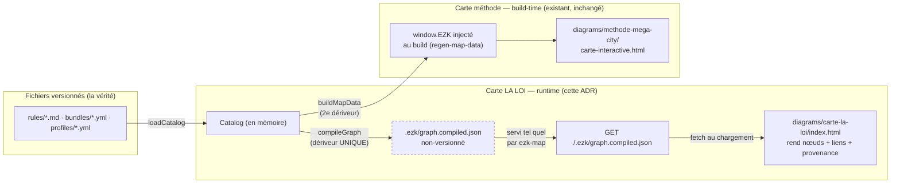

# ADR-0041 — La carte « LA LOI » : une carte dédiée qui LIT le graphe compilé au runtime

- Statut : accepté
- Date : 2026-08-26
- Fiche : `20260821172716537_carte-ne-montre-pas-la-loi.md` (épic `20260821163346487`)
- Contexte amont : ADR-0040 (`graph:compile`), ADR-0039 (trois étages / carte fidèle), D5 d'ADR-0040 (« la carte LIT l'objet compilé, elle ne recompile pas au bord »)

## En clair

On ouvre le bloc « LA LOI » de la carte (règles, bundles, profils + qui active quoi)
dans une **carte à part**, `diagrams/carte-la-loi/`, qui **va chercher le graphe déjà compilé**
au moment où la page se charge — au lieu de le recopier dans le HTML à la construction.
Pourquoi : le serveur `ezk:map` sert déjà n'importe quel fichier du dépôt, donc la page
peut lire `/.ezk/graph.compiled.json` **sans une ligne de code serveur en plus**, et le
test de sabotage (ajouter un bundle → recompiler → il apparaît, sans toucher la carte)
passe tout seul. Effet : la zone LOI devient la première zone **100 % lue des fichiers**,
et la carte de la méthode existante n'est pas touchée (aucun risque de la casser).

## Contexte

La carte affiche LA LOI comme un bloc opaque. Tout son intérieur est pourtant déjà
modélisé : `graph:compile` (ADR-0040) émet `.ezk/graph.compiled.json`, un objet typé
`{ nodes:[{kind,id}], edges:[{from,fromKind,link,to,toKind}] }` — 107 nœuds, 187 arêtes,
dont `rule`×59, `bundle`×12, `profile`×6 et les liens `bundle→rule`, `profile→bundle`,
`profile→agent/skill`, `rule→agent`, `profile→profile`. L'artefact est **non-versionné**
(gitignoré), régénéré à la demande.

Trois faits de terrain cadrent la décision :

1. **`ezk-map.ts` sert déjà tout le dépôt** sous un garde-fou de traversée, avec
   `Cache-Control: no-store`. Un `fetch('/.ezk/graph.compiled.json')` depuis une page de
   `diagrams/` fonctionne sans nouvelle route.
2. **La carte existante `methode-mega-city` est alimentée autrement** : `map-data.ts`
   dérive un `window.EZK` depuis le **catalogue** (`loadCatalog`) et l'**injecte à la
   construction** via `regen-map-data.ts` (marqueurs `MAP_DATA_BEGIN/END`). C'est un
   deuxième dériveur des mêmes relations, mais figé dans le HTML au build.
3. **Ni le graphe compilé ni les entités du domaine ne portent le chemin fichier.** Le
   loader indexe par `id` de frontmatter, **pas par nom de fichier**, et tolère
   (historiquement) plusieurs entités par fichier.

## Décision

### D1 — Intégration : une carte dédiée `diagrams/carte-la-loi/` (pas d'extension de `methode-mega-city`)

Nouveau dossier `diagrams/carte-la-loi/` (une page `index.html` + un `meta.yaml` pour le titre
du menu). Le menu de `ezk:map` la liste automatiquement (il énumère les dossiers de
`diagrams/`). On **ne touche pas** `methode-mega-city` : elle reste sur son injection
build-time, la LOI vit sur son mécanisme runtime. Mélanger les deux dans une même page
serait fragile et risquerait de casser la carte featured (contrainte : ne pas la casser).

### D2 — Source : `fetch('/.ezk/graph.compiled.json')` au chargement (D5 honoré)

La page lit l'**objet compilé** servi tel quel par `ezk-map`. Elle **ne recompile pas**,
ne re-parse aucun `.yml`, ne réutilise pas `map-data.ts`. `compileGraph` reste le
**dériveur unique** ; la carte n'en est que le **consommateur**. Artefact absent (pas de
`graph:compile` lancé) ⇒ la page affiche « lance `pnpm --dir products/mega-city
graph:compile` » plutôt qu'un écran vide.

`map-data.ts` (build-time, catalogue) et la carte LOI (runtime, graphe compilé)
**coexistent** pour ce POC. Faire converger `map-data` sur le graphe compilé — pour
supprimer le dériveur redondant — est un chantier distinct (voir Conséquences), **hors
lot**.

### D3 — Provenance : dérivation par convention dans le lecteur, gardée par un test

Chaque nœud rend son chemin par convention, dans le code de la carte LOI :

| kind      | id (exemple)               | chemin dérivé                                   |
|-----------|----------------------------|-------------------------------------------------|
| `rule`    | `hexagonal/adapter-location` | `products/mega-city/rules/hexagonal/adapter-location.md` |
| `bundle`  | `architecture`             | `products/mega-city/bundles/architecture.yml`   |
| `profile` | `base`                     | `products/mega-city/profiles/base.yml`          |

La convention est **exacte sur le corpus actuel** (59 règles 1:1, bundles/profils
`<id>.<ext>`), mais **fragile par contrat** : le loader découple `id` et nom de fichier.
On la **garde par un test** qui vérifie que chaque chemin dérivé existe sur disque — un
rename ou un fichier multi-entités fait alors **rougir la CI**, pas mentir la carte en
silence.

## Alternatives écartées

- **Étendre `methode-mega-city`** — deux mécanismes de données dans une page, risque de
  casse de la carte featured, et le sabotage (recompile sans regen) ne marcherait pas
  puisqu'elle est injectée au build. Écartée pour l'isolation POC.
- **Injecter la LOI au build (comme `map-data`)** — trahit D5 (la carte devrait être
  re-régénérée après chaque `graph:compile`) et casse le test de sabotage tel qu'écrit
  (`graph:compile` puis `ezk:map`, sans regen). Écartée.
- **Ajouter une route serveur `/api/law`** — utile un jour pour un contrat propre, mais
  YAGNI : le serveur sert déjà l'artefact. Écartée pour le POC.
- **Provenance stampée dans le graphe compilé** (le loader porte le vrai chemin) — c'est
  la **bonne cible long terme** (provenance prouvée, pas devinée), mais elle touche le
  contrat du domaine + le schéma de l'artefact ADR-0040. Reportée (voir Conséquences).

## Schéma — deux mécanismes, une seule source de dérivation

*Légende — le chemin **plein** (LA LOI, cette ADR) lit l'artefact compilé au chargement de
la page : recompiler suffit à rafraîchir la carte. Le chemin de droite (carte méthode,
existant) fige les données dans le HTML au build. `.ezk/graph.compiled.json` (en
pointillé) est non-versionné. Les deux partent du même `Catalog` mais via deux dériveurs —
d'où la redondance à résorber plus tard.*

## Conséquences

**Positives**
- POC quasi tout front : **aucune modification** de `ezk-map.ts` ni de `compiled-graph.ts`.
- D5 respecté par construction ; test de sabotage vert sans regen ni édition de carte.
- La carte featured n'est pas touchée — zéro risque de régression.
- La zone LOI devient l'**étalon de fidélité** : 100 % lue d'un graphe déterministe.

**Négatives / dette assumée**
- **Deux dériveurs coexistent** (`compileGraph` et `buildMapData`). À résorber : faire lire
  la carte méthode depuis le graphe compilé, puis retirer `map-data`. → fiche de suivi.
- **Provenance par convention, fragile par contrat.** Cible propre : le loader stampe le
  `sourcePath` réel sur chaque entité, `compileGraph` le porte sur le nœud. C'est une
  **enrichissement du schéma de l'artefact ADR-0040** → amendement ADR-0040 + fiche
  dédiée, pas ce lot.
- Couplage de la page au chemin on-disk `/.ezk/graph.compiled.json` (accepté ; une route
  `/api/law` le découplerait le jour où on en a besoin).

## Fichiers touchés (réalisé)

- **`src/core/loi-view.ts`** — logique PURE et testée : `extractLoi`, `provenancePath`
  (D3), `whoActivates` (héritage `profile-extends` + `bundle-extends`), `bundleRules`,
  `enforcingAgents` (arêtes `enforces`, rule→agent).
- **`src/core/__tests__/loi-view.test.ts`** — AC2 (comptage), AC3/D3 (provenance de chaque
  nœud réel existe sur disque), filtrage d'arêtes, **héritage** (`mobile` inclut `base`),
  `enforces`.
- **`diagrams/carte-la-loi/index.html`** — fetch `/.ezk/graph.compiled.json`, 3 colonnes +
  recherche ; clic profil → « qui active quoi » (héritage compris), clic règle → agents
  `enforces`. Reflète `loi-view.ts` en JS vanilla (dette assumée, voir Conséquences).
- **`diagrams/carte-la-loi/meta.yaml`** — `title:` pour le menu.
- **Non touchés** : `bin/ezk-map.ts`, `src/core/compiled-graph.ts`, `map-data.ts`,
  `carte-interactive.html`.

## Pièges pour le dev

- **Lancer `graph:compile` d'abord** : sans lui, `.ezk/graph.compiled.json` n'existe pas
  (404) — c'est le comportement voulu, la page doit le dire.
- **Vocabulaire des liens exact** : `bundle-rule`, `profile-bundle`, `profile-agent`,
  `profile-skill`, `profile-extends`, `enforces` (rule→agent). Ne pas inventer de clés.
- **Ne pas re-parser les `.yml`** : la seule source est l'objet fetché (D5).
- **`enforces` porte les liens rule→agent** (11) ; `interactions` (agent→rule côté
  frontmatter) est déjà résolu dans le graphe compilé — lire les arêtes, pas les fichiers.
- **La convention casse si un id ≠ nom de fichier** : c'est justement ce que le test
  attrape. Ne pas « corriger » en devinant — remonter à l'enrichissement de schéma.

## Suivi de mise en œuvre (revue adverse 2026-08-26)

Le POC initial **ignorait l'héritage** : `whoActivates` ne suivait pas `profile-extends` /
`bundle-extends`, donnant une réponse **fausse** pour les 5 profils qui étendent `base`
(ex. `mobile` affiché sans le bundle `base` ni ses règles ni le skill `ezk-archive`).
Corrigé : fermeture transitive dans `whoActivates`, **testée** (`mobile` doit inclure
`base`). Ajouté au passage : le rendu des arêtes `enforces` (clic sur une règle → agents
qui la gardent, AC3) ; l'échappement des ids en `textContent` (plus d'`innerHTML`) ; des
synonymes FR pour que la recherche « règles » / « composition » aboutisse (AC1).
**Limite connue** : un graphe présent mais **périmé** n'est pas détectable côté navigateur
(pas d'accès aux mtimes source) ; la fraîcheur reste garantie par le check `graph:compile`
au `ship`/CI.
