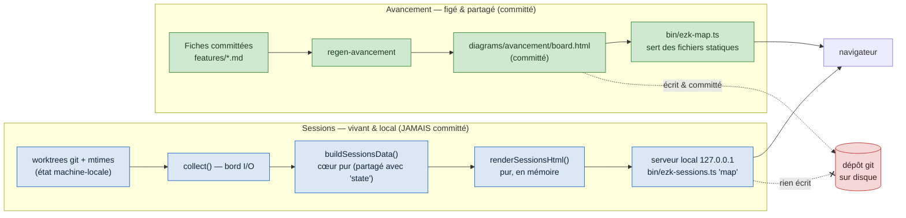

# ADR-0043 — Vue navigateur des sessions : servie en direct, jamais committée

- Statut : **Proposé** (2026-08-29) — ratification possible via panel adverse
- Date : 2026-08-29
- Fiche : `20260829214131713_ezk-sessions-vue-navigateur-live.md` (suite de `20260825141012293`, PR #188)
- Contexte amont : ADR-0042 (cockpit de sessions = surface « Observe »), ADR-0001 (« le script range, il ne juge pas »), `bin/ezk-map.ts` (serveur de diagrammes statiques)

## En clair

On veut voir l'état des sessions dans le navigateur, pas seulement en texte. Décision :
une **sous-commande** `pnpm ezk:sessions map` calcule l'état **en direct** à l'ouverture,
rend une page HTML **en mémoire**, et la sert sur un mini-serveur **local**. Rien n'est
écrit sur disque, donc **rien n'est committé** — c'est le cœur du besoin.

On **n'ajoute pas** de route à `bin/ezk-map.ts`. Cette carte-là sert des **fichiers
figés et partagés** (les diagrammes committés) ; l'état des sessions est **vivant et propre
à la machine**. Mélanger les deux casserait le seul métier de `ezk-map`.

## Contexte

`ezk-sessions state` rend déjà l'état en texte. Le collecteur pur `buildSessionsData`
(`src/core/sessions-data.ts`) et la collecte I/O `collect()` (`bin/ezk-sessions.ts`) existent.
La fiche demande la **même donnée** dans une page web, avec **une seule source de vérité**.

La fiche parente suggérait « un onglet `ezk:map sessions`, sur le modèle de l'avancement ».
Ce modèle ne transpose pas. L'onglet « avancement » est `diagrams/avancement/board.html` :
un fichier **committé**, **régénéré depuis les fiches committées**. Il est déterministe et
partagé entre toutes les machines. L'état des sessions, lui, dépend des worktrees git locaux
et des mtimes de sessions : il **change en continu** et **diffère d'une machine à l'autre**.
Le committer créerait du churn permanent et de **faux conflits inter-sessions** — exactement
ce que le cockpit combat (ADR-0042).

## Décision

### D1 — Une sous-commande dédiée : `pnpm ezk:sessions map`

La vue vit dans le **même binaire** que `state`, `bin/ezk-sessions.ts`. Ce binaire porte
déjà `collect()` (bord I/O) et appelle `buildSessionsData` (cœur pur). La sous-commande
`map` réutilise **exactement** cette chaîne — **zéro extraction, zéro duplication de logique**.
Une seule source de vérité, mécaniquement garantie : `state` et `map` partent des mêmes données.

### D2 — Rendu HTML pur, servi à la volée, jamais persisté

Le rendu est une **fonction pure** `renderSessionsHtml(data: SessionsData): string`, placée
dans `src/core/sessions-html.ts`. Elle transforme les données en page, **sans I/O** — donc
**testable sans serveur ni git** (critère « tests sur le rendu HTML »). Le bord I/O
(`bin/`) démarre un serveur `node:http` qui, **à chaque requête**, rappelle `collect()` +
`buildSessionsData` + `renderSessionsHtml` et renvoie la chaîne. **Aucun fichier écrit** :
pas de `diagrams/sessions/`, pas de snapshot, rien à gitignorer, rien à committer.

### D3 — Serveur local uniquement, on ne touche pas `ezk-map.ts`

Le serveur écoute sur `127.0.0.1` (repli de port sur `EADDRINUSE`, ouverture best-effort du
navigateur), **sur le modèle** de `ezk-map.ts` mais **sans le modifier**. `bin/ezk-map.ts`
garde son unique raison de changer — servir les diagrammes de `diagrams/`. Ses tests
(`ezk-map-menu.test.ts`) restent intacts. Recopier ~40 lignes de patron serveur est une
dette assumée, préférée à un refactor qui toucherait un fichier partagé par d'autres sessions.

## Alternatives écartées

- **(B) Route `/sessions` dans `bin/ezk-map.ts`** — c'est ce que la fiche parente imaginait.
  Écartée : viole SRP. `ezk-map` sert des **fichiers statiques figés** ; y injecter un calcul
  **vivant** lui donne une 2ᵉ raison de changer et casse son invariant « je range, je ne
  calcule rien » (ADR-0001 §2). Modifie de surcroît un fichier gardé par des tests et partagé.
- **(C) Regen éphémère gitignoré** (`sessions:regen` écrit `diagrams/sessions/`, `ezk:map` la
  sert) — écartée : produit un **snapshot périmé** dès qu'un worktree bouge, ajoute une
  **dépendance d'ordre** (regen avant serve), et un fichier gitignoré reste un fichier à gérer.
  Plus de pièces mobiles pour un POC, sans bénéfice (YAGNI).
- **Helper serveur partagé extrait maintenant** (DRY entre `ezk-map` et `ezk-sessions`) —
  différée : l'extraction imposerait de recâbler `ezk-map.ts`, donc de risquer sa casse. Le
  refactor pourra venir plus tard, hors de ce POC.

## Schéma — deux chaînes, une frontière : ce qui est committé, ce qui ne l'est pas

*Ce que montre ce schéma : deux chemins vers le navigateur. En **vert**, l'avancement —
des fichiers committés régénérés depuis les fiches, servis tels quels. En **bleu**, les
sessions — un calcul refait à chaque ouverture, rendu en mémoire. La flèche barrée en
**rouge** vers le dépôt sur disque est la décision : la chaîne sessions **n'écrit jamais**,
donc ne peut ni créer de churn ni provoquer de faux conflit inter-sessions.*

## Conséquences

**Positives**
- **Une seule source de vérité** garantie par construction : `state` et `map` partent de la
  même `collect()` + `buildSessionsData`, dans le même binaire.
- **Zéro état vivant committé** : la page n'existe qu'en mémoire, le dépôt reste propre après
  ouverture (critère de la fiche vérifié trivialement).
- **Rendu testable sans serveur** : `renderSessionsHtml` est pur — les tests visent la chaîne
  data → HTML directement.
- `ezk-map.ts` **inchangé** : son métier et ses tests sont préservés.

**Négatives / dette assumée**
- **Duplication du patron serveur** (`node:http` + repli de port + ouverture navigateur)
  entre `ezk-map` et `ezk-sessions`. Assumée pour le POC ; extraction d'un helper partagé
  possible plus tard.
- **Découvrabilité moindre** qu'un onglet dans la map : la vue s'ouvre par une commande, pas
  depuis le menu des cartes. Compensé par la symétrie `state` / `map` et par `ezk-help`.
- **Recalcul à chaque requête** (pas de cache). Négligeable à l'échelle d'un poste solo, et
  c'est précisément ce qui garde la page **live**.
