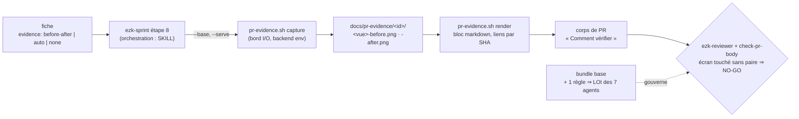

# ADR-0045 — Preuve avant/après dans les PR : outillage, activation, frontière

- Statut : **Proposé** (2026-09-03)
- Fiche : `../../../../features/20260902224608715_pr-preuve-avant-apres-outiller-la-regle.md`
- Règle visée : `../../rules/development/pr-before-after-media.md`

## En clair

La règle qui exige deux images (écran avant / écran après) dans toute PR d'interface
existe mais ne produit rien. On la rend vraie sans rien réinventer : un petit script
`bin/pr-evidence.sh` capture la paire, la règle entre dans la LOI par une seule ligne
ajoutée au socle `base`, et le reviewer plus le contrôle de corps de PR la font respecter.

## Contexte

La règle `development/pr-before-after-media` (MUST) vit dans le bundle `development`, que
**aucun profil ne lie**. Résultat mesuré : 0 paire sur 90 PR. Trois trous : pas outillée,
pas activée, pas contrôlée. La feature est un POC dogfoodé sur les cartes `ezk:map` de
vectorz. On tranche ici quatre points de conception ; le reste (implémentation, prompt
reviewer, test bash) revient à l'étape TDD.

## Décision

**1 — Activer par le socle `base`, une règle, pas le bundle entier.** On ajoute la seule
ligne `development/pr-before-after-media` à `bundles/base.yml`. Le profil `global`
(`extends: [base]` + `bundles: [base]`) la compile aussitôt dans la LOI des 7 agents.
Motif : discipline transverse de corps de PR, du même ordre que `conventional-commits`,
déjà au socle. Réversible en retirant une ligne. Lier le bundle `development` entier
imposerait 9 règles jamais revues d'un coup ; on l'écarte.

**2 — Maison du script : `products/mega-city/bin/`.** Même famille que `check-links.sh` et
`regen-backlog.sh`, déjà couverts par `bin/test-scripts.sh`. Un script, pas un skill : le
skill `ezk-checks` (fiche 0178) est une `idea` non construite (YAGNI). Une sous-commande
d'`ezk-qa` coupleraut l'agent QA à un outil de capture (viole SRP). `ezk-sprint` et
`ezk-qa` **composent** le même binaire.

**3 — Dépôts privés : lien par SHA, repli documenté.** Les PNG légers sont committés sur la
branche dans `docs/pr-evidence/<id>/`, liés en absolu par SHA de commit
(`…/blob/<sha>/docs/pr-evidence/…?raw=true`), ce qui survit à la suppression de branche
après squash. Sur dépôt privé, on vérifie **à la première vraie PR** que l'image s'affiche
pour un membre ; sinon repli = commentaire de PR avec téléversement manuel, écrit tel quel
dans la matrice. C'est une politique : aucune expérimentation réseau ici.

**4 — Frontière du script : `capture` + `render`, l'orchestration reste au SKILL.** Le
binaire porte deux responsabilités minces : `capture` (URL → PNG à viewport fixe,
`<vue>-<phase>.png`, phase ∈ before|after) et `render` (bloc markdown avec liens par SHA).
Monter l'« état avant » (worktree jetable sur la base, app sur un 2ᵉ port) reste du **texte**
d'`ezk-sprint`, avec au plus une option best-effort `--base <ref> --serve "<cmd>"`. Le
backend de capture est substituable par `PR_EVIDENCE_SHOT_CMD` (défaut
`pnpm exec playwright screenshot …`) : tests bash hermétiques sans navigateur, run réel
opt-in. Clean arch : bord I/O mince, cœur testable.

*Légende : le chemin plein est le flux de production de la preuve ; le script (bleu clair, deux
bordures minces) ne fait que capturer et rendre, l'orchestration « avant » reste au SKILL ;
la flèche pointillée montre la règle activée par le socle `base` qui gouverne le contrôle.*

## Conséquences

- Un test fige la liste des règles de `base` (`src/__tests__/catalog.test.ts:97`,
  `src/core/__tests__/loi-view.test.ts:145`) : l'étape TDD y ajoute la nouvelle règle.
- `~/.claude/ENTRY.md` gagne la règle après `lawgiver bind-global` : critère d'acceptation
  de la fiche satisfait.
- Le script est une brique unique partagée par `ezk-sprint` (auto) et `ezk-qa` (preuve E2E) ;
  pas de duplication de la capture.
- La règle s'applique désormais à **tous** les profils héritant de `base` : acceptable car
  son exception `N.A. — <raison>` couvre chore/docs/infra et les apps de bureau.

## Réversibilité

Tout se défait par petits gestes : retirer la ligne de `bundles/base.yml` désactive la règle
sans toucher au code ; le script vit seul dans `bin/` et se supprime sans effet de bord ; la
politique de dépôt privé bascule vers le repli manuel par un mot dans la matrice. Aucune
décision n'est un point de non-retour.
