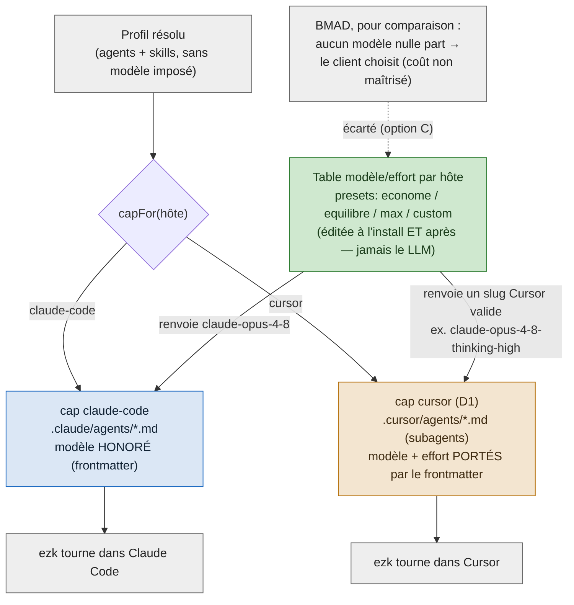

# ADR-0047 — Installer ezk dans Cursor + modèle & effort configurables par hôte

- Statut : **Proposé** (2026-09-01) — arbitrages PO tranchés le 2026-09-03 (voir D5) ; **panel adverse tenu le 2026-09-03** : GO-avec-amendements, recadrage ratifié PO (voir « Amendements du panel »)
- Date : 2026-09-01
- Fiche : [`20260901173549334`](../../../../features/20260901173549334_ezk-multi-client-cursor-modeles-par-hote.md)
- Contexte amont : [ADR-0003](0003-moteur-bind-plan-pur-coquille-io.md) (cap = adaptateur par hôte, DIP), [ADR-0006](0006-absorber-claude-skills-catalogue2.md) (bind remplace l'install monolithique), fiche `0144` (frontmatter `model`/`effort` + « ModelTierRouter » anticipé), `docs/ezk-model-and-lisibility.md` (doctrine 0181 : pin `claude-opus-4-8` + mapping Cursor **en prose**), `docs/benchmarks/2026-08-25-bmad-vs-ezk.md`
- **Ne rouvre pas** : le pin `claude-opus-4-8` pour Claude Code (0181 tient), le cœur déterministe (ADR-0001/0003)

## En clair

On veut installer ezk dans **Cursor** comme on l'installe dans Claude Code. Deux trous à
combler.

Un : **Cursor n'a pas d'adaptateur.** Un adaptateur — un « cap » dans le vocabulaire ezk —
c'est la pièce qui pose les agents et les skills dans la forme qu'un client sait lire. Le
type des hôtes nomme déjà `cursor`, mais personne n'a écrit le cap. Donc `bind … cursor`
échoue aujourd'hui.

Deux : **le modèle part tel quel, sans filtre par client.** Les agents épinglent
`claude-opus-4-8`, un identifiant que seul Claude Code comprend. Recopié à l'aveugle dans
Cursor, il ne veut rien dire.

Décision : on écrit le cap Cursor (brique 1), et on ajoute un point qui **traduit « quel
modèle, quel effort » selon le client**, à partir d'une **table que tu règles** — à l'install
et après (brique 2). Le LLM ne choisit rien. Tu dis explicitement : Opus 4.8 ici, Sonnet là,
ou « rien, Cursor décide ».

**BMAD fait l'inverse sur les modèles** : il n'en épingle aucun, il laisse le client choisir.
Simple, mais ça t'enlève le contrôle du coût — exactement ce que tu refuses (Fable 5 / Opus 5
trop gourmands). On copie donc à BMAD sa **mécanique d'installation multi-client** (un
registre déclaratif, un fichier par client, un manifeste des choix), mais on garde **en plus**
une politique de modèle que tu pilotes.

## Contexte

**Comment on installe aujourd'hui.** `lawgiver bind`/`bind-global` prend un profil (la liste
d'agents + skills), le résout, puis appelle le **cap** de l'hôte pour le matérialiser
(`src/caps/registry.ts` → `capFor(host)`). Trois caps existent : `claude-code`,
`claude-code-global`, `claude-desktop`. Ajouter un hôte = un module cap + une ligne au
registre. C'est le principe d'inversion de dépendance posé par l'ADR-0003.

**Cursor est déjà prévu, jamais construit.** `HostId` liste `cursor`
(`docs/domain.ts:129`) et le commentaire du `Cap` dit « cursor / cop1 → leur format natif »
(`docs/domain.ts:136`). Mais `src/caps/` n'a pas de `cursor.ts` : `capFor('cursor')` lève
« Hôte inconnu ».

**Le modèle est recopié verbatim, sans savoir vers quel client.** Le rendu d'un agent
(`src/caps/agent-content.ts`) recopie `model`, `model_spare`, `effort` **tels quels** et ne
prend **aucun paramètre d'hôte**. Pire pour notre cas : en mode `--link` (l'install courante),
le fichier agent est **symlinké brut** dans `~/.claude/agents/` — la valeur `claude-opus-4-8`
passe intacte. Elle atterrirait donc telle quelle dans Cursor.

**La règle Cursor existe… mais seulement en prose.** La doctrine 0181
(`docs/ezk-model-and-lisibility.md`) dit déjà « hôte Cursor → slug `claude-opus-4-8-thinking-high`,
sinon replie sur Sonnet », et les skills la répètent (`ezk-archive/SKILL.md:55`,
`ezk-sprint/SKILL.md:229`). C'est une **consigne lue par le LLM au moment d'agir**, pas un
mécanisme appliqué à l'installation. Rien n'est réglable à l'install ni après.

**L'idée du routeur par hôte est déjà au dossier.** La fiche `0144:41` prévoyait qu'« un cap
mappe `Agent.model` sur le ModelTierRouter » — jamais implémenté côté Claude Code. On
n'invente donc pas un concept, on **branche une prise déjà posée**.

**Contrainte Cursor à regarder en face.** Un fichier de commande Cursor (`.cursor/commands/*.md`)
**n'honore pas un modèle par fichier** : dans Cursor, le modèle se choisit dans l'UI, ou par
« mode ». « Un modèle par agent » n'est donc pas exprimable dans Cursor comme il l'est dans le
frontmatter Claude Code. Toute décision doit intégrer ça, sinon elle promet un contrôle que le
client ne rend pas.

## Décision

### D1 — Écrire le cap `cursor` (la brique d'installation)

Un module `src/caps/cursor.ts` + une entrée dans `src/caps/registry.ts`. Le spike du
2026-09-03 a figé les formes natives de Cursor (voir
[`docs/spikes/2026-09-03-cursor-cap-format.md`](../spikes/2026-09-03-cursor-cap-format.md)) :

- **skills** ezk → `.cursor/skills/<id>/SKILL.md` — **même format ouvert** qu'aujourd'hui
  (Agent Skills d'Anthropic, adopté par Cursor). Rien à réécrire.
- **agents** ezk → `.cursor/agents/<id>.md` — **subagents** Cursor (markdown + frontmatter,
  champ `model`). C'est là que le modèle par hôte se pose.
- **LOI** compilée → `.cursor/rules/*.mdc` (`alwaysApply`).
- commandes utilisateur (optionnel) → `.cursor/commands/*.md`.

Le seam existe déjà — c'est **un cap de plus, pas un corpus réécrit**.

### D2 — Résoudre modèle + effort **par hôte** (le « ModelTierRouter » enfin réel)

On introduit un point de résolution `(hôte, agent) → {model, effort}`. L'étape de
matérialisation devient **consciente de l'hôte**. La source est une **table de config éditable
par l'humain**. Le frontmatter actuel (`model`/`model_spare`/`effort`) reste le **défaut
Claude Code** — rien ne casse, tout est rétrocompatible.

- **Claude Code** : **pas de table** (amendement panel — la table serait morte en mode lien).
  Le modèle vient de la **frontmatter source**, symlinkée telle quelle (`--link`). C'est **ta
  config**, inchangée. La table est **Cursor-only**.
- **Cursor** : la table renvoie un **slug Cursor valide** (ex. Opus 4.8, présent au catalogue
  Cursor), rendu dans le **subagent** `.cursor/agents/<id>.md` — dont le frontmatter porte
  `model` **et** l'effort (syntaxe `model: "claude-opus-4-8-thinking-high"`, effort dans le nom du slug — vérifiée au POC 2026-09-03). Jamais
  `claude-opus-4-8` recopié à l'aveugle : la table traduit vers le slug Cursor. La **note
  générée** ne sert plus que de **repli** si un agent devait passer par un canal sans modèle
  (règle/commande).

### D3 — Contrôle humain à l'install **et** après (l'exigence centrale)

*(Recadré par le panel — presets et manifeste parqués. Voir « Amendements du panel ».)*

- **À l'install** : l'install pose **un** `models.cursor.yml` pré-rempli d'un défaut prudent
  (Opus 4.8 pour les rôles lourds, Sonnet-classe pour les mécaniques). Aucune question.
- **Après** : tu **édites** `models.cursor.yml` et tu **re-bind**. Le fichier **EST** l'état
  persistant (pas de manifeste séparé). Le LLM ne choisit jamais ; toi si, quand tu veux.

### D4 — On ne copie **pas** la stratégie modèle de BMAD

BMAD délègue le modèle au client (option agnostique, cf. Alternatives (C)). Écarté ici : perte
du contrôle coût. On copie à BMAD sa **mécanique d'install** (registre + fan-out + manifeste),
**pas** sa politique modèle. C'est le point de divergence assumé.

### D5 — Arbitrages PO (tranchés le 2026-09-03)

Le PO a tranché les points que cet ADR réservait. Ils **précisent** D2/D3, ils ne les
rouvrent pas.

- **On reste concret — pas de niveau abstrait** (alt. D écartée). Les agents gardent un modèle
  nommé. La config Claude actuelle **ne bouge pas, à l'octet près**.
- **Une config par client, livrée pré-remplie.** `models.claude-code.yml` reprend la config
  Claude connue (les pins actuels) ; `models.cursor.yml` part sur un **défaut automatique
  prudent** — au plus près des choix Claude, penché vers le moins cher quand Cursor n'a pas
  l'équivalent. Jamais « le client décide librement ».
- **Install en auto, sans question, pour démarrer.** L'install **pose** les fichiers par
  défaut ; on les édite après. « Demander à l'install » (prompt interactif façon BMAD) est
  **possible** et reste une option ultérieure, pas le chemin de départ.
- **Pas de repli simplifié** (alt. B écartée). La config par client est déjà simple ; ajouter
  l'alias-map serait *plus* de pièces, pas moins. Risque faible.
- **Zéro duplication — mécanisme détaillé dans [ADR-0048](0048-contenu-mono-source-modele-en-surcouche.md).**
  Le contenu s'écrit **une source unique**. Skills → **liées** dans chaque client (zéro copie).
  Agents Claude → **liés** (inchangé, ta config). Agents Cursor → **générés** (rôle depuis la
  source + modèle Cursor écrit depuis `models.cursor.yml`), resynchronisés au re-déploiement.
  On n'édite jamais une sortie à la main ; la mise à jour fait le fan-out.

## Alternatives écartées

- **(B) Alias-map par identifiant concret** — garder `model: claude-opus-4-8` et une petite
  table `id concret → slug par hôte`. Diff minimal, mais **fragile** : la clé bouge à chaque
  nouveau modèle, et elle n'exprime pas le **besoin du rôle** (« réflexion lourde »).
  **Écartée (PO, 2026-09-03)** : la config par client (D5) est déjà simple ; ce repli
  ajouterait des pièces sans réduire le risque.
- **(C) Agnostique façon BMAD** — aucun modèle dans les artefacts, le client choisit. Le plus
  simple, le plus portable. **Écarté** : contredit l'exigence de contrôle du coût (Fable 5 /
  Opus 5). C'est la divergence assumée avec BMAD.
- **(D) Vocabulaire de « tier » abstrait dans le frontmatter** (`tier: deep | fast` au lieu
  d'un id) — plus propre à long terme : le rôle déclare son besoin, la table traduit.
  **Écartée pour l'instant (PO, 2026-09-03)** : elle réécrirait les 7 agents et toucherait la
  config Claude, que le PO veut garder intacte. Réintroductible plus tard sans rien casser
  (D2 démarre keyé par agent-id).

## Schéma — un profil, deux atterrissages, un seul décideur du modèle : toi

*Ce que montre ce schéma : un même profil (au centre en haut) atterrit dans deux clients via
`capFor`. La **table modèle/effort** (en vert) est le seul décideur, et c'est toi qui la
règles — à l'install et après. À gauche (bleu), Claude Code honore le modèle par le
frontmatter. À droite (ambre), Cursor reçoit les mêmes agents en **subagents** : leur
frontmatter **porte** le modèle et l'effort (un slug Cursor valide, ex. Opus 4.8), traduit par
la table. En bas, BMAD, écarté : il ne met aucun modèle, donc le client choisit et le coût
t'échappe.*

## Conséquences

**Positives**
- **ezk installable dans Cursor** — et dans tout futur client — par le seam existant : un cap
  de plus (ADR-0003 tenu).
- **Contrôle humain réel** du modèle + effort par client, à l'install et après. Le LLM ne
  choisit pas.
- **Rétrocompatible** : le pin Claude Code (0181) reste intact ; le frontmatter reste sa
  vérité.
- La doctrine **prose** 0181 devient un **mécanisme déterministe et testable** — fini « le LLM
  lit une consigne et espère ».

**Négatives / dette assumée**
- **Zéro duplication (D5).** On ne recopie pas le contenu des skills par client. Le contenu
  reste une source unique, référencée — symlink pour Claude (`--link`), pointeur mince pour
  Cursor. La config modèle par hôte vit dans un petit fichier **à côté**, pas dans une copie du
  contenu. Cela **lève** la dette « copy pour réécrire le modèle » qu'une première lecture
  laissait craindre. Le modèle par hôte se lit à la matérialisation, sans dupliquer le rôle.
- **Caveat résiduel Cursor (corrigé au spike).** Les **règles** (`.cursor/rules`) et
  **commandes** n'ont pas de champ modèle — mais rien d'important n'en dépend. Les **agents**,
  eux, passent par les **subagents** (`.cursor/agents`) qui portent le modèle + l'effort. La
  crainte « Cursor = juste une note » est **levée**.
- Le **format natif Cursor bouge** (BMAD a changé entre v4 et v6). Le spike du 2026-09-03 l'a
  figé pour maintenant (skills / subagents / rules) ; garder une veille pour la suite.
- **Deux endroits** portent « quel modèle » : le frontmatter (défaut Claude Code) et la table
  par hôte. Accepté : le frontmatter reste la vérité Claude Code, la table ne fait que dévier
  par hôte.

## Amendements du panel (2026-09-03)

Panel adverse (architecte + reviewer + PM). Capture :
[`docs/captures/2026-09-03-panel-adr-0047-0048.md`](../captures/2026-09-03-panel-adr-0047-0048.md).
Verdict : **GO-avec-amendements** ; recadrage **ratifié PO**. Retenu :

- **Table Cursor-only.** Pas de `models.claude-code.yml` (mort en mode lien) — Claude garde sa
  frontmatter. Lève la contradiction D2 ↔ ADR-0048.
- **Un seul `models.cursor.yml`.** Presets, manifeste, flag `--models`, routeur partagé →
  **parqués** (réintroductibles).
- **Interop `.claude/agents` à trancher AVANT la brique 1** : Cursor lit aussi ce dossier ; sans
  décision, le bug de départ revient (collision de noms + dialecte Claude).
- **`agentContent` host-aware** (structurel, pas mineur) ; **résolveur pur** chargé par le loader,
  appliqué dans `bind` avant les caps ; **IO global** à rendre host-aware pour `.cursor/rules`.
- **Distribution** (fiche 0087) incompatible avec « skills liées » (liens absolus) → mode `copy`
  le jour venu. **Staleness** de la sortie Cursor à estamper (hash source).
- **POC empirique Cursor avant de coder le modèle** : slug exact d'Opus 4.8, effort honoré,
  interop, symlink de skill suivi.

## Suite

- **Fiche créée et groomée** : [`20260901173549334`](../../../../features/20260901173549334_ezk-multi-client-cursor-modeles-par-hote.md), scindable en deux — (1) cap `cursor` ; (2) résolution modèle/effort par hôte.
- **Arbitrages PO tranchés le 2026-09-03** (voir D5).
- **Spike Cursor fait le 2026-09-03** — formats natifs figés
  ([`docs/spikes/2026-09-03-cursor-cap-format.md`](../spikes/2026-09-03-cursor-cap-format.md)) :
  skills au format ouvert, modèle + effort portés par subagent, Opus 4.8 au catalogue Cursor.
- **Reste avant merge** : le **panel adverse** `ezk-architect` valide la solidité technique
  (structurante) — la validation, pas la réouverture des arbitrages. Puis build de la brique 1.
