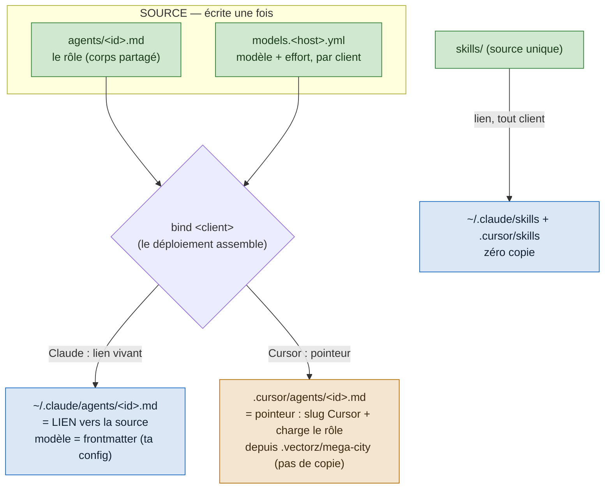

# ADR-0048 — Contenu mono-source, modèle en surcouche (composition, pas copie)

- Statut : **Proposé** (2026-09-03) — deepening de l'ADR-0047 D5 ; sortie **générée** confirmée PO ; **amendé par le panel adverse le 2026-09-03** : table **Cursor-only**, POC Cursor avant build (capture : [`docs/captures/2026-09-03-panel-adr-0047-0048.md`](../captures/2026-09-03-panel-adr-0047-0048.md)) ; **amendé le 2026-09-04** : foyer `.vectorz/mega-city` + **pointeurs** (révise D3 — voir « Amendement 2026-09-04 »)
- Date : 2026-09-03
- Fiche : [`20260901173549334`](../../../../features/20260901173549334_ezk-multi-client-cursor-modeles-par-hote.md)
- Contexte amont : [ADR-0047](0047-multi-client-cursor-et-modeles-par-hote.md) (D5 « zéro duplication » — **ceci en est le mécanisme**), [ADR-0003](0003-moteur-bind-plan-pur-coquille-io.md) (cap/DIP), [ADR-0027](0027-materialisation-assets-dossier-skill.md) (skill = dossier lié), spike [`docs/spikes/2026-09-03-cursor-cap-format.md`](../spikes/2026-09-03-cursor-cap-format.md), benchmark `docs/benchmarks/2026-08-25-bmad-vs-ezk.md`
- **Ne rouvre pas** : le choix Cursor + modèles par hôte (ADR-0047), le pin Claude (0181)

## En clair

Tu ne veux pas recopier le contenu des agents entre Claude et Cursor. Bonne nouvelle : le
problème est **petit** et à moitié déjà réglé.

Les **skills se lient** — une source, zéro copie, pour autant de clients qu'on veut. Il ne
reste que les **7 petits corps d'agents**, et pour **une seule raison** : le modèle change
d'un client à l'autre.

Décision : le contenu s'écrit **une fois** ; le modèle vit dans un **petit yaml par client** ;
le **déploiement assemble** les deux. Tu n'édites jamais deux contenus à la main. La mise à
jour régénère — exactement ce que tu proposais.

Image : c'est comme du code. Tu écris **une** source ; la compilation en produit la version
pour chaque cible. Personne n'appelle ça « dupliquer » — c'est un artefact de build, resynchronisé
à chaque compilation.

**BMAD fait pareil**, et j'ai vérifié : chaque agent est **une** petite source, un compilateur
l'assemble avec des **fragments partagés**, et les valeurs propres au projet sont **lues dans un
yaml central**. DRY à la source ; « déplié » à la construction.

## Contexte

**Le code, tel qu'il est.** lawgiver a déjà **deux modes** ([`src/io/apply.ts:356`](../../src/io/apply.ts)) :
`link` (symlink vers la source → vivant : un `git pull` met tout à jour) et `copy` (écrit le
contenu figé). Une skill est un **dossier lié** entier (ADR-0027, [`apply.ts:327`](../../src/io/apply.ts)).
Et le domaine **sépare déjà** le `role` (le corps) du `model`/`effort`
([`docs/domain.ts`](../../docs/domain.ts), [`src/caps/agent-content.ts`](../../src/caps/agent-content.ts)).

**La portée réelle du problème.** Aujourd'hui, tout est en lien : **zéro copie**. Les skills se
lieront pareil dans Cursor. Le seul point dur : un lien porte le fichier **entier**, modèle
compris. On ne peut donc pas lier **le même** fichier d'agent vers deux clients qui veulent
**deux modèles**. Ça ne concerne que les **corps d'agents** (courts), et seulement pour le **2ᵉ
client**.

**Une contrainte dure sur le modèle.** Le client (Claude Code, Cursor) lit le champ `model`
**avant** que le LLM démarre. Le modèle doit donc être **résolu au déploiement** et **écrit en
dur** dans le frontmatter de la sortie. On ne peut pas le déléguer à une étape d'exécution.
« Mettre la valeur dans un yaml à part » **marche** — mais, pour le modèle, la valeur est lue
**au déploiement**, pas à l'exécution.

**Ce que fait BMAD (vérifié).** Deux familles de variables : `{{double}}` résolue à
l'installation (écrite en dur), `{simple}` résolue à l'**exécution** par l'assistant (laissée
telle quelle). Une **config centrale** `config.yaml` par module ; l'agent la lit à l'activation
(`{user_name}`, `{communication_language}`…) — la valeur n'est **pas** recopiée, elle est
**référencée**. Des **fragments partagés** (activation, menus, règles) assemblés par un
compilateur, qui n'inclut que ce que l'agent utilise. Ce n'est **pas** une fabrique 1→N : c'est
un **compilateur** qui assemble une source + des fragments en une sortie. Net : **DRY à la
source ; l'arbre matérialisé est un artefact déplié** (duplication au repos, pas à la source).

## Décision

### D1 — DRY à la source ; la sortie est un artefact de build

Le contenu (le rôle d'un agent) s'écrit **une fois**. Chaque client reçoit une sortie qui est
**soit référencée** (lien → zéro copie, vivant), **soit générée** (copie resynchronisée au
re-déploiement). **On ne modifie jamais une sortie à la main** — comme on n'édite pas un `.js`
compilé.

### D2 — Le modèle est une surcouche par client, écrite au déploiement

Un fichier **`models.<host>.yml`** par client donne `(agent) → {model, effort}`. Le déploiement
**lit** ce yaml et **écrit en dur** la valeur dans le frontmatter de la sortie de ce client.
Écrite au déploiement, car le client lit le modèle **avant** le LLM (pas d'injection à
l'exécution pour le modèle).

### D3 — Répartition concrète (le meilleur des deux modes)

- **Skills** → **lien** vers la source unique, dans chaque client (mode `link`). Zéro copie,
  tout client. Rien à décider : c'est déjà le mécanisme.
- **Agents, Claude Code** → **inchangé**. Lien de la source (vivant ; modèle = frontmatter
  source = **ta config**). Zéro churn, zéro risque.
- **Agents, Cursor** → **révisé (Amendement 2026-09-04) : pointeur mince** — frontmatter avec le
  slug Cursor **écrit depuis `models.cursor.yml`** + corps « charge le rôle depuis
  `.vectorz/mega-city` » (pas de copie du rôle). *(D3 initial disait « sortie générée » ; voir
  Amendement.)*

### D4 — La mise à jour gère le fan-out

`bind <client>` régénère depuis la source unique. Éditer un **rôle** = **un** fichier source :
Claude le voit **vivant** (lien), Cursor via un **re-déploiement**. Éditer un **modèle** = une
ligne de yaml + re-déploiement (régénère la petite sortie). **Tu n'édites jamais deux contenus
à la main.**

## Amendement 2026-09-04 — foyer `.vectorz/mega-city` + pointeurs

Après le POC (voir spike § POC) et une proposition du PO, on **révise D3** : on ne **génère**
plus une copie du rôle pour Cursor ; on adopte un **foyer mono-source unique** + des
**pointeurs** par cap (le pattern BMAD). La portabilité — seule objection à l'approche pointeur
(alt. B) — est **levée** par un chemin **relatif au projet**.

- **Foyer** : `.vectorz/mega-city/` (projet) — `agents/`, `skills/`, `rules/`… La méthode vit
  **là, une seule fois**. (`.vectorz/` accueillera d'autres choses de projet plus tard.)
- **Claude Code** : `.claude/agents/<id>.md` = **lien** vers `.vectorz/mega-city/agents/<id>.md`
  (rôle en ligne, inchangé, zéro copie, zéro indirection). Modèle = frontmatter source.
- **Cursor** : `.cursor/agents/<id>.md` = **pointeur mince** — frontmatter avec le slug Cursor
  (`claude-opus-4-8-thinking-high`) + corps « charge `.vectorz/mega-city/agents/<id>` ». Zéro
  copie du rôle ; modèle honoré (POC).
- **Skills** : liées dans chaque client vers `.vectorz/mega-city/skills/` (symlink suivi — POC).

**Vérifié au POC (2026-09-04)** ✅ : un subagent Cursor dont le corps pointe vers
`.vectorz/mega-city/…` **charge et joue** bien le rôle partagé — le pointeur est viable. Nuance
modèle : honoré sur le chemin **Task** (ezk spawn ses agents via Task), **pas** en `@mention` en
ligne. Détail : [spike § POC](../spikes/2026-09-03-cursor-cap-format.md).

**Renommage** : `ezk-*` → `mc-*` est une suite logique, **différée** — fiche
[`20260904074824499`](../../../../features/20260904074824499_renommer-ezk-vers-mc.md).

Conséquence sur les alternatives : **(B) pointeur devient l'approche RETENUE** (grâce au foyer
`.vectorz/mega-city` relatif) ; la sortie **« générée »** (copie du rôle) passe en **repli**.

## Alternatives écartées

- **(B) Pointeur/wrapper pour les agents Cursor** (façon BMAD) — la sortie = frontmatter
  (modèle écrit) + un corps « charge le rôle depuis `<source>` ». **Zéro copie du rôle**, même
  au repos, et rôle **vivant**. **Écartée par défaut** : elle ajoute une **indirection** à
  l'exécution et un **chemin à résoudre** sur la machine (fragile pour distribuer à d'autres —
  fiche 0087). **Écartée (PO, 2026-09-03)**, en connaissance du compromis : le PO préfère des
  fichiers Cursor **complets et robustes**. Réintroductible si besoin plus tard.
- **(C) Tout générer, Claude compris** (modèle depuis un yaml unique pour tous) — uniforme, une
  seule table. **Écartée** : casse le **lien vivant** de Claude (régression) et touche **ta
  config Claude**, pour un gain nul (Claude marche déjà).
- **(D) Injecter le modèle à l'exécution** (l'agent lit son modèle dans un yaml quand il tourne,
  façon config BMAD) — **impossible pour le modèle** : le client lit le frontmatter **avant** le
  LLM. Valable seulement pour des valeurs de **contenu** (nom, langue), pas la sélection de
  modèle. Piste **future** pour des valeurs projet, hors de ce périmètre.

## Schéma — une source, deux sorties, jamais d'édition double

*Ce que montre ce schéma : en haut (vert), la source écrite une fois — le rôle et le yaml des
modèles. Au centre, le déploiement assemble. À gauche (bleu), Claude reçoit un **lien vivant**
(zéro copie, ta config inchangée). À droite (ambre), Cursor reçoit un **pointeur mince** (slug
Cursor écrit + « charge le rôle depuis `.vectorz/mega-city` », pas de copie). En bas, les skills : un **lien** dans
chaque client, zéro copie. Nulle part on n'édite une sortie à la main.*

## Conséquences

**Positives**
- **Contenu écrit une fois ; jamais d'édition double.** Le déploiement fait le fan-out — ta
  suggestion, appliquée.
- **Skills : zéro copie** (lien), pour tout client. **Claude inchangé et vivant.**
- **Modèle par client réel et correct** : écrit là où le client le lit (avant le LLM).
- **Aligné BMAD** (DRY à la source) et sur les modes `link`/`copy` **déjà présents**.

**Négatives / assumé** *(mis à jour par l'amendement 2026-09-04 : pointeur, pas copie)*
- **Indirection à l'exécution** : le subagent Cursor charge le rôle depuis `.vectorz/mega-city`
  via le pointeur. Le rôle **n'est pas recopié** ; une édition du rôle est prise **à chaud**
  (comme le lien Claude), **sans re-déploiement**. Un re-bind ne reste nécessaire que pour un
  **changement de modèle** (`models.cursor.yml`) ou de **roster** d'agents. Fiabilité de
  l'indirection **validée au POC** (2026-09-04).
- **Deux sources de modèle** : le frontmatter Claude et `models.cursor.yml`. Assumé — chacune
  est **unique pour son client**.

## Action items

1. [ ] Resolver **pur** `resolve(table, host, agentId) → {model, effort}` — table **chargée par
   le loader** (I/O), passée en donnée à `bind` (cœur pur, ADR-0003), appliquée **avant** les
   caps. **En v1 : Cursor-only** ; Claude garde sa frontmatter (pas de `models.claude-code.yml`).
2. [ ] `agentContent(agent, resolved, host)` — **structurel, pas « mineur »** (amendement panel) :
   Cursor met l'effort dans le **nom du slug** (`claude-opus-4-8-thinking-high`, vérifié au POC) et n'a pas les clés `model_spare`
   / `effort` / `isolation`. Branche Cursor dédiée ([`src/caps/agent-content.ts`](../../src/caps/agent-content.ts)).
3. [ ] Cap `cursor` : skills liées, agents en **pointeur** (frontmatter slug Cursor + « charge le
   rôle depuis `.vectorz/mega-city` »), LOI en `.cursor/rules`.
4. [ ] (Futur, hors périmètre) injection runtime façon BMAD pour des valeurs **projet** (nom,
   langue) — jamais pour le modèle.
