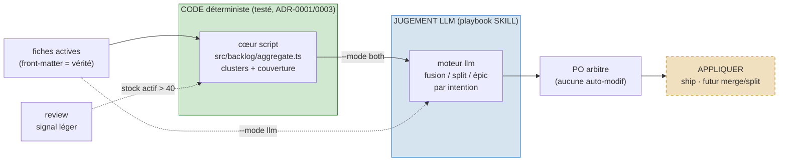

# ADR-0051 : `aggregate` — cœur script déterministe vs jugement LLM, et frontière avec `review`

**Statut :** Proposé
**Date :** 2026-09-11
**Déciders :** PO (Thomas)
**Décidé par :** ezk-architect (étape Archi du sprint, fiche [`20260812104022240`](../../../../features/done/20260812104022240_backlog-rationalisation-tags-script-llm.md))
**Portée :** ce ADR grave DEUX coutures de la sous-commande `ezk-backlog aggregate` — (1) où
passe la frontière code-déterministe ↔ jugement-LLM, et (2) qui, de `review` ou `aggregate`,
possède le dédoublonnage profond. Il ne traite PAS l'**application** des fusions/splits (statuts
`merged`/`split`), gated sur la fiche [`20260823121712652`](../../../../features/20260823121712652_modele-statut-kanban-schema-valide.md).

## En clair

`aggregate` range le backlog quand il a gonflé : il regroupe les fiches par thème et **propose**
une remise à plat. Deux moteurs. Le moteur **`script`** groupe mécaniquement sur les tags — c'est
du **code pur et testé** qui ne fait que trier et compter, jamais de jugement. Le moteur **`llm`**
lit ces paquets et **tranche** par intention (fusionner, découper, créer un épic). La décision :
le `script` vit en **cœur TS pur + un bin** (comme le board), le `llm` reste le **playbook**, et
`review` **cesse** de dédoublonner en profondeur — il **renvoie** vers `aggregate` au-delà d'un
seuil de stock. Personne ne modifie une fiche sans l'aval du PO ; un script appliquera plus tard.

## Contexte

La fiche `20260812104022240` nomme **deux moteurs** pour `aggregate` : `script` (mécanique,
déterministe, sur `labels:`) et `llm` (jugement). Sans couture nette, deux dérives menacent :

- **Mélange moteur/jugement** — coder le clustering ET le jugement dans le même endroit
  reproduirait le péché que l'ADR-0001 (« le script range/compte, le LLM ne recompte jamais »)
  et l'ADR-0003 (cœur PUR, I/O au bord) proscrivent déjà pour le board et les vues de plan.
- **Chevauchement `review` / `aggregate`** — `review` (fiche 0071, shipped) fait déjà un
  contrôle doublons par jugement LLM. Si `aggregate` refait la même chose sans partage de
  responsabilité, on a deux commandes qui clusterisent, et le PO ne sait plus laquelle lancer.
  C'est le même type de couture que l'ADR-0018 a gravée entre `reconcile` (détecte) et `ship`
  (exécute).

Fait de plomberie confirmé à l'Archi : le champ `labels:` **existe et est déjà parsé** par
`src/loaders/fiches.ts` (`Fiche.labels: string[]`, 17/139 fiches taguées). Le champ `depends:`
**n'est pas parsé** — l'outiller reste un enabler distinct, hors de ce sprint.

## Décision

### 1. Le moteur `script` = cœur TS PUR + bin ; le moteur `llm` = playbook

- **Cœur PUR** : `products/mega-city/src/backlog/aggregate.ts`. Ne dépend que du **type**
  `Fiche` (import type-only, comme `avancement-data.ts`). Zéro I/O, déterministe, testé.
  Il **clusterise** et **rend une structure de clusters + une couverture** — il ne juge pas,
  ne fusionne pas, n'écrit rien.
- **Bord I/O** : `products/mega-city/bin/backlog-aggregate.ts`. Charge les fiches
  (`loadFiches`), applique le `--scope`, appelle le cœur, **imprime** le rapport numéroté et la
  ligne de couverture. **Lecture seule** — jamais d'écriture (critère : `git status` propre).
  Câblé `"backlog:aggregate": "tsx bin/backlog-aggregate.ts"`.
- **Moteur `llm`** : reste le **playbook** (prose SKILL). Il consomme les clusters du script
  (`--mode both`) ou repart des fiches brutes (`--mode llm`), et **propose** fusions / splits /
  épics / re-priorisations **par intention**. C'est le jugement — jamais du code.
- **`--mode script`** ne bascule **jamais** en silence vers `llm` : sur un stock peu tagué il
  rend un clustering **partiel** et **affiche sa couverture** (« N/139 taguées »), sans crash.

Dépendances dirigées vers le domaine : `bin/` → `src/backlog/` + `src/loaders/`. Le cœur
n'importe aucune infrastructure. (Clean arch, DIP — mêmes règles que le board.)

### 2. Frontière `review` ↔ `aggregate` (anti-chevauchement)

- `review` garde son contrôle #2 comme **signal léger de surface** (doublons évidents).
- Le dédoublonnage **profond** (clustering du stock entier) appartient à `aggregate`.
- **Seuil** : quand le stock actif dépasse **40 fiches** (compteur déterministe déjà lu par
  `review` via `regen`, ADR-0001), `review` **n'entreprend pas** le clustering profond — il
  émet une ligne « stock actif = M (> 40) → lance `aggregate` pour une remise à plat » et
  s'arrête là. En deçà, `review` suffit. Règle **textuelle** (SKILL), aucun code neuf côté
  `review`.

### 3. Hors périmètre de ce sprint (gravé pour éviter la re-litige)

- **Appliquer** les fusions/splits (`merged`/`split`) → gated sur `20260823121712652`.
  `aggregate` **propose** et nomme le geste d'application (`ship`, futur `merge`/`split`) sans
  l'exécuter.
- **Parser `depends:`** et **backfiller** les ≈122 fiches sans tag → enablers distincts (data
  chore), non bloquants ; le cœur prouve qu'il tourne dès 17/139.

## Schéma — la couture (1 concept)

*Légende : en **vert** le code déterministe qui range et compte (jamais de jugement), en
**bleu** le jugement LLM qui propose, en **beige pointillé** l'application gated (hors sprint) ;
`review` délègue le clustering profond à `aggregate` au-delà de 40 fiches actives.*

## Conséquences

**Positives**
- Le moteur `script` est **testable et déterministe** : mêmes garanties que le board (tri,
  compteurs, zéro surprise), et le LLM ne recompte jamais (ADR-0001).
- Frontière `review`/`aggregate` **gravée** : plus d'ambiguïté sur « quelle commande lancer ».
- Aucun objet nouveau, aucune migration : réutilise `Fiche.labels`, `regen`, le front-matter.
- Cœur **buildable maintenant** sans attendre les statuts `merged`/`split`.

**Négatives / coûts**
- Le seuil `40` est un choix de calibrage (le stock actuel ≈136 le dépasse déjà, donc `review`
  défère à `aggregate` dès aujourd'hui) ; réglable si l'usage le dément.
- Le clustering par heuristiques (tags + épic + préfixe de titre) reste grossier tant que le
  backfill des tags n'est pas fait — assumé : la **couverture affichée** rend cette limite
  visible, et le moteur `llm` rattrape le reste.

**Neutres**
- `depends:` non parsé : le cœur ne l'utilise pas ; l'ajouter plus tard n'invalide pas cet ADR.
