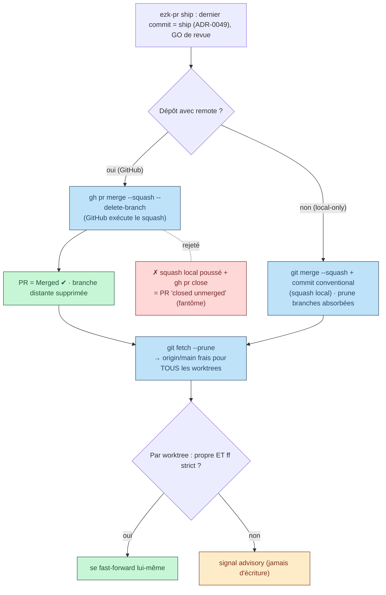

# ADR-0052 — Merge local-first : GitHub exécute le squash, le main local se réaligne tout seul

- Statut : **Proposé** (2026-09-12) — grooming fiche `20260911213014783`, ratification possible via panel
- Date : 2026-09-12
- Compose / précise : ADR-0009 (ezk-pr consomme le stock de PRs), ADR-0042 (concurrence = visibilité, pas verrou), ADR-0049 (le ship complet vit dans la PR), ADR-0019 (racine = arbre principal), fiche 0076 (hygiène branches post-squash)
- Fiche : `../../../../features/20260911213014783_merge-local-first-sync-main.md`

## En clair

La fiche voulait « piloter le squash en local ». Sur un dépôt GitHub à convention squash, **c'est impossible proprement** : un squash fabriqué en local puis poussé ne fait **jamais** voir la PR comme « mergée » par GitHub, et la fermer à la main la marque « closed unmerged » — la PR fantôme qu'on veut éviter.

On tranche donc autrement. **GitHub exécute le squash** (`gh pr merge --squash`), parce que c'est le seul geste qui ferme la PR en vrai « Merged » et supprime la branche distante. Le « local-first », lui, se déplace : le local **décide** quand merger, **fournit** le message conventional et le commit de ship (ADR-0049), puis **se réaligne tout seul** après le merge. Plus de `git switch main && git pull` à la main.

Pour un dépôt **sans remote**, il n'y a pas de PR : là, le squash est bien local (`git merge --squash`).

## Contexte

La friction visée : après chaque merge, le `main` local n'avance pas ; l'opérateur tape `git switch main && git pull` ; en session parallèle il n'a pas de terminal ; les worktrees finissent en retard sur `origin/main` et travaillent sur une base fausse.

La piste de la fiche — « squash en local puis `gh pr close` merged-locally » — se heurte au comportement réel de GitHub, qu'il fallait vérifier et non supposer :

1. GitHub ne marque une PR « Merged » que si les commits de la **tête de PR** deviennent atteignables depuis la base. Un **squash** jette l'historique et produit un **nouveau SHA** : poussé sur `main`, il ne rend pas la tête atteignable. La PR reste « Open ».
2. `gh pr close` sur cette PR la passe « Closed » (rouge) = **unmerged**. C'est la PR fantôme interdite par la fiche, et elle casse `reconcile` (qui se cale sur l'état *merged*).
3. À l'inverse, `gh pr merge <n> --squash --delete-branch` fait GitHub créer le commit de squash sur la base, marquer la PR **Merged**, supprimer la branche distante — proprement.

Donc, sur dépôt GitHub à convention squash, **merge local propre et fermeture GitHub propre sont mutuellement exclusifs**. ADR-0049 enfonce le clou : le commit de ship (statut + vues) est le dernier commit de la branche et doit atterrir **par le squash-merge GitHub**, atomiquement.

## Décision

### D1 — GitHub exécute le squash ; le local **décide** et **se réaligne**

Sur un dépôt avec remote, le squash-merge reste **côté serveur** : `gh pr merge <n> --squash --delete-branch`, avec le message conventional passé par le local (`--subject`/`--body`). « Local-first » = le local possède la **décision**, le **message** et le **commit de ship** (ADR-0049) ; GitHub n'est que l'**exécutant** du merge. C'est le seul chemin qui donne une PR réellement « Merged », sans fantôme.

### D2 — Réalignement automatique du main local, par fast-forward

Juste après le merge serveur, `ezk-pr ship` fait un **`git fetch --prune`**. Fait capital de git : les worktrees **partagent** l'object store et les refs distantes, donc ce seul fetch rafraîchit `origin/main` **pour tous les worktrees** du dépôt et supprime la ref de branche distante mergée. Le `main` local ne « diverge » jamais d'`origin/main` (convention squash, une seule source de merge) : il se remet à jour par **fast-forward**, jamais par merge. C'est ce qui remplace le `git switch main && git pull` manuel.

### D3 — Les autres worktrees se **soignent eux-mêmes** ; on ne touche jamais à un worktree tenu

Conformément à ADR-0042 (visibilité, pas verrou ; jamais d'écriture dans le worktree d'une autre session), **aucune session ne réaligne le worktree d'une autre**. Chaque worktree (l'arbre principal qui porte `main` compris) se fast-forward **lui-même** à son prochain geste, via la **gate de fraîcheur existante** (règle `development/run-freshness-origin-main`), promue de « avertir » à « avertir **ou** se réaligner quand c'est sûr ». `ezk-pr ship` ne fait, en transverse, que le `git fetch --prune` (sûr, partagé, non intrusif) et **signale** les worktrees en retard sans y écrire.

### D4 — Prédicat de sûreté (réutilisé, pas réinventé)

Un worktree est **auto-fast-forwardable** si et seulement si : working tree **propre** (`git status --porcelain` vide) **ET** fast-forward strict possible (sur `main` en retard, ou branche strictement derrière sans divergence). Sinon : **signal seulement** (advisory). Détecteur = l'intersection des fichiers non commités d'ADR-0042 + la classification absorbée/réelle de 0076. Un worktree sale ou tenu par une session vivante n'est **jamais** déplacé.

### D5 — Dépôt sans remote et hors ligne

Sans remote, il n'y a pas de PR : le squash est **local** (`git switch main && git merge --squash <branche> && git commit`, message conventional), puis prune des branches absorbées (0076). Hors ligne avec remote injoignable, la gate de fraîcheur **dégrade proprement** (avertit, ne bloque pas) selon le spike `20260906122942825`, qui devient une **dépendance** de l'axe 2.

## Schéma — deux chemins de merge, une seule fermeture propre

**Légende.** Bleu = geste exécuté ; vert = état propre atteint ; orange = simple signal (on ne touche pas au worktree) ; rouge = chemin **rejeté** (squash local + `gh pr close` fabrique une PR fantôme « closed unmerged »). Le seul chemin qui ferme la PR en vrai « Merged » passe par `gh pr merge --squash` côté GitHub ; le local se réaligne ensuite par fast-forward.

## Options écartées

- **Squash fabriqué en local + `git push origin main` + `gh pr close` « merged locally »** — rejeté : GitHub ne voit pas un merge, la PR finit « closed unmerged » (fantôme), `reconcile` décroche, et il faudrait repousser le ship sur `main` depuis un worktree — le blocage worktree→`main` qu'ADR-0049 vient d'éliminer.
- **Une session réaligne les worktrees des autres** — rejeté : viole ADR-0042 (pas d'écriture dans le worktree d'autrui) ; risque d'écraser un travail non commité. Chaque worktree se soigne lui-même.
- **Nouveau skill `ezk-sync` dédié** — rejeté (YAGNI) : le geste git vit déjà dans `ezk-pr ship` (ADR-0009) et le réalignement dans la gate de fraîcheur existante. Rien à créer.
- **Verrou « une PR = une session »** — déjà écarté par ADR-0042.

## Conséquences

**Plus facile** — fin du `git switch main && git pull` manuel ; `origin/main` frais partout après un merge d'un seul `fetch --prune` ; PR toujours « Merged » propre ; cohérent avec l'atterrissage atomique d'ADR-0049.

**À surveiller / dette assumée** — le réalignement des autres worktrees est **advisory** (ADR-0042) : un worktree sale reste en retard jusqu'à ce que sa propre session agisse ; c'est voulu. L'axe 2 **dépend** du spike offline `20260906122942825`. La promotion de la gate de fraîcheur (avertir → se réaligner) doit garder le prédicat D4 strict pour ne jamais déplacer un worktree tenu.

**Réversible** — retirer l'étape `fetch --prune`/fast-forward d'`ezk-pr ship` et revenir à la gate « avertir seulement » suffit.
