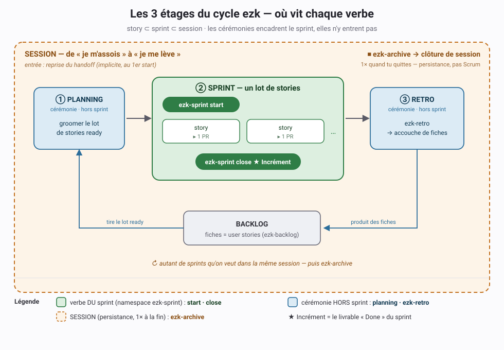

# ADR 0054 — Clôture de sprint vs archive de session ; cérémonies hors sprint

**Statut :** Accepté
**Date :** 2026-09-30
**Ratifié le :** 2026-10-01, au build du POC (fiche 20260930123438875)
**Deciders :** PO (opérateur) — brainstorming produit + mini-panel (architecte + scrum master), puis **grooming panel du 2026-09-30** (architecte + PO/juge) : Option A + découpage en 3 fiches

> Matière de la fiche [20260930123438875](../../../../features/done/20260930123438875_cycle-vie-sprint-session-ceremonies.md).
> Ratifié à l'étape Archi du sprint qui a construit le POC (`start` et `close`). Ce que le POC ne livre pas est rangé en « Suite » plus bas.
>
> **Découpé en 3 fiches** au grooming panel du 2026-09-30 (Option A) :
> [1 — le lot dans ezk-backlog](../../../../features/done/20260930194219046_ezk-backlog-lot.md) ·
> [2 — verbes ezk-sprint start/close](../../../../features/done/20260930123438875_cycle-vie-sprint-session-ceremonies.md), livrée par #275 ·
> [3 — ezk-product-build orchestrateur de session](../../../../features/done/20260930194219068_ezk-product-build-orchestrateur-session.md).

## En clair

On sépare trois étages qui étaient collés : **la story**, **le sprint**, **la session**.
Le sprint devient une vraie unité Scrum — un **lot** de user stories qui produit un **incrément**.
Il s'ouvre et se ferme : `ezk-sprint start` / `ezk-sprint close`. La **session** (le fait de
s'asseoir puis de se lever, au sens Claude Code) garde `ezk-archive` pour ne rien perdre. Les
**cérémonies** (planning, retro) restent **hors** du sprint et le bouclent par le backlog.

## Contexte

La méthode collait deux niveaux et il manquait celui du milieu :

- `ezk-sprint run` construit **une** feature = **une** PR. Un « sprint » ≈ une feature.
- `ezk-sprint check` (ex-`ezk-start`) ouvre, `ezk-archive` clôt — au niveau **session**.

Il n'existait pas d'étage « sprint = lot de stories → incrément ». En Scrum, un Sprint contient
1..N user stories et aboutit à un **Incrément** ; une session de travail peut enchaîner plusieurs
sprints. L'asymétrie ressentie — ouverture *dans* `ezk-sprint`, clôture *dehors* dans `ezk-archive`
— était le symptôme de cet étage manquant.

Un mini-panel tenu le 2026-09-30 a d'abord opposé un NO-GO à `ezk-sprint close`, par argument de
cadence : « close = 1×/session, sprint = 1×/feature ». L'argument tombe dès qu'on rétablit le
niveau sprint : une session contient N sprints, donc `close` tourne **1× par sprint**, à la bonne
cadence. La prémisse était trop étroite ; cet ADR la corrige.

## Décision

1. **Trois étages emboîtés** : `story ⊂ sprint ⊂ session`.
   - **Story** : l'unité de travail. Reste **1 story = 1 PR** (inchangé).
   - **Sprint** : un **lot** de stories → un **Incrément**. Unité de production Scrum.
   - **Session** : frontière de **persistance** (une fois assis → levé, au sens Claude Code).
     Concern d'outillage, pas de Scrum.

2. **Verbes du sprint** (namespace `ezk-sprint` — même scope + même cadence) :
   - `ezk-sprint start` — ouvre le sprint et exécute l'intake ; remplace `check` comme verbe par
     défaut (le dry-run read-only reste disponible en option).
   - `ezk-sprint close` — ferme le sprint, scelle l'incrément, **rend la main à la session**.

3. **Session** : `ezk-archive` **inchangé** — le nom porte une capacité durable (snapshot
   `docs/sessions/` + anneau de handoff), pas seulement « fermer ». **Ouverture de session
   implicite** : la reprise du handoff se fait au **premier** `ezk-sprint start`. Aucun verbe
   d'ouverture de session dédié → `start` reste sans ambiguïté un verbe **du sprint**.

4. **Cérémonies hors sprint** : le **planning** (groomer/choisir le lot) et la **retro**
   (`ezk-retro`) encadrent le sprint sans y entrer. La retro **n'agit pas directement** : elle
   **produit des fiches** (backlog), groomées au planning **du sprint suivant**. Boucle :
   `retro → fiches → backlog → planning → sprint`.

5. **Nommage écarté** : `stop` pour la clôture normale. En Scrum, « stop/cancel a sprint » = fin
   **anormale** (annulation). On termine avec un incrément → `close`. `stop` pourra plus tard
   désigner l'annulation d'un sprint, si le besoin apparaît.

6. **Qui itère les stories d'un sprint — Option A** (tranchée au grooming du 2026-09-30).
   C'est **`ezk-sprint`** qui possède la boucle du lot : `run` = `start → N stories → close` =
   **un incrément**. `ezk-product-build` se **repose** au-dessus — il enchaîne des **sprints**
   (des lots), son checkpoint passe **entre incréments**, plus entre features. Cela lève la
   contradiction « `run` construit N stories » vs « product-build appelle ezk-sprint par fiche ».

7. **Le lot vit dans `ezk-backlog`, pas dans `ezk-sprint`** (question b). Sélectionner/figer un
   lot de N fiches ready (le « sprint backlog ») est une capacité **neuve** d'`ezk-backlog`
   (ex. `next --lot N`) ; `ezk-sprint start` ne fait que **consommer** le lot. C'est la
   **fondation** (fiche 1), construite en premier.

8. **Pas d'objet « sprint » persistant** (question a). YAGNI : l'incrément existe déjà (commits
   squash sur `main` + fiches `shipped`). `SPRINT.md` + un pointeur (ids/PRs du lot) suffisent.

Cette décision **étend** [ADR-0039](0039-trois-etages-moteur-methode-branchements-plugin.md) §2
(« la PR est un mécanisme, pas une cérémonie ») aux bornes de cycle de vie : ouvrir/fermer sont
des **mécanismes/hygiène**, pas des cérémonies.

## Conséquences

**Positives**
- Le sprint redevient « un espace d'actions » pur ; les cérémonies restent dehors, comme voulu.
- La symétrie ouverture/clôture est vraie **au bon niveau** (sprint : start/close ; session : archive).
- `ezk-sprint close` est légitimé (cadence sprint) — le NO-GO du mini-panel est levé par changement
  de prémisse, tracé ici.

**Coûts (ce n'est PAS un simple renommage — à traiter au build ; état du POC dans « Périmètre du POC et Suite »)**
- **Fiche 1** — `ezk-backlog` gagne le **lot** (sélectionner/figer N fiches ready) + la définition
  d'incrément. `ezk-sprint start` **consomme** ce lot (fondation de la suite).
- **Fiche 2** — livrée par #275 : `ezk-sprint start`/`close` au niveau lot (`start --lot <ids>`),
  `close` scelle l'incrément, `SPRINT.md` suit le **lot** courant.
- **Fiche 3** — `ezk-product-build` **reposé** en orchestrateur de session (Option A) : il enchaîne
  des **sprints** (lots), checkpoint **entre incréments**.
- **Rétro-compat : un mapping PAR verbe** — `check` et `run` ne peuvent PAS aliaser `start` à
  l'identique (ils n'ont pas le même contrat) :
  - `check` → alias de `start --dry-run` : **reste strictement read-only** (aucun claim, aucune
    branche) — on ne mappe jamais `check` vers une ouverture avec effet de bord.
  - `run` → alias du **cycle complet** `start → stories → close` : conserve le build 0→10 de bout
    en bout — on ne mappe jamais `run` vers la seule ouverture, sinon les appelants existants
    s'arrêteraient avant d'avoir construit la moindre story.
  Alias transitoires le temps de la bascule (précédent
  [ADR-0053](0053-check-ready-devient-review-defaut-autonome.md) : renommage avec alias).

## Tranché au POC

Les deux questions laissées ouvertes à la proposition sont closes pour le POC. Chacune reste révisable.

- **Objet « sprint » persistant, ou SPRINT.md suffit-il ?** SPRINT.md suffit. Il est ignoré par git. Il porte le lot, les notes, la section « Galères & gestes (labo) » et une ligne par incrément scellé. Un nouveau `start` reporte ces trois dernières sections. Un objet persistant (id, incrément listé) ne se justifie que si cette approche montre ses limites.
- **Frontière entre le planning et `ezk-backlog`.** Le planning, c'est `ezk-backlog` : `review`, `groom` et `next --ready-only`, composés par l'intake de `start`. Il n'y a pas de verbe `planning`.

Le grooming panel du 2026-09-30 a tranché les mêmes questions dans le même sens (Décisions 6 à 8). Il ajoute un point : **sélectionner et figer** le lot (N fiches ready) devient une capacité d'`ezk-backlog`, que `start --lot` consomme. C'est la fiche 1. Le repositionnement d'`ezk-product-build`, rangé en « Suite » plus bas, est la fiche 3.

Cinq précisions sont nées du build.

- **Checkpoint.** Il reste avant chaque merge (étape 9), donc par story. `close` ne pose pas de seconde question « on continue ? » : il rend la main. Pour un lot d'une story, le déroulé est celui d'avant. Sous `ezk-product-build`, ces arrêts sont absorbés : une seule question par sprint, après `close` (fiche 3).
- **Deux `close`.** `ezk-archive close` (alias de `run`) reste et ferme la session. `ezk-sprint close` ferme le sprint. Les deux SKILL.md se distinguent l'un de l'autre.
- **Story reportée.** Elle prend `[~]` dans le lot et retourne au backlog. Seule une case `[ ]` bloque `close`. Un sprint sans aucune story livrée n'a pas d'incrément : `close` refuse.
- **Portier en ALERT.** `start` refuse. Seul `--override "<raison>"` passe outre, et la raison est journalisée dans SPRINT.md.
- **Fin anormale.** Un sprint où rien n'est livré, ou que le PO arrête, ne peut pas rester ouvert : il bloquerait tout nouveau `start`. `close --abandon "<raison>"` le ferme sans incrément. La raison est journalisée et le savoir de session reste. Le verbe `stop` reste réservé à une annulation plus riche, si le besoin apparaît.

## Périmètre du POC et Suite

**Livré par le POC.** `ezk-sprint start` et `close` (script `sprint.sh` et son DoD bash). `check` ≡ `start --dry-run`. `run` ≡ cycle complet. Le partage des rôles avec `ezk-archive`, qui ne change pas. La carte de méthode à jour. Cet ADR accepté.

**En Suite.**
- `ezk-product-build` repositionné en orchestrateur de la boucle de session (planning → sprint → rétro → planning). Fait le 2026-10-02 : la boucle par lot (`--lot N`, défaut 1) et un seul checkpoint par sprint, après `close` (fiches 1 et 3). Reste la boucle de session complète, et `run:context` / `run:report` qui affichent la taille du lot.
- Panel adverse complet (architecte, scrum master, PO/juge) sur ce repositionnement.
- Date de retrait des alias `check` et `run`, et sort de l'alias `close` d'`ezk-archive`.

## Nommage

Cette section absorbe la fiche de nommage [20260903085150321](../../../../features/done/20260903085150321_nommage-commandes-scrum-safe.md), devenue `superseded`.

**Règle.** On prend le mot Scrum là où Scrum en a un : story, sprint, incrément, planning, rétro. Pour ce que Scrum n'a pas, la persistance d'outil, on garde le terme réel de l'outil : **session**, au sens de Claude Code. SAFe n'est emprunté que pour un étage au-dessus du sprint, et seulement s'il faut le nommer.

**Ce qui en découle.**
- Les verbes du sprint sont des verbes d'événement Scrum : `start` et `close`. `stop` reste réservé à l'annulation, qui est une fin anormale.
- La séparation tient : `ezk-product-build` **compose** `ezk-sprint` et n'en devient jamais un mode.
- Le nom d'`ezk-product-build` n'est pas tranché ici. Fait nouveau : l'**incrément** est maintenant la sortie de chaque `ezk-sprint close`. Appeler `ezk-product-build` « `ezk-increment` » (penchant du PO au 2026-09-03) mettrait deux sens dans le même mot. `ezk-train` (SAFe) ou le statu quo restent ouverts. La décision est en Suite, avec le repositionnement.

## Alternatives écartées

- **`ezk-sprint archive` / un seul verbe** : recolle la persistance (session) à la production
  (sprint), deux natures et deux cadences. Rejeté.
- **`ezk-sprint retrospective`** : ferait entrer une cérémonie dans le sprint, contre la doctrine
  « le sprint n'est pas une cérémonie ». La retro reste `ezk-retro`, hors sprint.
- **Renommer « session » en « sprint »** (fusion à 2 étages) : cohérent avec un Scrum compressé,
  mais efface l'étage de production. Rejeté au profit des 3 étages.
