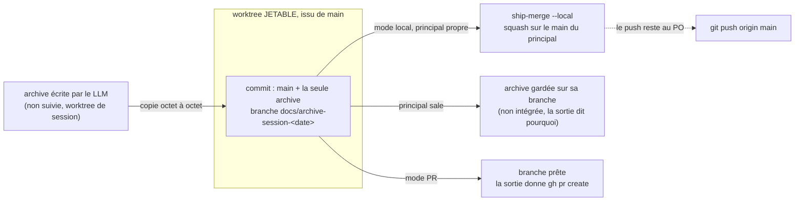

# ADR 0063 — La clôture committe son archive via un worktree jetable issu de main

**Statut :** Accepté (run V0.6, 2026-10-06)
**Date :** 2026-10-06
**Deciders :** PO (fiche P1 V0.6) ; conception tranchée par `ezk-architect` au grooming
**Fiche :** `20261005100026946` (« La clôture de session committe l'archive qu'elle écrit »)
**Compose :** [ship-merge.sh `--local`](../../skills/ezk-pr/scripts/ship-merge.sh) · s'appuie sur [ADR-0055](0055-artefacts-generes-hors-versionnage.md) (les vues restent hors git, l'archive non)

## En clair

À la clôture, `ezk-archive` écrivait l'archive de session dans `docs/sessions/`, puis **proposait** le
commit sans le faire. Le fichier restait hors de git dans le dossier de travail ; si l'app supprimait
ce dossier, l'archive était perdue. Désormais la clôture **committe elle-même** l'archive, puis
l'**intègre** sur le `main` local (mode local) ou la laisse sur une branche prête pour une PR (mode PR).
Le push reste au PO.

Le point dur : `ezk-archive run` tourne **dans un worktree de session**, où `main` n'est pas extrait.
Un `git checkout main` y échoue, et committer sur la branche de session embarquerait le travail en
cours. La solution committe l'archive dans un **worktree git jetable issu de `main`** — jamais le
checkout principal, jamais la branche de session.

## Décision

1. **Un script range** (frontière ADR-0001) : `skills/ezk-archive/scripts/archive-commit.sh`, appelé
   par le SKILL à l'étape 8, **seulement en `run`/`close`**. Le LLM a jugé *quoi* écrire dans
   l'archive ; le script fait le commit, déterministe.
2. **Worktree jetable issu de `main`.** Le script crée une branche `docs/archive-session-<date>` dans
   un worktree temporaire basé sur `main`, y copie **le seul** fichier d'archive, le committe, puis
   retire le worktree. L'arbre partant de `main`, le commit ne peut contenir que l'archive.
3. **Intégration composée, pas réécrite.** En **mode local** (`github.pr: false`), le script compose
   `ship-merge.sh --local` (squash sur le `main` local + prune de la branche + refresh des vues). En
   **mode PR**, il laisse la branche et imprime la commande d'ouverture. **Il ne pousse jamais.**
4. **Dossier principal sale → on sauve sans merger.** Si le principal porte du travail non commité, le
   script **ne merge pas** (le squash l'embarquerait) : l'archive reste committée sur sa branche, et la
   sortie dit comment l'intégrer plus tard. L'archive n'est jamais perdue.
5. **`check` reste read-only.** Le script n'est jamais appelé en `check` : aucune branche, aucun
   worktree, aucun commit.

## Le chemin de l'archive — du worktree de session au main principal

*Lecture : l'archive ne passe jamais par la branche de session ni par un `checkout main` dans le
worktree de session. Elle est copiée dans un checkout propre de `main` (le worktree jetable), committée
seule, puis intégrée — ou gardée sur sa branche si le principal n'est pas propre.*

## Conséquences

- **Bien.** L'archive est sauvée dès la clôture (`git status` du worktree ne la montre plus). Le piège
  « `main` already checked out » est évité par construction. `ship-merge.sh` n'est pas réécrit.
- **À payer.** Un worktree jetable par clôture (retiré aussitôt, `trap` de filet). Le mode se lit dans
  `.vectorz/config.yml` via `ezk config show` (repli grep).
- **Hors scope.** Le handoff durable (`handoff.sh durable`, machine jetable) garde son propre chemin ;
  cet ADR ne couvre que l'**archive de session** (`docs/sessions/`).
- **DoD exécutable :** `skills/ezk-archive/scripts/test-archive-commit.sh` (local propre, principal
  sale, mode PR, collision de nom, gardes).
