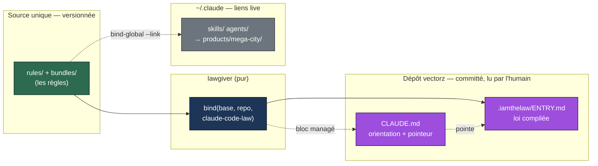

# ADR 0064 — La loi se binde par projet via un cap « law-only », pas par copie des skills

**Statut :** Accepté
**Date :** 2026-10-07
**Deciders :** PO + ezk-architect
**Fiche :** [`20261007115129448`](../../../../features/20261007115129448_claude-md-proxy-loi-bindee-par-projet.md) — CLAUDE.md proxy + loi bindée par projet
**S'appuie sur :** [ADR-0003](0003-moteur-deterministe-caps.md) (cap par hôte, DIP) · [ADR-0055](0055-artefacts-generes-hors-versionnage.md) (une vue générée reste en git si un humain la lit) · [ADR-0056](0056-loi-du-socle-par-le-global.md)

## En clair

On veut voir la loi du projet **dans le dépôt** et un `CLAUDE.md` qui **pointe** vers elle au lieu de recopier les règles. Un `bind` complet ne convient pas : il recopierait aussi les skills et agents de vectorz dans `vectorz/.claude/`, or vectorz **est** la source de ces skills — ce serait circulaire. On ajoute donc un hôte `claude-code-law` qui ne pose **que** la loi (`.iamthelaw/ENTRY.md`) et le pointeur dans `CLAUDE.md`, et on binde le profil `base`.

## Contexte / Problème

Trois faits, vérifiés dans `products/mega-city/bin/lawgiver.ts` et `src/caps/claude-code.ts` :

1. **Le cap `claude-code` fait déjà un tout-en-un.** `bind <profil> <projet>` écrit `<projet>/.claude/agents`, `.claude/skills`, `.iamthelaw/ENTRY.md` (la loi compilée), **un bloc managé dans `CLAUDE.md`** qui pointe déjà vers `.iamthelaw/ENTRY.md`, et des hooks git.
2. **vectorz est un cas spécial.** Les skills et agents vivent dans `products/mega-city/skills/` et `/agents/`, et `~/.claude` est fait de **liens** vers ce checkout. Un `bind` complet de vectorz sur lui-même recopierait ses propres skills/agents dans `vectorz/.claude/` : duplication circulaire, bruit en revue, risque de divergence.
3. **La loi est la même sur toutes les machines.** `ENTRY.md` est une fonction pure des règles committées (`rules/` + `bundles/`). Ce n'est pas un état propre à la machine. Les profils `base`, `daily` et `global` portent tous `bundles: [base]` : ils compilent donc **la même loi** (6 règles du socle). Seuls leurs skills/agents diffèrent — et pour la loi, ils ne comptent pas.

Le but visé par la fiche : `CLAUDE.md` = aiguilleur, la loi = source unique visible. Même esprit qu'[ADR-0029](0029-fiche-est-le-document-pr-en-est-le-rendu.md) côté fiches.

## Décision

**Option B — « loi seule », via un nouveau cap `claude-code-law`.** On rejette le bind complet (A, circulaire) et le non-bind (C, loi non palpable). On rejette aussi le `--law-only` sur le chemin `bind` (il ferait passer une condition de filtrage dans le cœur pur).

### 1. Un cap, pas un flag

Le moteur modélise déjà « même outil, autre portée de déploiement » comme un **hôte** : `claude-code` (projet, complet) et `claude-code-global` (global) coexistent. On ajoute `claude-code-law` dans la même famille. Ce cap pur rend :

```
{ files: [ .iamthelaw/ENTRY.md, bloc managé CLAUDE.md ], hooks: [] }
```

Il réutilise les constructeurs `entryFile` et `claudeMdFile` du cap `claude-code` (à extraire vers `law-content.ts`, qui possède déjà `compileRule`). Pas d'agents, pas de skills, pas de hooks.

### 2. Portée du changement (minimal)

| Changement | Fichier | Nature |
|---|---|---|
| Extraire `entryFile` + `claudeMdFile` + constantes `ENTRY_PATH`/`CLAUDE_MD_REFERENCE` | `src/caps/law-content.ts` | refactor DRY/SRP |
| Nouveau cap `claude-code-law` | `src/caps/claude-code-law.ts` (neuf) | +1 module |
| Enregistrer le cap | `src/caps/registry.ts` | +1 ligne |
| Documenter le littéral | `docs/domain.ts` (`HostId`, déjà ouvert par `\| string`) | +1 littéral |
| Cœur `bind.ts` | — | **intact** (OCP) |
| CLI (arg parsing) | — | **intact** (`host` est déjà positionnel) |

La commande devient : `pnpm --dir products/mega-city lawgiver bind base "$(git rev-parse --show-toplevel)" claude-code-law`.

### 3. Profil bindé : `base`

`base`, `daily`, `global` compilent la même loi (tous `bundles: [base]`). `base` est le porteur **honnête et minimal** pour un bind law-only : il ne traîne pas une liste exhaustive de skills/agents que le cap ignore de toute façon. La loi obtenue égale celle déjà déployée en global — cohérent.

### 4. `CLAUDE.md` : pointeur posé, règles recopiées retirées une fois à la main

Le cap pose le **bloc managé** « lis `.iamthelaw/ENTRY.md` » et préserve le reste. Il **ne retire pas** les règles de clarté recopiées en dur aujourd'hui. Les enlever est une **édition humaine unique** : après quoi `CLAUDE.md` garde son orientation (le ton) + le pointeur, sans règlement dupliqué.



*Légende — flux de la loi. Vert = la source unique (règles versionnées). Bleu = le moteur `lawgiver` (pur, déterministe). Violet = ce qui atterrit dans le dépôt et que l'humain lit : la loi compilée et un `CLAUDE.md` qui la pointe (flèche pointillée « pointe »). Gris = `~/.claude`, fait de liens live vers la source — le cap `claude-code-law` n'y touche pas et ne recopie aucun skill/agent dans le dépôt. La même source alimente les deux sorties sans duplication.*

## Conséquences

**Positives.**
- La loi est **visible et versionnée** dans vectorz, relisible en revue. Objectif #1 de la fiche tenu.
- **Zéro duplication circulaire** : aucun skill/agent recopié dans `vectorz/.claude/`.
- Cœur et CLI **intacts** : extension par cap (OCP/DIP), comme prévu par ADR-0003. Le `host` déjà positionnel absorbe le nouvel hôte sans toucher au parsing.
- Le cap law-only est **réutilisable** par tout projet qui veut la loi palpable sans la toolbox (pas que vectorz).

**À assumer / garde-fous.**
- `.iamthelaw/ENTRY.md` est un **artefact généré committé**. [ADR-0055](0055-artefacts-generes-hors-versionnage.md) le permet (on le commite **parce qu'un humain le lit**), mais il hérite du risque de dérive : si `rules/` change sans re-bind, le fichier ment. **Mesure (critère 3)** : une garde légère — étendre `doctor` à une cible projet, ou un check façon `views:check` qui recompile la loi et exige `git diff` propre sur `.iamthelaw/ENTRY.md`. À poser en suite, hors cœur du POC.
- Conflit git possible si deux sessions re-bindent en même temps : bruit pur, résolu en rejouant le bind (vérité dans `rules/`). Même nature que BACKLOG.md.
- Le retrait des règles recopiées de `CLAUDE.md` est **manuel et unique** : le cap ne le fait pas.
- Les **hooks** sont volontairement hors du law-only : vectorz gère ses propres hooks git, le bind de loi ne doit pas les bousculer.

## Alternatives écartées

- **A — bind complet.** Recopie skills/agents dans `vectorz/.claude/` → circulaire (vectorz est la source) et bruit en revue.
- **C — ne pas binder.** `CLAUDE.md` pointe vers la loi globale/`rules/`, rien de compilé dans le dépôt → la loi reste invisible en feuilletant le repo, contre le but #1.
- **B via `--law-only` sur `bind`.** Même résultat, mais fait descendre une condition de filtrage dans `bind()` (pur) et dans l'interface `Cap` → pollue le cœur. Le cap dédié respecte mieux SRP/OCP et suit le précédent `claude-code-global`.
