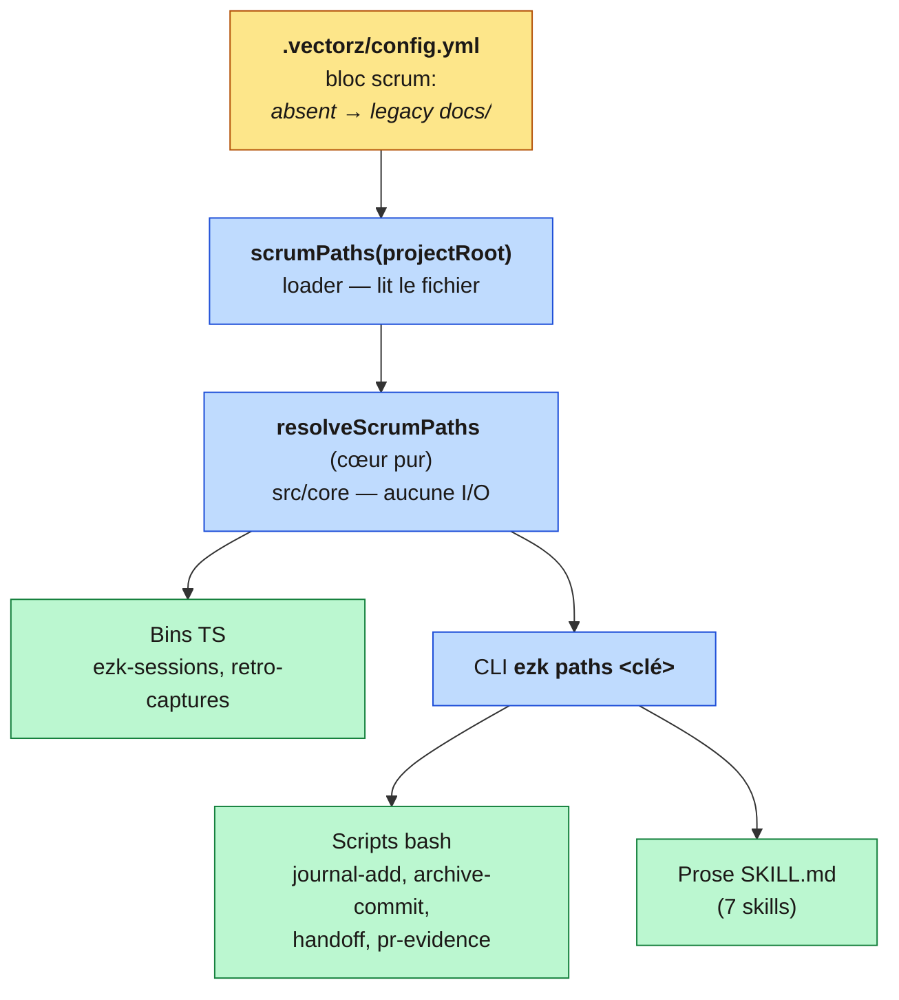

# ADR 0066 — Chemins des artefacts de méthode configurables via `.vectorz/`, regroupés sous `scrum/`

**Statut :** Accepté
**Date :** 2026-10-07
**Deciders :** PO + ezk-architect
**Lot :** V0.9 « Ranger la maison » (`milestone: rationalisation`)

## En clair

Les artefacts de **process** de la méthode (récits de sprint, notes de rétro, captures, journal,
preuves de PR) sont aujourd'hui dispersés dans `docs/`, mêlés à la vraie doc. On les regroupe sous
un dossier **`scrum/`**, et on rend leurs chemins **configurables** par un bloc `scrum:` dans
`.vectorz/config.yml` — sur le modèle exact du bloc `github:` déjà en place. **Le défaut reste les
anciens chemins `docs/…`**, donc aucun projet ne casse tant qu'il n'a pas migré. Pas de fiche
chapeau : le travail est **5 fiches sœurs** liées par le même `milestone` + la même `version`.

## Contexte

`docs/` mélange deux natures : de la **doc produit** (`articles/`, `audits/`, `adr/`) et de la
**continuité de méthode** (`sessions/`, `retro-notes/`, `captures/`, `journal/`, `pr-evidence/`).
Ces chemins de process sont **codés en dur** dans **7 skills** (~39 références), répartis sur trois
mondes : la prose des `SKILL.md`, des scripts bash, des bins TS. Comme les skills sont **partagés**
entre projets (vectorz, muti, samplerz…), changer la convention dans un seul projet le
désynchronise des skills.

Le dépôt a déjà la bonne forme pour résoudre ça : une couche `.vectorz/` avec un résolveur **pur**
`resolveGithub` (cœur sans I/O, [ADR-0003](0003-moteur-bind-plan-pur-coquille-io.md)) + un loader,
dont la règle d'or est « clé absente = comportement inchangé ».

## Décision

1. **Regrouper sous `scrum/`** : `scrum/sprints` (ex-`sessions`), `scrum/retro/{notes,captures}`
   (ex-`retro-notes` + `captures`), `scrum/journal`, `scrum/evidence` (ex-`pr-evidence`).
   `docs/adr/` et `features/` **restent** (vraie doc d'archi / backlog très installé).
2. **Rendre ces 5 chemins configurables** par un bloc `scrum:` dans `.vectorz/config.yml`, résolu
   par une fonction pure `resolveScrumPaths` (cœur, sans I/O) + un loader `scrumPaths` — **frère de
   `resolveGithub`**.
3. **Défaut = disposition legacy `docs/…`** (non-régression). `scrum: true` = disposition
   canonique nouvelle. Un objet `scrum: { … }` permet un override par clé pour un projet exotique.
4. **Trois consommateurs, une abstraction** : les bins TS importent `scrumPaths`, les scripts bash
   appellent `ezk paths <clé>` (qui imprime le chemin résolu — le bash ne parse jamais le YAML), la
   prose des `SKILL.md` référence `ezk paths` au lieu des littéraux.
5. **Migration par projet = un commit atomique** : `git mv` des 5 dossiers **+** `scrum: true`.
   Avant ce commit : config absente → legacy. Après : config présente → `scrum/`, fichiers déjà là.
   Aucune fenêtre où « les skills écrivent ici » et « les fichiers sont là » divergent.
6. **Pas de fiche chapeau** (décision PO 2026-10-07) : le travail est 5 fiches sœurs liées par
   `milestone: rationalisation` + `version: V0.9`. Une story = une fiche. Ce document (l'ADR) est
   le seul « récit d'ensemble ».

### Les 5 fiches (carte du lot)

| # | Fiche | Dépend de |
|---|---|---|
| 1 | Chemins de process configurables (`scrum:`) — fondation : `resolveScrumPaths` + loader + `ezk paths` + tests | rien |
| 2 | Brancher les 7 skills/scripts/bins sur le résolveur (retirer les 39 chemins en dur) | 1 |
| 3 | Basculer vectorz vers `scrum/` (`git mv` + `scrum: true` + fixtures de test) | 2 |
| 4 | Nettoyer `docs/` : supprimer `archive/`, requalifier/supprimer `e2e/` | rien (parallèle) |
| 5 | Note de migration + bascule d'un consommateur (muti) | 2 |

Chemin critique : **1 → 2 → {3, 5}** ; la 4 en parallèle.

## Conséquences

- (+) **Non-régression totale** : aucun projet ne casse avant d'avoir migré ; rollback = revert
  d'un commit.
- (+) **Une seule source de vérité** (le cœur TS) ; le bash ne parse pas de YAML.
- (+) `docs/` redevient de la doc ; le process est groupé, versionné, feuilletable.
- (−) La disposition nouvelle n'est pas le défaut zéro-config pendant le déploiement multi-projets
  (choix assumé : la sûreté prime). Inverser le défaut une fois tous les projets migrés est un
  futur bump de version — **YAGNI, non conçu maintenant**.
- (−) Les suites de test shell qui codent `docs/sessions` en dur se mettent à jour à la bascule
  vectorz (fiche 3).

### `SPRINT.md` — hors périmètre

Déjà tranché : [ADR-0054](0054-cloture-sprint-vs-archive-session.md) le déclare ignoré par git, et
vectorz l'ignore déjà. Le cas muti (commité) est porté par une fiche dédiée. Pas de clé `SPRINT.md`
dans `scrum:`.

## Le mécanisme en un schéma

**Légende.** En jaune la source unique (le fichier de config ; son absence = anciens chemins) ; en
bleu le résolveur pur et sa frontière d'entrée (loader + CLI) ; en vert les trois mondes
consommateurs, qui ne connaissent plus aucun chemin en dur. Les flèches descendent du réglage vers
les consommateurs : personne ne remonte vers un littéral.

**S'appuie sur :** [ADR-0003](0003-moteur-bind-plan-pur-coquille-io.md) (résolveur pur, DIP) ·
[ADR-0055](0055-artefacts-generes-hors-versionnage.md) (un artefact généré committé si un humain le
lit) · [ADR-0001](0001-monorepo-composable-coeur-deterministe.md) (le script range le mécanique, le LLM juge).
