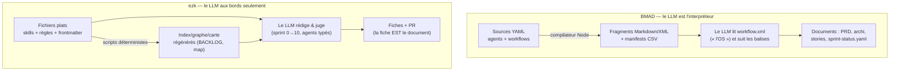

# Benchmark BMAD-METHOD vs méthode ezk — au niveau du code

> Rapport commandé le 2026-08-25. Comparaison **au niveau du code** des deux méthodes
> agiles pilotées par LLM que le projet connaît : **BMAD-METHOD** (le framework open-source
> de référence) et **ezk** (la méthode maison, celle de ce dépôt).

**En clair.** BMAD et ezk visent la même chose — faire construire un produit par des agents LLM,
proprement. Mais elles font un **pari opposé sur qui tient le volant**. BMAD met tout dans des
**instructions en prose** (Markdown/XML) et laisse le **LLM tout interpréter** ; un compilateur
Node se contente d'assembler les fragments. ezk fait l'inverse : un **cœur déterministe** (scripts
sur des listes + git) fait tout le rangement, et le **LLM ne travaille qu'aux bords** (il rédige,
il juge). Résultat : BMAD est **plus riche à l'usage** (menus, elicitation, « quoi faire après »),
ezk est **plus sûr et moins cher** (rien de load-bearing ne dépend d'un prompt). Le verdict tient
en une phrase : **on ne doit pas devenir BMAD, mais trois de ses mécanismes valent la peine d'être
volés** — le menu « et maintenant ? », la boucle d'elicitation, et le catalogue de commandes compilé.

**Si tu arrives frais.**
- *BMAD* = *Breakthrough Method for Agile AI-Driven Development*, un framework open-source (licence MIT).
- *ezk* = la méthode de ce dépôt, outillée en **skills** Claude Code (`/ezk-…`), **agents** et **règles**.
- *agent* = une persona LLM avec un rôle (dev, PM, architecte…).
- *workflow* (BMAD) / *skill* (ezk) = une procédure invocable.
- *elicitation* = une boucle où l'agent propose des façons d'améliorer ce qu'il vient d'écrire, tu en choisis une, il l'applique, il re-propose.
- *menu / `*help`* = la liste numérotée des actions qu'un agent sait faire, affichée quand tu l'actives.

---

## 1. Le verdict en une page

Chaque ligne : qui fait le travail, qui s'en sort le mieux, et ce qui se transpose à ezk.

| Dimension | BMAD | ezk | Avantage | À voler ? |
|---|---|---|---|---|
| **Découvrabilité / « et maintenant ? »** | menu numéroté à l'activation + routeur global `/bmad-help` + « Next Steps » en fin d'étape | `/ezk-help` (index plat généré), sinon prose ; rien en fin de commande | **BMAD** | **Oui** — [20260825160456259](../../../../features/20260825160456259_next-step-affordance-commandes-suivantes.md) |
| **Elicitation (raffinement guidé)** | boucle `advanced-elicitation` : 50 méthodes, propose 5, applique, re-propose | absente ; `groom` délègue à un brainstorm libre | **BMAD** | **Oui** — [20260825161522791](../../../../features/20260825161522791_elicitation-raffinement-structure-groom.md) |
| **Templates de livrables** | PRD, archi, story, epic… templatés avec instructions embarquées | 1 seul vrai template (la fiche) + ADR | **BMAD** | Partiel — [20260817113353538](../../../../features/20260817113353538_etude-prior-art-bmad-templates-elicitation.md) |
| **Modèle / graphe** | manifests CSV compilés (`bmad-help.csv`, `agent-manifest.csv`, SHA-256) | schéma typé `domain.ts` **mais aucune instance compilée** ; graphe dérivé à la volée | **BMAD** (sur ce point précis) | **Oui** — [20260821204737357](../../../../features/20260821204737357_cabler-la-methode-modele-compile.md) |
| **Orchestration** | 4 phases longues, un « OS » `workflow.xml` interprété par le LLM | boucle sprint 0→10, étapes déléguées à des agents typés | Nul (choix différents) | Non |
| **Sûreté / cœur** | tout est un prompt **non appliqué** (« NEVER skip a step ») | cœur déterministe testé (ADR-0001) ; LLM jamais load-bearing | **ezk** | — |
| **Coût (tokens / temps)** | lourd : persona + menu + `workflow.xml` rechargés à chaque tour | léger : fichiers plats, scripts, délégation par modèle | **ezk** | — |
| **Personnalisation** | prises `*.customize.yaml`… **inutilisées à 100 %** dans nos 3 installs | règles + profils **réellement** utilisés et CI-vérifiés | **ezk** | — |

**Les 3 choses à voler (par ordre de valeur) :**
1. **Le « et maintenant ? »** en fin de commande — le manque le plus criant côté ezk, et le moins cher à combler.
2. **La boucle d'elicitation** — le vrai joyau de BMAD ; transposable au `groom` d'ezk.
3. **Le catalogue de commandes compilé** — ezk a le schéma (`domain.ts`) mais pas l'instance ; BMAD montre la cible.

---

## 2. Les deux méthodes en une image

**La différence de fond.** BMAD est un **compilateur + un tas de prompts** : rien n'exécute vraiment
le workflow, c'est le LLM qui obéit (ou pas) à des consignes du genre « n'saute JAMAIS une étape ».
ezk pose la règle inverse (ADR-0001) : *« cœur déterministe = ce qui doit toujours marcher ; LLM aux
bords seulement, jamais load-bearing »* ([domain.ts](../domain.ts)). Tout le reste des différences
découle de ce choix.

---

## 3. Comparaison dimension par dimension

### Dim 1 — Découvrabilité et « et maintenant ? » *(ton déclencheur n°1)*

- **BMAD.** Trois mécanismes qui se cumulent :
  1. À l'activation, chaque agent **affiche un menu numéroté** de toutes ses actions, puis **s'arrête et attend** (`src/utility/agent-components/activation-steps.txt`). Le choix se fait par numéro ou par **fuzzy match** (fait par le LLM, pas par du code).
  2. Un **routeur global** `/bmad-help` (`src/core/tasks/help.md`) lit le catalogue `bmad-help.csv`, regarde ce qui vient d'être produit, et **recommande la prochaine étape requise**.
  3. Chaque workflow **imprime la suite** en clair. Exemple (`create-story/instructions.xml:336`) : « Next Steps: 1. Review the story… 2. Run `dev-story`… 3. Run `code-review` when complete ».
  > Nuance de version : le préfixe `*` de l'ancien BMAD **a disparu en v6**. Le menu passe par des codes à 2 lettres (`[CP]`, `[MH]`, `[DA]`) auto-injectés + les commandes `/slash`.
- **ezk.** `/ezk-help` ([bin/ezk-help.ts](../../bin/ezk-help.ts)) génère un **index plat** de tous les skills depuis les frontmatter — il répond « quelles commandes existent », **pas** « que faire maintenant, ici ». En fin de sprint, l'étape 9 est un **STOP en prose** (« on continue ? »), sans proposer de commande. La suite est **tirée** au prochain intake via `ezk-backlog next --ready-only`, jamais **proposée**. Seule exception : une ligne isolée dans `ezk-codex`.
- **Verdict.** **BMAD gagne nettement.** C'est exactement le trou que tu as ressenti.
- **À voler.** Un bloc **« Et maintenant ? »** en clôture de commande (1-3 commandes contextuelles). Déjà capturé : fiche [`20260825160456259`](../../../../features/20260825160456259_next-step-affordance-commandes-suivantes.md).

### Dim 2 — Templates de réponse et elicitation *(ton déclencheur n°2)*

- **BMAD.** Les templates sont du Markdown à variables `{{mustache}}`. La vraie valeur est la **boucle d'elicitation** (`src/core/workflows/advanced-elicitation/workflow.xml` + **50 méthodes** dans `methods.csv`). Après chaque section écrite, l'agent propose `[a] Advanced Elicitation, [c] Continue, [p] Party, [y] YOLO`. Si tu prends `a`, il **choisit 5 méthodes parmi 50** selon le contenu, en applique une, montre la version améliorée, demande de valider, puis **re-propose** — jusqu'à ce que tu sortes. C'est un patron concret de raffinement itératif que la plupart des frameworks n'ont pas.
- **ezk.** **Pas d'elicitation.** Le plus proche est `groom` qui délègue à `product-management:product-brainstorming` — un brainstorm **libre**, pas un menu numéroté répétable. Côté templates : **un seul** vrai template de livrable, la fiche ([feature-template.md](../../skills/ezk-backlog/templates/feature-template.md)), dont la force est ailleurs — **la fiche EST le document, le corps de PR n'en est que le rendu** (ADR-0029). La règle « En clair » ([human-facing-lisibility](../../rules/documentation-guidelines/human-facing-lisibility.md)) impose une lisibilité que BMAD n'a pas.
- **Verdict.** **BMAD gagne sur le mécanisme** (elicitation + bibliothèque de templates). ezk gagne sur **la lisibilité imposée**.
- **À voler.** Une **boucle d'elicitation** dans `groom` (menu de méthodes de raffinement, appliquer→revoir→re-proposer). Capturé : fiche neuve ci-dessous + enrichissement de l'étude existante `20260817113353538`.

### Dim 3 — Structure des agents

- **BMAD.** Un agent = un `*.agent.yaml` (`metadata` / `persona` / `menu`) **compilé** en XML-dans-Markdown. Chaque item de menu porte **un** handler (`workflow` / `exec` / `tmpl` / `data` / `action`). Le handler `workflow` charge toujours d'abord `workflow.xml`. 10 agents en v6.0.4 (analyst, architect, dev, pm, qa, sm, ux-designer, tech-writer, quick-flow, bmad-master).
- **ezk.** Un agent = un `agents/*.md` : rôle en prose + `competences[]` (ids de skills) + `interactions[]` (ids de règles) + des **boutons d'exécution** dans le frontmatter (`model` / `model_spare` / `effort` / `isolation`). 7 agents. Le sprint choisit **Opus pour juger, Sonnet pour la mécanique**, automatiquement.
- **Verdict.** Différent, pas mieux/moins bien. BMAD standardise l'**activation** ; ezk standardise le **coût/modèle** par agent.
- **À voler.** Rien d'urgent. Le `model`-aware d'ezk est même un cran au-dessus.

### Dim 4 — Orchestration et « OS » d'exécution

- **BMAD.** Un fichier prompt de ~230 lignes, `src/core/tasks/workflow.xml`, se décrit comme *« the CORE OS for executing BMAD workflows »*. Il définit le contrat : lire les fichiers en entier, exécuter les étapes **dans l'ordre exact**, sauver après chaque balise `<template-output>`, un vocabulaire de balises (`<action>`, `<check if>`, `<ask>`, `<goto>`…), et deux modes (`normal` vs `#yolo`). Le pipeline canonique est long : analyse → PRD → UX → archi → epics → sprint → story → dev → review → rétro.
- **ezk.** La boucle `ezk-sprint run` (0→10) : intake (`reconcile` + `next --ready-only`) → POC → archi (ADR) → BDD (Gherkin = DoD) → TDD (red-green-refactor) → gate local (`act`) → E2E (Playwright) → revue adverse GO/NO-GO → PR → **STOP checkpoint** → squash-merge + `ship`. Chaque étape est **déléguée à un agent typé**.
- **Verdict.** Choix différents. BMAD = un interpréteur unique très verbeux ; ezk = une chaîne d'agents avec gates outillés (tests, CI, E2E **réellement lancés**).
- **À voler.** Rien : l'« OS » unique de BMAD est aussi sa fragilité (voir Dim 6).

### Dim 5 — Build, compilation et modèle

- **BMAD.** Un installeur Node (`tools/cli/`) **compile** les agents, **génère les manifests** dans `_bmad/_config/` (`agent-manifest.csv`, `workflow-manifest.csv`, `files-manifest.csv` avec **SHA-256 par fichier**), et **fusionne** les `module-help.csv` en un **catalogue unique** `bmad-help.csv` (58 commandes, colonnes `phase, code, command, required, agent, description, outputs`…). C'est une vraie **couche de build**, bien séparée des sources.
- **ezk.** Le schéma existe — [domain.ts](../domain.ts) type proprement Rule / Bundle / Skill / Agent / Profile — **mais il n'y a aucune instance compilée**. Le graphe est **redérivé à la volée** (`src/loaders/catalog.ts`). Ce qui est compilé, ce sont des **vues** régénérées et CI-vérifiées : `regen-backlog.sh` (l'index BACKLOG), `regen-composes-graph.ts` (un graphe Mermaid), `ezk-map.ts` (la carte 3-étages). Le câblage relationnel (`competences` / `roles` / `interactions`) est **peu peuplé** : beaucoup de liens vivent encore en **prose Markdown** (chemins fragiles, d'où le `check-links.sh` à lancer à la main).
- **Verdict.** **BMAD gagne sur ce point précis** : il a l'objet compilé interrogeable que ezk n'a pas encore.
- **À voler.** Compiler le graphe en **une instance typée** (pas juste des vues Mermaid). Déjà capturé et argumenté : fiche [`20260821204737357`](../../../../features/20260821204737357_cabler-la-methode-modele-compile.md).

### Dim 6 — Sûreté : qui garantit que ça marche ?

- **BMAD.** **Rien n'est appliqué par du code.** La justesse dépend entièrement du LLM qui honore des consignes du type `<mandate>NEVER skip a step</mandate>`. Le registre tout-en-majuscules (« do NOT be lazy », « prevent developer fuckups ») trahit une conformité **fragile**. Et le compilateur lui-même a des ratés : dans `bmad-help.csv`, la prose de persona a été **injectée par erreur** au milieu de la colonne `agent-command` (split naïf sur `:`).
- **ezk.** Règle fondatrice (ADR-0001) : le **cœur déterministe** (scripts + git) fait tout ce qui doit toujours marcher ; le LLM ne « range » jamais. Le tri du backlog, les compteurs, les gates, les merges : **des scripts testés**, pas des prompts.
- **Verdict.** **ezk gagne franchement.** C'est le pari le plus important, et ezk l'a fait dans le bon sens.
- **À voler.** Rien — c'est BMAD qui devrait voler ça.

### Dim 7 — Coût (tokens et temps)

- **BMAD.** Lourd **par conception** : chaque activation injecte activation + handlers + persona + menu ; `workflow.xml` (~230 l.) est **rechargé à chaque workflow** ; la stratégie `discover_inputs` (« when in doubt, LOAD IT ») aspire des PRD/archi entiers en contexte. Même les adeptes confirment « c'est long » (~5-6 workflows documentaires avant le code) — le module `quick-flow` existe précisément pour court-circuiter ça.
- **ezk.** Léger : fichiers plats, scripts déterministes, délégation par modèle (Sonnet pour la mécanique). Pas de rechargement d'« OS » à chaque étape.
- **Verdict.** **ezk gagne.**
- **À voler.** Rien.

### Dim 8 — Personnalisation sans forker

- **BMAD.** Mécanisme prévu : des prises `_config/agents/*.customize.yaml` (`persona` / `critical_actions` / `menu` / `prompts`) qui **surchargent** un agent sans toucher la source. Constat gênant : dans **nos 3 installs** (vectorz, cop1-cobaye, okascore), **100 % des prises sont le template vierge non modifié**. Le canal existe, personne ne s'en sert.
- **ezk.** La personnalisation passe par les **règles** et **profils**, qui sont **réellement utilisés** et vérifiés en CI (chaque brique doit avoir un étage, sinon rouge — ADR-0039).
- **Verdict.** **ezk gagne** — non par le mécanisme, mais parce que le sien vit vraiment.
- **À voler.** Rien.

---

## 4. Ce que ezk fait déjà aussi bien, ou mieux

- **Le cœur déterministe (ADR-0001)** — la meilleure décision d'archi des deux méthodes. Rien de critique ne dépend d'un prompt.
- **Tout est fichier plat** — Markdown + frontmatter + YAML, portable sur n'importe quel hôte via `bind`/caps.
- **Source unique + projections régénérées** — le frontmatter fait foi ; index, graphe, carte, help sont **générés** et CI-vérifiés (pas de dérive manuelle).
- **Lisibilité imposée** — la règle « En clair » (MUST, avec un agent qui l'applique + une métrique) n'a **pas d'équivalent** chez BMAD.
- **Délégation consciente du modèle** — Opus pour juger, Sonnet pour la mécanique, isolation en worktree pour les agents qui écrivent.
- **Économie du DoR** — `groom` ne se déclenche qu'au moment de tirer la fiche ; `next --ready-only` révèle toujours la **tête bloquée** (pas d'inversion de priorité silencieuse).

Autrement dit : **ezk a un meilleur socle** (sûreté, coût, lisibilité, portabilité). Ce qui lui manque,
c'est la **couche d'affordances interactives** que BMAD a soignée.

---

## 5. Ce qu'on devrait voler à BMAD → fiches

Les recommandations sont **déjà rangées dans le backlog** (dédoublonnées contre l'existant) :

| Reco | Statut backlog |
|---|---|
| **« Et maintenant ? »** en fin de commande | Fiche **neuve** [`20260825160456259`](../../../../features/20260825160456259_next-step-affordance-commandes-suivantes.md) (idée #1) |
| **Boucle d'elicitation** dans `groom` | Fiche **neuve** [`20260825161522791`](../../../../features/20260825161522791_elicitation-raffinement-structure-groom.md) |
| **Bibliothèque de templates + étude prior-art** | **Enrichit** l'étude existante [`20260817113353538`](../../../../features/20260817113353538_etude-prior-art-bmad-templates-elicitation.md) |
| **Graphe compilé** (instance, pas vues) | **Existe déjà**, argumenté : [`20260821204737357`](../../../../features/20260821204737357_cabler-la-methode-modele-compile.md) |

Ce qu'on **n'imite pas** volontairement : le pipeline documentaire long (4 phases), l'« OS »
`workflow.xml` non appliqué, les prises de personnalisation (le canal règles/profils d'ezk fait mieux).

---

## 6. Annexe — preuves, sources et limites

### Sources et versions (à rejouer)

- **BMAD, code source lu** : `bmad-method@6.0.4` (cache npx `~/.npm/_npx/2d6bcd63982e6f85/node_modules/bmad-method`). Secondaire consulté : `6.0.0-alpha.22`.
- **BMAD, tel qu'installé** dans ce dépôt et voisins : `6.0.0-Beta.8` (`_bmad/_config/manifest.yaml`) — d'où de légers écarts de comptage (14 agents installés avec modules externes `bmb`/`tea`, vs **10** dans le cœur `core`+`bmm` de la 6.0.4).
- **BMAD, run réel** : `cop1-cobaye/_bmad-output/` — **banc d'essai jetable** (une story semée à la main), pas un run canonique complet.
- **ezk** : ce dépôt, `products/mega-city/` au commit `b4bbde8`.

### Fichiers-clés (pour aller lire)

**BMAD** — `src/core/tasks/workflow.xml` (l'« OS ») · `src/core/workflows/advanced-elicitation/workflow.xml` + `methods.csv` (elicitation) · `src/utility/agent-components/activation-steps.txt` + `tools/cli/lib/agent/compiler.js` (menu/help) · `src/core/tasks/help.md` (routeur) · `src/bmm/module-help.csv` (catalogue) · `src/bmm/workflows/4-implementation/{create-story,sprint-status,code-review}/` (le cycle dev).

**ezk** — [docs/domain.ts](../domain.ts) (schéma) · [ADR-0001](../adr/0001-monorepo-composable-coeur-deterministe.md) (cœur déterministe) · [ADR-0029](../adr/0029-fiche-est-le-document-pr-en-est-le-rendu.md) (fiche = document) · [bin/ezk-help.ts](../../bin/ezk-help.ts) · [bin/regen-backlog.sh](../../bin/regen-backlog.sh) · [rules/documentation-guidelines/human-facing-lisibility.md](../../rules/documentation-guidelines/human-facing-lisibility.md) · [skills/ezk-backlog/templates/feature-template.md](../../skills/ezk-backlog/templates/feature-template.md).

### Chiffres (source : les 3 lectures de code de cette session)

- **BMAD 6.0.4** : 10 agents · ~25 fichiers-workflow · 8 tâches cœur · **50 méthodes d'elicitation** · 7 checklists · 1 team.
- **BMAD installé (Beta.8)** : 14 agents · 46 workflows · catalogue `bmad-help.csv` de **58 commandes** · manifest d'intégrité de **565 fichiers** (SHA-256).
- **ezk** : **22 skills** · **7 agents** · **59 règles** (10 catégories) · **12 bundles** · **6 profils** · **30 ADR**.

### Limites de ce benchmark (honnêteté)

- Comparaison **statique** (lecture de code), pas un run A/B chronométré des deux méthodes sur la même feature.
- Léger **écart de version** BMAD (source 6.0.4 vs installé Beta.8) — signalé partout où ça compte.
- Le « run réel » BMAD est un **banc d'essai jetable**, il ne montre pas le pipeline documentaire complet.
- Les comptages ezk viennent des frontmatter ; un `regen`/`ezk:help` fait foi si un écart apparaît.

---

## 7. Ce que ça veut dire pour toi

**En une phrase : garde le socle d'ezk, vole trois affordances à BMAD.**

- **Ta demande n°1 est validée et déjà fichée** : le « et maintenant ? » en fin de commande est le
  manque le plus net, et le moins cher à combler. Fiche `20260825160456259`, rattachée à l'épic
  découvrabilité.
- **Ta demande n°2 (templates BMAD) a une réponse claire** : le vrai trésor n'est pas les templates,
  c'est l'**elicitation**. C'est ce qu'il faut transposer au `groom`, pas les gabarits documentaires.
- **Ne copie pas BMAD en entier** : son pipeline long et son « OS » non appliqué sont ses faiblesses,
  et ton cœur déterministe (ADR-0001) est meilleur que tout ce qu'il a.

**Ce qu'il te reste à faire** : arbitrer les priorités — les **2 fiches neuves** (« et maintenant ? » et
elicitation) sont en **P2**, la fiche **graphe compilé** (`20260821204737357`) est déjà en **P1**. À toi de
dire si le « et maintenant ? » doit monter. Puis groomer quand tu voudras les tirer. Le reste est déjà rangé.
