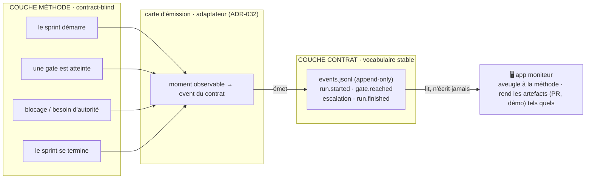

# Carte de la méthode — le diagramme vivant

> **Diagramme VIVANT** : il représente la méthode `ezk-*` **telle qu'elle est aujourd'hui**.
> Il **doit être mis à jour dans la même PR** que toute modification de la méthode (skill,
> agent, règle, ou flux). Voir « Mise à jour » en bas. Rendu nativement par GitHub (Mermaid).

Deux couches, volontairement séparées (cf. [ADR-032](../../../docs/adr/ADR-032-emission-adaptateur-separable.md)) :
la **méthode** (ce qu'on fait) et le **contrat** (les événements qu'on émet pour être supervisable).

---

## Couche 1 — La méthode (le flux de travail)

*Ce qui se passe réellement, aujourd'hui, quand on développe.*

**Acteurs** : le **PO** (déclenche, tranche) · les **skills** `ezk-product-builder` (chaîne),
`ezk-sprint` (1 fiche → 1 PR), `ezk-backlog` (le stock), `ezk-retro` (améliore) · **LA LOI**
(`rules/`) qui guide et se fait enrichir.

---

## Couche 2 — Le contrat (les événements émis)

*Ce que la méthode **émet** pour qu'une app moniteur — **aveugle à la méthode** — puisse suivre
l'avancement. Le vocabulaire est gelé (contrat de supervisabilité, 2026-07-13).*

> ⚠️ **État réel** : la couche 1 (méthode) **existe**. La couche 2 (émission) est **le
> contrat gelé** (la cible) — les skills `ezk-*` **n'émettent pas encore** ; le câblage est en
> cours de conception : ADR-032 (émission = adaptateur), fiche subtree 0067 (`ezk-ezk`
> contract-aware), fiche 0050 (kit émetteur), spike vectorz 0048 (envelopper BMAD). Ce
> diagramme montre la **cible d'émission**, pas un flux déjà branché.

---

## Mise à jour (discipline)

Ce diagramme **périme silencieusement** si on ne le tient pas. Règle :

> **Toute PR qui modifie la méthode — un `SKILL.md`, un agent, une règle de `rules/`, ou le
> flux de sprint — met à jour cette carte dans la même PR.**

Formalisation en **règle enforced** (wirée à un bundle) : fiche subtree **0068**. En attendant,
c'est une convention. `ezk-retro` peut faire évoluer cette règle comme n'importe quelle autre.
