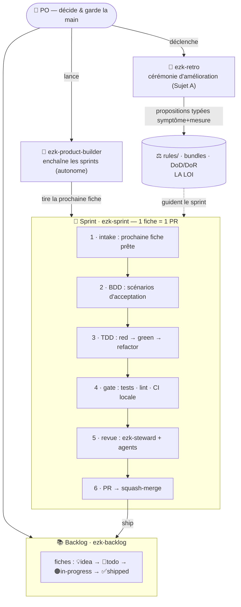
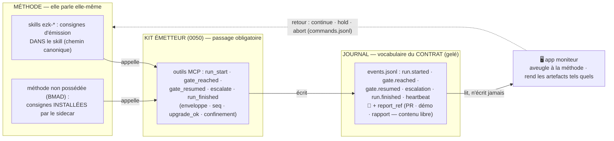
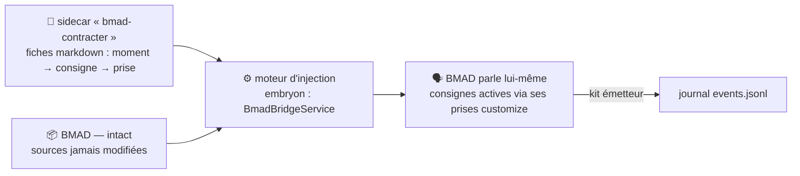

# Carte de la méthode — le diagramme vivant

> **Diagramme VIVANT** : il représente la méthode `ezk-*` **telle qu'elle est aujourd'hui**.
> Il **doit être mis à jour dans la même PR** que toute modification de la méthode (skill,
> agent, règle, ou flux). Voir « Mise à jour » en bas. Rendu nativement par GitHub (Mermaid).

Deux couches, volontairement séparées (cf. [ADR-032](../../../docs/adr/ADR-032-emission-adaptateur-separable.md),
statut **PROPOSÉ** — direction **(i)** actée par le PO le 2026-07-17 : *l'émetteur canonique vit
**dans** la méthode ; le « sidecar » installe l'émission dans les méthodes qu'on ne possède pas*) :
la **méthode** (ce qu'on fait) et le **contrat** (les événements qu'on émet pour être supervisable).

---

## Couche 1 — La méthode (le flux de travail)

*Ce qui se passe réellement, aujourd'hui, quand on développe.*

**Acteurs** : le **PO** (déclenche, tranche) · les **skills** `ezk-product-builder` (chaîne),
`ezk-sprint` (1 fiche → 1 PR), `ezk-backlog` (le stock), `ezk-retro` (améliore) · **LA LOI**
(`rules/`) qui guide et se fait enrichir.

---

## Couche 2 — Le contrat (les événements émis)

*Ce que la méthode **émet** pour qu'une app moniteur — **aveugle à la méthode** — puisse suivre
l'avancement. Le vocabulaire est gelé (contrat de supervisabilité, 2026-07-13). **C'est la méthode
elle-même qui parle** : les consignes d'émission vivent **dans** ses skills — ou y sont
**installées par le sidecar** quand on ne possède pas la méthode. Elle appelle le **kit émetteur**,
qui écrit le journal.*

**Deux groupes de messages** : ① le **vocabulaire typé** (la petite liste fixe ci-dessus) pilote
l'état et **les freins** — au `gate.reached`, la méthode **s'arrête** et attend `continue` ; ② le
**contenu libre de la méthode** (lien de PR, démo, rapport…) voyage **en pièce jointe**
(`report_ref`) des messages typés — l'app l'affiche **tel quel**, sans le comprendre.

### Le sidecar (méthodes qu'on ne possède pas — ex. BMAD)

> **Le sidecar est un installateur, pas un observateur** : il injecte les consignes d'émission dans
> les **prises officielles** de BMAD (`_bmad/_config/agents/*.customize.yaml`) — après quoi c'est
> **BMAD lui-même** qui émet et **s'arrête aux jalons**. BMAD reste utilisable normalement, avec ou
> sans vectorz. Fiche : subtree **[0058](../features/0058-bmad-contrat-supervisabilite.md)** (après 0050).

> ⚠️ **État réel** : la couche 1 (méthode) **existe**. Le **kit émetteur** de la couche 2
> **existe aussi** — `products/mega-city/src/supervision/` : journal JSONL, serveur MCP,
> runtime, 5 outils (fiche 0050, in-progress). Ce qui **manque** : les skills `ezk-*`
> n'**appellent pas encore** le kit pendant un vrai sprint, et le sidecar BMAD n'est pas construit.
> Chemin acté (PO, 2026-07-17) : **finir 0050 → construire 0058 (le sidecar)** ; `ezk-ezk`
> contract-aware (0067) suivra pour les nouveaux skills.

---

## Mise à jour (discipline)

Ce diagramme **périme silencieusement** si on ne le tient pas. Règle :

> **Toute PR qui modifie la méthode — un `SKILL.md`, un agent, une règle de `rules/`, ou le
> flux de sprint — met à jour cette carte dans la même PR.**

Formalisation en **règle enforced** (wirée à un bundle) : fiche subtree **0068**. En attendant,
c'est une convention. `ezk-retro` peut faire évoluer cette règle comme n'importe quelle autre.
