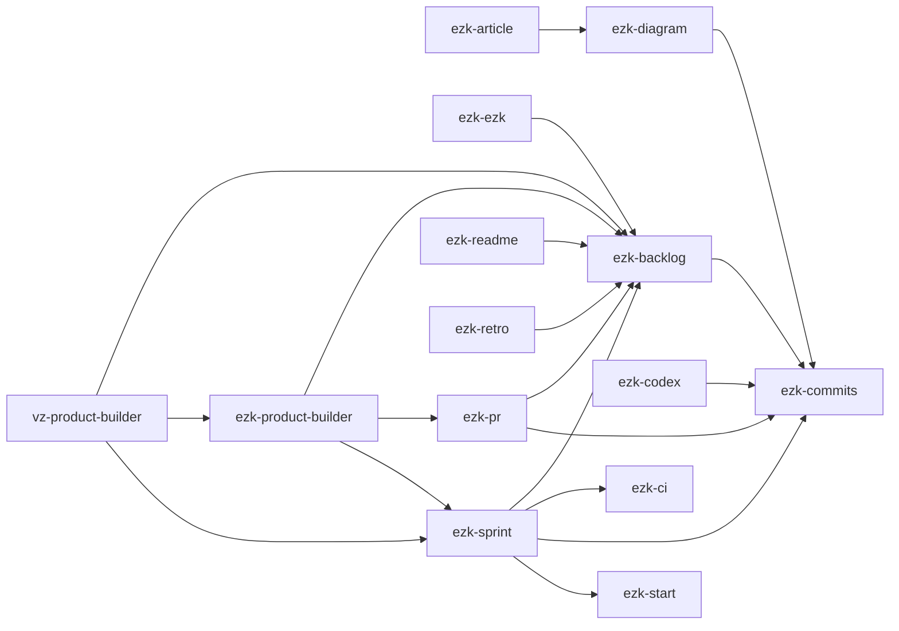

# skills/ — catalogue des compétences (host-agnostique)

Le **corps markdown** des skills (le playbook), indépendant de l'hôte. Source de vérité unique.
Les `caps/<host>/` les matérialisent dans la forme native de chaque LLM.

Un skill = un dossier :

```
ezk-commits/
├── SKILL.md      ← frontmatter (name, description = le déclencheur) + playbook markdown
└── scripts/      ← scripts optionnels
```

**Migration** : tes skills `ezk-*` actuels (repo `claude-skills`) viendront ici à ton rythme.
En attendant, ils restent utilisables **tels quels** via `install.sh` — voir `caps/claude-desktop/`.

## Catalogue

| skill | état | rôle |
|---|---|---|
| `ezk-ezk` | 📝 proposé (ADR-0007) | méta-skill : transforme une session en skill réutilisable (compose brainstorming + architecture + skill-creator ; range via `scripts/deploy.sh`) |
| `ezk-archive` | 📥 importé (strangler-fig), portier (0088, ADR-0021) | rituel de clôture de session : clôt proprement un repo pour ne rien perdre entre deux sessions. `scripts/check.sh` est un **portier** (verdict `CLEAN`/`DIRTY` — sur CLEAN la clôture est traitée inline, sur DIRTY déléguée au sous-agent scopé) ; `scripts/handoff.sh` range la note en anneau FIFO |
| `ezk-start` | 📦 nouveau (fiche 0090 tâche 1) | garde-fou d'**ouverture** de session (symétrique d'archive) : working tree, worktrees parallèles, fiches `in-progress`, handoff + tête PLAN. Portier read-only (`VERDICT: CLEAR`/`ALERT`) — sur ALERT choix explicite (rejoindre / interrompre journalisé), jamais de démarrage silencieux de sprint |
| `ezk-product-builder` | 📝 proposé (ADR-0008) | couche product-owner : construit un produit en enchaînant des sprints (compose ezk-backlog + /product-brainstorming + ezk-sprint ; pure orchestration, aucun script) |
| `ezk-commits` | 📥 importé (strangler-fig, pilote 0004) | messages Conventional Commits + hook `commit-msg` (`scripts/commit-msg`) — 1er skill rendu **bindable** (loader sous-dossiers) |
| `ezk-backlog` | 📥 importé (0024, version #31) | backlog markdown versionné (add dédoublonnant + version + brainstorm) — satisfait la fiche 0022 |
| `ezk-sprint` | 📥 importé (0024) | orchestrateur de sprints autonomes (BDD→TDD→gate→revue→PR→squash) |
| `ezk-ci` | 📥 importé (0024), volet conso (0055) | valide les pipelines GitHub Actions en local (act + Docker) + surveille/plafonne la conso GHA des repos privés (`conso`/`frugal`) |
| `ezk-preview` | 📥 importé (0024) | URL de démo pour une feature (Vercel / cloudflared / tailscale) |
| `ezk-device` | 📥 importé (0024) | build + test Android sur un tél physique distant (Tailscale/adb) |
| `ezk-apk` | 📥 importé (0024) | build d'un APK/IPA de preview sur EAS + lien d'install |
| `ezk-npm-scripts` | 📥 importé (0024) | hygiène des scripts npm/pnpm/turbo d'un monorepo |
| `ezk-design-system` | 📥 importé (0024) | design system minimal (tokens + atomes + styleguide vivant) — l'« étendre » reste la fiche 0019 |
| `ezk-pr` | 📦 nouveau (ADR-0009, fiche 0027) | orchestre le **test-puis-merge d'un stock de PRs** : `init` (convention Validation — template mince lié à `docs/PR_VALIDATION.md`, jamais écrasé), `plan` (ordre de merge par merge-tree, sessions groupées), `run`/`report`/`ship` (compose ezk-preview, ezk-device/apk, verify, ezk-backlog) |
| `ezk-diagram` | 📦 nouveau | prose → diagramme **Mermaid** versionné (triplet `diagrams/<slug>/`) + vues partageables : `README.md` rendu nativement par GitHub & liens mermaid.live/ink (`scripts/render.sh` + `publish.sh`) |
| `ezk-docker` | 📦 récupéré (commit orphelin) | pilote une **stack Docker** locale de test/dev via le socket (`up`/`ps`/`logs`/`down`/`nuke`), conventions blast-radius (stacks préfixées, teardown obligatoire) — frontière nette vs `ezk-ci` |
| `ezk-readme` | 📦 récupéré (commit orphelin) | crée/audite **le README** d'un projet (pitch, badges adossés au réel, quickstart, indirections vers les sources de vérité) ; `create` / `audit` (rapport + diff, jamais d'écrasement) |
| `ezk-retro` | 📦 né du 1er self-host (fiche 0063) | **cérémonie d'auto-amélioration de la méthode** (Sujet A) : round-robin d'agents → propositions typées symptôme+mesure → juge de cohérence → rangement `rules/`/backlog sous contrôle PO (`help`/`run`/`impose`/`retire`) |
| `ezk-article` | 📦 nouveau (fiche 0049) | écrit/réécrit un **article technique vulgarisé** : brief de persona demandé au demandeur, règles d'écriture encodées, **panel de 5 relecteurs frais** (lecteur cible, essais techniques, copy-editor, fidélité aux sources, références) + contre-lecture à froid = gate de publication ; `revise` versionne côte à côte (`<slug>-vN.md`) |
| `ezk-codex` | 📦 nouveau (ADR-0024) | **adresse les retours Codex d'une PR** de bout en bout : `fix` (récupère findings inline+reviews, corrige ou **décline** les faux positifs + 👎, commit scopé, push, re-déclenche `@codex review`, **sonde de verdict bornée**) · `check` (lecture seule). Garde-fou de tête : **stand-down** anti-collision (PR mergée / branche pilotée ailleurs / commits d'une autre session). Composé par `ezk-sprint` (étape 10) + `ezk-pr` (`ship`) ; **ne merge pas** |

> **Agents** (`../agents/`) : `ezk-architect`, `ezk-pm`, `ezk-qa`, `ezk-reviewer`, `ezk-steward`, `ezk-dev` (6, tous bindés par le profil `global`).
> Migration du contenu **terminée** : 12 skills migrés (0024) + `ezk-pr` (né ici) + `ezk-diagram` + `ezk-docker` & `ezk-readme` (récupérés de commits orphelins au passage au monorepo vectorz) + `ezk-retro` (né du 1er self-host, fiche 0063) + `ezk-article` (né de la fiche 0049) + `ezk-start` (fiche 0090) = **19 skills** au profil `global`, + 6 agents.
> Hors catalogue `global` : `supervision-demo` (méthode JOUET pour éprouver le kit de supervision — non déployée) · `supervision-analyze` (post-mortem journal + transcript — fiche 0104, opt-in) · `vz-product-builder` (overlay AUTONOME du product-builder à corpus de reviewers, fiche 0060 — opt-in explicite, jamais bindé par défaut : l'autonomie se choisit).
> Follow-up hors migration : **étendre** `ezk-design-system` (UI/UX requêtable, fiche 0019).

## Graphe de composition (`composes:`)

<!-- composes-graph:begin -->

<!-- composes-graph:end -->
