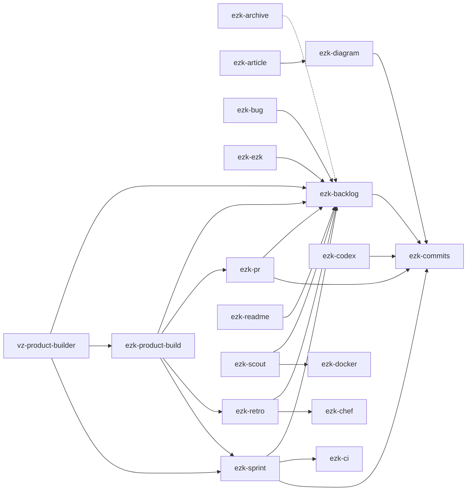

# skills/ — catalogue des compétences (host-agnostique)

## En clair

Un skill est une compétence que Claude Code sait lancer avec une commande (`/ezk-…`). Ce tableau liste **tous** les skills du dépôt, une ligne chacun. La colonne « profil » dit si le skill est déployé partout (`global`) ou à activer à la demande (`opt-in`). Pour l'index toujours à jour, tape `/ezk-help`. Pour une question « comment faire ? », ouvre la [FAQ](../../../docs/faq-comment-faire.md).

Le **corps markdown** d'un skill (le playbook) est indépendant de l'hôte : c'est la source de vérité unique. Les `caps/<host>/` le matérialisent dans la forme native de chaque LLM.

Un skill = un dossier :

```
ezk-commits/
├── SKILL.md      ← frontmatter (name, description = le déclencheur) + playbook markdown
└── scripts/      ← scripts optionnels
```

## Catalogue

| skill | pour quoi faire | profil | origine |
|---|---|---|---|
| `ezk-backlog` | noter une idée ou un bug, groomer une fiche, choisir la prochaine à tirer, marquer livré | global | importé |
| `ezk-sprint` | développer des fiches en autonomie : tests d'abord, revue, une PR chacune. `start` ouvre le sprint, `close` le scelle ; la session reste à `ezk-archive` | global | importé, ADR-0054 |
| `ezk-product-build` | enchaîner plusieurs sprints tout seul, en décidant quoi construire ensuite | global | ADR-0008 |
| `ezk-archive` | clôturer une session sans rien perdre : verdict propre ou sale, note de passation | global | importé, ADR-0021 |
| `ezk-commits` | écrire des messages de commit au bon format, avec un hook qui le vérifie | global | importé |
| `ezk-pr` | tester puis fusionner un lot de PRs ouvertes, dans le bon ordre | global | ADR-0009 |
| `ezk-codex` | traiter les retours du relecteur Codex sur une PR : corriger ou décliner, sans fusionner | global | ADR-0024 |
| `ezk-retro` | faire une rétro : transformer une friction vécue en règle mesurable, sous ton contrôle | global | fiche 0167 |
| `ezk-ezk` | transformer une session de travail en skill réutilisable | global | ADR-0007 |
| `ezk-ci` | rejouer les pipelines GitHub Actions en local et surveiller leur coût | global | importé |
| `ezk-preview` | obtenir une URL de démo d'une feature (Vercel, cloudflared, tailscale) | global | importé |
| `ezk-device` | construire et tester l'app Android sur un téléphone distant | global | importé |
| `ezk-apk` | construire un APK ou un IPA de preview sur EAS, avec un lien d'installation | global | importé |
| `ezk-npm-scripts` | garder propres les scripts npm, pnpm et turbo d'un monorepo | global | importé |
| `ezk-design-system` | poser un design system minimal : tokens, atomes, styleguide vivant | global | importé |
| `ezk-diagram` | transformer une explication en diagramme Mermaid versionné et partageable | global | né ici |
| `ezk-docker` | piloter une stack Docker locale de test, avec nettoyage obligatoire | global | récupéré |
| `ezk-readme` | créer ou auditer le README d'un projet, sans jamais écraser l'existant | global | récupéré |
| `ezk-article` | écrire un article technique vulgarisé, relu par un panel de lecteurs frais | global | fiche 0153 |
| `ezk-scout` | chasser les bugs en tâche de fond sur une app qui tourne, sans rien corriger | global | fiche 20260910165637000 |
| `ezk-chef` | gérer les recettes : en extraire une d'une fiche livrée, la vérifier, les lister | global | fiche 20260824122629794 |
| `ezk-bug` | cadrer un bug signalé en fiche reproductible, puis la ranger au backlog | global | — |
| `supervision-analyze` | comprendre pourquoi le Moniteur affiche « Silence prolongé » (post-mortem du journal) | opt-in | fiche 0104 |
| `supervision-demo` | banc d'essai jetable du kit de supervision : une méthode jouet, pas du vrai travail | opt-in | — |
| `vz-product-builder` | variante autonome de `ezk-product-build` : convoque seule ses relecteurs, s'arrête sur 4 décisions humaines | opt-in | fiche 0164 |

> **Profil.** `global` = déployé par le profil `global` (`profiles/global.yml`). `opt-in` = le skill existe dans le dépôt, mais ce profil ne le déploie pas : on l'active explicitement. Un test (`catalog-readme.test.ts`) garde cette colonne vraie.
> **Agents.** Les rôles de la méthode (architecte, dev, QA, relecteur, PM, steward, archiviste) vivent dans [`../agents/`](../agents/) ; le profil `global` les déploie.
> **Suite connue.** Ajouter un axe de maturité (ready / experimental / deprecated) : à décider par le PO. Étendre `ezk-design-system` à l'UI/UX requêtable : à reprendre depuis le backlog.

## Graphe de composition (`composes:` et `delegates:`)

Trait plein : `composes:`, le composant est requis (avertissement au bind s'il manque).
Pointillé : `delegates:`, délégué s'il est présent, jamais d'avertissement ; le skill écrit son repli.

<!-- composes-graph:begin -->

```mermaid
flowchart LR
    ezk-archive -.-> ezk-backlog
    ezk-article --> ezk-diagram
    ezk-backlog --> ezk-commits
    ezk-bug --> ezk-backlog
    ezk-codex --> ezk-commits
    ezk-diagram --> ezk-commits
    ezk-ezk --> ezk-backlog
    ezk-pr --> ezk-backlog
    ezk-pr --> ezk-commits
    ezk-product-build --> ezk-backlog
    ezk-product-build --> ezk-pr
    ezk-product-build --> ezk-retro
    ezk-product-build --> ezk-sprint
    ezk-readme --> ezk-backlog
    ezk-retro --> ezk-backlog
    ezk-retro --> ezk-chef
    ezk-scout --> ezk-backlog
    ezk-scout --> ezk-docker
    ezk-sprint --> ezk-backlog
    ezk-sprint --> ezk-ci
    ezk-sprint --> ezk-commits
    vz-product-builder --> ezk-backlog
    vz-product-builder --> ezk-product-build
    vz-product-builder --> ezk-sprint
```
<!-- composes-graph:end -->
